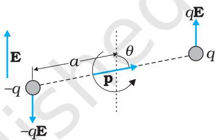

# Chapter One

# ELECTRIC CHARGES AND FIELDS

# 1.1 INTRODUCTION

All of us have the experience of seeing a spark or hearing a crackle when we take off our synthetic clothes or sweater, particularly in dry weather. Have you ever tried to find any explanation for this phenomenon? Another common example of electric discharge is the lightning that we see in the sky during thunderstorms.We also experience a sensation of an electric shock either while opening the door of a car or holding the iron bar of a bus after sliding from our seat. The reason for these experiences is discharge of electric charges through our body, which were accumulated due to rubbing of insulating surfaces. You might have also heard that this is due to generation of static electricity. This is precisely the topic we are going to discuss in this and the next chapter. Static means anything that does not move or change with time. Electrostatics deals with the study of forces， fields and potentials arising from static charges.

# 1.2 ELECTRIC CHARGE

Historically the credit of discovery of the fact that amber rubbed with wool or silk cloth attracts light objects goes to Thales of Miletus, Greece, around 6oo BC.The name electricity is coined from the Greek word elektron meaning amber. Many such pairs of materials were known which on rubbing could attract light objects like straw, pith balls and bits of papers.

  
FIGURE 1.1 Rods: like charges repel and unlike charges attract each other.

It was observed that if two glass rods rubbed with wool or silk cloth are brought close to each other, they repel each other [Fig. 1.1(a)]. The two strands of wool or two pieces of silk cloth, with which the rods were rubbed, also repel each other. However, the glass rod and wool attracted each other. Similarly, two plastic rods rubbed with cat's fur repelled each other [Fig.1.1(b)] but attracted the fur. On the other hand, the plastic rod attracts the glass rod [Fig. 1.1(c)l and repel the silk or wool with which the glass rod is rubbed. The glass rod repels the fur.

These seemingly simple facts were established from years of efforts and careful experiments and their analyses. It was concluded, after many careful studies by different scientists, that there were only two kinds of an entry which is called the electric charge. We say that the bodies like glass or plastic rods, silk, fur and pith balls are electrified. They acquire an electric charge on rubbing. There are two kinds of electrification and we find that (i) like charges repel and (ii) unlike charges attract each other. The property which differentiates the two kinds of charges is called the polarity of charge.

When a glass rod is rubbed with silk, the rod acquires one kind of charge and the silk acquires the second kind of charge. This is true for any pair of objects that are rubbed to be electrified. Now if the electrified glass rod is brought in contact with silk, with which it was rubbed, they no longer attract each other. They also do not attract or repel other light objects as they did on being electrified.

Thus, the charges acquired after rubbing are lost when the charged bodies are brought in contact. What can you conclude from these observations? It just tells us that unlike charges acquired by the objects neutralise or nullify each other's effect. Therefore, the charges were named as positive and negative by the American scientist Benjamin Franklin. By convention, the charge on glass rod or cat's fur is called positive and that on plastic rod or silk is termed negative. If an object possesses an electric charge, it is said to be electrified or charged. When it has no charge it is said to be electrically neutral.

A simple apparatus to detect charge on a body is the gold-leaf electroscope [Fig. 1.2(a)]. It consists of a vertical metal rod housed in a box, with two thin gold leaves attached to its bottom end. When a charged object touches the metal knob at the top of the rod, charge flows on to the leaves and they diverge. The degree of divergance is an indicator of the amount of charge.

Try to understand why material bodies acquire charge. You know that all matter is made up of atoms and/or molecules. Although normally the materials are electrically neutral, they do contain charges; but their charges are exactly balanced. Forces that hold the molecules together, forces that hold atoms together ina solid, the adhesive force of glue, forces associated with surface tension, all are basically electrical in nature,arising from the forces between charged particles. Thus the electric force is all pervasive and it encompasses almost each and every field associated with our life. It is therefore essential that we learn more about such a force.

To electrify a neutral body, we need to add or remove one kind of charge. When we say that a body is charged,we always refer to this excess charge or deficit of charge.In solids，some of the electrons, being less tightly bound in the atom,are the charges which are transferred from one body to the other. A body can thus be charged positively by losing some of its electrons. Similarly,a body can be charged negatively by gaining electrons. When we rub a glass rod with silk, some of the electrons from the rod are transferred to the silk cloth. Thus the rod gets positively charged and the silk gets negatively charged. No new charge is created in the process of rubbing.Also the number of electrons, that are transferred, is a very small fraction of the total number of electrons in the material body.

# 1.3 CONDUCTORS AND INSULATORS

Some substances readily allow passage of electricity through them, others do not. Those which allow electricity to pass through them easily are called conductors. They have electric charges (electrons) that are comparatively free to move inside the material. Metals, human and animal bodies and earth are conductors. Most of the non-metals like glass, porcelain, plastic,nylon,wood offer high resistance to the passage of electricity through them. They are called insulators.Most substances fall into one of the two classes stated above\*.

When some charge is transferred to a conductor, it readily gets distributed over the entire surface of the conductor. In contrast, if some charge is put on an insulator, it stays at the same place. You will learn why this happens in the next chapter.

This property of the materials tells you why a nylon or plastic comb gets electrified on combing dry hair or on rubbing,but a metal article like spoon does not. The charges on metal leak through our body to the ground as both are conductors of electricity.However, if a metal rod with a wooden or plastic handle is rubbed without touching its metal part, it shows signs of charging.

  
FIGURE 1.2 Electroscopes: (a) The gold leaf electroscope, (b) Schematics of a simple electroscope.

# 1.4 BASIC PROPERTIES OF ELECTRIC CHARGE

We have seen that there are two types of charges, namely positive and negative and their effects tend to cancel each other. Here,we shall now describe some other properties of the electric charge.

If the sizes of charged bodies are very small as compared to the distances between them, we treat them as point charges. All the charge content of the body is assumed to be concentrated at one point in space.

# 1.4.1 Additivity of charges

We have not as yet given a quantitative definition of a charge; we shall follow it up in the next section. We shall tentatively assume that this can be done and proceed. If a system contains two point charges $q _ { 1 }$ and $q _ { 2 }$ ,the total charge of the system is obtained simply by adding algebraically $q _ { 1 }$ and $q _ { 2 }$ ,i.e., charges add up like real numbers or they are scalars like the mass of a body. If a system contains $n$ charges $q _ { 1 }$ ， $q _ { 2 } , q _ { 3 } , . . . , q _ { \mathrm { n } }$ , then the total charge of the system is $q _ { \mathrm { 1 } } + q _ { \mathrm { 2 } } + q _ { \mathrm { 3 } } + \ldots + q _ { \mathrm { n } }$ .Charge has magnitude but no direction, similar to mass. However, there is one difference between mass and charge. Mass of a body is always positive whereas a charge can be either positive or negative. Proper signs have to be used while adding the charges in a system. For example, the total charge of a system containing five charges $+ 1$ ， $+ 2$ ,-3, $+ 4$ and $- 5$ , in some arbitrary unit, is $( + 1 ) + ( + 2 ) + ( - 3 ) + ( + 4 ) + ( - 5 ) = - 1$ in the same unit.

# 1.4.2 Charge is conserved

We have already hinted to the fact that when bodies are charged by rubbing, there is transfer of electrons from one body to the other; no new charges are either created or destroyed.A picture of particles of electric charge enables us to understand the idea of conservation of charge. When we rub two bodies,what one body gains in charge the other body loses. Within an isolated system consisting of many charged bodies,due to interactions among the bodies, charges may get redistributed but it is found that the total charge of the isolated system is always conserved. Conservation of charge has been established experimentally.

It is not possible to create or destroy net charge carried by any isolated system although the charge carrying particles may be created or destroyed in a process. Sometimes nature creates charged particles: a neutron turns into a proton and an electron. The proton and electron thus created have equal and opposite charges and the total charge is zero before and after the creation.

# 1.4.3 Quantisation of charge

Experimentally it is established that all free charges are integral multiples of a basic unit of charge denoted by $e .$ Thus charge $q$ on a body is always given by

$q = n e$ where $n$ is any integer, positive or negative. This basic unit of charge is the charge that an electron or proton carries.By convention, the charge on an electron is taken to be negative; therefore charge on an electron is written as $- e$ and that on a proton as $+ e$

The fact that electric charge is always an integral multiple of $e$ is termed as quantisation of charge. There are a large number of situations in physics where certain physical quantities are quantised. The quantisation of charge was first suggested by the experimental laws of electrolysis discovered by English experimentalist Faraday. It was experimentally demonstrated by Millikan in 1912.

In the International System (SI) of Units, a unit of charge is called a coulomb and is denoted by the symbol C.A coulomb is defined in terms the unit of the electric current which you are going to learn in a subsequent chapter. In terms of this definition, one coulomb is the charge flowing through a wire in 1 s if the current is 1 A (ampere), (see Chapter 1 of Class XI, Physics Textbook , Part I). In this system, the value of the basic unit of charge is

$$
e = 1 . 6 0 2 1 9 2 \times 1 0 ^ { - 1 9 } \mathrm { C }
$$

Thus, there are about $6 \times 1 0 ^ { 1 8 }$ electrons in a charge of $- 1 \mathrm { C }$ In electrostatics, charges of this large magnitude are seldom encountered and hence we use smaller units $1 ~ \mu \mathrm { C }$ (micro coulomb) $\overline { { \mathbf { \Omega } } } = 1 0 ^ { - 6 } \mathbf { C }$ or $1 \mathrm { m C }$ (milli coulomb) $\mathrm { = 1 0 ^ { - 3 } C }$

If the protons and electrons are the only basic charges in the universe, all the observable charges have to be integral multiples of $e$ Thus, if a body contains $n _ { 1 }$ electrons and $n _ { 2 }$ protons, the total amount of charge on the body is $n _ { 2 } \times e + n _ { 1 } \times ( - e ) = ( n _ { 2 } - n _ { 1 } ) e .$ Since $n _ { 1 }$ and $n _ { 2 }$ are integers, their difference is also an integer. Thus the charge on any body is always an integral multiple of $e$ and can be increased or decreased also in steps of $e$

The step size $e$ is, however, very small because at the macroscopic level, we deal with charges of a few $\mu \mathrm { C }$ . At this scale the fact that charge of a body can increase or decrease in units of $e$ is not visible.In this respect, the grainy nature of the charge is lost and it appears to be continuous.

This situation can be compared with the geometrical concepts of points and lines.A dotted line viewed from a distance appears continuous to us but is not continuous in reality. As many points very close to each other normally give an impression of a continuous line, many small charges taken together appear as a continuous charge distribution.

At the macroscopic level, one deals with charges that are enormous compared to the magnitude of charge $e .$ Since $e = 1 . 6 \times 1 0 ^ { - 1 9 } \mathrm { C } .$ a charge of magnituOde, say $1 \mu \mathrm { C }$ ,contains something like $1 0 ^ { 1 3 }$ times the electronic charge.At this scale, the fact that charge can increase or decrease only in units of $e$ is not very different from saying that charge can take continuous values. Thus,at the macroscopic level, the quantisation of charge has no practical consequence and can be ignored. However,at the microscopic level,where the charges involved are of the order of a few tens or hundreds of $e$ ，i.e.，they can be counted, they appear in discrete lumps and quantisation of charge cannot be ignored. It is the magnitude of scale involved that is very important.

Example 1.1 If $1 0 ^ { 9 }$ electrons move out of a body to another body every second, how much time is required to get a total charge of $1 \textrm { C }$ on the other body?

Solution In one second $1 0 ^ { 9 }$ electrons move out of the body. Therefore the charge given out in one second is $1 . 6 \times 1 0 ^ { - 1 9 } \times 1 0 ^ { 9 } \mathrm { C } = \dot { 1 . 6 } \times 1 0 ^ { - 1 0 } \mathrm { C } .$ The time required to accumulate a charge of $1 \mathrm { { C } }$ can then be estimated to be $\mathrm { ~ 1 ~ C ~ \div ~ ( 1 . 6 \times 1 0 ^ { - 1 0 } ~ C / s ) } = 6 . 2 5 \times 1 0 ^ { 9 } \mathrm { ~ s = 6 . 2 5 \times 1 0 ^ { 9 } \div ~ ( 3 6 5 ~ \times ~ 2 4 \times ~ 2 5 ) }$ 3600) years $= ~ 1 9 8$ years. Thus to collect a charge of one coulomb, from a body from which $1 0 ^ { 9 }$ electrons move out every second, we will need approximately 20o years. One coulomb is, therefore, a very large unit for many practical purposes.

It is, however, also important to know what is roughly the number of electrons contained in a piece of one cubic centimetre of a material. A cubic piece of copper of side $1 ~ \mathrm { c m }$ contains about $2 . 5 \times 1 0 ^ { 2 4 }$ electrons.

Example 1.2 How much positive and negative charge is there in a cup of water?

Solution Let us assume that the mass of one cup of water is $2 5 0 \ \mathrm { g }$ ， The molecular mass of water is $1 8 \mathrm { g }$ . Thus,one mole $\ l = 6 . 0 \ b { 2 } \times \ l 1 0 ^ { 2 3 }$ molecules) of water is $1 8 \ \mathrm { \& }$ ，Therefore the number of molecules in one cup of water is (250/18) × 6.02 x 1023.

Each molecule of water contains two hydrogen atoms and one oxygen atom, i.e., 1O electrons and 10 protons. Hence the total positive and total negative charge has the same magnitude. It is equal to $( 2 5 0 / 1 8 ) \times 6 . 0 2 \times 1 0 ^ { 2 3 } \times 1 0 \times 1 . 6 \times 1 0 ^ { - 1 9 } \mathrm { ~ C } = 1 . 3 4 \times 1 0 ^ { 7 } \mathrm { ~ C } ,$

# 1.5 CoULOMB's LAW

Coulomb's law is a quantitative statement about the force between two point charges.When the linear size of charged bodies are much smaller than the distance separating them, the size may be ignored and the charged bodies are treated as point charges.Coulomb measured the force between two point charges and found that it varied inversely as the square of the distance between the charges and was directly proportional to the product of the magnitude of the two charges and

# Electric Charges and Fields

acted along the line joining the two charges. Thus, if two point charges $q _ { 1 }$ ， $q _ { 2 }$ are separated by a distance rin vacuum, the magnitude of the force $( \pmb { \mathbb { F } } )$ between them is given by

$$
F = k \ \frac { \left| { { q _ { _ { 1 } } } \ { q _ { _ { 2 } } } } \right| } { { { r ^ { 2 } } } }
$$

How did Coulomb arrive at this law from his experiments? Coulomb used a torsion balance\* for measuring the force between two charged metallic spheres.When the separation between two spheres is much larger than the radius of each sphere, the charged spheres may be regarded as point charges. However, the charges on the spheres were unknown, to begin with.How then could he discover a relation like Eq. (l.1)? Coulomb thought of the following simple way: Suppose the charge on a metallic sphere is $q$ , If the sphere is put in contact with an identical uncharged sphere, the charge will spread over the two spheres.By symmetry, the charge on each sphere will be $q / 2 ^ { * }$ . Repeating this process, we can get charges q/2, $q / 4$ etc. Coulomb varied the distance for a fixed pair of charges and measured the force for different separations.He then varied the charges in pairs,keeping the distance fixed for each pair. Comparing forces for different pairs of charges at different distances, Coulomb arrived at the relation, Eq. (1.1).

Coulomb's law,a simple mathematical statement, was initially experimentally arrived at in the manner described above. While the original experiments established it at a macroscopic scale,it has also been established down to subatomic level $( r \sim 1 0 ^ { - 1 0 } \mathrm { m } )$

Coulomb discovered his law without knowing the explicit magnitude of the charge. In fact, it is the other way round: Coulomb's law can now be employed to furnish a definition for a unit of charge. In the relation, Eq. (1.1), $k$ is so far arbitrary. We can choose any positive value of $k .$ The choice of $k$ determines the size of the unit of charge. In SI units, the value of $k$ is about $9 \times 1 0 ^ { 9 } \ \frac { \mathrm { N m ^ { 2 } } } { \mathrm { C ^ { 2 } } }$ The unit of charge that results from this choice is called a coulomb which we defined earlier in Section 1.4. Putting this value of $k$ in Eq. (1.1), we see that for $q _ { \mathrm { 1 } } ^ { \mathrm { ~ ~ } } = q _ { \mathrm { 2 } } ^ { \mathrm { ~ ~ } } = 1 \mathrm { ~ C ~ }$ ， $r = 1 \mathrm { m }$

That is, $1 \mathrm { C }$ is the charge that when placed at a distance of $1 \mathrm { m }$ from another charge of the same magnitude in vacuum experiences an electrical force of repulsion of magnitude

Charles Augustin de Coulomb (1736 - 1806) Coulomb，a French physicist， began his career as a military engineer in the West Indies. In 1776,he returned to Paris and retired to a small estate to do his scientific research. He invented a torsion balance to measure the quantity of a force and used it for determination of forces of electric attraction or repulsion between small charged spheres. He thus arrived in 1785 at the inverse square law relation, now known as Coulomb's law. The law had been anticipated by Priestley and also by Cavendish earlier, though Cavendish never published his results. Coulomb also found the inverse square law of force between unlike and like magnetic poles.

  
FIGURE 1.3 (a) Geometry and (b) Forces between charges.

$9 \times 1 0 ^ { 9 } \mathrm { { N } }$ . One coulomb is evidently too big a unit to be used. In practice,in electrostatics,one uses smaller units like $1 \mathrm { m C }$ or $1 \mu \mathrm { C }$

The constant $k$ in Eq. (l.1) is usually put as $k = 1 / 4 \pi \varepsilon _ { _ 0 }$ for later convenience, so that Coulomb's law is written as

$$
\left| F = { \frac { 1 } { 4 \pi \varepsilon _ { 0 } } } \quad { \frac { \left| q _ { 1 } q _ { 2 } \right| } { r ^ { 2 } } } \right|
$$

$\varepsilon _ { 0 }$ is called the permittivity of free space . The value of $\varepsilon _ { 0 }$ in SI units is

$$
\varepsilon _ { \scriptscriptstyle 0 } = 8 . 8 5 4 \times 1 0 ^ { - 1 2 } \mathrm { C } ^ { 2 } \mathrm { N } ^ { - 1 } \mathrm { m } ^ { - 2 }
$$

Since force is a vector,it is better to write Coulomb's law in the vector notation. Let the position vectors of charges $q _ { 1 }$ and $q _ { 2 }$ be ${ \bf r } _ { 1 }$ and $\mathbf { r } _ { 2 }$ respectively [see Fig.1.3(a)). We denote force on $q _ { 1 }$ due to $q _ { 2 }$ by F12 and force on $q _ { 2 }$ due to $q _ { 1 }$ by $\mathbf { F } _ { 2 1 }$ . The two point charges $q _ { 1 }$ and $q _ { 2 }$ have been numbered 1 and 2 for convenience and the vector leading from 1 to 2 is

denoted by r21:

$$
\mathbf { r } _ { 2 1 } = \mathbf { r } _ { 2 } - \mathbf { r } _ { 1 }
$$

In the same way, the vector leading from 2 to 1 is denoted by $\mathbf { r } _ { 1 2 }$

$$
\mathbf { r } _ { 1 2 } = \mathbf { r } _ { 1 } - \mathbf { r } _ { 2 } = - \mathbf { r } _ { 2 1 }
$$

The magnitude of the vectors $\mathbf { r } _ { 2 1 }$ and $\mathbf { r } _ { 1 2 }$ is denoted by $r _ { 2 1 }$ and $r _ { 1 2 }$ respectively $( r _ { 1 2 } = r _ { 2 1 } )$ .The direction of a vector is specified by a unit vector along the vector. To denote the direction from l to 2 (or from 2 to 1), we define the unit vectors:

$$
\hat { \bf r } _ { 2 1 } = \frac { { \bf r } _ { 2 1 } } { r _ { 2 1 } } , \hat { \bf r } _ { 1 2 } = \frac { { \bf r } _ { 1 2 } } { r _ { 1 2 } } , \hat { \bf r } _ { 2 1 } - \hat { \bf r } _ { 1 2 }
$$

Coulomb's force law between two point charges $q _ { 1 }$ and $q _ { 2 }$ located at ${ \bf r } _ { 1 }$ and $\mathbf { r } _ { 2 }$ ,respectively is then expressed as

$$
\mathbf { F } _ { 2 1 } = { \frac { 1 } { 4 \pi \varepsilon _ { o } } } \ { \frac { q _ { 1 } \ q _ { 2 } \ \hat { \mathbf { r } } _ { 2 1 } } { r _ { 2 1 } ^ { 2 } } } \ { \hat { \mathbf { r } } } _ { 2 1 }
$$

Some remarks on Eq. (1.3) are relevant:

Equation (1.3) is valid for any sign of $q _ { 1 }$ and $q _ { 2 }$ whether positive or negative. If $q _ { 1 }$ and $q _ { 2 }$ are of the same sign (either both positive or both negative), $\mathbf { F } _ { 2 1 }$ is along $\hat { \mathbf { r } } _ { 2 1 }$ ,which denotes repulsion, as it should be for like charges. If $q _ { 1 }$ and $q _ { 2 }$ are of opposite signs, $ { \mathbf { F } } _ { 2 1 }$ is along $- \hat { \mathbf { r } } _ { \textrm { 2 1 } } ( = \hat { \mathbf { r } } _ { \textrm { 1 2 } } )$ ， which denotes attraction,as expected for unlike charges. Thus, we do not have to write separate equations for the cases of like and unlike charges. Equation (1.3) takes care of both cases correctly [Fig. 1.3(b)l.

The force $\mathbf { F } _ { 1 2 }$ on charge $q _ { 1 }$ due to charge $q _ { 2 }$ , is obtained from Eq. (1.3), by simply interchanging 1 and 2, i.e.,

$$
\mathbf { F } _ { 1 2 } = { \frac { 1 } { 4 \pi \varepsilon _ { 0 } } } \ { \frac { q _ { 1 } \ q _ { 2 } } { r _ { 1 2 } ^ { 2 } } } \ \hat { \mathbf { r } } _ { 1 2 } = - \mathbf { F } _ { 2 1 }
$$

Thus, Coulomb's law agrees with the Newton's third law.

Coulomb's law [Eq. (1.3)l gives the force between two charges $q _ { 1 }$ and $q _ { 2 }$ in vacuum. If the charges are placed in matter or the intervening space has matter, the situation gets complicated due to the presence of charged constituents of matter. We shall consider electrostatics in matter in the next chapter.

Example 1.3 Coulomb's law for electrostatic force between two point charges and Newton's law for gravitational force between two stationary point masses, both have inverse-square dependence on the distance between the charges and masses respectively. (a) Compare the strength of these forces by determining the ratio of their magnitudes (i) for an electron and a proton and (ii) for two protons. (b) Estimate the accelerations of electron and proton due to the electrical force of their mutual attraction when they are $1 \mathrm { ~ \AA ~ } ( = 1 0 ^ { - 1 0 } \mathrm { ~ m } )$ apart? $( m _ { p } = 1 . 6 7 \times$ $1 0 ^ { - 2 7 } \mathrm { k g }$ $m _ { e } = 9 . 1 1 \times 1 0 ^ { - 3 1 } \mathrm { k \dot { g } } )$

# Solution

(a) (i) The electric force between an electron and a proton at a distance $\boldsymbol { r }$ apart is:

$$
F _ { e } = - { \frac { 1 } { 4 \pi \varepsilon _ { 0 } } } { \frac { e ^ { 2 } } { r ^ { 2 } } }
$$

where the negative sign indicates that the force is attractive. The corresponding gravitational force (always attractive) is:

$$
F _ { G } = - G \frac { m _ { p } ^ { } \ m _ { e } ^ { } } { r ^ { 2 } }
$$

where $m _ { p }$ and $m _ { e }$ are the masses of a proton and an electron respectively.

$$
\left| { \frac { F _ { e } } { F _ { G } } } \right| = { \frac { e ^ { 2 } } { 4 \pi \varepsilon _ { 0 } G m _ { p } m _ { e } } } = 2 . 4 \times 1 0 ^ { 3 9 }
$$

(ii) On similar lines, the ratio of the magnitudes of electric force to the gravitational force between two protons at a distance $\boldsymbol { r }$ apart is:

$$
\left| \frac { F _ { e } } { F _ { G } } \right| = \frac { e ^ { 2 } } { 4 \pi \varepsilon _ { 0 } G m _ { p } m _ { p } } = \ 1 . 3 \times 1 0 ^ { 3 6 }
$$

However, it may be mentioned here that the signs of the two forces are different. For two protons, the gravitational force is attractive in nature and the Coulomb force is repulsive. The actual values of these forces between two_protons inside a nucleus (distance between two protons is $\sim 1 0 ^ { - 1 5 } \mathrm { m }$ inside a nucleus) are $F _ { \mathrm { e } } \sim 2 3 0 \ : \mathrm { N }$ whereas, $F _ { _ \mathrm { G } } \stackrel { \cdot } { \sim } 1 . 9 \times 1 0 ^ { - 3 4 } \mathrm { N }$

The (dimensionless) ratio of the two forces shows that electrical forces are enormously stronger than the gravitational forces.

(b) The electric force $\mathbf { F }$ exerted by a proton on an electron is same in magnitude to the force exerted by an electron on a proton; however, the masses of an electron and a proton are different. Thus, the magnitude of force is

$$
{ \begin{array} { r l } { | \mathbf { F } | } & { = { \frac { 1 } { 4 \pi \varepsilon _ { 0 } } } { \frac { e ^ { 2 } } { r ^ { 2 } } } = 8 . 9 8 7 \times 1 0 ^ { 9 } \ { \mathrm { N m } } ^ { 2 } / { \mathrm { C } } ^ { 2 } \times ( 1 . 6 \times 1 0 ^ { - 1 9 } \mathrm { C } ) ^ { 2 } \ / \ ( 1 0 ^ { - 1 0 } \mathrm { m } ) ^ { 2 } } \\ & { = 2 . 3 \times 1 0 ^ { - 8 } \mathrm { N } } \end{array} }
$$

Using Newton's second law of motion, $F = m a$ ，the acceleration that an electron will undergo is $a = 2 . 3 { \times } 1 0 ^ { - 8 } \mathrm { N } / 9 . 1 1 { \times } 1 0 ^ { - 3 1 } \mathrm { k g } = 2 . 5 \times 1 0 ^ { 2 2 } \mathrm { m / s ^ { 2 } }$

Comparing this with the value of acceleration due to gravity, we can conclude that the effect of gravitational field is negligible on the motion of electron and it undergoes very large accelerations under the action of Coulomb force due to a proton.

The value for acceleration of the proton is $2 . 3 \times 1 0 ^ { - 8 } \mathrm { ~ N ~ / ~ } 1 . 6 7 \times 1 0 ^ { - 2 7 } \mathrm { k g } = 1 . 4 \times 1 0 ^ { 1 9 } \mathrm { m / s ^ { 2 } }$

Example 1.4 A charged metallic sphere A is suspended by a nylon thread. Another charged metallic sphere B held by an insulating handle is brought close to A such that the distance between their centres is $1 0 ~ \mathrm { c m }$ , as shown in Fig. 1.4(a). The resulting repulsion of A is noted (for example, by shining a beam of light and measuring the deflection of its shadow on a screen). Spheres A and B are touched by uncharged spheres C and D respectively, as shown in Fig. 1.4(b). C and D are then removed and B is brought closer to A to a distance of $5 . 0 \ \mathrm { c m }$ between their centres,as shown in Fig. 1.4(c). What is the expected repulsion of A on the basis of Coulomb's law? Spheres A and C and spheres B and D have identical sizes. Ignore the sizes of A and $_ \mathrm { B }$ in comparison to the separation between their centres.

  
FIGURE 1.4

Solution Let the original charge on sphere A be $q$ and that on B be $q ^ { \prime }$ . At a distance $r$ between their centres, the magnitude of the electrostatic force on each is given by

$$
F = { \frac { 1 } { 4 \pi \varepsilon _ { 0 } } } { \frac { q q ^ { \prime } } { r ^ { 2 } } }
$$

neglecting the sizes of spheres A and B in comparison to r. When an identical but uncharged sphere C touches A, the charges redistribute on A and C and, by symmetry,each sphere carries a charge $q / 2$ Similarly,after $_ \mathrm { D }$ touches B,the redistributed charge on each is $q ^ { \prime } / 2$ . Now, if the separation between A and $_ \mathrm { B }$ is halved, the magnitude of the electrostatic force on each is

$$
F ^ { \prime } = { \frac { 1 } { 4 \pi \varepsilon _ { 0 } } } { \frac { ( q / 2 ) ( q ^ { \prime } / 2 ) } { ( r / 2 ) ^ { 2 } } } = { \frac { 1 } { 4 \pi \varepsilon _ { 0 } } } { \frac { ( q q ^ { \prime } ) } { r ^ { 2 } } } = F
$$

Thus the electrostatic force on A, due to $_ \mathrm { B }$ ， remains unaltered.

# 1.6 FORCES BETWEEN MULTIPLE CHARGES

The mutual electric force between two charges is given by Coulomb's law. How to calculate the force on a charge where there are not one but several charges around? Consider a system of $n$ stationary charges $q _ { 1 }$ ， $q _ { 2 }$ $q _ { 3 }$ $q _ { n }$ in vacuum. What is the force on $q _ { 1 }$ due to $q _ { 2 }$ ， $q _ { 3 }$ $q _ { n } ?$ Coulomb's law is not enough to answer this question. Recall that forces of mechanical origin add according to the parallelogram law of addition. Is the same true for forces of electrostatic origin?

Experimentally, it is verified that force on any charge due to a number of other charges is the vector sum of all the forces on that charge due to the other charges, taken one at a time. The individual forces are unaffected due to the presence of other charges. This is termed as the principle of superposition.

To better understand the concept, consider a system of three charges $q _ { 1 , \ } q _ { 2 }$ and $q _ { 3 } ^ { \phantom { \dagger } } ,$ , as shown in Fig. 1.5(a). The force on one charge, say $q _ { 1 }$ ， due to two other charges $q _ { 2 }$ ， $q _ { 3 }$ can therefore be obtained by performing a vector addition of the forces due to each one of these charges. Thus,if the force on $q _ { 1 }$ due to $q _ { 2 }$ is denoted by ${ \bf F } _ { 1 2 }$ ， ${ \bf F } _ { 1 2 }$ is given by Eq. (1.3) even though other charges are present.

Thus, $\mathbf { F } _ { 1 2 } = { \frac { 1 } { 4 \pi \varepsilon _ { 0 } } } { \frac { q _ { 1 } q _ { 2 } } { r _ { 1 2 } ^ { 2 } } } { \hat { \mathbf { r } } } _ { 1 2 }$ (a) three charges (b) multiple charges.

  
FIGURE 1.5 A system of

In the same way, the force on $q _ { 1 }$ due to $q _ { 3 }$ ,denoted by ${ \bf F } _ { 1 3 }$ , is given by

$$
\mathbf { F } _ { 1 3 } = { \frac { 1 } { 4 \pi \varepsilon _ { 0 } } } { \frac { q _ { 1 } q _ { 3 } } { r _ { 1 3 } ^ { 2 } } } { \hat { \mathbf { r } } } _ { 1 3 }
$$

which again is the Coulomb force on $q _ { 1 }$ due to $q _ { 3 }$ ，even though other charge $q _ { 2 }$ is present.

Thus the total force $\mathbf { F } _ { 1 }$ on $q _ { 1 }$ due to the two charges $q _ { 2 }$ and $q _ { 3 }$ is given as

$$
\mathbf { F } _ { 1 } = \mathbf { F } _ { 1 2 } + \mathbf { F } _ { 1 3 } = { \frac { 1 } { 4 \pi \varepsilon _ { 0 } } } { \frac { q _ { 1 } q _ { 2 } } { r _ { 1 2 } ^ { 2 } } } { \hat { \mathbf { r } } } _ { 1 2 } + { \frac { 1 } { 4 \pi \varepsilon _ { 0 } } } { \frac { q _ { 1 } q _ { 3 } } { r _ { 1 3 } ^ { 2 } } } { \hat { \mathbf { r } } } _ { 1 3 }
$$

The above calculation of force can be generalised to a system of charges more than three,as shown in Fig. 1.5(b).

The principle of superposition says that in a system of charges $q _ { 1 }$ ， $q _ { 2 } , . . . , q _ { n }$ ,the force on $q _ { 1 }$ due to $q _ { 2 }$ is the same as given by Coulomb's law, i.e., it is unaffected by the presence of the other charges $q _ { 3 }$ $q _ { 4 }$ … $q _ { n } .$ The thevectorsumof theforces total force $\mathbf { F } _ { 1 }$ on the charge $q _ { 1 }$ $\mathbf { F } _ { 1 2 }$ , due to all other charges, is then given by ${ \pmb { \mathrm { F } } } _ { 1 3 }$ 13,···, Fn

i.e.,

$$
\mathbf { F } _ { 1 } = \mathbf { F } _ { 1 2 } + \mathbf { F } _ { 1 3 } + \ldots + \mathbf { F } _ { \mathrm { l n } } = { \frac { 1 } { 4 \pi \varepsilon _ { 0 } } } { \left[ { \frac { q _ { 1 } q _ { 2 } } { r _ { 1 2 } ^ { 2 } } } { \hat { \mathbf { r } } } _ { 1 2 } + { \frac { q _ { 1 } q _ { 3 } } { r _ { 1 3 } ^ { 2 } } } { \hat { \mathbf { r } } } _ { 1 3 } + \ldots + { \frac { q _ { 1 } q _ { n } } { r _ { 1 n } ^ { 2 } } } { \hat { \mathbf { r } } } _ { 1 n } \right] }
$$

$$
= { \frac { q _ { 1 } } { 4 \pi \varepsilon _ { 0 } } } \sum _ { i = 2 } ^ { n } { \frac { q _ { i } } { r _ { 1 i } ^ { 2 } } } { \hat { \mathbf { r } } } _ { 1 i }
$$

The vector sum is obtained as usual by the parallelogram law of addition of vectors.All of electrostatics is basically a consequence of Coulomb's law and the superposition principle.

Example 1.5 Consider three charges $q _ { 1 }$ ， $q _ { 2 }$ ， $q _ { 3 }$ each equal to $q$ at the vertices of an equilateral triangle of side 1. What is the force on a charge $Q$ (with the same sign as q) placed at the centroid of the triangle, as shown in Fig. 1.6?

  
FIGURE 1.6

Solution In the given equilateral triangle ABC of sides of length l, if we draw a perpendicular AD to the side BC,

$\mathrm { A D } = \mathrm { A C }$ cos $3 0 ^ { \circ } = ( \sqrt { 3 } / 2 ) l$ and the distance AO of the centroid O from A is (2/3) $\mathrm { A D } = ( _ { 1 / \sqrt { 3 } } ) \ \ i$ . By symmatry $\mathrm { A O } = \mathrm { B O } = \mathrm { C O }$ ，

Thus,

Force $\mathbf { F _ { 1 } }$ on $Q$ due to charge $q$ at $\mathrm { ~  ~ A ~ } = \frac { 3 } { 4 \pi \varepsilon _ { 0 } } \frac { Q q } { l ^ { 2 } }$ along Ao   
Force $\mathbf { F _ { 2 } }$ on $Q$ due to charge $q$ at $\mathrm { ~ B ~ } = \frac { 3 } { 4 \pi \varepsilon _ { 0 } } \frac { Q q } { l ^ { 2 } }$ along BO   
Force Fxon Qdue to charge q at C = 4πε along Co   
The resultant of forces F2 and F& is $\frac { 3 } { 4 \pi \varepsilon _ { 0 } } \frac { Q q } { l ^ { 2 } }$ along OA,by the parallelogramlaw.Therefore,thetotalforeon=4ε $Q = { \frac { 3 } { 4 \pi \varepsilon _ { 0 } } } { \frac { Q q } { l ^ { 2 } } } { \left( { \hat { \mathbf { r } } } - { \hat { \mathbf { r } } } \right) }$ $= 0$ ，where $\hat { \mathbf { r } }$ is the unit vector along OA.   
It is clear also by symmetry that the three forces will sum to zero. Suppose that the resultant force was non-zero but in some direction. Consider what would happen if the system was rotated through $6 0 ^ { \circ }$ about O.

Example 1.6 Consider the charges $q , \ q$ ,and $- q$ placed at the vertices of an equilateral triangle, as shown in Fig. 1.7. What is the force on each charge?

  
FIGURE 1.7

Solution The forces acting on charge $q$ at A due to charges $q$ at B and $- q$ at $\mathrm { ^ c }$ are $\mathbf { F } _ { 1 2 }$ along BA and ${ \bf F } _ { 1 3 }$ along AC respectively, as shown in Fig. 1.7. By the parallelogram law, the total force $\mathbf { F } _ { 1 }$ on the charge $q$ at A is given by

$\boldsymbol { \mathbf { F } } _ { 1 } = F \hat { \boldsymbol { \ } } \hat { \mathbf { r } } _ { 1 }$ where $\hat { \bf r } _ { 1 }$ is a unit vector along BC.

The force of attraction or repulsion for each pair of charges has the same magnitude F = - $F = { \frac { q ^ { 2 } } { 4 \pi \varepsilon _ { 0 } l ^ { 2 } } }$

The total force $\mathbf { F } _ { 2 }$ on charge $q$ at $_ \mathrm { B }$ is thus $\boldsymbol { \mathbf { F _ { 2 } } } = F \hat { \boldsymbol { \textbf { r } } } _ { 2 }$ ，where $\hat { \mathbf { r } } _ { 2 }$ is a unit vector along AC.

Similarly the total force on charge $- q$ at $\mathrm { ^ c }$ is $\mathbf { F } _ { 3 } = { \sqrt { 3 } } { \textbf { } } F { \hat { \mathbf { n } } }$ , where $\hat { \bf n }$ is the unit vector along the direction bisecting the $\angle \mathrm { B C A }$

It is interesting to see that the sum of the forces on the three charges is zero, i.e.,

$$
\mathbf { F } _ { 1 } + \mathbf { F } _ { 2 } + \mathbf { F } _ { 3 } = 0
$$

The result is not at all surprising. It follows straight from the fact that Coulomb's law is consistent with Newton's third law. The proof is left to you as an exercise.

# 1.7 ELECTRIC FIELD

Let us consider a point charge $Q$ placed in vacuum, at the origin O. If we place another point charge $q$ at a point P, where $\mathbf { o } \mathbf { P } = \mathbf { r } ,$ , then the charge $Q$ will exert a force on $q$ as per Coulomb's law. We may ask the question: If charge $q$ is removed, then what is left in the surrounding? Is there nothing? If there is nothing at the point P, then how does a force act when we place the charge $q$ at P. In order to answer such questions, the early scientists introduced the concept of field. According to this, we say that the charge $Q$ produces an electric field everywhere in the surrounding. When another charge $q$ is brought at some point P, the field there acts on it and produces a force. The electric field produced by the charge $Q$ ata point r is given as

$$
\mathbf { E } \left( \mathbf { r } \right) = { \frac { 1 } { 4 \pi \varepsilon _ { 0 } } } { \frac { Q } { r ^ { 2 } } } { \hat { \mathbf { r } } } = { \frac { 1 } { 4 \pi \varepsilon _ { 0 } } } { \frac { Q } { r ^ { 2 } } } { \hat { \mathbf { r } } }
$$

where $\hat { \mathbf { r } } = \mathbf { r } / \mathrm { r }$ , is a unit vector from the origin to the point r. Thus, Eq.(1.6) specifies the value of the electric field for each value of the position vector $\pmb { \mathrm { r } }$ . The word “field" signifies how some distributed quantity (which could be a scalar or a vector) varies with position. The effect of the charge has been incorporated in the existence of the electric field.We obtain the force $\mathbf { F }$ exerted by a charge $Q$ on a charge $q$ as

$$
\mathbf { F } = { \frac { 1 } { 4 \pi \varepsilon _ { 0 } } } { \frac { Q q } { r ^ { 2 } } } { \hat { \mathbf { r } } }
$$

  
FIGURE 1.8 Electric field (a) due to a charge Q, (b) due to a charge $- Q$

■ Note that the charge $q$ also exerts an equal and opposite force on the charge $Q$ .The electrostatic force between the charges $Q$ and $q$ can be looked upon as an interaction between charge $q$ and the electric field of $Q$ and vice versa. If we denote the position of charge $q$ by the vector $\pmb { \mathrm { r } }$ ,it experiences a force $\mathbf { F }$ equal to the charge $q$ multiplied by the electric field $\mathbf { \delta E }$ at the location of $q$ Thus,

$\mathbf { F } ( \mathbf { r } ) = q \mathbf { E } ( \mathbf { r } )$ (1.8) Equation (1.8) defines the SI unit of electric field as $\mathrm { N } / \mathrm { C } ^ { * }$ Some important remarks may be made here: (i) From Eq. (1.8),we can infer that if $q$ is unity, the electric field due to a charge $Q$ is numerically equal to the force exerted by it. Thus, the electric field due to $a$ charge $Q$ at $a$ point in space may be defined as the force that $a$ unit positive charge would experience if placed at that point. The charge $Q$ ，which is producing the electric field, is called a source charge and the charge $q$ ，which tests the effect of a source charge,is called a test charge. Note that the source charge $Q$ must remain at its original location. However, if a charge $q$ is brought at any point around $Q$ $Q$ itself is bound to experience an electrical force due to $q$ and will tend to move. A way out of this difficulty is to make $q$ negligibly small. The force $\mathbf { F }$ is then negligibly small but the ratio $\mathbf { r } / q$ is finite and defines the electric field:

$$
\mathbf { E } = \operatorname* { l i m } _ { q \to 0 } \left( { \frac { \mathbf { F } } { q } } \right)
$$

A practical way to get around the problem (of keeping $Q$ undisturbed   
in the presence of $q )$ is to hold $Q$ to its location by unspecified forces!   
This may look strange but actually this is what happens in practice.   
When we are considering the electric force on a test charge $q$ due to a   
charged planar sheet (Section 1.14), the charges on the sheet are held to   
their locations by the forces due to the unspecified charged constituents   
inside the sheet. ■ 一

(ii) Note that the electric field $\mathbf { \delta E }$ due to $Q$ , though defined operationally in terms of some test charge $q { \mathrm { . } }$ ，is independent of $q$ ，This is because $\mathbf { F }$ is proportional to $q$ ，so the ratio $\mathbf { F } / q$ does not depend on q. The force $\mathbf { F }$ on the charge $q$ due to the charge $Q$ depends on the particular location of charge $q$ which may take any value in the space around the charge $Q$ Thus, the electric field $\mathbf { E }$ due to $Q$ is also dependent on the space coordinate r. For different positions of the charge $q$ all over the space, we get different values of electric field E. The field exists at every point in three-dimensional space.

(ii) For a positive charge,the electric field will be directed radially outwards from the charge. On the other hand, if the source charge is negative, the electric field vector, at each point, points radially inwards.

(iv) Since the magnitude of the force $\mathbf { F }$ on charge $q$ due to charge $Q$ depends only on the distance $r$ of the charge $q$ from charge $Q$ the magnitude of the electric field $\mathbf { E }$ will also depend only on the distance r. Thus at equal distances from the charge $Q$ ,the magnitude of its electric field $\mathbf { \delta E }$ is same. The magnitude of electric field $\mathbf { E }$ due to a point charge is thus same on a sphere with the point charge at its centre; in other words,it has a spherical symmetry.

# 1.7.1 Electric field due to a system of charges

Consider a system of charges $q _ { 1 }$ ， $q _ { 2 }$ ，， $q _ { n }$ with position vectors ${ \bf r } _ { 1 }$ ， $\mathbf { r } _ { 2 }$ ，. ${ \bf r } _ { n }$ relative to some origin O. Like the electric field at a point in space due to a single charge, electric field at a point in space due to the system of charges is defined to be the force experienced by a unit test charge placed at that point,without disturbing the original positions of charges $q _ { 1 }$ ， $q _ { 2 }$ ，.， $q _ { n } .$ . We can use Coulomb's law and the superposition principle to determine this field at a point $\mathrm { P }$ denoted by position vector r.

  
FIGURE 1.9 Electric field at a point due to a system of charges is the vector sum of the electric fields at the point due to individual charges.

Electric field $\mathbf { E } _ { 1 }$ at $\pmb { \mathrm { r } }$ due to $q _ { 1 }$ at ${ \bf r } _ { 1 }$ is given by

$$
\mathbf { E } _ { 1 } = { \frac { 1 } { 4 \pi \varepsilon _ { \scriptscriptstyle \mathrm { o } } } } { \frac { q _ { \scriptscriptstyle \mathrm { l } } } { r _ { \scriptscriptstyle \mathrm { l } \mathrm { P } } ^ { 2 } } } { \hat { \mathbf { r } } } _ { \scriptscriptstyle \mathrm { l } \mathrm { P } }
$$

where $\hat { \bf r } _ { \scriptscriptstyle \mathrm { 1 P } }$ is a unit vector in the direction from $q _ { 1 }$ to $\mathrm { P }$ and $r _ { \mathrm { 1 P } }$ is the distance between $q _ { 1 }$ and $\mathrm { P }$

In the same manner, electric field $\mathbf { E } _ { 2 }$ at $\mathbf { r }$ due to $q _ { 2 }$ at $\mathbf { r } _ { 2 }$ is

$$
\mathbf { E } _ { 2 } = { \frac { 1 } { 4 \pi \varepsilon _ { \circ } } } { \frac { q _ { 2 } } { r _ { 2 \mathrm { P } } ^ { 2 } } } { \hat { \mathbf { r } } } _ { \mathrm { 2 P } }
$$

where $\hat { \bf r } _ { \mathrm { 2 P } }$ is a unit vector in the direction from $q _ { 2 }$ to $\mathrm { P }$ and $r _ { \mathrm { 2 P } }$ is the distance between $q _ { 2 }$ and P. Similar expressions hold good for fields ${ \bf E } _ { 3 }$ ， $\mathbf { E } _ { 4 } , . . . , \mathbf { E } _ { n }$ due to charges $q _ { 3 } , q _ { 4 } , . . . , q _ { n } .$

By the superposition principle, the electric field $\mathbf { E }$ at $\pmb { \mathrm { r } }$ due to the system of charges is (as shown in Fig. 1.9)

$$
\mathbf { E } ( \mathbf { r } ) = \mathbf { E } _ { \mathrm { 1 } } ( \mathbf { r } ) + \mathbf { \delta E } _ { \mathrm { 2 } } ( \mathbf { r } ) + \ldots + \mathbf { \delta E } _ { \mathrm { n } } ( \mathbf { r } )
$$

$$
= \frac { 1 } { 4 \pi \varepsilon _ { 0 } } \frac { q _ { 1 } } { r _ { \scriptscriptstyle \mathrm { 1 P } } ^ { 2 } } \hat { \mathbf { r } } _ { \scriptscriptstyle \mathrm { 1 P } } + \frac { 1 } { 4 \pi \varepsilon _ { 0 } } \frac { q _ { 2 } } { r _ { \scriptscriptstyle \mathrm { 2 P } } ^ { 2 } } \hat { \mathbf { r } } _ { \scriptscriptstyle \mathrm { 2 P } } + \ldots + \frac { 1 } { 4 \pi \varepsilon _ { 0 } } \frac { q _ { n } } { r _ { \scriptscriptstyle \mathrm { n P } } ^ { 2 } } \hat { \mathbf { r } } _ { \scriptscriptstyle \mathrm { n P } }
$$

$$
\mathbf { E } ( \mathbf { r } ) = \mathbf { \frac { 1 } { 4 \pi \varepsilon _ { 0 } } } \sum _ { i = 1 } ^ { n } { \frac { q _ { i } } { r _ { i \mathrm { P } } ^ { 2 } } } { \hat { \mathbf { r } } } _ { \mathrm { i \mathrm { P } } }
$$

$\mathbf { \delta E }$ is a vector quantity that varies from one point to another point in space and is determined from the positions of the source charges.

# 1.7.2 Physical significance of electric field

You may wonder why the notion of electric field has been introduced here at all. After all, for any system of charges, the measurable quantity is the force on a charge which can be directly determined using Coulomb's law and the superposition principle [Eq. (1.5)]. Why then introduce this intermediate quantity called the electric field?

For electrostatics,the concept of electric field is convenient, but not really necessary. Electric field is an elegant way of characterising the electrical environment of a system of charges. Electric field at a point in the space around a system of charges tells you the force a unit positive test charge would experience if placed at that point (without disturbing the system). Electric field is a characteristic of the system of charges and is independent of the test charge that you place at a point to determine the field. The term field in physics generally refers to a quantity that is defined at every point in space and may vary from point to point. Electric field is a vector field, since force is a vector quantity.

The true physical significance of the concept of electric field, however, emerges only when we go beyond electrostatics and deal with timedependent electromagnetic phenomena. Suppose we consider the force between two distant charges $q _ { 1 }$ ， $q _ { 2 }$ in accelerated motion. Now the greatest speed with which a signal or information can go from one point to another is $c$ , the speed of light. Thus, the effect of any motion of $q _ { 1 }$ on $q _ { 2 }$ cannot arise instantaneously. There will be some time delay between the effect (force on $q _ { 2 } ^ { \phantom { + } }$ ）and the cause (motion of $q _ { 1 } )$ . It is precisely here that the notion of electric field (strictly, electromagnetic field) is natural and very useful. The field picture is this: the accelerated motion of charge $q _ { 1 }$ produces electromagnetic waves,which then propagate with the speed c, reach $q _ { 2 }$ and cause a force on $q _ { 2 }$ . The notion of field elegantly accounts for the time delay. Thus, even though electric and magnetic fields can be detected only by their effects (forces) on charges, they are regarded as physical entities,not merely mathematical constructs. They have an independent dynamics of their own， i.e., they evolve according to laws of their own. They can also transport energy. Thus,a source of timedependent electromagnetic fields, turned on for a short interval of time and then switched off, leaves behind propagating electromagnetic fields transporting energy. The concept of field was first introduced by Faraday and is now among the central concepts in physics.

Example 1.7 An electron falls through a distance of $1 . 5 ~ \mathrm { c m }$ in a uniform electric field of magnitude $2 . 0 \mathrm { ~ \breve { ~ } { \times } ~ } 1 0 ^ { 4 } \mathrm { ~ N ~ C ^ { - 1 } }$ [Fig. 1.10(a)]. The direction of the field is reversed keeping its magnitude unchanged and a proton falls through the same distance [Fig. 1.1o(b)]. Compute the time of fall in each case. Contrast the situation with that of free fall under gravity'.

  
FIGURE 1.10

Solution In Fig. 1.1O(a) the field is upward, so the negatively charged electron experiences a downward force of magnitude $e E$ where $E$ is the magnitude of the electric field. The acceleration of the electron is whe $a _ { e } ~ = ~ e E / m _ { e }$ massof te electron. $m _ { e }$

Starting from rest, the time required by the electron to fall through a distance $h$ is given by $t _ { e } = { \sqrt { \frac { 2 h } { a _ { e } } } } = { \sqrt { \frac { 2 h m _ { e } } { e E } } }$

For $e = 1 . 6 \times 1 0 ^ { - 1 9 } \mathrm { C }$ $m _ { \mathrm { e } } = 9 . 1 1 \times 1 0 ^ { - 3 1 } \mathrm { k g } ,$ $E = 2 . 0 \times 1 0 ^ { 4 } \mathrm { N } \mathrm { C } ^ { - 1 }$ ）， $h = 1 . 5 \times 1 0 ^ { - 2 } \mathrm { m }$ ，$t _ { \mathrm { e } } = 2 . 9 \times 1 0 ^ { - 9 } \mathrm { s }$

In Fig. 1.1O (b), the field is downward, and the positively charged proton experiences a downward force of magnitude $e E$ .The acceleration of the proton is

$$
a _ { _ p } \ = \ e E / m _ { p }
$$

where $m _ { p }$ is the mass of the proton; $m _ { p } = 1 . 6 7 \times 1 0 ^ { - 2 7 }$ kg. The time of fall for the proton is

$$
t _ { p } = { \sqrt { \frac { 2 h } { a _ { p } } } } = { \sqrt { \frac { 2 h m _ { p } } { e E } } } = 1 . 3 { \times } 1 0 ^ { - 7 } \mathbf { s }
$$

Thus, the heavier particle (proton) takes a greater time to fall through the same distance. This is in basic contrast to the situation of ‘free fall under gravity' where the time of fall is independent of the mass of the body. Note that in this example we have ignored the acceleration due to gravity in calculating the time of fall. To see if this is justified, let us calculate the acceleration of the proton in the given electric field:

$$
\begin{array} { l } { { \displaystyle a _ { p } = \frac { e E } { m _ { p } } } } \\ { { \mathrm { ~ \ ~ \ ~ } } } \\ { { \displaystyle \ = \frac { ( 1 . 6 ~ \times ~ 1 0 ^ { - 1 9 } ~ { \bf { C } } ) ~ \times ~ ( 2 . 0 ~ \times ~ 1 0 ^ { 4 } ~ { \bf { N } } { \bf { C } } ^ { - 1 } ) } { 1 . 6 7 ~ \times ~ 1 0 ^ { - 2 7 } ~ { \bf { k g } } } } } \\ { { \mathrm { ~ \ ~ \ ~ \ ~ } } } \\ { { \displaystyle \ = 1 . 9 ~ \times ~ 1 0 ^ { 1 2 } ~ { \bf { m s } } ^ { - 2 } } } \end{array}
$$

which is enormous compared to the value of $g$ $( 9 . 8 \mathrm { ~ m ~ } \mathrm { { s } ^ { - 2 } } )$ ，the acceleration due to gravity. The acceleration of the electron is even greater. Thus, the effect of acceleration due to gravity can be ignored in this example.

Example 1.8 Two point charges $q _ { 1 }$ and $q _ { 2 }$ ,of magnitude $+ 1 0 ^ { - 8 } \mathrm { ~ C ~ }$ and $- 1 0 ^ { - 8 } \ \bar { \mathrm { ~ C ~ } }$ ， respectively， are placed $0 . 1 \mathrm { ~ m ~ }$ apart. Calculate the electric fields at points A, B and C shown in Fig. 1.11.

  
FIGURE 1.11

Solution The electric field vector $\mathbf { E } _ { \mathrm { 1 A } }$ at A due to the positive charge $q _ { 1 }$ points towards the right and has a magnitude

$$
E _ { \mathrm { 1 A } } = { \frac { ( 9 \times 1 0 ^ { 9 } \mathrm { N m ^ { 2 } C ^ { - 2 } } ) \times ( 1 0 ^ { - 8 } \mathrm { C } ) } { ( 0 . 0 5 \mathrm { m } ) ^ { 2 } } } = 3 . 6 \times 1 0 ^ { 4 } ~ \mathrm { N } ~ \mathrm { C ^ { - 1 } }
$$

The electric field vector $\mathbf { E } _ { \mathrm { 2 A } }$ at A due to the negative charge $q _ { 2 }$ points towards the right and has the same magnitude. Hence the magnitude of the total electric field $E _ { \mathrm { A } }$ at A is

$\mathbf { E } _ { \mathrm { A } }$ is directed toward the right.

The electric field vector $\mathbf { E } _ { \mathrm { 1 B } }$ at $_ \mathrm { B }$ due to the positive charge $q _ { 1 }$ points towards the left and has a magnitude

$$
E _ { \mathrm { 1 B } } = { \frac { ( 9 \times 1 0 ^ { 9 } \mathrm { N m ^ { 2 } C ^ { - 2 } } ) \times ( 1 0 ^ { - 8 } \mathrm { C } ) } { ( 0 . 0 5 \mathrm { m } ) ^ { 2 } } } = 3 . 6 \times 1 0 ^ { 4 } \mathrm { N } \mathrm { C ^ { - 1 } }
$$

The electric field vector $\mathbf { E } _ { \mathrm { 2 B } }$ at $_ \mathrm { B }$ due to the negative charge $q _ { 2 }$ points towards the right and has a magnitude

$$
E _ { \mathrm { 2 B } } = { \frac { ( 9 \times 1 0 ^ { 9 } \mathrm { N m ^ { 2 } C ^ { - 2 } } ) \times ( 1 0 ^ { - 8 } \mathrm { C } ) } { ( 0 . 1 5 \mathrm { m } ) ^ { 2 } } } = ~ 4 \times 1 0 ^ { 3 } ~ \mathrm { N ~ C ^ { - 1 } }
$$

The magnitude of the total electric field at $_ \mathrm { B }$ is

$\mathbf { E } _ { \mathrm { B } }$ is directed towards the left.

The magnitude of each electric field vector at point C, due to charge $q _ { 1 }$ and $q _ { 2 }$ is

$$
E _ { \mathrm { { 1 C } } } = E _ { \mathrm { 2 C } } = { \frac { ( 9 \times 1 0 ^ { 9 } { \mathrm { N m } } ^ { 2 } { \mathrm { C } } ^ { - 2 } ) \times ( 1 0 ^ { - 8 } { \mathrm { C } } ) } { ( 0 . 1 0 \mathrm { m } ) ^ { 2 } } } = \ 9 \times 1 0 ^ { 3 } { \textrm { N C } } ^ { - 1 }
$$

The directions in which these two vectors point are indicated in Fig. 1.11. The resultant of these two vectors is

$$
E _ { C } = E _ { 1 c } \cos { \frac { \pi } { 3 } } + E _ { 2 c } \cos { \frac { \pi } { 3 } } = \mathrm { ~ 9 ~ } \times 1 0 ^ { 3 } \mathrm { ~ N ~ C ^ { - 1 } ~ }
$$

$\mathbf { E } _ { \scriptscriptstyle \mathrm { C } }$ points towards the right.

# 1.8 ELECTRIC FIELD LINES

We have studied electric field in the last section. It is a vector quantity and can be represented as we represent vectors. Let us try to represent E due to a point charge pictorially. Let the point charge be placed at the origin. Draw vectors pointing along the direction of the electric field with their lengths proportional to the strength of the field at each point. Since the magnitude of electric field at a point decreases inversely as the square of the distance of that point from the charge, the vector gets shorter as one goes away from the origin, always pointing radially outward. Figure 1.l2 shows such a picture. In this figure,each arrow indicates the electric field,i.e., the force acting on a unit positive charge, placed at the tail of that arrow. Connect the arrows pointing in one direction and the resulting figure represents a field line.We thus get many field lines, all pointing outwards from the point charge.Have we lost the information about the strength or magnitude of the field now, because it was contained in the length of the arrow? No. Now the magnitude of the field is represented by the density of field lines.E is strong near the charge, so the density of field lines is more near the charge and the lines are closer. Away from the charge, the field gets weaker and the density of field lines is less, resulting in well-separated lines.

  
FIGURE 1.12 Field of a point charge.

Another person may draw more lines.But the number of lines is not important. In fact, an infinite number of lines can be drawn in any region.

  
FIGURE 1.13 Dependence of electric field strength on the distance and its relation to the number of field lines.

It is the relative density of lines in different regions which is important.

We draw the figure on the plane of paper, i.e., in twodimensions but we live in three-dimensions. So if one wishes to estimate the density of field lines, one has to consider the number of lines per unit cross-sectional area, perpendicular to the lines. Since the electric field decreases as the square of the distance from a point charge and the area enclosing the charge increases as the square of the distance, the number of field lines crossing the enclosing area remains constant, whatever may be the distance of the area from the charge.

We started by saying that the field lines carry information about the direction of electric field at different points in space. Having drawn a certain set of field lines, the relative density (i.e., closeness) of the field lines at different points indicates the relative strength of electric field at those points. The field lines crowd where the field is strong and are spaced apart where it is weak. Figure 1.13 shows a set of field lines. We can imagine two equal and small elements of area placed at points R and S normal to the field lines there. The number of field lines in our picture cutting the area elements is proportional to the magnitude of field at these points. The picture shows that the field at R is stronger than at S.

To understand the dependence of the field lines on the area, or rather the solid angle subtended by an area element, let us try to relate the area with the solid angle, a generalisation of angle to three dimensions. Recall how a (plane) angle is defined in two-dimensions. Let a small transverse line element $\Delta l$ be placed at a distance $r$ from a point O. Then the angle subtended by $\Delta l$ at $\mathrm { O }$ can be approximated as $\Delta \theta = \Delta l / r$ Likewise, in three-dimensions the solid angle\* subtended by a small perpendicular plane area $\Delta S$ ，at a distance $r _ { \mathrm { { ; } } }$ ，can be written as $\mathbf { \widehat { \Delta } } \mathbf { \Delta } \mathbf { \widehat { \Delta } } \Delta \mathbf { S } / r ^ { 2 }$ . We know that in a given solid angle the number of radial field lines is the same. In Fig. 1.13,for two points $\mathrm { P _ { 1 } }$ and $\mathrm { P _ { 2 } }$ at distances $r _ { \mathrm { 1 } }$ and $r _ { \mathrm { { 2 } } }$ from the charge, the element of area subtending the solid angle $\Delta \Omega$ is $r _ { 1 } ^ { \overline { { 2 } } } \Delta \Omega$ at $\mathrm { { P _ { 1 } } }$ and an element of area $r _ { 2 } ^ { 2 } \Delta \Omega$ at $\mathrm { P _ { 2 } }$ ,respectively. The number of lines (say $n )$ cutting these area elements are the same.The number of field lines, cutting unit area element is therefore $n / ( r _ { 1 } ^ { 2 } \Delta \Omega )$ at $\mathrm { P _ { 1 } }$ and $n / ( r _ { 2 } ^ { 2 } \Delta \Omega )$ at $\mathrm { P _ { 2 } }$ ，respectively. Since $n$ and $\Delta \Omega$ are common, the strength of the field clearly has a $1 \dot { / } r ^ { 2 }$ dependence.

The picture of field lines was invented by Faraday to develop an intuitive non-mathematical way of visualising electric fields around charged configurations. Faraday called them lines of force. This term is somewhat misleading, especially in case of magnetic fields. The more appropriate term is field lines (electric or magnetic) that we have adopted in this book.

Electric field lines are thus a way of pictorially mapping the electric field around a configuration of charges.An electric field line is, in general, a curve drawn in such a way that the tangent to it at each point is in the direction of the net field at that point. An arrow on the curve is obviously necessary to specify the direction of electric field from the two possible directions indicated by a tangent to the curve.A field line is a space curve, i.e.,a curve in three dimensions.

Figure 1.14 shows the field lines around some simple charge configurations.As mentioned earlier, the field lines are in 3-dimensional space, though the figure shows them only in a plane. The field lines of a single positive charge are radially outward while those of a single negative charge are radially inward. The field lines around a system of two positive charges (q, q) give a vivid pictorial description of their mutual repulsion, while those around the configuration of two equal and opposite charges $\left( q , \mathbf { \Pi } - q \right)$ ，a dipole,show clearly the mutual attraction between the charges.The field lines follow some important general properties:

(i) Field lines start from positive charges and end at negative charges. If there is a single charge, they may start or end at infinity.   
(ii) In a charge-free region, electric field lines can be taken to be continuous curves without any breaks.   
(iii) Two field lines can never cross each other. (If they did, the field at the point of intersection will not have a unique direction, which is absurd.)   
(iv) Electrostatic field lines do not form any closed loops. This follows from the conservative nature of electric field (Chapter 2).

# 1.9 ELECTRIC FLUX

Consider flow of a liquid with velocity $\pmb { \ v }$ , through a small flat surface dS, in a direction normal to the surface. The rate of flow of liquid is given by the volume crossing the area per unit time v dS and represents the flux of liquid flowing across the plane. If the normal to the surface is not parallel to the direction of flow of liquid, i.e., to $\pmb { \ v }$ ,but makes an angle $\theta$ with it, the projected area in a plane perpendicular to $\pmb { \ v }$ is & dS cos 0. Therefore, the flux going out of the surface dS is v.n dS. For the case of the electric field, we define an analogous quantity and call it electric flux. We should, however, note that there is no flow of a physically observable quantity unlike the case of liquid flow.

In the picture of electric field lines described above, we saw that the number of field lines crossing a unit area, placed normal to the field at a point is a measure of the strength of electric field at that point. This means that if we place a small planar element of area $\Delta S$ normal to $\mathbf { E }$ at a point, the number of field lines crossing it is proportional\* to $E ~ \Delta S$ Now suppose we tilt the area element by angle $\theta$ Clearly, the number of field lines crossing the area element will be smaller. The projection of the area element normal to $E$ is $\Delta S$ cos0. Thus, the number of field lines crossing $\Delta S$ is proportional to $E \Delta S$ cos0.When $\theta = 9 0 ^ { \circ }$ ,field lines will be parallel to $\Delta S$ and will not cross it at all (Fig. 1.15).

  
FIGURE 1.14 Field lines due to some simple charge configurations.

  
FIGURE 1.15 Dependence of flux on the inclination $\theta$ between $\mathbf { z }$ and n .   
FIGURE 1.16 Convention for defining normal n and △S.

The orientation of area element and not merely its magnitude is important in many contexts.For example,ina stream, the amount of water flowing through a ring wil naturally depend on how you hold the ring. If you hold it normal to the flow, maximum water will flow through it than if you hold it with some other orientation. This shows that an area element should be treated as a vector. It has a magnitude and also a direction. How to specify the direction of a planar area? Clearly, the normal to the plane specifies the orientation of the plane. Thus the direction of a planar area vector is along its normal.

How to associate a vector to the area of a curved surface? We imagine dividing the surface into a large number of very small area elements. Each small area element may be treated as planar and a vector associated with it, as explained before.

Notice one ambiguity here. The direction of an area element is along its normal. But a normal can point in two directions. Which direction do we choose as the direction of the vector associated with the area element? This problem is resolved by some convention appropriate to the given context. For the case of a closed surface, this convention is very simple. The vector associated with every area element of a closed surface is taken to be in the direction of the outward normal. This is the convention used in Fig. 1.16.Thus,the area element vector $\Delta \bar { \bf s }$ at a point on a closed surface equals △S n where $\Delta S$ is the magnitude of the area element and $\hat { \bf n }$ is a unit vector in the direction of outward normal at that point.

We now come to the definition of electric flux. Electric flux $\Delta \phi$ through an area element $\Delta \bar { \bf s }$ is defined by

$$
\Delta \phi = { \bf E } { \cdot } \Delta { \bf S } = E \Delta S \ \cos \theta
$$

which,as seen before, is proportional to the number of field lines cutting the area element. The angle $\theta$ here is the angle between $\mathbf { E }$ and $\Delta \bar { \bf s }$ .Fora closed surface,with the convention stated already, $\theta$ is the angle between $\mathbf { \delta E }$ and the outward normal to the area element. Notice we could look at the expression $E$ △S cosO in two ways: E (△S cos0) i.e., $E$ times the projection of area normal to $\mathbf { \delta E }$ ，or $E _ { \perp } \Delta S$ ,i.e., component of $\mathbf { E }$ along the normal to the area element times the magnitude of the area element. The unit of electric flux is $\mathrm { ~ N ~ C ~ } ^ { - 1 } \mathrm { ~ m ~ } ^ { 2 }$ ：

The basic definition of electric flux given by Eq. (1.11) can be used, in principle,to calculate the total flux through any given surface. All we have to do is to divide the surface into small area elements,calculate the flux at each element and add them up. Thus, the total flux $\phi$ through a surface $S$ is

$$
\phi \simeq \Sigma \ \mathbf { E } { \cdot } \Delta \mathbf { S }
$$

The approximation sign is put because the electric field $\mathbf { \delta E }$ is taken to be constant over the small area element. This is mathematically exact only when you take the limit $\Delta S  0$ and the sum in Eq. (1.12) is written as an integral.

# 1.10 ELECTRIC DIPOLE

An electric dipole is a pair of equal and opposite point charges $q$ and $- q$ separated by a distance $2 a$ The line connecting the two charges defines a direction in space.By convention, the direction from $- q$ to $q$ is said to be the direction of the dipole. The mid-point of locations of $- q$ and $q$ is called the centre of the dipole.

The total charge of the electric dipole is obviously zero. This does not mean that the field of the electric dipole is zero. Since the charge $q$ and $- q$ are separated by some distance, the electric fields due to them, when added, do not exactly cancel out. However, at distances much larger than the separation of the two charges forming a dipole $( r > > 2 a )$ , the fields due to $q$ and $- q$ nearly cancel out. The electric field due to a dipole therefore falls off, at large distance, faster than like $1 / r ^ { 2 }$ (the dependence on $r$ of the field due to a single charge $q )$ . These qualitative ideas are borne out by the explicit calculation as follows:

# 1.10.1 The field of an electric dipole

The electric field of the pair of charges $[ - q$ and $q )$ at any point in space can be found out from Coulomb's law and the superposition principle. The results are simple for the following two cases: (i) when the point is on the dipole axis, and (ii) when it is in the equatorial plane of the dipole, i.e.，on a plane perpendicular to the dipole axis through its centre. The electric field at any general point $\mathrm { P }$ is obtained by adding the electric fields ${ \underline { { \mathbf { E } } } } _ { - q }$ due to the charge $- q$ and ${ \bf E } _ { + q }$ due to the charge $q$ ，by the parallelogram law of vectors.

# (i) For points on the axis

Let the point $\mathrm { P }$ be at distance $r$ from the centre of the dipole on the side of the charge $q$ ，as shown in Fig.1.17(a). Then

$$
\mathbf { E } _ { - q } = - \frac { q } { 4 \pi \varepsilon _ { 0 } { ( r + a ) } ^ { 2 } } \mathbf { p }
$$

where $\hat { \bf p }$ is the unit vector along the dipole axis (from -q to q). Also

$$
\mathbf { E } _ { + q } = \frac { q } { 4 \pi \varepsilon _ { 0 } ( r - a ) ^ { 2 } } \mathbf { p }
$$

The total field at $\mathrm { P }$ is

$$
{ \begin{array} { l } { \displaystyle \mathbf { E } = \mathbf { E } _ { + q } + \mathbf { E } _ { - q } = { \frac { q } { 4 \pi \varepsilon _ { 0 } } } { \left[ { \frac { 1 } { { ( r - a ) } ^ { 2 } } } \ - \ { \frac { 1 } { { ( r + a ) } ^ { 2 } } } \right] } \mathbf { p } } \\ { \displaystyle = \ { \frac { q } { 4 \pi \varepsilon _ { o } } } \ { \frac { 4 a r } { { ( \ r ^ { 2 } - a ^ { 2 } ) } ^ { 2 } } } \ \mathbf { p } } \end{array} }
$$

  
FIGURE 1.17 Electric field of a dipole at (a) a point on the axis, (b) a point on the equatorial plane of the dipole. p is the dipole moment vector of magnitude $p = q \times 2 a$ and directed from $- q$ to $q$

For $r > > a$

$$
\mathbf { E } = { \frac { 4 q a } { 4 \pi \varepsilon _ { 0 } r ^ { 3 } } } { \hat { \mathbf { p } } } \qquad ( r > > a )
$$

# (ii) For points on the equatorial plane

The magnitudes of the electric fields due to the two charges $+ q$ and $- q$ are given by

$$
\begin{array} { l } { \displaystyle E _ { + q } = \frac { q } { 4 \pi \varepsilon _ { 0 } } \frac { 1 } { r ^ { 2 } + a ^ { 2 } } } \\ { \displaystyle E _ { - q } = \frac { q } { 4 \pi \varepsilon _ { 0 } } \frac { 1 } { r ^ { 2 } + a ^ { 2 } } } \end{array}
$$

and are equal.

The directions of ${ \bf E } _ { + q }$ and ${ \bf E } _ { - q }$ are as shown in Fig. 1.17(b). Clearly, the components normal to the dipole axis cancel away. The components along the dipole axis add up. The total electric field is opposite to $\hat { \bf p }$ . We have

$$
\begin{array} { l } { { { \bf { E } } = - \left( { E _ { \mathrm { \Delta } + q } + E _ { \mathrm { \Delta } - q } } \right) \cos \theta \mathrm { \Delta } { \hat { \bf { p } } } } } \\ { { { \mathrm { \Delta } } = - { \displaystyle \frac { 2 q a } { 4 \pi \varepsilon _ { o } ( r ^ { 2 } + a ^ { 2 } ) ^ { 3 / 2 } } } { \bf { p } } } } \end{array}
$$

At large distances $( r > > a )$ , this reduces to

$$
\mathbf { E } = - { \frac { 2 q a } { 4 \pi \varepsilon _ { o } r ^ { 3 } } } { \hat { \mathbf { p } } } \qquad ( r > > a )
$$

From Eqs. (l.15) and (1.18), it is clear that the dipole field at large distances does not involve $q$ and $a$ separately; it depends on the product qa. This suggests the definition of dipole moment. The dipole moment vector $\mathbf { p }$ of an electric dipole is defined by

$$
\textbf { p } = q \times 2 a \hat { \textbf { p } }
$$

that is, it is a vector whose magnitude is charge $q$ times the separation $2 a$ (between the pair of charges $q , - q )$ and the direction is along the line from $- q$ to $q$ In terms of $\mathbf { p }$ ,the electric field of a dipole at large distances takes simple forms:

At a point on the dipole axis

$$
\mathbf { E } = { \frac { 2 \mathbf { p } } { 4 \pi \varepsilon _ { o } r ^ { 3 } } } \qquad ( r > > a )
$$

At a point on the equatorial plane

$$
\mathbf { E } = - { \frac { \mathbf { p } } { 4 \pi \varepsilon _ { o } r ^ { 3 } } } \qquad ( r > > a )
$$

Notice the important point that the dipole field at large distances falls off not as $1 / r ^ { 2 }$ but $\mathrm { a s } 1 / r ^ { 3 }$ . Further, the magnitude and the direction of the dipole field depends not only on the distance $r$ but also on the angle between the position vector r and the dipole moment $\mathbf { p }$

We can think of the limit when the dipole size $2 a$ approaches zero, the charge $q$ approaches infinity in such a way that the product $p = q \times 2 a$ is finite. Such a dipole is referred to as a point dipole. For a point dipole, Eqs. (1.2O) and (1.21) are exact, true for any $r$

# 1.10.2 Physical significance of dipoles

In most molecules, the centres of positive charges and of negative charges\* lie at the same place. Therefore, their dipole moment is zero. $\mathrm { C O } _ { 2 }$ and $\mathrm { C H } _ { 4 }$ are of this type of molecules. However, they develop a dipole moment when an electric field is applied.But in some molecules,the centres of negative charges and of positive charges do not coincide. Therefore they have a permanent electric dipole moment, even in the absence of an electric field. Such molecules are called polar molecules. Water molecules, $\mathrm { H } _ { 2 } \mathrm { O }$ is an example of this type. Various materials give rise to interesting properties and important applications in the presence or absence of electric field.

Example 1.9 Two charges $\pm 1 0 ~ \mu \mathrm { C }$ are placed $5 . 0 \mathrm { m m }$ apart. Determine the electric field at (a) a point $\mathrm { P }$ on the axis of the dipole $1 5 ~ \mathrm { c m }$ away from its centre O on the side of the positive charge, as shown in Fig. 1.18(a), and (b) a point Q, $1 5 \mathrm { c m }$ away from O on a line passing through O and normal to the axis of the dipole, as shown in Fig. 1.18(b).

↑ Q 11 not ta be A 0 + A 0 B -10 μC +10 μC FIGURE 1.18 (b)

Solution (a) Field at $\mathrm { P }$ due to charge $+ 1 0 ~ \mu \mathrm { C }$

$= { \frac { 1 0 ^ { - 5 } \mathrm { C } } { 4 \pi ( 8 . 8 5 4 \times 1 0 ^ { - 1 2 } \mathrm { C } ^ { 2 } \mathrm { N } ^ { - 1 } \mathrm { m } ^ { - 2 } ) } } \times { \frac { 1 } { ( 1 5 - 0 . 2 5 ) ^ { 2 } \times 1 0 ^ { - 4 } \mathrm { m } ^ { 2 } } }$   
$= \ 4 . 1 3 \times 1 0 ^ { 6 } ~ \mathrm { ~ N ~ C ^ { - 1 } }$ along BP   
Field at $\mathrm { P }$ due to charge $- 1 0 ~ \mu \mathrm { C }$   
$= { \frac { 1 0 ^ { - 5 } { \bf C } } { 4 \pi ( 8 . 8 5 4 \times 1 0 ^ { - 1 2 } { \bf C } ^ { 2 } { \bf N } ^ { - 1 } { \bf m } ^ { - 2 } ) } } \times { \frac { 1 } { ( 1 5 + 0 . 2 5 ) ^ { 2 } \times 1 0 ^ { - 4 } { \bf m } ^ { 2 } } }$   
$= \phantom { - } 3 . 8 6 \times 1 0 ^ { 6 } \phantom { - } \mathrm { ~ N ~ C ^ { - 1 } ~ }$ along PA

The resultant electric field at $\mathrm { P }$ due to the two charges at A and B is $= \ 2 . 7 \times 1 0 ^ { 5 } ~ \mathrm { ~ N ~ C ^ { - 1 } }$ along BP.

In this example, the ratio OP/OB is quite large $\ l ( = 6 0 )$ . Thus, we can expect to get approximately the same result as above by directly using the formula for electric field at a far-away point on the axis of a dipole. For a dipole consisting of charges $\pm \textit { q }$ $2 a$ distance apart, the electric field at a distance $r$ from the centre on the axis of the dipole has a magnitude

$$
E = { \frac { 2 p } { 4 \pi \varepsilon _ { 0 } r ^ { 3 } } }
$$

$$
( r / a > > 1 )
$$

where $p = 2 a \ q$ is the magnitude of the dipole moment.

The direction of electric field on the dipole axis is always along the direction of the dipole moment vector (i.e.， from $- q$ to $q )$ . Here, $p = 1 0 ^ { - 5 } \mathrm { ~ C ~ } \times 5 \times 1 0 ^ { - 3 } \mathrm { ~ m ~ } = 5 \times 1 0 ^ { - 8 } \mathrm { ~ C ~ m ~ }$   
Therefore,

$$
E \ = { \frac { 2 \times 5 \times 1 0 ^ { - 8 } \mathrm { C m } } { 4 \pi ( 8 . 8 5 4 \times 1 0 ^ { - 1 2 } \mathrm { C } ^ { 2 } \mathrm { N } ^ { - 1 } \mathrm { m } ^ { - 2 } ) } } \times { \frac { 1 } { ( 1 5 ) ^ { 3 } \times 1 0 ^ { - 6 } \mathrm { m } ^ { 3 } } } \ = 2 . 6 \times 1 0 ^ { 5 } ~ { \textrm { N C } } ^ { - 1 }
$$

along the dipole moment direction AB, which is close to the result obtained earlier.

$$
= { \frac { 1 0 ^ { - 5 } \mathrm { \bf ~ C } } { 4 \mathrm { \pi } ( 8 . 8 5 4 \times 1 0 ^ { - 1 2 } \mathrm { \bf ~ C } ^ { 2 } \mathrm { \bf ~ N } ^ { - 1 } \mathrm { \bf ~ m } ^ { - 2 } ) } } \times { \frac { 1 } { [ 1 5 ^ { 2 } + ( 0 . 2 5 ) ^ { 2 } ] \times 1 0 ^ { - 4 } \mathrm { \bf ~ m } ^ { 2 } } }
$$

$$
= \frac { 1 0 ^ { - 5 } \mathrm { C } } { 4 \pi ( 8 . 8 5 4 \times 1 0 ^ { - 1 2 } \mathrm { C } ^ { 2 } \mathrm { N } ^ { - 1 } \mathrm { m } ^ { - 2 } ) } \times \frac { 1 } { [ 1 5 ^ { 2 } + ( 0 . 2 5 ) ^ { 2 } ] \times 1 0 ^ { - 4 } \mathrm { m } ^ { 2 } }
$$

Clearly, the components of these two forces with equal magnitudes cancel along the direction OQ but add up along the direction parallel to BA. Therefore, the resultant electric field at $\mathrm { \sf { Q } }$ due to the two charges at A and B is

$$
= 2 \times { \frac { 0 . 2 5 } { \sqrt { 1 5 ^ { 2 } { \textrm { + } } ( 0 . 2 5 ) ^ { 2 } } } } \times 3 . 9 9 \times 1 0 ^ { 6 } \mathrm { N C ^ { - 1 } a l o n g \ B A }
$$

$\mathbf { \Sigma } = \mathbf { \Sigma } _ { 1 . 3 3 } \times \mathbf { \Sigma } _ { 1 0 ^ { 5 } } \mathbf { \Sigma } _ { \mathrm { ~ N ~ C ~ } ^ { - 1 } }$ along BA.

As in (a), we can expect to get approximately the same result by directly using the formula for dipole field at a point on the normal to the axis of the dipole:

$$
E = \frac { p } { 4 \pi \varepsilon _ { 0 } r ^ { 3 } } \eqno ( r / a > > 1 )
$$

$$
= \frac { 5 \times 1 0 ^ { - 8 } \mathrm { C m } } { 4 \pi ( 8 . 8 5 4 \times 1 0 ^ { - 1 2 } \mathrm { C } ^ { 2 } \mathrm { N } ^ { - 1 } \mathrm { m } ^ { - 2 } ) } \times \frac { 1 } { ( 1 5 ) ^ { 3 } \times 1 0 ^ { - 6 } \mathrm { m } ^ { 3 } }
$$

The direction of electric field in this case is opposite to the direction of the dipole moment vector. Again, the result agrees with that obtained before.

# 1.11 DIPOLE IN A UNIFORM EXTERNAL FIELD

Consider a permanent dipole of dipole moment p in a uniform external field $\mathbf { E }$ ,as shown in Fig. 1.19. (By permanent dipole, we mean that p exists irrespective of E; it has not been induced by E.)

There is a force $q \mathbf { E }$ on $q$ and a force $- q \mathbf { E }$ on $- q$ The net force on the dipole is zero,since $\mathbf { \delta E }$ is uniform. However, the charges are separated, so the forces act at different points, resulting in a torque on the dipole.When the net force is zero, the torque (couple) is independent of the origin. Its magnitude equals the magnitude of each force multiplied by the arm of the couple (perpendicular distance between the two antiparallel forces).

Magnitude of torque $= q E \times 2 a \sin \theta$ $= 2 \ q a E \sin \theta$

  
FIGURE 1.19 Dipole in a uniform electric field.

Its direction is normal to the plane of the paper, coming out of it

The magnitude of $\mathbf { p } \times \mathbf { E }$ is also $p E \mathsf { s i n } \theta$ and its direction is normal to the paper, coming out of it. Thus,

$$
{ \pmb { \tau } } = { \pmb { \ p } } \times { \pmb { \ E } }
$$

This torque will tend to align the dipole with the field E. When $\mathbf { p }$ is aligned with $\mathbf { \delta E }$ , the torque is zero.

What happens if the field is not uniform? In that case, the net force will evidently be non-zero.In addition there will, in general, be a torque on the system as before. The general case is involved, so let us consider the simpler situations when $\mathbf { p }$ is parallel to $\mathbf { E }$ or antiparallel to $\mathbf { \delta E }$ .In either case, the net torque is zero,but there is a net force on the dipole if $\mathbf { \delta E }$ is not uniform.

Figure 1.2O is self-explanatory. It is easily seen that when $\mathbf { p }$ is parallel to $\mathbf { E }$ ,the dipole has a net force in the direction of increasing field. When p is antiparallel to $\mathbf { \delta E }$ ， the net force on the dipole is in the direction of decreasing field. In general, the force depends on the orientation of p with respect to $\mathbf { E }$

This brings us to a common observation in frictional electricity.A comb run through dry hair attracts pieces of paper. The comb,as we know,acquires charge through friction. But the paper is not charged. What then explains the attractive force? Taking the clue from the preceding

FIGURE 1.20 Electric force on a dipole: (a) $\mathbf { E }$ parallel to $\pmb { \mathrm { p } }$ ，(b) $\mathbf { z }$ antiparallel to p.

discussion, the charged comb ‘polarises' the piece of paper, i.e., induces a net dipole moment in the direction of field.Further, the electric field due to the comb is not uniform. This non-uniformity of the field makes a dipole to experience a net force on it.In this situation,it is easily seen that the paper should move in the direction of the comb!

Line charge $\Delta Q = \lambda \Delta l$

Surface charge $\Delta Q = \sigma \Delta S$

Volume charge $\Delta Q = \rho _ { \Delta V }$

# FIGURE 1.21

Definition of linear, surface and volume charge densities. In each case, the element (△l, △S, △V) chosen is small on the macroscopic scale but contains a very large number of microscopic constituents.

# 1.12 CONTINUOUS CHARGE DISTRIBUTION

We have so far dealt with charge configurations involving discrete charges $q _ { 1 }$ ， $q _ { 2 }$ ，.， $q _ { n }$ . One reason why we restricted to discrete charges is that the mathematical treatment is simpler and does not involve calculus. For many purposes,however, it is impractical to work in terms of discrete charges and we need to work with continuous charge distributions. For example, on the surface of a charged conductor, it is impractical to specify the charge distribution in terms of the locations of the microscopic charged constituents. It is more feasible to consider an area element $\Delta S$ (Fig. 1.21) on the surface of the conductor (which is very small on the macroscopic scale but big enough to include a very large number of electrons) and specify the charge $\Delta Q$ on that element. We then define a surface charge density $\sigma$ at the area element by

$$
\sigma = { \frac { \Delta Q } { \Delta S } }
$$

We can do this at different points on the conductor and thus arrive at a continuous function $\sigma _ { \mathrm { { : } } }$ , called the surface charge density. The surface charge density $\sigma$ so defined ignores the quantisation of charge and the discontinuity in charge distribution at the microscopic level\*. $\sigma$ represents macroscopic surface charge density, which in a sense, is a smoothed out average of the microscopic charge density over an area element $\Delta S$ which, as said before, is large microscopically but small macroscopically. The units for g are C/m2.

Similar considerations apply for a line charge distribution and a volume charge distribution. The linear charge density λ of a wire is defined by

$$
\lambda = { \frac { \Delta Q } { \Delta l } }
$$

where $\Delta l$ is a small line element of wire on the macroscopic scale that, however, includes a large number of microscopic charged constituents, and $\Delta Q$ is the charge contained in that line element. The units for $\lambda$ are $\mathrm { { C } / \mathrm { { m } } }$ . The volume charge density (sometimes simply called charge density) is defined in a similar manner:

$$
\boxed { \rho = \frac { \Delta Q } { \Delta V } }
$$

where $\Delta Q$ is the charge included in the macroscopically small volume element $\Delta V$ that includes a large number of microscopic charged constituents. The units for $\rho$ are $\mathrm { { C } / \mathrm { { m } ^ { 3 } } }$ ：

The notion of continuous charge distribution is similar to that we adopt for continuous mass distribution in mechanics.When we refer to the density of a liquid, we are referring to its macroscopic density. We regard it as a continuous fluid and ignore its discrete molecular constitution.

The field due to a continuous charge distribution can be obtained in much the same way as for a system of discrete charges,Eq. (1.1O). Suppose a continuous charge distribution in space has a charge density $\rho$ .Choose any convenient origin O and let the position vector of any point in the charge distribution be r. The charge density $\rho$ may vary from point to point, i.e., it is a function of r. Divide the charge distribution into small volume elements of size $\Delta V .$ .The charge ina volume element $\Delta V$ is $\rho \Delta V$

Now, consider any general point P (inside or outside the distribution) with position vector $\mathbf { R }$ (Fig. 1.21). Electric field due to the charge $\rho \Delta V$ is given by Coulomb's law:

$$
\Delta \mathbf { E } = { \frac { 1 } { 4 \pi \varepsilon _ { 0 } } } \ { \frac { \rho \Delta V } { r ^ { \prime 2 } } } { \hat { \mathbf { r } } } ^ { \prime }
$$

where $r ^ { \prime }$ is the distance between the charge element and P,and $\hat { \mathbf { r } } ^ { \prime }$ isa unit vector in the direction from the charge element to P.By the superposition principle, the total electric field due to the charge distribution is obtained by summing over electric fields due to different volume elements:

$$
\mathbf { E } \cong { \frac { 1 } { 4 \pi \varepsilon _ { 0 } } } \sum _ { \ a l l \ \Delta V } { \frac { \rho \ \Delta V } { \ r ^ { \prime 2 } } } { \hat { \mathbf { r } } } ^ { \prime }
$$

Note that $\rho , \ r ^ { \prime }$ $\overleftarrow { \mathbf { r } } ^ { \prime }$ all can vary from point to point. In a strict mathematical method, we should let $\Delta V {  } 0$ and the sum then becomes an integral; but we omit that discussion here, for simplicity. In short, using Coulomb's law and the superposition principle, electric field can be determined for any charge distribution, discrete or continuous or part discrete and part continuous.

# 1.13 GAUSS's LAW

As a simple application of the notion of electric flux, let us consider the total flux through a sphere of radius $r$ ， which encloses a point charge $q$ at its centre.Divide the sphere into small area elements,as shown in Fig. 1.22.

The flux through an area element $\Delta \bar { \bf s }$ is

$$
\Delta \phi = \mathbf { E } { \cdot } \Delta \mathbf { \ S } = \frac { q } { 4 \pi \varepsilon _ { 0 } r ^ { 2 } } \hat { \mathbf { r } } { \cdot } \Delta \mathbf { S }
$$

where we have used Coulomb's law for the electric field due to a single charge $q$ The unit vector $\hat { \mathbf { r } }$ is along the radius vector from the centre to the area element. Now, since the normal to a sphere at every point is along the radius vector at that point, the area element $\Delta \bar { \bf s }$ and $\hat { \mathbf { r } }$ have the same direction.Therefore,

$$
\Delta \phi = { \frac { q } { 4 \pi \varepsilon _ { 0 } \ r ^ { 2 } } } \Delta S
$$

since the magnitude of a unit vector is 1.

The total flux through the sphere is obtained by adding up flux through all the different area elements:

  
FIGURE 1.22 FluX through a sphere enclosing a point charge q at its centre.

  
FIGURE 1.23 Calculation of the flux of uniform electric field through the surface of a cylinder.

$$
\phi = \sum _ { a l l \Delta S } \quad \frac { q } { 4 \pi \varepsilon _ { 0 } \ r ^ { 2 } } \Delta S
$$

Since each area element of the sphere is at the same distance $r$ from the charge,

$$
\phi = \frac { q } { 4 \pi \varepsilon _ { o } \ r ^ { 2 } } \sum _ { \ a l l \Delta S } \Delta S = \frac { q } { 4 \pi \varepsilon _ { \mathrm { 0 } } \ r ^ { 2 } } S
$$

Now S, the total area of the sphere, equals $4 \pi r ^ { 2 }$ .Thus,

$$
\phi = \frac { q } { 4 \pi \varepsilon _ { 0 } \ r ^ { 2 } } \times 4 \pi r ^ { 2 } = \frac { q } { \varepsilon _ { 0 } }
$$

Equation (l.3O) is a simple illustration of a general result of electrostatics called Gauss's law.

We state Gauss's law without proof:

Electric flux through $a$ closed surface S

$$
= q / \varepsilon _ { 0 }
$$

$q =$ total charge enclosed by S.

The law implies that the total electric flux through a closed surface is zero if no charge is enclosed by the surface. We can see that explicitly in the simple situation of Fig. 1.23.

Here the electric field is uniform and we are considering a closed cylindrical surface, with its axis parallel to the uniform field E. The total flux $\phi$ through the surface is $\phi = \phi _ { 1 } + \phi _ { 2 } + \phi _ { 3 }$ ,where $\phi _ { 1 }$ and $\phi _ { 2 }$ represent the flux through the surfaces 1 and 2 (of circular cross-section) of the cylinder and $\phi _ { 3 }$ is the flux through the curved cylindrical part of the closed surface. Now the normal to the surface 3 at every point is perpendicular to $\mathbf { E }$ , so by definition of flux, $\phi _ { 3 } = 0$ .Further, the outward normal to 2 is along $\mathbf { \delta E }$ while the outward normal to 1 is opposite to $\mathbf { E }$ Therefore,

$$
\begin{array} { l } { { \phi _ { _ { 1 } } = - E S _ { _ { 1 } } , ~ \phi _ { _ { 2 } } = + E S _ { _ { 2 } } } } \\ { { S _ { _ { 1 } } = S _ { _ { 2 } } = S } } \end{array}
$$

where Sis the area of circular cross-section. Thus, the total flux is zero, as expected by Gauss's law. Thus,whenever you find that the net electric flux through a closed surface is zero, we conclude that the total charge contained in the closed surface is zero.

The great significance of Gauss's law Eq. (l.31), is that it is true in general, and not only for the simple cases we have considered above. Let us note some important points regarding this law:

(i) Gauss's law is true for any closed surface, no matter what its shape or size.   
(ii) The term $q$ on the right side of Gauss's law, Eq. (1.31), includes the sum of all charges enclosed by the surface. The charges may be located anywhere inside the surface.   
(ii) In the situation when the surface is so chosen that there are some charges inside and some outside, the electric field [whose flux appears on the left side of Eq. (1.31)] is due to all the charges,both inside and outside S. The term $q$ on the right side of Gauss's law, however, represents only the total charge inside S.

(iv) The surface that we choose for the application of Gauss's law is called the Gaussian surface. You may choose any Gaussian surface and apply Gauss's law. However, take care not to let the Gaussian surface pass through any discrete charge.This is because electric field due to a system of discrete charges is not well defined at the location of any charge. (As you go close to the charge, the field grows without any bound.) However, the Gaussian surface can pass through a continuous charge distribution.

(v) Gauss's law is often useful towards a much easier calculation of the electrostatic field when the system has some symmetry. This is facilitated by the choice of a suitable Gaussian surface.

(vi) Finally, Gauss's law is based on the inverse square dependence on distance contained in the Coulomb's law. Any violation of Gauss's law will indicate departure from the inverse square law.

Example 1.10 The electric field components in Fig. 1.24 are $E _ { x } = \alpha \bar { x } ^ { 1 / 2 }$ ， $E _ { y } = E _ { z } = 0$ ,in which $\alpha = 8 0 0 \ \mathrm { \bar { N } / C \ m ^ { 1 / 2 } }$ Calculate (a) the flux through the cube,and (b) the charge within the cube. Assume that $a = 0 . 1 \textrm { m }$ 一

  
FIGURE 1.24

# Solution

(a) Since the electric field has only an $x$ component, for faces perpendicular to $x$ direction, the angle between $\mathbf { E }$ and $\Delta \bar { \mathbf s }$ is $\pm \pi / 2$ . Therefore, the flux $\phi = { \bf { E } } . \Delta { \bf { S } }$ is separately zero for each face of the cube except the two shaded ones. Now the magnitude of the electric field at the left face is $E _ { \scriptscriptstyle L } = \alpha x ^ { 1 / 2 } = \alpha a ^ { 1 / 2 }$ $x = a$ at the left face). The magnitude of electric field at the right face is Er=α xl/2 =α (2a)1/2 $x = 2 a$ at the right face). The corresponding fluxes are $\phi _ { _ L } ^ { } = \mathrm { \bf ~ E } _ { _ L } ^ { } \cdot \Delta \mathrm { \bf ~ S } = \Delta S \mathrm { \bf ~ E } _ { _ L } \cdot \hat { \bf n } _ { _ L } ^ { } = E _ { _ L } ^ { } \Delta S \cos \theta = - E _ { _ L } ^ { } \Delta S$ ，since $\theta = 1 8 0 ^ { \circ }$ $= - E _ { \scriptscriptstyle L } a ^ { 2 }$ ${ \begin{array} { r l } & { \phi _ { _ R } = \mathbf { E } _ { _ R } ^ { } \cdot \Delta \mathbf { S } = E _ { _ R } ^ { } \Delta S \cos \theta \ = E _ { _ R } ^ { } \Delta S , \quad { \mathrm { s i n c e ~ } } \theta = 0 ^ { \circ } } \\ & { \quad = E _ { _ R } a ^ { 2 } } \end{array} }$ Net flux through the cube

$$
{ \begin{array} { r l } { } & { = \phi _ { _ { R } } + \phi _ { _ { L } } = E _ { _ { R } } a ^ { 2 } - E _ { _ { L } } a ^ { 2 } = a ^ { 2 } \left( E _ { _ { R } } - E _ { _ { L } } \right) = \alpha a ^ { 2 } \left[ \left( 2 a \right) ^ { 1 / 2 } - a ^ { 1 / 2 } \right] } \\ { } & { = \ \alpha a ^ { 5 / 2 } \left( { \sqrt { 2 } } - 1 \right) } \\ { } & { = \ 8 0 0 \ \left( 0 . 1 \right) ^ { 5 / 2 } \ \left( { \sqrt { 2 } } - 1 \right) } \\ { } & { = \ 1 . 0 5 \ \mathrm { N } \ \mathrm { m } ^ { 2 } \ \mathrm { C } ^ { - 1 } } \end{array} }
$$

(b) We can use Gauss's law to find the total charge $q$ inside the cube. We have $\phi = q / \varepsilon _ { 0 }$ or $q = \phi \varepsilon _ { 0 }$ . Therefore,

$$
q = 1 . 0 5 \times 8 . 8 5 4 \times 1 0 ^ { - 1 2 } \mathrm { C } = 9 . 2 7 \times 1 0 ^ { - 1 2 } \mathrm { C } .
$$

Example 1.11 An electric field is uniform, and in the positive $x$ direction for positive $x ,$ ， and uniform with the same magnitude but in the negative $x$ direction for negative $x .$ It is given that ${ \bf E } = 2 0 0$ i N/C for $x > 0$ and $\mathbf { E } = - 2 0 0$ i N/C for $x < 0$ . A right circular cylinder of length $2 0 ~ \mathrm { c m }$ and radius $5 \mathrm { { c m } }$ has its centre at the origin and its axis along the $x$ axis so that one face is at $x = + 1 0$ cm and the other is at $x = - 1 0 \ \mathrm { c m }$ (Fig. 1.25). (a) What is the net outward flux through each flat face? (b) What is the flux through the side of the cylinder? (c) What is the net outward flux through the cylinder? (d) What is the net charge inside the cylinder?

# Solution

(a) We can see from the figure that on the left face $\mathbf { E }$ and $\Delta \bar { \mathbf s }$ are parallel. Therefore, the outward flux is $\phi _ { L } ^ { } \mathbf { = } \mathbf { E { \cdot } } \Delta \mathbf { S } = - ~ 2 0 0 ~ \hat { \mathbf { i } } { \cdot } \Delta \mathbf { S }$ $= \mathrm { \Omega } + 2 0 0 \mathrm { \Omega } \Delta S .$ ，since $\hat { \bf i } { \cdot } \Delta { \bf S } = - \Delta { \bf S }$ $\begin{array} { r l } { = } & { { } + 2 0 0 \times \pi \left( 0 . 0 5 \right) ^ { 2 } = + 1 . 5 7 \mathrm { { N m ^ { 2 } C ^ { - 1 } } } } \end{array}$ On the right face, $\mathbf { E }$ and $\Delta \bar { \mathbf s }$ are parallel and therefore Φr= E△S = + 1.57 N m² C-1.

(b) For any point on the side of the cylinder $\mathbf { E }$ is perpendicular to $\Delta \bar { \mathbf s }$ and hence $\mathbf { \delta E } { \cdot } \Delta \mathbf { s } = 0$ . Therefore, the flux out of the side of the cylinder is zero.

(c) Net outward flux through the cylinder $\phi = 1 . 5 7 + 1 . 5 7 + 0 = 3 . { \bar { 1 4 } } \mathrm { N } \mathrm { m } ^ { 2 } { \bar { \mathrm { C } } } ^ { - 1 }$

  
FIGURE 1.25

(d) The net charge within the cylinder can be found by using Gauss's law which gives

$\begin{array} { c } { { q = \varepsilon _ { 0 } \phi } } \\ { { \phantom { - } = 3 . 1 4 \times 8 . 8 5 4 \times 1 0 ^ { - 1 2 } \phantom { x } } } \end{array}$ = 2.78 × 10-11 C

# 1.14 APPLICATIONS OF GAUSS'S LAW

The electric field due to a general charge distribution is,as seen above, given by Eq. (l.27). In practice,except for some special cases，the summation (or integration) involved in this equation cannot be carried out to give electric field at every point in space. For some symmetric charge configurations,however,it is possible to obtain the electric field in a simple way using the Gauss's law. This is best understood by some examples.

# 1.14.1 Field due to an infinitely long straight uniformly charged wire

Consider an infinitely long thin straight wire with uniform linear charge density λ. The wire is obviously an axis of symmetry. Suppose we take the radial vector from O to Pand rotate it around the wire. The points P, $\mathrm { P ^ { \prime } }$ ， $\mathrm { P ^ { \prime \prime } }$ so obtained are completely equivalent with respect to the charged wire. This implies that the electric field must have the same magnitude at these points.The direction of electric field at every point must be radial (outward if $\lambda > 0$ ， inward if $\lambda < 0$ ). This is clear from Fig. 1.26.

Consider a pair of line elements $\mathrm { P _ { 1 } }$ and $\mathrm { P _ { 2 } }$ of the wire,as shown. The electric fields produced by the two elements of the pair when summed give a resultant electric field which is radial (the components normal to the radial vector cancel). This is true for any such pair and hence the total field at any point $\mathrm { P }$ is radial. Finally,since the wire is infinite, electric field does not depend on the position of P along the length of the wire.In short, the electric field is everywhere radial in the plane cutting the wire normally, and its magnitude depends only on the radial distance r.

To calculate the field, imagine a cylindrical Gaussian surface, as shown in the Fig. 1.26(b). Since the field is everywhere radial, flux through the two ends of the cylindrical Gaussian surface is zero.At the cylindrical part of the surface,Eis normal to the surface at every point, and its magnitude is constant, since it depends only on r. The surface area of the curved part is $2 \pi r l ,$ where lis the length of the cylinder.

  
FIGURE 1.26 (a) Electric field due to an infinitely long thin straight wire is radial, (b) The Gaussian surface for a long thin wire of uniform linear charge density.

Flux through the Gaussian surface $=$ flux through the curved cylindrical part of the surface = $E \times 2 \pi r l$

The surface includes charge equal to $\lambda l .$ Gauss's law then gives

$$
\begin{array} { l } { E \times 2 \pi r l = \lambda l / \varepsilon _ { 0 } } \\ { \displaystyle } \\ { \mathrm { i . e . , } E = \frac { \lambda } { 2 \pi \varepsilon _ { 0 } r } } \end{array}
$$

Vectorially, $\mathbf { \delta E }$ at any point is given by

$$
\mathbf { E } = \frac { \lambda } { 2 \pi \varepsilon _ { 0 } r } \hat { \textbf { n } }
$$

where $\hat { \bf n }$ is the radial unit vector in the plane normal to the wire passing through the point. $\mathbf { E }$ is directed outward if $\lambda$ is positive and inward if $\lambda$ is negative.

Note that when we write a vector A as a scalar multiplied by a unit vector, i.e., as $\mathbf { A } = A$ â, the scalar $A$ is an algebraic number. It can be negative or positive. The direction of A will be the same as that of the unit vector $\hat { \mathbf { a } }$ if $A > 0$ and opposite to $\hat { \mathbf { a } }$ if $A < 0$ . When we want to restrict to non-negative values, we use the symbol $| \mathbf { A } |$ and call it the modulus of A. Thus, $| \mathbf { A } | \geq 0$ ：

Also note that though only the charge enclosed by the surface (λl) was included above, the electric field E is due to the charge on the entire wire.Further, the assumption that the wire is infinitely long is crucial. Without this assumption, we cannot take $\mathbf { E }$ to be normal to the curved part of the cylindrical Gaussian surface. However, Eq. (l.32) is approximately true for electric field around the central portions of a long wire, where the end effects may be ignored.

# 1.14.2 Field due to a uniformly charged infinite plane sheet

Let $\sigma$ be the uniform surface charge density of an infinite plane sheet (Fig. 1.27). We take the $x$ axis normal to the given plane. By symmetry, the electric field will not depend on $y$ and z coordinates and its direction X at every point must be parallel to the $x$ -direction.

  
FIGURE 1.27 Gaussian surface for a uniformly charged infinite plane sheet.

We can take the Gaussian surface to be a rectangular parallelepiped of cross-sectional area A,as shown. (A cylindrical surface will also do.) As seen from the figure, only the two faces 1 and 2 will contribute to the flux; electric field lines are parallel to the other faces and they，therefore,do not contribute to the total flux.

The unit vector normal to surface 1 is in $- x$ direction while the unit vector normal to surface 2 is in the $+ x$ direction. Therefore, flux E.△S through both the surfaces are equal and add up. Therefore the net flux through the Gaussian surface is $2 ~ E A$ The charge enclosed by the closed surface is $\sigma A$ ： Therefore by Gauss's law,

2 $E A = \sigma A / \varepsilon _ { 0 }$ or, $E = \sigma / 2 \varepsilon _ { 0 }$ Vectorically,

$$
\mathbf { E } = \frac { \sigma } { 2 \varepsilon _ { 0 } } \hat { \mathbf { n } }
$$

where $\hat { \bf n }$ is a unit vector normal to the plane and going away from it.

$\mathbf { E }$ is directed away from the plate if $\sigma$ is positive and toward the plate if $\sigma$ is negative. Note that the above application of the Gauss' law has brought out an additional fact: $E$ is independent of $x$ also.

For a finite large planar sheet, Eq. (l.33) is approximately true in the middle regions of the planar sheet, away from the ends.

# 1.14.3 Field due to a uniformly charged thin spherical shell

Let $\sigma$ be the uniform surface charge density of a thin spherical shell of radius $R$ (Fig. 1.28). The situation has obvious spherical symmetry. The field at any point P, outside or inside,can depend only on $r$ (the radial distance from the centre of the shell to the point) and must be radial (i.e., along the radius vector).

(i) Field outside the shell: Consider a point $\mathrm { P }$ outside the shell with radius vector r. To calculate $\mathbf { E }$ at P, we take the Gaussian surface to be a sphere of radius rand with centre O, passing through P. All points on this sphere are equivalent relative to the given charged configuration. (That is what we mean by spherical symmetry.) The electric field at each point of the Gaussian surface, therefore, has the same magnitude $E$ and is along the radius vector at each point. Thus, E and $\Delta \bar { \bf s }$ at every point are parallel and the flux through each element is $E \Delta S .$ Summing over all $\Delta S ,$ , the flux through the Gaussian surface is ${ \boldsymbol { E } } \times { \boldsymbol { 4 } } \ \pi \ r ^ { 2 }$ . The charge enclosed is $\scriptstyle \sigma \times 4 \pi R ^ { 2 }$ . By Gauss's law

$$
E \times 4 \ : \pi \ : r ^ { 2 } = \frac { \sigma } { \varepsilon _ { 0 } } \ : 4 \ : \pi \ : R ^ { 2 }
$$

  
FIGURE 1.28 Gaussian surfaces for a point with (a) $r > R ,$ (b) $r < R$

where $q = 4 \pi R ^ { 2 } \sigma$ is the total charge on the spherical shell. Vectorially,

$$
\mathbf { E } = { \frac { q } { 4 \pi \varepsilon _ { 0 } \ r ^ { 2 } } } { \hat { \mathbf { r } } }
$$

The electric field is directed outward if $q > 0$ and inward if $q < 0$ .This,however, is exactly the field produced bya charge $q$ placed at the centre O.Thus for points outside the shell, the field due to a uniformly charged shell is as if the entire charge of the shell is concentrated at its centre.

(ii) Field inside the shell: In Fig. 1.28(b), the point $\mathrm { P }$ is inside the shell. The Gaussian surface is again a sphere through P centred at O.

The flux through the Gaussian surface,calculated as before,is $E \times 4 ~ \pi ~ r ^ { 2 }$ . However, in this case, the Gaussian surface encloses no charge. Gauss's law then gives

that is, the field due to a uniformly charged thin shellis zero at all points inside the shell\*.This important result is a direct consequence of Gauss's law which follows from Coulomb's law. The experimental verification of this result confirms the $1 / r ^ { 2 }$ dependence in Coulomb's law.

Example 1.12 An early model for an atom considered it to have a positively charged point nucleus of charge Ze, surrounded by a uniform density of negative charge up to a radius $R .$ The atom as a whole is neutral. For this model, what is the electric field ata distance $r$ from the nucleus?

  
FIGURE 1.29

Solution The charge distribution for this model of the atom is as shown in Fig. 1.29. The total negative charge in the uniform spherical charge distribution of radius $R$ must be $- Z e$ ， since the atom (nucleus of charge $Z e +$ negative charge) is neutral. This immediately gives us the negative charge density $\rho$ ， since we must have

$$
\frac { 4 \pi R ^ { 3 } } { 3 } \rho = 0 - Z e
$$

$$
\displaystyle { \rho = - \frac { 3 Z e } { 4 \pi R ^ { 3 } } }
$$

To find the electric field $\mathbf { E } ( \mathbf { r } )$ at a point $\mathrm { P }$ which is a distance $r$ away from the nucleus,we use Gauss's law. Because of the spherical symmetry of the charge distribution, the magnitude of the electric field $\mathbf { E } ( \mathbf { r } )$ depends only on the radial distance,no matter what the direction of $\pmb { \mathrm { r } }$ . Its direction is along (or opposite to) the radius vector r from the origin to the point P. The obvious Gaussian surface is a spherical surface centred at the nucleus.We consider two situations, namely, $r < R$ and $r > R .$

i $r < R$ : The electric flux $\phi$ enclosed by the spherical surface is Φ = E(r) ×4π r²

# Electric Charges and Fields

where $E \left( r \right)$ is the magnitude of the electric field at $r .$ This is because the field at any point on the spherical Gaussian surface has the same direction as the normal to the surface there, and has the same magnitude at all points on the surface.

The charge $q$ enclosed by the Gaussian surface is the positive nuclear charge and the negative charge within the sphere of radius $r$ ，

$$
q = Z e \mathrm { ~ + ~ } \frac { 4 \pi r ^ { 3 } } { 3 } \rho
$$

Substituting for the charge density $\rho$ obtained earlier, we have

$$
q = Z e - Z e \frac { r ^ { 3 } } { R ^ { 3 } }
$$

Gauss's law then gives,

$$
E ( r ) = \frac { Z e } { 4 \pi \varepsilon _ { 0 } } \frac { 1 } { r ^ { 2 } } - \frac { r } { R ^ { 3 } } ; r < R
$$

The electric field is directed radially outward.

(ii) $r > R$ ：In this case, the total charge enclosed by the Gaussian spherical surface is zero since the atom is neutral. Thus, from Gauss's law,

$\textit { E } ( r ) \times 4 \pi \ r ^ { 2 } = 0$ or $E \left( r \right) = 0 ; \quad r > R$ ult: ，$r = R ,$ $E = 0$

# SUMMARY

1. Electric and magnetic forces determine the properties of atoms, molecules and bulk matter.   
2. From simple experiments on frictional electricity, one can infer that there are two types of charges in nature; and that like charges repel and unlike charges attract. By convention, the charge on a glass rod rubbed with silk is positive; that on a plastic rod rubbed with fur is then negative.   
3. Conductors allow movement of electric charge through them, insulators do not. In metals, the mobile charges are electrons; in electrolytes both positive and negative ions are mobile.   
4. Electric charge has three basic properties: quantisation, additivity and conservation.

Quantisation of electric charge means that total charge (q) of a body is always an integral multiple of a basic quantum of charge (e) i.e., $q = n e$ where $n = 0$ $\pm 1$ ， $\pm 2$ $\pm 3$ ， ... Proton and electron have charges $+ e$ $- e$ , respectively. For macroscopic charges for which n is a very large number, quantisation of charge can be ignored.

Additivity of electric charges means that the total charge of a system is the algebraic sum (i.e., the sum taking into account proper signs) of all individual charges in the system.

Conservation of electric charges means that the total charge of an isolated system remains unchanged with time. This means that when bodies are charged through friction, there is a transfer of electric charge from one body to another, but no creation or destruction of charge.

5. Coulomb's Law: The mutual electrostatic force between two point charges $q _ { 1 }$ and $q _ { 2 }$ is proportional to the product $q _ { 1 } q _ { 2 }$ and inversely proportional to the square of the distance r21 separating them. Mathematically,

$$
\mathbf { F } _ { _ { 2 1 } } = { \mathrm { f o r c e ~ o n ~ } } q _ { 2 } { \mathrm { ~ d u e ~ t o ~ } } q _ { 1 } = { \begin{array} { l l l } { k } & { ( q _ { 1 } q _ { 2 } ) } & { } \\ { r _ { 2 1 } ^ { 2 } } & { } & { } \end{array} } { \hat { \mathbf { r } } } _ { 2 1 }
$$

where $\hat { \bf r } _ { 2 1 }$ is a unit vector in the direction from $q _ { 1 }$ to $q _ { 2 }$ and $k = ~ { \frac { 1 } { 4 \pi \varepsilon _ { 0 } } }$ is the constant of proportionality.

In SI units, the unit of charge is coulomb. The experimental value of the constant $\varepsilon _ { 0 }$ is

$$
\varepsilon _ { 0 } = 8 . 8 5 4 \times 1 0 ^ { - 1 2 } \mathrm { C } ^ { 2 } \mathrm { N } ^ { - 1 } \mathrm { m } ^ { - 2 }
$$

The approximate value of $k$ is

$$
k = 9 \times 1 0 ^ { 9 } \mathrm { ~ N ~ m ^ { 2 } ~ C ^ { - 2 } }
$$

6. The ratio of electric force and gravitational force between a proton and an electron is

$$
\frac { k e ^ { 2 } } { G \ m _ { e } m _ { p } } \cong 2 . 4 \ \times \ 1 0 ^ { 3 9 }
$$

7. Superposition Principle: The principle is based on the property that the forces with which two charges attract or repel each other are not affected by the presence of a third (or more) additional charge(s). For an assembly of charges $q _ { 1 }$ $q _ { 2 }$ $q _ { 3 }$ ,., the force on any charge, say $q _ { 1 }$ ,is the vector sum of the force on $q _ { 1 }$ due to $q _ { 2 }$ ,the force on $q _ { 1 }$ due to $q _ { 3 } ^ { \phantom { \dagger } }$ and so on. For each pair, the force is given by the Coulomb's law for two charges stated earlier.

8. The electric field $\mathbf { z }$ at a point due to a charge configuration is the force on a small positive test charge $q$ placed at the point divided by the magnitude of the charge. Electric field due to a point charge $q$ has a magnitude $\vert \boldsymbol { q } \vert / 4 \pi \varepsilon _ { _ 0 } r ^ { 2 }$ ； it is radially outwards from $q$ if $q$ is positive, and radially inwards if $q$ is negative. Like Coulomb force, electric field also satisfies superposition principle.

9. An electric field line is a curve drawn in such a way that the tangent at each point on the curve gives the direction of electric field at that point. The relative closeness of field lines indicates the relative strength of electric field at different points; they crowd near each other in regions of strong electric field and are far apart where the electric field is weak. In regions of constant electric field, the field lines are uniformly spaced parallel straight lines.

10. Some of the important properties of field lines are: (i) Field lines are continuous curves without any breaks. (i) Two field lines cannot cross each other. (ii) Electrostatic field lines start at positive charges and end at negative charges -they cannot form closed loops.

11. An electric dipole is a pair of equal and opposite charges $q$ and $- q$ separated by some distance $2 a$ ， Its dipole moment vector $\mathbf { p }$ has magnitude 2qa and is in the direction of the dipole axis from $- q$ to $q$

12. Field of an electric dipole in its equatorial plane (i.e., the plane perpendicular to its axis and passing through its centre) at a distance $r$ from the centre:

$$
\begin{array} { l } { { { \displaystyle { \bf E } = \frac { { \bf - p } } { 4 \ \pi \varepsilon _ { o } \ r } } \ \frac { 1 } { ( a ^ { 2 } + r ^ { 2 } ) ^ { 3 / 2 } } } } \\ { { \ } } \\ { { \displaystyle { \bf \tilde { E } } = \frac { - { \bf p } } { 4 \ \pi \varepsilon _ { o } \ r ^ { 3 } } , \qquad f o r \ r > > a } } \end{array}
$$

Dipole electric field on the axis at a distance $r$ from the centre:

$$
{ \begin{array} { r l } & { \mathbf { E } = { \cfrac { 2 \mathbf { p } r } { 4 \ \pi \varepsilon _ { 0 } { \left( r ^ { 2 } - a ^ { 2 } \right) } ^ { 2 } } } } \\ & { } \\ { \cong \ { \cfrac { 2 \mathbf { p } } { 4 \ \pi \varepsilon _ { 0 } r ^ { 3 } } } } & { f o r \quad r \ > \ { a } } \end{array} }
$$

The $1 / r ^ { 3 }$ dependence of dipole electric fields should be noted in contrast to the $1 / r ^ { 2 }$ dependence of electric field due to a point charge.

13. In a uniform electric field $\mathbf { z }$ , a dipole experiences a torque $\mathfrak { r }$ given by

$$
{ \pmb { \tau } } = { \bf p } \times { \bf E }
$$

but experiences no net force.

14. The flux $\Delta \phi$ of electric field $\mathbf { z }$ through a small area element △S is given by

$$
\Delta \phi = \mathbf { E } { \cdot } \Delta \mathbf { s }
$$

The vector area element $\Delta \bar { \mathbf s }$ is

$$
\Delta \mathbf { S } = \Delta S \hat { \textbf { n } }
$$

where $\Delta S$ is the magnitude of the area element and $\hat { \bf n }$ is normal to the area element, which can be considered planar for suficiently small △S.

For an area element of a closed surface, $\hat { \bf n }$ is taken to be the direction of outward normal, by convention.

15. Gauss's law: The flux of electric field through any closed surface $S$ is $1 / \varepsilon _ { 0 }$ times the total charge enclosed by S. The law is especially useful in determining electric field $\mathbf { z }$ , when the source distribution has simple symmetry:

(i) Thin infinitely long straight wire ofuniform linear charge density λ

$$
\mathbf { E } = \frac { \lambda } { 2 \pi \varepsilon _ { 0 } \ r } \hat { \textbf { n } }
$$

where $r$ is the perpendicular distance of the point from the wire and $\hat { \bf n }$ is the radial unit vector in the plane normal to the wire passing through the point.

(i Infinite thin plane sheet ofuniform surface charge density $\sigma$

$$
\mathbf { E } = \frac { \sigma } { 2 \mathrm { ~ } \varepsilon _ { \mathrm { 0 } } } \hat { \textbf { n } }
$$

where $\hat { \bf n }$ is a unit vector normal to the plane, outward on either side.

(iii) Thin spherical shell of uniform surface charge density o

$$
\mathbf { E } = { \frac { q } { 4 \ \pi \varepsilon _ { 0 } \ r ^ { 2 } } }  \ { \hat { \mathbf { r } } } \qquad ( r \ \geq \ R )
$$

$$
\mathbf { E } = 0
$$

$$
\mathrm { ~ \bf ~ \chi ~ } ( r { \mathrm { ~ \bf ~ \chi ~ } } < { \mathrm { ~ \bf ~ \chi ~ } } R )
$$

where $r$ is the distance of the point from the centre of the shell and $R$ the radius of the shell. $q$ is the total charge of the shell: $q = 4 \pi R ^ { 2 } \sigma$

The electric field outside the shell is as though the total charge is concentrated at the centre. The same result is true for a solid sphere of uniform volume charge density. The field is zero at all points inside the shell.

<table><tr><td>Physical quantity</td><td> Symbol</td><td>Dimensions</td><td>Unit</td><td>Remarks</td></tr><tr><td>Vector element area</td><td>△S E</td><td>[L2]</td><td>m2 Vm-1</td><td>△S=△S n</td></tr><tr><td>Electric field Electric flux</td><td>Φ</td><td>[MLT³A-1] [ML³ T³A-1]</td><td>Vm</td><td>△Φ = E.△S</td></tr><tr><td>Dipole moment</td><td></td><td>[LTA]</td><td>C m</td><td>Vector directed</td></tr><tr><td></td><td>Fep</td><td></td><td></td><td>from negative to positive charge</td></tr><tr><td>Charge density: linear</td><td></td><td>[L-1 TA]</td><td>C m-1</td><td>Charge/length</td></tr><tr><td>surface</td><td>0</td><td>[L−² TA]</td><td>C m -2</td><td>Charge/area</td></tr><tr><td>volume</td><td>0</td><td>[L-− TA]</td><td>C m3</td><td>Charge/volume</td></tr></table>

# POINTS TO PONDER

1. You might wonder why the protons,all carrying positive charges, are compactly residing inside the nucleus. Why do they not fly away? You will learn that there is a third kind of a fundamental force, called the strong force which holds them together. The range of distance where this force is effective is, however, very small $\sim 1 0 ^ { - 1 4 }$ m. This is precisely the size of the nucleus. Also the electrons are not allowed to sit on top of the protons, i.e. inside the nucleus, due to the laws of quantum mechanics. This gives the atoms their structure as they exist in nature.   
2. Coulomb force and gravitational force follow the same inverse-square law. But gravitational force has only one sign (always attractive), while

Coulomb force can be of both signs (attractive and repulsive), allowing possibility of cancellation of electric forces. This is how gravity, despite being a much weaker force, can be a dominating and more pervasive force in nature.

3. The constant of proportionality $k$ in Coulomb's law is a matter of choice if the unit of charge is to be defined using Coulomb's law. In SI units, however, what is defined is the unit of current (A) via its magnetic effect (Ampere's law) and the unit of charge (coulomb) is simply defined by ( $\mathrm { 1 C } = 1$ A s). In this case, the value of $k$ is no longer arbitrary; it is approximately 9 × 10° N m² C-2.

4. The rather large value of $k$ , i.e., the large size of the unit of charge (1C) from the point of view of electric effects arises because (as mentioned in point 3 already) the unit of charge is defined in terms of magnetic forces (forces on current-carrying wires) which are generally much weaker than the electric forces. Thus while 1 ampere is a unit of reasonable size for magnetic effects, $1 \mathrm { C } = 1$ A s, is too big a unit for electric effects.

5. The additive property of charge is not an obvious' property. It is related to the fact that electric charge has no direction associated with it; charge is a scalar.

6. Charge is not only a scalar (or invariant) under rotation; it is also invariant for frames of reference in relative motion. This is not always true for every scalar. For example, kinetic energy is a scalar under rotation,but is not invariant for frames of reference in relative motion.

7. Conservation of total charge of an isolated system is a property independent of the scalar nature of charge noted in point 6. Conservation refers to invariance in time in a given frame of reference. A quantity may be scalar but not conserved (like kinetic energy in an inelastic collision). On the other hand, one can have conserved vector quantity (e.g., angular momentum of an isolated system).

8. Quantisation of electric charge is a basic (unexplained) law of nature; interestingly, there is no analogous law on quantisation of mass.

9. Superposition principle should not be regarded as ‘obvious', or equated with the law of addition of vectors. It says two things: force on one charge due to another charge is unaffected by the presence of other charges,and there are no additional three-body, four-body, etc., forces which arise only when there are more than two charges.

10. The electric field due to a discrete charge configuration is not defined at the locations of the discrete charges. For continuous volume charge distribution,it is defined at any point in the distribution. For a surface charge distribution,electric field is discontinuous across the surface.

11. The electric field due to a charge configuration with total charge zero is not zero; but for distances large compared to the size of the configuration, its field falls off faster than $1 / r ^ { 2 }$ ， typical of field due to a single charge. An electric dipole is the simplest example of this fact.

# EXERCISES

1.1 What is the force between two small charged spheres having charges of $2 \times 1 0 ^ { - 7 } \mathrm { C }$ and $3 \times 1 0 ^ { - 7 } \mathrm { C }$ placed $3 0 ~ \mathrm { c m }$ apart in air?

1.2 The electrostatic force on a small sphere of charge $0 . 4 ~ \mu \mathrm { C }$ due to another small sphere of charge $- 0 . 8 ~ \mu \mathrm { C }$ in air is $0 . 2 \mathrm { ~ N ~ } $ . (a) What is the distance between the two spheres? (b) What is the force on the second sphere due to the first?

1.3 Check that the ratio $k e ^ { 2 } / G \ m _ { e } m _ { p }$ is dimensionless.Look up a Table of Physical Constants and determine the value of this ratio.What does the ratio signify?

1.4 (a) Explain the meaning of the statement ‘electric charge of a body is quantised'. (b) Why can one ignore quantisation of electric charge when dealing with macroscopic i.e., large scale charges?

1.5 When a glass rod is rubbed with a silk cloth, charges appear on both.A similar phenomenon is observed with many other pairs of bodies.Explain how this observation is consistent with the law of conservation of charge.

1.6 Four point charges $q _ { \mathrm { A } } ^ { } = 2 { \mu \mathrm { C } }$ $q _ { \mathrm { B } } = - 5 ~ \mu \mathrm { C }$ $q _ { \mathrm { c } } = 2 ~ \mu \mathrm { C }$ ,and $q _ { \mathrm { _ D } } = - 5 \mu \mathrm { C }$ are located at the corners of a square ABCD of side $1 0 ~ \mathrm { c m }$ .What is the force on a charge of $1 ~ \mu \mathrm { C }$ placed at the centre of the square?

(a) An electrostatic field line is a continuous curve. That is,a field line cannot have sudden breaks.Why not? (b) Explain why two field lines never cross each other at any point?

1.8 Two point charges $q _ { \mathrm { A } } = 3 ~ \mu \mathrm { C }$ and $q _ { \mathrm { B } } = - 3 ~ \mu \mathrm { C }$ are located $2 0 ~ \mathrm { c m }$ apart in vacuum. (a) What is the electric field at the midpoint $\mathrm { o }$ of the line AB joining the two charges? (b) If a negative test charge of magnitude $1 . 5 \times 1 0 ^ { - 9 } \mathrm { ~ C ~ }$ is placed at this point,what is the force experienced by the test charge?

1.9 A system has two charges $q _ { \mathrm { A } } = 2 . 5 \stackrel { \mathrm { ~ \large ~ \cdot ~ } } { \times } 1 0 ^ { - 7 } ~ \mathrm { C }$ and $q _ { \mathrm { B } } ~ = ~ - 2 . 5 \times \mathrm { \bar { 1 } } 0 ^ { - 7 } ~ \mathrm { C }$ located at points A: (0, 0, $- 1 5 ~ \mathrm { c m } )$ and B: (0,0, $+ 1 5 ~ \mathrm { c m } )$ , respectively. What are the total charge and electric dipole moment of the system?

1.10 An electric dipole with dipole moment $4 \times 1 0 ^ { - 9 } \mathrm { ~ C ~ m ~ }$ is aligned at $3 0 ^ { \circ }$ with the direction of a uniform electric field of magnitude $5 \times 1 0 ^ { 4 } ~ \mathrm { N C ^ { - 1 } }$ Calculate the magnitude of the torque acting on the dipole.

1.11 A polythene piece rubbed with wool is found to have a negative charge of $3 \times 1 0 ^ { - 7 } \mathrm { ~ C ~ }$ (a) Estimate the number of electrons transferred (from which to which?) (b) Is there a transfer of mass from wool to polythene?

1.12(a) Two insulated charged copper spheres A and B have their centres separated by a distance of $5 0 ~ \mathrm { c m }$ . What is the mutual force of electrostatic repulsion if the charge on each is $6 . 5 \times 1 0 ^ { - 7 }$ C? The radii of A and B are negligible compared to the distance of separation. (b) What is the force of repulsion if each sphere is charged double the above amount,and the distance between them is halved?

1.13 Figure 1.3O shows tracks of three charged particles in a uniform electrostatic field. Give the signs of the three charges.Which particle has the highest charge to mass ratio?

  
FIGURE 1.30

1.14 Consider a uniform electric field $\mathbf { E } = 3 \times 1 0 ^ { 3 } \widehat { \mathbf { i } } \mathrm { N } / \mathrm { C }$ . (a) What is the flux of this field through a square of $1 0 ~ \mathrm { c m }$ on a side whose plane is parallel to the $y z$ plane? (b) What is the flux through the same square if the normal to its plane makes a $6 0 ^ { \circ }$ angle with the $x$ axis?

1.15 What is the net flux of the uniform electric field of Exercise 1.14 through a cube of side $2 0 ~ \mathrm { c m }$ oriented so that its faces are parallel to the coordinate planes?

1.16 Careful measurement of the electric field at the surface of a black box indicates that the net outward flux through the surface of the box is $8 . 0 \times 1 0 ^ { 3 } ~ \mathrm { N m ^ { 2 } / C }$ . (a) What is the net charge inside the box? (b) If the net outward flux through the surface of the box were zero, could you conclude that there were no charges inside the box? Why or Why not?

1.17 A point charge $+ 1 0 ~ \mu \mathrm { C }$ is a distance $5 \mathrm { \ c m }$ directly above the centre of a square of side $1 0 ~ \mathrm { { c m } }$ ，as shown in Fig. 1.31. What is the magnitude of the electric flux through the square? (Hint: Think of the square as one face of a cube with edge $1 0 ~ \mathrm { c m }$ ）

  
FIGURE 1.31

1.18 A point charge of $2 . 0 ~ \mu \mathrm { C }$ is at the centre of a cubic Gaussian surface $9 . 0 \ \mathrm { c m }$ on edge.What is the net electric flux through the surface?

1.19 A point charge causes an electric flux of $- 1 . 0 \times 1 0 ^ { 3 } \ \mathrm { N m ^ { 2 } / C }$ to pass through a spherical Gaussian surface of $1 0 . 0 ~ \mathrm { c m }$ radius centred on the charge. (a) If the radius of the Gaussian surface were doubled, how much flux would pass through the surface? (b) What is the value of the point charge?

1.20A conducting sphere of radius $1 0 ~ \mathrm { { c m } }$ has an unknown charge. If the electric field $2 0 ~ \mathrm { c m }$ from the centre of the sphere is $1 . 5 \times 1 0 ^ { 3 } \mathrm { N / C }$ and points radially inward,what is the net charge on the sphere?

1.21 A uniformly charged conducting sphere of $2 . 4 \textrm { m }$ diameter has a surface charge density of $8 0 . 0 ~ \mu \mathrm { C } / \mathrm { m } ^ { 2 }$ . (a) Find the charge on the sphere.(b) What is the total electric flux leaving the surface of the sphere?

1.22An infinite line charge produces a field of $9 \times 1 0 ^ { 4 } ~ \mathrm { N / C }$ at a distance of $2 \mathrm { \ c m }$ . Calculate the linear charge density.

1.23 Two large, thin metal plates are parallel and close to each other. On their inner faces,the plates have surface charge densities of opposite signs and of magnitude $1 7 . 0 \times 1 0 ^ { - 2 2 } \mathrm { C / m ^ { 2 } }$ What is E: (a) in the outer region of the first plate,(b) in the outer region of the second plate, and (c) between the plates?