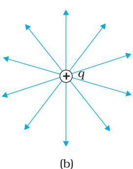

# Chapter Two

# ELECTROSTATIC POTENTIAL AND CAPACITANCE

# 2.1INTRODUCTION

In Chapters 5 and 7 (Class XI), the notion of potential energy was introduced. When an external force does work in taking a body from a point to another against a force like spring force or gravitational force, that work gets stored as potential energy of the body. When the external force is removed, the body moves，gaining kinetic energy and losing an equal amount of potential energy. The sum of kinetic and potential energies is thus conserved. Forces of this kind are called conservative forces. Spring force and gravitational force are examples of conservative forces.

Coulomb force between two (stationary) charges is also a conservative force.This is not surprising, since both have inverse-square dependence on distance and differ mainly in the proportionality constants - the masses in the gravitational law are replaced by charges in Coulomb's law.Thus,like the potential energy of a mass in a gravitational field,we can define electrostatic potential energy of a charge in an electrostatic field.

Consider an electrostatic field $\mathbf { E }$ due to some charge configuration. First, for simplicity, consider the field $\mathbf { E }$ due to a charge $Q$ placed at the origin. Now, imagine that we bring a test charge $q$ from a point R to a point P against the repulsive force on it due to the charge $Q$ .With reference to Fig. 2.1, this will happen if $Q$ and $q$ are both positive or both negative. For definiteness,let us take $Q$ $q > 0$

Two remarks may be made here. First, we assume that the test charge $q$ is so small that it does not disturb the original configuration,namely the charge $Q$ at the origin (or else,we keep $Q$ fixed at the origin by some unspecified force). Second, in bringing the charge $q$ from R to P, we apply an external force $\mathbf { F } _ { \mathrm { e x t } }$ just enough to counter the repulsive electric force $\mathbf { F } _ { \mathrm { E } }$ (i.e, $\mathbf { F } _ { \mathrm { e x t } } \mathbf { = } - \mathbf { F } _ { \mathrm { E } } )$ ： This means there is no net force on or acceleration of the charge $q$ when it is brought from R to P,i.e., it is brought with infinitesimally slow constant speed. In this situation, work done by the external force is the negative of the work done by the electric force,and gets fully stored in the form of potential energy of the charge $q .$ . If the external force is removed on reaching P, the electric force will take the charge away from Q - the stored energy (potential energy) at $\mathrm { P }$ is used to provide kinetic energy to the charge $q$ in such a way that the sum of the kinetic and potential energies is conserved.

Thus, work done by external forces in moving a charge $q$ from R to $\mathrm { P }$ is

$$
\begin{array} { r l } { \mathbf { W } _ { \mathrm { R P } } = } & { \displaystyle \int \mathbf { F } _ { e x t } \cdot \mathrm { d } \mathbf { r } } \\ { = } & { \displaystyle - \int \mathbf { F } _ { e x t } \cdot \mathrm { d } \mathbf { r } } \end{array}
$$

This work done is against electrostatic repulsive force and gets stored as potential energy.

At every point in electric field, a particle with charge $q$ possesses a certain electrostatic potential energy, this work done increases its potential energy by an amount equal to potential energy difference between points Rand P.

Thus, potential energy difference

$$
\Delta U = U _ { P } - U _ { R } = W _ { R P }
$$

(Note here that this displacement is in an opposite sense to the electric force and hence work done by electric field is negative, i.e., $- W _ { R P }$ ）

Therefore, we can define electric potential energy difference between two points as the work required to be done by an external force in moving (without accelerating) charge $q$ from one point to another for electric field of any arbitrary charge configuration.

Two important comments may be made at this stage:

(i)The right side of Eq. (2.2) depends only on the initial and final positions of the charge. It means that the work done by an electrostatic field in moving a charge from one point to another depends only on the initial and the final points and is independent of the path taken to go from one point to the other. This is the fundamental characteristic of a conservative force. The concept of the potential energy would not be meaningful if the work depended on the path. The path-independence of work done by an electrostatic field can be proved using the Coulomb's law. We omit this proof here.

# Electrostatic Potential and Capacitance

(ii) Equation (2.2) defines potential energy difference in terms of the physically meaningful quantity work. Clearly, potential energy so defined is undetermined to within an additive constant.What this means is that the actual value of potential energy is not physically significant; it is only the difference of potential energy that is significant. We can always add an arbitrary constant $\alpha$ to potential energy at every point, since this will not change the potential energy difference:

$$
\begin{array} { r } { ( U _ { P } + \alpha ) - ( U _ { R } + \alpha ) = U _ { P } - U _ { R } } \end{array}
$$

Put it differently, there is a freedom in choosing the point where potential energy is zero.A convenient choice is to have electrostatic potential energy zero at infinity. With this choice, if we take the point R at infinity,we get from Eq. (2.2)

$$
W _ { \infty P } = U _ { P } - U _ { \infty } = U _ { P }
$$

Since the point P is arbitrary, Eq. (2.3) provides us with a definition of potential energy of a charge $q$ at any point. Potential energy of charge q at a point (in the presence of field due to any charge configuration) is the work done by the external force (equal and opposite to the electric force) in bringing the charge q from infinity to that point.

# 2.2 ELECTROSTATIC POTENTIAL

Consider any general static charge configuration. We define potential energy of a test charge $q$ in terms of the work done on the charge $q$ . This work is obviously proportional to $q$ since the force at any point is $q \mathbf { E }$ ,where $\mathbf { \delta E }$ is the electric field at that point due to the given charge configuration. It is, therefore, convenient to divide the work by the amount of charge $q$ S0 that the resulting quantity is independent of $q$ In other words, work done per unit test charge is characteristic of the electric field associated with the charge configuration. This leads to the idea of electrostatic potential $V$ due to a given charge configuration. From Eq. (2.1), we get:

Work done by external force in bringing a unit positive charge from point R to $\mathrm { P }$

Count Alessandro Volta (1745 - 1827) Italian physicist, professor at Pavia. Volta established that the animal electricity observed by Luigi Galvani, 1737-1798, in experiments with frog muscle tissue placed in contact with dissimilar metals, was not due to any exceptional property of animal tissues but was also generated whenever any wet body was sandwiched between dissimilar metals. This led him to develop the first voltaic pile, or battery， consisting of a large stack of moist disks of cardboard (electrolyte) sandwiched between disks of metal (electrodes).

$$
= V _ { P } - V _ { R } \ \left( = { \frac { U _ { P } - U _ { R } } { q } } \right)
$$

where $V _ { P }$ and $V _ { R }$ are the electrostatic potentials at P and R, respectively. Note,as before, that it is not the actual value of potential but the potential difference that is physically significant. If,as before，we choose the potential to be zero at infinity,Eq. (2.4) implies:

Work done by an external force in bringing a unit positive charge from infinity to a point $=$ electrostatic potential (V) at that point.

  
FIGURE 2.2 Work done on a test charge q by the electrostatic field due to any given charge configuration is independent of the path,and depends only on its initial and final positions.

In other words, the electrostatic potential (V) at any point in a region with electrostatic field is the work done in bringing a unit positive charge (without acceleration) from infinity to that point.

The qualifying remarks made earlier regarding potential energy also apply to the definition of potential. To obtain the work done per unit test charge, we should take an infinitesimal test charge Sq, obtain the work done δW in bringing it from infinity to the point and determine the ratio SW/Sq. Also, the external force at every point of the path is to be equal and opposite to the electrostatic force on the test charge at that point.

# 2.3 POTENTIAL DUE TO A POINT CHARGE

Consider a point charge $Q$ at the origin (Fig. 2.3). For definiteness, take $Q$ to be positive. We wish to determine the potential at any point $\mathrm { P }$ with position vector r from the origin. For that we must calculate the work done in bringing a unit positive test charge from infinity to the point P. For $Q > 0$ ， the work done against the repulsive force on the test charge is positive. Since work done is independent of the path, we choose a convenient path - along the radial direction from infinity to the point P.

  
FIGURE 2.3 Work done in bringing a unit positive test charge from infinity to the point P, against the repulsive force of charge $Q$ $\left( Q > 0 \right)$ ，is the potential at P due to the charge Q.

At some intermediate point $\mathrm { P ^ { \prime } }$ on the path, the electrostatic force on a unit positive charge is

$$
\left. { \frac { Q \times 1 } { 4 \pi \varepsilon _ { 0 } r ^ { \prime 2 } } } { \hat { \mathbf { r } } } ^ { \prime } \right.
$$

where $\hat { \mathbf { r } } ^ { \prime }$ is the unit vector along $\mathrm { O P ^ { \prime } }$ . Work done against this force from $\mathbf { r } ^ { \prime }$ to $\mathbf { r } ^ { \prime } + \Delta \mathbf { r } ^ { \prime }$ is

$$
\Delta W = - { \frac { Q } { 4 \pi \varepsilon _ { 0 } r ^ { \prime 2 } } } \Delta r ^ { \prime }
$$

The negative sign appears because for $\Delta r ^ { \prime } < 0$ $\Delta W$ is positive. Total work done (W) by the external force is obtained by integrating Eq. (2.6) from $r ^ { \prime } = \infty$ to $r ^ { \prime } { = } r ,$

$$
W = - \int _ { \infty } ^ { r } \frac { Q } { 4 \pi \varepsilon _ { 0 } { r ^ { \prime } } ^ { 2 } } d r ^ { \prime } = \frac { Q } { 4 \pi \varepsilon _ { 0 } { r ^ { \prime } } } \Bigg | _ { \infty } ^ { r } = \frac { Q } { 4 \pi \varepsilon _ { 0 } r }
$$

This, by definition is the potential at $\mathrm { P }$ due to the charge $Q$

$$
V ( r ) = \frac { Q } { 4 \pi \varepsilon _ { 0 } r }
$$

Equation (2.8) is true for any sign of the charge $Q$ ，though we considered $Q > 0$ in its derivation. For $Q < 0$ ， $V < 0$ ,i.e., work done (by the external force) per unit positive test charge in bringing it from infinity to the point is negative. This is equivalent to saying that work done by the electrostatic force in bringing the unit positive charge form infinity to the point $\mathrm { P }$ is positive.[This is as it should be, since for $Q < 0$ , the force on a unit positive test charge is attractive, so that the electrostatic force and the displacement (from infinity to P) are in the same direction.] Finally, we note that Eq. (2.8) is consistent with the choice that potential at infinity be zero.

  
FIGURE 2.4 Variation of potential $V$ with $r$ [in units of $( Q / 4 \pi \varepsilon _ { 0 } ) \ \mathrm { m } ^ { - 1 } ]$ (blue curve) and field with $r$ [in units of $( Q / 4 \pi \varepsilon _ { 0 } ) \ \mathrm { m } ^ { - 2 } ]$ (black curve) for a point charge $Q$

Figure (2.4) shows how the electrostatic potential $\left( \propto 1 / r \right)$ and the electrostatic field $\scriptstyle { \left( \infty \mathrm { ~ 1 / } r ^ { 2 } \right) }$ varies with $r .$

# Example 2.1

(a) Calculate the potential at a point $\mathrm { P }$ due to a charge of $4 \times 1 0 ^ { - 7 } \mathrm { C }$ located 9 cm away.   
(b) Hence obtain the work done in bringing a charge of $2 \times 1 0 ^ { - 9 } \mathrm { C }$ from infinity to the point P. Does the answer depend on the path along which the charge is brought?

# Solution

$$
{ \begin{array} { l } { { \displaystyle V = { \frac { 1 } { 4 \pi \varepsilon _ { 0 } } } { \frac { Q } { r } } = 9 \times 1 0 ^ { 9 } \mathrm { N m ^ { 2 } } \mathrm { C ^ { - 2 } } \times { \frac { 4 \times 1 0 ^ { - 7 } \mathrm { C } } { 0 . 0 9 \mathrm { m } } } } } \\ { { \mathrm { ~ \ ~ \ } = 4 \times 1 0 ^ { 4 } \mathrm { V } } } \\ { { \displaystyle W = q V = 2 \times 1 0 ^ { - 9 } \mathrm { C } \times 4 \times 1 0 ^ { 4 } \mathrm { V } } } \\ { { \mathrm { ~ \ ~ \ ~ } = 8 \times 1 0 ^ { - 5 } \mathrm { J } } } \end{array} }
$$

No,work done will be path independent. Any arbitrary infinitesimal path can be resolved into two perpendicular displacements: One along $\mathbf { r }$ and another perpendicular to r. The work done corresponding to the later will be zero.

# 2.4 POTENTIAL DUE TO AN ELECTRIC DIPOLE

As we learnt in the last chapter, an electric dipole consists of two charges $q$ and $- q$ separated by a (small) distance $2 a .$ . Its total charge is zero. It is characterised by a dipole moment vector $\mathbf { p }$ whose magnitude is $q \times 2 a$ and which points in the direction from $- q$ to $q$ (Fig. 2.5). We also saw that the electric field of a dipole at a point with position vector r depends not just on the magnitude $r _ { \mathrm { { ; } } }$ ,but also on the angle between r and p. Further,

  
FIGURE 2.5 Quantities involved in the calculation of potential due to a dipole.

Now, by geometry,

the field falls off, at large distance, not as $1 / r ^ { 2 }$ (typical of field due to a single charge) but as $\bar { 1 / r ^ { 3 } }$ .We, now, determine the electric potential due to a dipole and contrast it with the potential due to a single charge.

As before,we take the origin at the centre of the dipole.Now we know that the electric field obeys the superposition principle. Since potential is related to the work done by the field,electrostatic potential also follows the superposition principle. Thus, the potential due to the dipole is the sum of potentials due to the charges $q$ and $- q$

$$
V = { \frac { 1 } { 4 \pi \varepsilon _ { 0 } } } { \left( { \frac { q } { r _ { 1 } } } - { \frac { q } { r _ { 2 } } } \right) }
$$

where $r _ { 1 }$ and $r _ { 2 }$ are the distances of the point P from $q$ and $- q$ ,respectively.

$$
\begin{array} { c } { { r _ { 1 } ^ { 2 } = r ^ { 2 } + a ^ { 2 } - 2 a r \cos \theta } } \\ { { { } } } \\ { { r _ { 2 } ^ { 2 } = r ^ { 2 } + a ^ { 2 } + 2 a r \cos \theta } } \end{array}
$$

We take $r$ much greater than $a \left( r > > a \right)$ and retain terms only upto the first order in $a / r$

$$
\begin{array} { l } { \displaystyle r _ { 1 } ^ { 2 } = r ^ { 2 } \left( 1 - \frac { 2 a \cos \theta } { r } + \frac { a ^ { 2 } } { r ^ { 2 } } \right) } \\ { \displaystyle \cong r ^ { 2 } \left( 1 - \frac { 2 a \cos \theta } { r } \right) } \end{array}
$$

Similarly,

$$
r _ { 2 } ^ { 2 } \cong r ^ { 2 } \left( 1 + \frac { 2 a \cos \theta } { r } \right)
$$

Using the Binomial theorem and retaining terms upto the first order $\mathrm { i n } a / r$ ; we obtain,

$$
\begin{array} { l } { \displaystyle \frac { 1 } { r _ { \mathrm { 1 } } } \cong \frac { 1 } { r } \left( 1 - \frac { 2 a \cos \theta } { r } \right) ^ { - 1 / 2 } \cong \frac { 1 } { r } \left( 1 + \frac { a } { r } \cos \theta \right) } \\ { \displaystyle \frac { 1 } { r _ { \mathrm { 2 } } } \cong \frac { 1 } { r } \left( 1 + \frac { 2 a \cos \theta } { r } \right) ^ { - 1 / 2 } \cong \frac { 1 } { r } \left( 1 - \frac { a } { r } \cos \theta \right) } \end{array}
$$

Using Eqs. (2.9) and (2.13) and $p = 2 q a$ we get

$$
V = { \frac { q } { 4 \pi \varepsilon _ { 0 } } } { \frac { 2 a c o s \theta } { r ^ { 2 } } } = { \frac { p \cos \theta } { 4 \pi \varepsilon _ { 0 } r ^ { 2 } } }
$$

Now, $p \cos \theta = \mathbf { p . i }$

where $\hat { \mathbf { r } }$ is the unit vector along the position vector OP.

The electric potential of a dipole is then given by

$$
V = { \frac { 1 } { 4 \pi \varepsilon _ { 0 } } } { \frac { \mathbf { p . } { \hat { \mathbf { r } } } } { r ^ { 2 } } } ; \qquad ( r > > a )
$$

Equation (2.15) is,as indicated,approximately true only for distances large compared to the size of the dipole,so that higher order terms in $a / r$ are negligible. For a point dipole $\mathbf { p }$ at the origin, Eq. (2.15)is,however, exact.

From Eq. (2.15), potential on the dipole axis ( $\textstyle \theta = 0 , \pi$ )is given by

$$
V = \pm { \frac { 1 } { 4 \pi \varepsilon _ { 0 } } } { \frac { p } { r ^ { 2 } } }
$$

(Positive sign for $\theta = 0$ , negative sign for $\theta = \pi$ ) The potential in the equatorial plane $[ \theta = \pi / 2 ]$ is zero.

The important contrasting features of electric potential of a dipole from that due to a single charge are clear from Eqs. (2.8) and (2.15):

(i) The potential due to a dipole depends not just on $r$ but also on the angle between the position vector $\pmb { \mathrm { r } }$ and the dipole moment vector p. (It is,however, axially symmetric about p. That is, if you rotate the position vector r about p,keeping $\theta$ fixed, the points corresponding to P on the cone so generated will have the same potential as at P.)   
(ii) The electric dipole potential falls off, at large distance, as $1 / r ^ { 2 }$ ,not as $1 / r ,$ ， characteristic of the potential due to a single charge. (You can refer to the Fig. 2.5 for graphs of $1 / r ^ { 2 }$ versus r and $1 / r$ versus $r _ { \mathrm { { ; } } }$ drawn there in another context.)

# 2.5 POTENTIAL DUE TO A SYSTEM OF CHARGES

Consider a system of charges $q _ { 1 }$ ， $q _ { 2 }$ …· $q _ { \mathrm { n } }$ with position vectors $\mathbf { r } _ { 1 }$ $\mathbf { r } _ { 2 } , \ldots .$ ${ \bf r } _ { \mathrm { n } }$ relative to some origin (Fig. 2.6). The potential $V _ { 1 }$ at $\mathrm { P }$ due to the charge $q _ { 1 }$ is

$$
V _ { _ 1 } = \frac { 1 } { 4 \pi \varepsilon _ { _ 0 } } \frac { q _ { _ 1 } } { r _ { _ { 1 \mathrm { P } } } }
$$

where $r _ { \mathrm { 1 P } }$ is the distance between $q _ { 1 }$ and P.

Similarly, the potential $V _ { 2 }$ at $\mathrm { P }$ due to $q _ { 2 }$ and $V _ { 3 }$ due to $q _ { 3 }$ are given by

$$
V _ { 2 } = { \frac { 1 } { 4 \pi \varepsilon _ { 0 } } } { \frac { q _ { 2 } } { r _ { 2 \mathrm { { P } } } } } , V _ { 3 } = { \frac { 1 } { 4 \pi \varepsilon _ { 0 } } } { \frac { q _ { 3 } } { r _ { 3 \mathrm { { P } } } } }
$$

where $r _ { \mathrm { 2 P } }$ and $r _ { \mathrm { { 3 P } } }$ are the distances of $\mathrm { P }$ from charges $q _ { 2 }$ and $q _ { 3 }$ ,respectively; and so on for the potential due to other charges.By the superposition principle, the potential $V$ at P due to the total charge configuration is the algebraic sum of the potentials due to the individual charges

$$
\bar { V ^ { = } } \bar { V _ { \mathrm { 1 } } } + \bar { V _ { \mathrm { 2 } } } + \ldots + \bar { V _ { \mathrm { n } } }
$$

  
FIGURE 2.6 Potential at a point due to a system of charges is the sum of potentials due to individual charges.

$$
= { \frac { 1 } { 4 \pi \varepsilon _ { 0 } } } { \left( { \frac { q _ { 1 } } { r _ { \mathrm { 1 P } } } } + { \frac { q _ { 2 } } { r _ { \mathrm { 2 P } } } } + \ldots + { \frac { q _ { n } } { r _ { n \mathrm { P } } } } \right) }
$$

If we have a continuous charge distribution characterised by a charge density $\rho$ (r), we divide it, as before, into small volume elements each of size $\Delta v$ and carrying a charge $\rho \Delta v$ .We then determine the potential due to each volume element and sum (strictly speaking , integrate) over all such contributions,and thus determine the potential due to the entire distribution.

We have seen in Chapter l that for a uniformly charged spherical shell, the electric field outside the shell is as if the entire charge is concentrated at the centre. Thus, the potential outside the shellis given by

$$
V = { \frac { 1 } { 4 \pi \varepsilon _ { 0 } } } { \frac { q } { r } } \quad ( r \geq { R } )
$$

where $q$ is the total charge on the shell and $R$ its radius. The electric field inside the shell is zero. This implies (Section 2.6) that potential is constant inside the shell (as no work is done in moving a charge inside the shell), and, therefore, equals its value at the surface,which is

$$
V = \frac { 1 } { 4 \pi \varepsilon _ { 0 } } \frac { q } { R }
$$

Example 2.2 Two charges $3 \times 1 0 ^ { - 8 } \mathrm { ~ C ~ }$ and ${ } ^ { - 2 } \times 1 0 ^ { - 8 } \mathrm { ~ C ~ }$ are located $1 5 ~ \mathrm { c m }$ apart. At what point on the line joining the two charges is the electric potential zero? Take the potential at infinity to be zero.

Solution Let us take the origin $\mathrm { o }$ at the location of the positive charge. The line joining the two charges is taken to be the $x ^ { \th }$ axis; the negative charge is taken to be on the right side of the origin (Fig. 2.7).

  
FIGURE 2.7

Let P be the required point on the $x ^ { \th }$ axis where the potential is zero. If $x$ is the $x -$ coordinate of P, obviously $x$ must be positive. (There is no possibility of potentials due to the two charges adding up to zero for $x < 0 .$ ) If $x$ lies between O and A, we have

$$
\frac { 1 } { 4 \pi \varepsilon _ { \scriptscriptstyle 0 } } \left[ \frac { 3 \times 1 0 ^ { - 8 } } { x \times 1 0 ^ { - 2 } } - \frac { 2 \times 1 0 ^ { - 8 } } { ( 1 5 - x ) \times 1 0 ^ { - 2 } } \right] = 0
$$

where $x$ is in cm. That is,

$$
{ \frac { 3 } { x } } - { \frac { 2 } { 1 5 - x } } = 0
$$

which gives $x ~ = ~ 9 ~ \mathrm { c m }$

If $x$ lies on the extended line OA, the required condition is

$$
{ \frac { 3 } { x } } - { \frac { 2 } { x - 1 5 } } = 0
$$

which gives

Thus,electric potential is zero at $9 \ \mathrm { c m }$ and $4 5 ~ \mathrm { c m }$ away from the positive charge on the side of the negative charge. Note that the formula for potential used in the calculation required choosing potential to be zero at infinity.

Example 2.3 Figures 2.8 (a) and (b) show the field lines of a positive and negative point charge respectively.

  
FIGURE 2.8

(a) Give thesignsofthepotentialdifferece $V _ { \mathrm { { P } } } - V _ { \mathrm { { Q } } }$ ： $V _ { \mathrm { B } } \mathrm { ~ - ~ } V _ { \mathrm { A } }$   
(b) Give the sign of the potential energy difference of a small negative charge between the points $\mathrm { \sf { Q } }$ and P; A and B.   
(c) Give the sign of the work done by the field in moving a small positive charge from $\mathrm { \sf Q }$ to P.   
(d) Give the sign of the work done by the external agency in moving a small negative charge from B to A.   
(e) Does the kinetic energy of a small negative charge increase or decrease in going from $_ \mathrm { B }$ to A?

# Solution

(a) As $V \propto { \frac { 1 } { r } }$ ， $V _ { P } > V _ { Q } .$ $( V _ { P } - V _ { Q } )$ osiv al $V _ { B }$ islesgasie $V _ { A }$ $V _ { B } > V _ { A }$ $( V _ { B } - V _ { A } )$   
(b) A small negative charge will be attracted towards positive charge. The negative charge moves from higher potential energy to lower potential energy. Therefore the sign of potential energy difference of a small negative charge between $\mathrm { \sf Q }$ and $\mathrm { P }$ is positive.   
Similarly, $\left( \mathrm { P . E . } \right) _ { \mathrm { A } } > \left( \mathrm { P . E . } \right) _ { \mathrm { B } }$ and hence sign of potential energy differences is positive.   
(c) In moving a small positive charge from $\mathrm { \sf Q }$ to P, work has to be done by an external agency against the electric field. Therefore, work done by the field is negative.   
(d) In moving a small negative charge from B to A work has to be done by the external agency. It is positive.   
(e) Due to force of repulsion on the negative charge, velocity decreases and hence the kinetic energy decreases in going from B to A.   
FIGURE 2.9 For a single charge $q$   
(a) equipotential surfaces are   
spherical surfaces centred at the charge，and (b) electric field lines are radial,   
starting from the charge if $q > 0$ ：

  
(a)

# 2.6 EgUIPOTENTIAL SURFACES

An equipotential surface is a surface with a constant value of potential at all points on the surface. For a single charge $q$ ,the potential is given by Eq. (2.8):

$$
V = { \frac { 1 } { 4 \pi \varepsilon _ { o } } } { \frac { q } { r } }
$$

This shows that $V$ is a constant if $r$ is constant. Thus, equipotential surfaces of a single point charge are concentric spherical surfaces centred at the charge.

Now the electric field lines for a single charge $q$ are radial lines starting from or ending at the charge, depending on whether qis positive or negative. Clearly, the electric field at every point is normal to the equipotential surface passing through that point. This is true in general: for any charge configuration, equipotential surface through a point is normal to the electric field at that point. The proof of this statement is simple.

If the field were not normal to the equipotential surface, it would have non-zero component along the surface. To move a unit test charge against the direction of the component of the field, work would have to be done. But this is in contradiction to the definition of an equipotential surface: there is no potential difference between any two points on the surface and no work is required to move a test charge on the surface. The electric field must, therefore, be normal to the equipotential surface at every point. Equipotential surfaces offer an alternative visual picture in addition to the picture of electric field lines around a charge configuration.

  
FIGURE 2.10 Equipotential surfaces for a uniform electric field.

For a uniform electric field $\mathbf { \delta E }$ , say, along the $x -$ axis, the equipotential surfaces are planes normal to the $x$ axis, i.e., planes parallel to the $y - z$ plane (Fig. 2.1O). Equipotential surfaces for (a) a dipole and (b) two identical positive charges are shown in Fig. 2.11.

  
FIGURE 2.11 Some equipotential surfaces for (a) a dipole, (b) two identical positive charges.

# 2.6.1 Relation between field and potential

Consider two closely spaced equipotential surfaces A and B (Fig. 2.12) with potential values $V$ and $V + \delta V ,$ where $\delta V$ is the change in $V$ in the direction of the electric field E.Let P be a point on the surface B. δl is the perpendicular distance of the surface A from P. Imagine that a unit positive charge is moved along this perpendicular from the surface B to surface A against the electric field. The work done in this process is $| \mathbf { E } | \delta l .$

This work equals the potential difference $V _ { A } - V _ { B } .$

Thus,

$$
\begin{array} { l } { | \mathbf { E } | \delta l = V - ( V + \delta V ) = - \delta V } \\ { \displaystyle } \\ { \mathrm { i . e . , ~ } | \mathbf { E } | = - \frac { \delta V } { \delta l } } \end{array}
$$

Since $\delta V$ is negative, $\delta V = - \left| \delta V \right|$ . we can rewrite Eq (2.20) as

  
FIGURE 2.12 From the potential to the field.

$$
\left| \mathbf { E } \right| = - { \frac { \delta V } { \delta l } } = + { \frac { \left| \delta V \right| } { \delta l } }
$$

We thus arrive at two important conclusions concerning the relation between electric field and potential:

(i) Electric field is in the direction in which the potential decreases steepest.   
(ii) Its magnitude is given by the change in the magnitude of potential per unit displacement normal to the equipotential surface at the point.

# 2.7 POTENTIAL ENERGY OF A SYSTEM OF CHARGES

Consider first the simple case of two charges $q _ { 1 }$ and $q _ { 2 }$ with position vector $\mathbf { r } _ { 1 }$ and $\mathbf { r } _ { 2 }$ relative to some origin. Let us calculate the work done (externally) in building up this configuration. This means that we consider the charges $q _ { 1 }$ and $q _ { 2 }$ initially at infinity and determine the work done by an external agency to bring the charges to the given locations. Suppose, first the charge $q _ { 1 }$ is brought from infinity to the point ${ \bf r } _ { 1 }$ .There is no external field against which work needs to be done,so work done in bringing $q _ { 1 }$ from infinity to ${ \bf r } _ { 1 }$ is zero. This charge produces a potential in space given by

$$
V _ { \mathrm { 1 } } = { \frac { 1 } { 4 \pi \varepsilon _ { \mathrm { 0 } } } } { \frac { q _ { \mathrm { 1 } } } { r _ { \mathrm { 1 { P } } } } }
$$

where $r _ { \mathrm { 1 P } }$ is the distance of a point $\mathrm { P }$ in space from the location of $q _ { 1 }$ From the definition of potential, work done in bringing charge $q _ { 2 }$ from infinity to the point $\mathbf { r } _ { 2 }$ is $q _ { 2 }$ times the potential at $\mathbf { r } _ { 2 }$ due to $q _ { 1 }$ ：

work done on q2= 4πε12

# Physics

where $r _ { \scriptscriptstyle { 1 2 } }$ is the distance between points 1 and 2.

Since electrostatic force is conservative, this work gets stored in the form of potential energy of the system. Thus, the potential energy of a system of two charges $q _ { 1 }$ and $q _ { 2 }$ is

  
FIGURE 2.13 Potential energy of a system of charges $q _ { 1 }$ and $q _ { 2 }$ is directly proportional to the product of charges and inversely to the distance between them.

$$
U = { \frac { 1 } { 4 \pi \varepsilon _ { 0 } } } { \frac { q _ { 1 } q _ { 2 } } { r _ { 1 2 } } }
$$

Obviously, if $q _ { 2 }$ was brought first to its present location and $q _ { 1 }$ brought later, the potential energy $U$ would be the same. More generally, the potential energy expression,

Eq. (2.22), is unaltered whatever way the charges are brought to the specified locations, because of path-independence of work for electrostatic force.

Equation (2.22) is true for any sign of $q _ { \mathrm { 1 } } \mathrm { a n d } q _ { \mathrm { 2 } }$ If $q _ { 1 } q _ { 2 } > 0$ ,potential energy is positive. This is as expected, since for like charges $( q _ { 1 } q _ { 2 } > 0 )$ ， electrostatic force is repulsive and a positive amount of work is needed to be done against this force to bring the charges from infinity to a finite distance apart. For unlike charges $( q _ { 1 } q _ { 2 } < 0 )$ ， the electrostatic force is attractive. In that case,a positive amount of work is needed against this force to take the charges from the given location to infinity. In other words, a negative amount of work is needed for the reverse path (from infinity to the present locations), so the potential energy is negative.

Equation (2.22) is easily generalised for a system of any number of point charges. Let us calculate the potential energy of a system of three charges $q _ { 1 } , q _ { 2 }$ and $q _ { 3 }$ located at $\mathbf { r } _ { 1 } , \mathbf { r } _ { 2 } , \mathbf { r } _ { 3 }$ ，respectively. To bring $q _ { 1 }$ first from infinity to $\mathbf { r } _ { 1 }$ , no work is required. Next we bring $q _ { 2 }$ from infinity to $\mathbf { r } _ { 2 }$ . As before, work done in this step is

$$
q _ { 2 } V _ { 1 } ( \mathbf { r } _ { 2 } ) = { \frac { 1 } { 4 \pi \varepsilon _ { 0 } } } { \frac { q _ { 1 } q _ { 2 } } { r _ { 1 2 } } }
$$

The charges $q _ { 1 }$ and $q _ { 2 }$ produce a potential, which at any point $\mathrm { P }$ is given by

$$
V _ { _ { 1 , 2 } } = { \frac { 1 } { 4 \pi \varepsilon _ { 0 } } } { \left( { \frac { q _ { _ { 1 } } } { r _ { _ { 1 \mathrm { P } } } } } + { \frac { q _ { _ { 2 } } } { r _ { _ { 2 \mathrm { P } } } } } \right) }
$$

Work done next in bringing $q _ { 3 }$ from infinity to the point ${ \bf r } _ { 3 }$ is $q _ { 3 }$ times . 2 at r3

  
FIGURE 2.14 Potential energy of a system of three charges is given by Eq. (2.26)，with the notation given in the figure.

$$
q _ { 3 } V _ { 1 , 2 } ( { \bf r } _ { 3 } ) = \frac { 1 } { 4 \pi \varepsilon _ { 0 } } \left( \frac { q _ { 1 } q _ { 3 } } { r _ { 1 3 } } + \frac { q _ { 2 } q _ { 3 } } { r _ { 2 3 } } \right)
$$

The total work done in assembling the charges at the given locations is obtained by adding the work done in different steps [Eq. (2.23) and Eq. (2.25)l,

$$
U = { \frac { 1 } { 4 \pi \varepsilon _ { 0 } } } { \left( \frac { q _ { 1 } q _ { 2 } } { r _ { 1 2 } } + \frac { q _ { 1 } q _ { 3 } } { r _ { 1 3 } } + \frac { q _ { 2 } q _ { 3 } } { r _ { 2 3 } } \right) }
$$

Again, because of the conservative nature of the electrostatic force (or equivalently,the path independence of work done), the final expression for $U _ { \ast }$ Eq. (2.26),is independent of the manner in which the configuration is assembled. The potential energy is characteristic of the present state of configuration, and not the way the state is achieved.

Example 2.4 Four charges are arranged at the corners of a square ABCD of side $d$ , as shown in Fig. 2.15.(a) Find the work required to put together this arrangement. (b) A charge $q _ { 0 }$ is brought to the centre $\mathrm { E }$ of the square, the four charges being held fixed at its corners. How much extra work is needed to do this?

  
FIGURE 2.15

# Solution

(a) Since the work done depends on the final arrangement of the charges, and not on how they are put together, we calculate work needed for one way of putting the charges at A, B, C and D. Suppose, first the charge $+ q$ is brought to A, and then the charges $- q , + q ,$ and $- q$ are brought to B, C and D, respectively. The total work needed can be calculated in steps:

(i) Work needed to bring charge $+ q$ to A when no charge is present elsewhere: this is zero.   
(ii) Work needed to bring $- q$ to $_ \mathrm { B }$ when $+ q$ is at A. This is given by (charge at B) $\times$ (electrostatic potential at B due to charge $+ q$ at A) $= - q \times \left( { \frac { q } { 4 \pi \varepsilon _ { 0 } d } } \right) = - { \frac { q ^ { 2 } } { 4 \pi \varepsilon _ { 0 } d } }$   
(iii) Work needed to bring charge $+ q$ to $\mathrm { ^ c }$ when $+ q$ is at A and $- q$ is at B. This is given by (charge at $\mathrm { C } ) \ \times$ (potential at C due to charges at A and B) $\begin{array} { l } { { \displaystyle = + q \left( \frac { + q } { 4 \pi \varepsilon _ { 0 } d \sqrt { 2 } } + \frac { - q } { 4 \pi \varepsilon _ { 0 } d } \right) } } \\ { { \displaystyle = \frac { - q ^ { 2 } } { 4 \pi \varepsilon _ { 0 } d } \left( 1 - \frac { 1 } { \sqrt { 2 } } \right) } } \end{array}$

(iv) Work needed to bring $- q$ to $_ \mathrm { D }$ when $+ q$ at $\mathrm { A } , - q$ at B, and $+ q$ at C. This is given by (charge at $\mathrm { D } ) \times$ (potential at $_ \mathrm { D }$ due to charges at A, $_ \mathrm { B }$ and C)

$$
\begin{array} { l } { { \displaystyle = - q \Biggl ( \frac { + q } { 4 \pi \varepsilon _ { 0 } d } + \frac { - q } { 4 \pi \varepsilon _ { 0 } d \sqrt 2 } + \frac { q } { 4 \pi \varepsilon _ { 0 } d } \Biggr ) } } \\ { { \displaystyle = \frac { - q ^ { 2 } } { 4 \pi \varepsilon _ { 0 } d } \Biggl ( 2 - \frac { 1 } { \sqrt 2 } \Biggr ) } } \end{array}
$$

Add the work done in steps (i), (ii), (ii) and (iv). The total work required is

$$
\begin{array} { l } { { \displaystyle = \frac { - q ^ { 2 } } { 4 \pi \varepsilon _ { 0 } d } \left\{ ( 0 ) + ( 1 ) + \left( 1 - \frac { 1 } { \sqrt { 2 } } \right) + \left( 2 - \frac { 1 } { \sqrt { 2 } } \right) \right\} } } \\ { { \displaystyle = \frac { - q ^ { 2 } } { 4 \pi \varepsilon _ { 0 } d } \Big ( 4 - \sqrt { 2 } \Big ) } } \end{array}
$$

The work done depends only on the arrangement of the charges, and not how they are assembled. By definition,this is the total electrostatic energy of the charges.

(Students may try calculating same work/energy by taking charges in any other order they desire and convince themselves that the energy will remain the same.)

(b) The extra work necessary to bring a charge $q _ { 0 }$ to the point $\mathrm { E }$ when the four charges are at A, B, C and D is $q _ { \mathrm { 0 } } \times$ (electrostatic potential at E due to the charges at A, B, C and D). The electrostatic potential at E is clearly zero since potential due to A and $\mathrm { ^ c }$ is cancelled by that due to B and D. Hence, no work is required to bring any charge to point E.

# 2.8 POTENTIAL ENERGY IN AN EXTERNAL FIELD

# 2.8.1 Potential energy of a single charge

In Section 2.7, the source of the electric field was specified - the charges and their locations - and the potential energy of the system of those charges was determined. In this section, we ask a related but a distinct question. What is the potential energy of a charge $q$ in a given field? This question was, in fact, the starting point that led us to the notion of the electrostatic potential (Sections 2.1 and 2.2). But here we address this question again to clarify in what way it is different from the discussion in Section 2.7.

The main difference is that we are now concerned with the potential energy of a charge (or charges) in an external field. The external field $\mathbf { \delta E }$ is not produced by the given charge(s) whose potential energy we wish to calculate. $\mathbf { E }$ is produced by sources external to the given charge(s).The external sources may be known,but often they are unknown or unspecified; what is specified is the electric field E or the electrostatic potential $V$ due to the external sources.We assume that the charge $q$ does not significantly affect the sources producing the external field. This is true if $q$ is very small, or the external sources are held fixed by other unspecified forces. Even if $q$ is finite, its influence on the external sources may still be ignored in the situation when very strong sources far away at infinity produce a finite field $\mathbf { E }$ in the region of interest. Note again that we are interested in determining the potential energy of a given charge $q$ (and later, a system of charges) in the external field; we are not interested in the potential energy of the sources producing the external electric field.

The external electric field $\mathbf { E }$ and the corresponding external potential V may vary from point to point. By definition, $V$ at a point P is the work done in bringing a unit positive charge from infinity to the point P.

(We continue to take potential at infinity to be zero.) Thus,work done in bringing a charge $q$ from infinity to the point Pin the external field is $\mathrm { q } V .$ This work is stored in the form of potential energy of $q$ If the point P has position vector r relative to some origin,we can write:

Potential energy of $q$ at $\pmb { \mathrm { r } }$ in an external field

$$
= q V ( \mathbf { r } )
$$

where $V ( \mathbf { r } )$ is the external potential at the point r.

Thus, if an electron with charge $q = e = 1 . 6 { \times } 1 0 ^ { - 1 9 } \mathrm { C }$ is accelerated by a potential difference of $\Delta V = 1$ volt, it would gain energy of $q \Delta V = 1 . 6 \times$ $1 0 ^ { - 1 9 } \mathrm { J }$ .This unit of energy is defined as 1 electron volt or leV, i.e., ${ \mathrm { 1 ~ e V = 1 . 6 \times 1 0 ^ { - 1 9 } J } }$ The units based on eV are most commonly used in atomic, nuclear and particle physics, $( 1 ~ \mathrm { k e V } = 1 0 ^ { 3 } \mathrm { e V } = 1 . 6 \times 1 0 ^ { - 1 6 } \mathrm { J }$ ,1 MeV $\mathbf { \tau } = 1 0 ^ { 6 } \mathrm { e V } = 1 . 6 \times 1 0 ^ { - 1 3 } \mathbf { \bar { J } }$ $1 ~ { \mathrm { G e V } } = 1 0 ^ { 9 } { \mathrm { e V } } = 1 . 6 \times 1 0 ^ { - 1 0 } { \mathrm { J } }$ and $1 \mathrm { T e V } = 1 0 ^ { 1 2 } \mathrm { e V }$ $= 1 . 6 \times 1 0 ^ { - 7 } \mathrm { J } )$ . [This has already been defined on Page 117, XI Physics Part I, Table 6.1.]

# 2.8.2 Potential energy of a system of two charges in an external field ■

Next, we ask: what is the potential energy ofa system of two charges $q _ { 1 }$ and $q _ { 2 }$ located at ${ \bf r } _ { 1 }$ and $\mathbf { r } _ { 2 }$ ， respectively, in an external field? First, we calculate the work done in bringing the charge $q _ { 1 }$ from infinity to ${ \bf r } _ { 1 }$ Work done in this step is $q _ { 1 } ^ { \mathbf { \Theta } } V ( \mathbf { r } _ { 1 } )$ , using Eq. (2.27). Next, we consider the work done in bringing $q _ { 2 }$ to $\mathbf { r } _ { 2 }$ . In this step, work is done not only against the external field $\mathbf { \delta E }$ but also against the field due to $q _ { 1 }$ ：

Work done on $q _ { 2 }$ against the external field $= q _ { 2 } V ( \mathbf { r } _ { 2 } )$   
Work done on $q _ { 2 }$ against the field due to $q _ { 1 }$ $= \frac { q _ { 1 } q _ { 2 } } { 4 \pi \varepsilon _ { o } r _ { 1 2 } }$

where $r _ { 1 2 }$ is the distance between $q _ { 1 }$ and $q _ { 2 }$ .We have made use of Eqs. (2.27) and (2.22). By the superposition principle for fields,we add up the work done on $q _ { 2 }$ against the two fields ( $\mathbf { \delta E }$ and that due to $q _ { 1 } ^ { \mathrm { ~ ~ } }$ ：

Work done in bringing $q _ { 2 }$ to $\mathbf { r } _ { 2 }$

$= q _ { 2 } V ( \mathbf { r } _ { 2 } ) + { \frac { q _ { 1 } q _ { 2 } } { 4 \pi \varepsilon _ { o } r _ { 1 2 } } }$   
Thus,   
Potential energy of the system   
$=$ the total work done in assembling the configuration   
$= q _ { 1 } V ( \mathbf { r } _ { 1 } ) + q _ { 2 } V ( \mathbf { r } _ { 2 } ) + { \frac { q _ { 1 } q _ { 2 } } { 4 \pi \varepsilon _ { 0 } r _ { 1 2 } } }$

# Example 2.5

(a) Determine the electrostatic potential energy of a system consisting of two charges $7 ~ \mu \mathrm { C }$ and $- 2 ~ \mu \mathrm { C }$ (and with no external field) placed at (-9 cm, 0, O) and (9 cm, 0, O) respectively.   
(b) How much work is required to separate the two charges infinitely away from each other?

(c) Suppose that the same system of charges_is now placed in an external electric field $E = A \ ( 1 / r ^ { 2 } )$ . $A = 9 \times \mathrm { ^ { - } 1 0 ^ { 5 } N C ^ { - 1 } \ m ^ { 2 } }$ What would the electrostatic energy of the configuration be?

# Solution

(a) $U = \frac { 1 } { 4 \pi \varepsilon _ { 0 } } \frac { q _ { 1 } q _ { 2 } } { r } = 9 \times 1 0 ^ { 9 } \times \frac { 7 \times ( - 2 ) \times 1 0 ^ { - 1 2 } } { 0 . 1 8 } = - 0 . 7 \ \mathrm { J } .$   
(b) $W = U _ { 2 } - U _ { 1 } = 0 - U = 0 - ( - 0 . 7 ) = 0 . 7 \ : \mathrm { J } .$   
(c) The mutual interaction energy of the two charges remains unchanged. In addition, there is the energy of interaction of the two charges with the external electric field. We find, $q _ { 1 } V \left( \mathbf { r } _ { 1 } \right) + q _ { 2 } V \left( \mathbf { r } _ { 2 } \right) = A \frac { 7 \mu \mathrm { C } } { 0 . 0 9 \mathrm { m } } + A \frac { - 2 \mu \mathrm { C } } { 0 . 0 9 \mathrm { m } }$ and the net electrostatic energy is $q _ { 1 } V \bigl ( \mathbf { r } _ { 1 } \bigr ) + q _ { 2 } V \bigl ( \mathbf { r } _ { 2 } \bigr ) + \frac { q _ { 1 } q _ { 2 } } { 4 \pi \varepsilon _ { 0 } r _ { 1 2 } } = A \frac { 7 \mu \mathbf { C } } { 0 . 0 9 \mathrm { m } } + A \frac { - 2 \mu \mathbf { C } } { 0 . 0 9 \mathrm { m } } - 0 . 7 \mathrm { J }$

  
FIGURE 2.16 Potential energy of a dipole in a uniform external field.

# 2.8.3 Potential energy of a dipole in an external field

Consider a dipole with charges $q _ { \mathrm { 1 } } = + q$ and $q _ { 2 } = - q$ placed in a uniform electric field $\mathbf { E }$ ,as shown in Fig. 2.16.

As seen in the last chapter, in a uniform electric field, the dipole experiences no net force; but experiences a torque $\pmb { \tau }$ given by

$$
{ \boldsymbol { \tau } } = \mathbf { p } \times \mathbf { E }
$$

which will tend to rotate it (unless $\mathbf { p }$ is parallel or antiparallel to $\mathbf { E }$ ). Suppose an external torque $\pmb { \tau } _ { \mathrm { e x t } }$ is applied in such a manner that it just neutralises this torque and rotates it in the plane of paper from angle $\theta _ { 0 }$ to angle $\theta _ { 1 }$ at an infinitesimal angular speed and without angular acceleration. The amount of work done by the external torque will be given by

$$
\begin{array} { l } { W = \displaystyle \int _ { \theta _ { 0 } } ^ { \theta _ { 1 } } t _ { \mathrm { e x t } } ( \theta ) d \theta = \displaystyle \int _ { \theta _ { 0 } } ^ { \theta _ { 1 } } p E \sin \theta d \theta } \\ { \quad = p E \big ( \cos \theta _ { 0 } - \cos \theta _ { 1 } \big ) } \end{array}
$$

This work is stored as the potential energy of the system.We can then associate potential energy $U ( \theta )$ with an inclination $\theta$ of the dipole. Similar to other potential energies,there is a freedom in choosing the angle where the potential energy $U$ is taken to be zero.A natural choice is to take $\theta _ { 0 } = \pi / 2$ . (An explanation for it is provided towards the end of discussion.) We can then write,

$$
L \left( \theta \right) = p E { \Bigg ( } \cos { \frac { \pi } { 2 } } - \cos \theta { \Bigg ) } = { \Bigg . } p E \cos \theta = - \mathbf { p . E }
$$

This expression can alternately be understood also from Eq. (2.29). We apply Eq. (2.29) to the present system of two charges $+ q$ and $- q$ The potential energy expression then reads

$$
U ^ { \prime } \left( \theta \right) = q [ V \left( \mathbf { r } _ { 1 } \right) - V \left( \mathbf { r } _ { 2 } \right) ] - \frac { q ^ { 2 } } { 4 \pi \varepsilon _ { 0 } \times 2 a }
$$

Here, $\mathbf { r _ { 1 } }$ and $\mathbf { r _ { 2 } }$ denote the position vectors of $+ q$ and $- q$ ，Now,the potential difference between positions $\mathbf { r _ { 1 } }$ and $\mathbf { r _ { 2 } }$ equals the work done in bringing a unit positive charge against field from $\mathbf { r _ { 2 } }$ to $\mathbf { r _ { 1 } }$ .The displacement parallel to the force is $2 a$ cos0. Thus, $\left[ V ( \mathbf { r } _ { 1 } ) \mathbf { - } \mathbf { V } \left( \mathbf { r } _ { 2 } \right) \right] =$ $- E \times 2 a$ cos0 .We thus obtain,

$$
U ^ { \prime } \big ( \theta \big ) = - p E \cos \theta - \frac { q ^ { 2 } } { 4 \pi \varepsilon _ { \scriptscriptstyle 0 } \times 2 a } = - { \bf p . E } - \frac { q ^ { 2 } } { 4 \pi \varepsilon _ { \scriptscriptstyle 0 } \times 2 a }
$$

We note that $U ^ { \prime } ( \theta )$ differs from $U ( \theta )$ by a quantity which is just a constant for a given dipole. Since a constant is insignificant for potential energy, we can drop the second term in Eq. (2.34) and it then reduces to Eq. (2.32).

We can now understand why we took $\theta _ { 0 } \mathrm { { = } } \pi / 2$ . In this case, the work done against the external field $\mathbf { E }$ in bringing $+ q$ and - $q$ are equal and opposite and cancel out, i.e., $q \left[ V ( \mathbf { r } _ { 1 } ) \mathbf { \Phi } - V ( \mathbf { r } _ { 2 } ) \right] { = } 0$

Example 2.6 A molecule of a substance has a permanent electric dipole moment of magnitude $1 0 ^ { - 2 9 } \mathrm { ~ C ~ m ~ }$ . A mole of this substance is polarised (at low temperature) by applying a strong electrostatic field of magnitude $1 0 ^ { 6 } \mathrm { V } \mathrm { m } ^ { - 1 }$ . The direction of the field is suddenly changed by an angle of $6 0 ^ { \circ }$ . Estimate the heat released by the substance in aligning its dipoles along the new direction of the field. For simplicity, assume $1 0 0 \%$ polarisation of the sample.

Solution Here, dipole moment of each molecules $= 1 0 ^ { - 2 9 } \mathrm { ~ C ~ m ~ }$ As 1 mole of the substance contains $6 \times 1 0 ^ { 2 3 }$ molecules, total dipole moment of all the molecules, $p = 6 \times 1 0 ^ { 2 3 } \times 1 0 ^ { - 2 9 } \mathrm { ~ C ~ m ~ }$ $= 6 \times 1 0 ^ { - 6 } \mathrm { ~ C ~ m ~ }$ Initial potential energy, $U _ { i } = - p E$ cos $\theta = - 6 { \times } 1 0 ^ { - 6 } { \times } 1 0 ^ { 6 }$ cos $0 ^ { \circ } = - 6 \mathrm { ~ J ~ }$ Final potential energy (when $\theta = 6 0 ^ { \circ } )$ ， $U _ { f } = - 6 \times 1 0 ^ { - 6 } \times 1 0 ^ { 6 }$ cos $6 0 ^ { \circ } = - 3 { \mathrm { ~ J } }$ Change in potential energy $= - 3 \mathrm { ~ J ~ - ~ } ( \mathrm { - 6 J } ) = 3 \mathrm { ~ J }$ So, there is loss in potential energy. This must be the energy released by the substance in the form of heat in aligning its dipoles.

# 2.9 ELECTROSTATICS OF CONDUCTORS

Conductors and insulators were described briefly in Chapter 1. Conductors contain mobile charge carriers.In metallic conductors, these charge carriers are electrons. In a metal, the outer (valence) electrons part away from their atoms and are free to move. These electrons are free within the metal but not free to leave the metal. The free electrons form a kind of gas'; they collide with each other and with the ions,and move randomly in different directions.In an external electric field, they drift against the direction of the field. The positive ions made up of the nuclei and the bound electrons remain held in their fixed positions.In electrolytic conductors, the charge carriers are both positive and negative ions; but the situation in this case is more involved- the movement of the charge carriers is affected both by the external electric field as also by the so-called chemical forces (see Chapter 3).We shall restrict our discussion to metallic solid conductors. Let us note important results regarding electrostatics of conductors.

# 1. Inside a conductor, electrostatic field is zero

Consider a conductor, neutral or charged. There may also be an external electrostatic field.In the static situation, when there is no current inside or on the surface of the conductor, the electric field is zero everywhere inside the conductor. This fact can be taken as the defining property of a conductor.A conductor has free electrons.As long as electric field is not zero,the free charge carriers would experience force and drift. In the static situation, the free charges have so distributed themselves that the electric field is zero everywhere inside. Electrostatic field is zero inside $a$ conductor.

# 2. At the surface of a charged conductor, electrostatic field must be normal to the surface at every point

If $\mathbf { \delta E }$ were not normal to the surface, it would have some non-zero component along the surface. Free charges on the surface of the conductor would then experience force and move. In the static situation, therefore, $\mathbf { \delta E }$ should have no tangential component. Thus electrostatic field at the surface of $a$ charged conductor must be normal to the surface at every point. (For a conductor without any surface charge density, field is zero even at the surface.) See result 5.

# 3. The interior of a conductor can have no excess charge in the static situation

A neutral conductor has equal amounts of positive and negative charges in every small volume or surface element. When the conductor is charged, the excess charge can reside only on the surface in the static situation. This follows from the Gauss's law. Consider any arbitrary volume element $v$ inside a conductor. On the closed surface S bounding the volume element v, electrostatic field is zero.Thus the total electric flux through S is zero. Hence,by Gauss's law, there is no net charge enclosed by S.But the surface S can be made as small as you like, i.e., the volume v can be made vanishingly small. This means there is no net charge at any point inside the conductor, and any excess charge must reside at the surface.

# 4. Electrostatic potential is constant throughout the volume of the conductor and has the same value (as inside) on its surface

This follows from results 1 and 2 above. Since $\mathbf { E } = 0$ inside the conductor and has no tangential component on the surface,no work is done in moving a small test charge within the conductor and on its surface.That is,there is no potential difference between any two points inside or on the surface of the conductor. Hence, the result.If the conductor is charged, electric field normal to the surface exists; this means potential will be different for the surface and a point just outside the surface.

In a system of conductors of arbitrary size,shape and charge configuration,each conductor is characterised by a constant value of potential, but this constant may differ from one conductor to the other.

# 5. Electric field at the surface of a charged conductor

$$
\mathbf { E } = \frac { \sigma } { \varepsilon _ { 0 } } \hat { \mathbf { n } }
$$

where $\sigma$ is the surface charge density and $\hat { \bf n }$ is a unit vector normal to the surface in the outward direction.

To derive the result, choose a pill box (a short cylinder) as the Gaussian surface about any point P on the surface,as shown in Fig. 2.17. The pill box is partly inside and partly outside the surface of the conductor. It has a small area of cross section $\delta \mathbf { S }$ and negligible height.

Just inside the surface, the electrostatic field is zero; just outside, the field is normal to the surface with magnitude $E$ Thus, the contribution to the total flux through the pill box comes only from the outside (circular) cross-section of the pill box. This equals $\pm \ : E \delta S$ (positive for $\sigma > 0$ ， negative for $\sigma < 0 .$ ),since over the small area δS, E may be considered constant and $\mathbf { E }$ and $\delta S$ are parallel or antiparallel. The charge enclosed by the pill box is o8S.

By Gauss's law

$$
\begin{array} { l } { E \delta S = \displaystyle \frac { \left| \sigma \right| \delta S } { \varepsilon _ { \scriptscriptstyle 0 } } } \\ { E = \displaystyle \frac { \left| \sigma \right| } { \varepsilon _ { \scriptscriptstyle 0 } } } \end{array}
$$

  
FIGURE 2.17 The Gaussian surface (a pill box) chosen to derive Eq. (2.35) for electric field at the surface of a charged conductor.

Including the fact that electric field is normal to the surface, we get the vector relation, Eq. (2.35), which is true for both signs of $\sigma$ For $\sigma > 0$ , electric field is normal to the surface outward; for $\sigma < 0$ ,electric field is normal to the surface inward.

# 6. Electrostatic shielding

Consider a conductor with a cavity, with no charges inside the cavity. A remarkable result is that the electric field inside the cavity is zero,whatever be the size and shape of the cavity and whatever be the charge on the conductor and the external fields in which it might be placed.We have proved a simple case of this result already: the electric field inside a charged spherical shell is zero. The proof of the result for the shell makes use of the spherical symmetry of the shell (see Chapter 1). But the vanishing of electric field in the (charge-free) cavity of a conductor is,as mentioned above, a very general result. A related result is that even if the conductor is charged or charges are induced on a neutral conductor by an external field,all charges reside only on the outer surface of a conductor with cavity.

  
FIGURE 2.18 The electric field inside a cavity of any conductor is zero. All charges reside only on the outer surface of a conductor with cavity. (There are no charges placed in the cavity.)

The proofs of the results noted in Fig. 2.18 are omitted here,but we note their important implication.Whatever be the charge and field configuration outside,any cavity in a conductor remains shielded from outside electric influence: the field inside the cavity is always zero. This is known as electrostatic shielding. The effect can be made use of in protecting sensitive instruments from outside electrical influence.Figure 2.19 gives a summary of the important electrostatic properties of a conductor.

  
FIGURE 2.19 Some important electrostatic properties of a conductor.

# Example 2.7

(a) A comb run through one's dry hair attracts small bits of paper. Why? What happens if the hair is wet or if it is a rainy day? (Remember, a paper does not conduct electricity.)   
(b) Ordinary rubber is an insulator. But special rubber tyres of aircraft are made slightly conducting. Why is this necessary?   
(c) Vehicles carrying inflammable materials usually have metalic ropes touching the ground during motion. Why?   
(d) A bird perches on a bare high power line,and nothing happens to the bird. A man standing on the ground touches the same line and gets a fatal shock. Why?

# Solution

(a) This is because the comb gets charged by friction. The molecules in the paper gets polarised by the charged comb,resulting in a net force of attraction. If the hair is wet, or if it is rainy day, friction between hair and the comb reduces. The comb does not get charged and thus it will not attract small bits of paper.

# Electrostatic Potential and Capacitance

(b) To enable them to conduct charge (produced by friction) to the ground; as too much of static electricity accumulated may result in spark and result in fire.   
(c) Reason similar to (b).   
(d) Current passes only when there is difference in potential.

# 2.10 DIELECTRICS AND POLARISATION

Dielectrics are non-conducting substances. In contrast to conductors, they have no (or negligible number of) charge carriers. Recal from Section 2.9 what happens when a conductor is placed in an external electric field. The free charge carriers move and charge distribution in the conductor adjusts itself in such a way that the electric field due to induced charges opposes the external field within the conductor.This happens until, in the static situation, the two fields cancel each other and the net electrostatic field in the conductor is zero.In a dielectric,this free movement of charges is not possible. It turns out that the external field induces dipole moment by stretching or re-orienting molecules of the dielectric. The collective effect of all the molecular dipole moments is net charges on the surface of the dielectric which produce a field that opposes the external field. Unlike in a conductor, however, the opposing field so induced does not exactly cancel the external field. It only reduces it.

  
FIGURE 2.20 Difference in behaviour of a conductor and a dielectric in an external electric field.

The extent of the effect depends on the nature of the dielectric.To understand the effect,we need to look at the charge distribution of a dielectric at the molecular level.

The molecules of a substance may be polar or non-polar. In a non-polar molecule,the centres of positive and negative charges coincide. The molecule then has no permanent (or intrinsic) dipole moment. Examples of non-polar molecules are oxygen $( \mathrm { O } _ { 2 } )$ and hydrogen $\mathrm { ( H } _ { 2 } \mathrm { ) }$ molecules which,because of their symmetry, have no dipole moment. On the other hand, a polar molecule is one in which the centres of positive and negative charges are separated (even when there is no external field).Such molecules have a permanent dipole moment.An ionic molecule such as HCl or a molecule of water $\mathrm { ( H _ { 2 } O ) }$ are examples of polar molecules.

  
FIGURE 2.21 Some examples of polar and non-polar molecules.

  
(a) Non-polar molecules

  
FIGURE 2.22 A dielectric develops a net dipole moment in an external electric field. (a) Non-polar molecules， (b) Polar molecules.

In an external electric field,the positive and negative charges of a nonpolar molecule are displaced in opposite directions.The displacement stops when the external force on the constituent charges of the molecule is balanced by the restoring force (due to internal fields in the molecule). The non-polar molecule thus develops an induced dipole moment. The dielectric is said to be polarised by the external field.We consider only the simple situation when the induced dipole moment is in the direction of the field and is proportional to the field strength. (Substances for which this assumption is true are called linear isotropic dielectrics.) The induced dipole moments of different molecules add up giving a net dipole moment of the dielectric in the presence of the external field.

A dielectric with polar molecules also develops a net dipole moment in an external field, but fora different reason. In the absence of any external field, the different permanent dipoles are oriented randomly due to thermal agitation; so the total dipole moment is zero.When an external field is applied, the individual dipole moments tend to align with the field. When summed overall the molecules, there is then a net dipole moment in the direction of the external field, i.e., the dielectric is polarised. The extent of polarisation depends on the relative strength of two mutually opposite factors: the dipole potential energy in the external field tending to align the dipoles with the field and thermal energy tending to disrupt the alignment. There may be, in addition, the ‘induced dipole moment' effect as for non-polar molecules,but generally the alignment effect is more important for polar molecules.

Thus in either case,whether polar or non-polar,a dielectric develops a net dipole moment in the presence of an external field. The dipole moment per unit volume is called polarisation and is denoted by P. For linear isotropic dielectrics,

$$
{ \bf P } = \varepsilon _ { 0 } \chi _ { e } { \bf E }
$$

where $\chi _ { e }$ is a constant characteristic of the dielectric and is known as the electric susceptibility of the dielectric medium.

It is possible to relate $\chi _ { e }$ to the molecular properties of the substance, but we shall not pursue that here.

The question is: how does the polarised dielectric modify the original external field inside it? Let us consider, for simplicity,a rectangular dielectric slab placed in a uniform external field $\mathbf { E } _ { 0 }$ parallel to two of its faces.The field causes a uniform polarisation $\mathbf { P }$ of the dielectric.Thus every volume element $\Delta v$ of the slab has a dipole momnt $\mathbf { P } \Delta v$ in the direction of the field. The volume element $\Delta v$ is macroscopically small but contains a very large number of molecular dipoles.Anywhere inside the dielectric,the volume element $\Delta v$ has no net charge (though it has net dipole moment). This is,because, the positive charge of one dipole sits close to the negative charge of the adjacent dipole. However,at the surfaces of the dielectric normal to the electric field, there is evidently a net charge density.As seen in $\mathrm { F i g } \ 2 . 2 3$ ，the positive ends of the dipoles remain unneutralised at the right surface and the negative ends at the left surface. The unbalanced charges are the induced charges due to the external field.

Thus, the polarised dielectric is equivalent to two charged surfaces with induced surface charge densities, say σp and $- \sigma _ { p }$ . Clearly, the field produced by these surface charges opposes the external field. The total field in the dielectric is,thereby,reduced from the case when no dielectric is present. We should note that the surface charge density $\pm \sigma _ { p }$ arises from bound (not free charges) in the dielectric.

→E E+E+E+E+ E+E+E+E+ E+E+E+E+ E+E+E+E+ -0 E+E+E+E+ E+E+E+E+ E+E+E+E+ E+E+E+E+ →P

FIGURE 2.23 A uniformly polarised dielectric amounts to induced surface charge density, but no volume charge density.

# 2.11 CAPACITORS AND CAPACITANCE

A capacitor is a system of two conductors separated by an insulator (Fig. 2.24). The conductors have charges, say $Q _ { 1 }$ and $Q _ { 2 }$ , and potentials $V _ { 1 }$ and $V _ { 2 }$ . Usually, in practice, the two conductors have charges $Q$ and $- Q$ ，with potential difference $V = V _ { 1 } - V _ { 2 }$ between them. We shall consider only this kind of charge configuration of the capacitor. (Even a single conductor can be used as a capacitor by assuming the other at infinity.) The conductors may be so charged by connecting them to the two terminals of a battery. $Q$ is called the charge of the capacitor, though this,in fact,is the charge on one of the conductors - the total charge of the capacitor is zero.

The electric field in the region between the conductors is proportional to the charge $Q$ That is, if the charge on the capacitor is, say doubled, the electric field will also be doubled at every point. (This follows from the direct proportionality between field and charge implied by Coulomb's law and the superposition principle.) Now, potential difference $V$ is the work done per unit positive charge in taking a small test charge from the conductor 2 to 1 against the field. Consequently, $V$ is also proportional to $Q$ ,and the ratio $Q / V$ is a constant:

  
FIGURE 2.24 A system of two conductors separated by an insulator forms a capacitor.

$$
C = { \frac { Q } { V } }
$$

The constant C is called the capacitance of the capacitor. C is independent of $Q$ or $V ,$ as stated above. The capacitance $C$ depends only on the geometrical configuration (shape, size, separation) of the system of two conductors. [As we shall see later, it also depends on the nature of the insulator (dielectric) separating the two conductors.] The SI unit of capacitance is 1 farad $\scriptstyle ( = 1$ coulomb volt-1) or $\mathsf { 1 ~ F = 1 ~ C ~ V ^ { - 1 } }$ . A capacitor with fixed capacitance is symbolically shown as $\dashv \vdash$ ,while the one with variable capacitance is shown as $- x <$

Equation (2.38) shows that for large C, Vis small for a given $Q _ { \ l }$ This means a capacitor with large capacitance can hold large amount of charge $Q$ at a relatively small V. This is of practical importance.High potential difference implies strong electric field around the conductors.A strong electric field can ionise the surrounding air and accelerate the charges so produced to the oppositely charged plates, thereby neutralising the charge on the capacitor plates,at least partly. In other words, the charge of the capacitor leaks away due to the reduction in insulating power of the intervening medium.

The maximum electric field that a dielectric medium can withstand without break-down (of its insulating property) is called its dielectric strength; for air it is about $3 \times 1 0 ^ { 6 } \ \mathrm { \bar { V } m ^ { - 1 } }$ . For a separation between conductors of the order of 1 cm or so, this field corresponds to a potential difference of $3 \times 1 0 ^ { 4 } \mathrm { V }$ between the conductors. Thus, for a capacitor to store a large amount of charge without leaking, its capacitance should be high enough so that the potential difference and hence the electric field do not exceed the break-down limits.Put differently, there is a limit to the amount of charge that can be stored on a given capacitor without significant leaking. In practice, a farad is a very big unit; the most common units are its sub-multiples $1 \ \mu \mathrm { F } = 1 0 ^ { - 6 } \ \mathrm { F }$ ， $\mathrm { 1 \ n F = 1 0 ^ { - 9 } F }$ ， ${ } ^ { 1 } \mathrm { p F } = 1 0 ^ { - 1 2 } \mathrm { F }$ etc.Besides its use in storing charge, a capacitor is a key element of most ac circuits with important functions,as described in Chapter 7.

# 2.12 THE PARALLEL PLATE CAPACITOR

A parallel plate capacitor consists of two large plane parallel conducting plates separated by a small distance (Fig. 2.25). We first take the

FIGURE 2.25 The parallel plate capacitor.

intervening medium between the plates to be vacuum.The effect of a dielectric medium between the plates is discussed in the next section.Let A be the area of each plate and $d$ the separation between them. The two plates have charges $Q$ and $- Q$ Since $d$ is much smaller than the linear dimension of the plates $( d ^ { 2 } < < A )$ , we can use the result on electric field by an infinite plane sheet of uniform surface charge density (Section 1.15).Plate 1 has surface charge density $\sigma = \boldsymbol { Q } / A$ and plate 2 has a surface charge density $- \sigma .$ Using Eq. (1.33), the electric field in different regions is:

Outer region I (region above the plate 1),

$$
E = \frac { \sigma } { 2 \varepsilon _ { 0 } } - \frac { \sigma } { 2 \varepsilon _ { 0 } } = 0
$$

Outer region I (region below the plate 2),

$$
E = \frac { \sigma } { 2 \varepsilon _ { 0 } } - \frac { \sigma } { 2 \varepsilon _ { 0 } } = 0
$$

In the inner region between the plates l and 2, the electric fields due to the two charged plates add up, giving

$$
E = { \frac { \sigma } { 2 \varepsilon _ { 0 } } } + { \frac { \sigma } { 2 \varepsilon _ { 0 } } } = { \frac { \sigma } { \varepsilon _ { 0 } } } = { \frac { Q } { \varepsilon _ { 0 } A } }
$$

The direction of electric field is from the positive to the negative plate.

Thus,the electric field is localised between the two plates and is uniform throughout. For plates with finite area, this will not be true near the outer boundaries of the plates.The field lines bend outward at the edges - an effect called ‘fringing of the field'.By the same token, $\sigma$ will not be strictly uniform on the entire plate. $[ E$ and $\sigma$ are related by Eq. (2.35).] However, for $d ^ { 2 } < < A$ ,these effects can be ignored in the regions sufficiently far from the edges,and the field there is given by Eq. (2.41). Now for uniform electric field, potential difference is simply the electric field times the distance between the plates, that is, 一

$$
V = E d = { \frac { 1 } { \varepsilon _ { 0 } } } { \frac { Q d } { A } }
$$

The capacitance $C$ of the parallel plate capacitor is then

$$
C = { \frac { Q } { V } } = = { \frac { \varepsilon _ { \scriptscriptstyle 0 } A } { d } }
$$

which,as expected, depends only on the geometry of the system. For typical values like $A = 1 ~ \mathrm { m } ^ { 2 }$ ， $d = 1 \mathrm { m m }$ , we get

$$
C = { \frac { 8 . 8 5 \times 1 0 ^ { - 1 2 } { \bf C } ^ { 2 } { \bf N } ^ { - 1 } { \bf m } ^ { - 2 } \times 1 { \bf m } ^ { 2 } } { 1 0 ^ { - 3 } { \bf m } } } = 8 . 8 5 \times 1 0 ^ { - 9 } { \bf F }
$$

(You can check that if $\mathrm { 1 F = 1 C \ V ^ { - 1 } = 1 C \ ( N C ^ { - 1 } m ) ^ { - 1 } = 1 \ C ^ { 2 } N ^ { - 1 } m ^ { - 1 } } .$ ） This shows that 1F is too big a unit in practice,as remarked earlier. Another way of seeing the ‘bigness' of 1F is to calculate the area of the plates needed to have $C = 1 \mathrm { { F } }$ for a separation of, say $1 \mathrm { c m }$ ：

$$
A = { \frac { C d } { \varepsilon _ { 0 } } } = { \frac { 1 { \mathrm { F } } \times 1 0 ^ { - 2 } { \mathrm { m } } } { 8 . 8 5 \times 1 0 ^ { - 1 2 } { \mathrm { C } } ^ { 2 } { \mathrm { N } } ^ { - 1 } { \mathrm { m } } ^ { - 2 } } } = 1 0 ^ { 9 } { \mathrm { m } } ^ { 2 }
$$

which is a plate about $3 0 \mathrm { k m }$ in length and breadth!

# 2.13 EFFECT OF DIELECTRIC ON CAPACITANCE

With the understanding of the behaviour of dielectrics in an external field developed in Section 2.1O, let us see how the capacitance of a parallel plate capacitor is modified when a dielectric is present. As before,we have two large plates,each of area $A$ ，separated by a distance $d .$ The charge on the plates is $\pm Q$ ，corresponding to the charge density $\pm \sigma$ (with $\sigma = Q / A )$ . When there is vacuum between the plates,

$$
E _ { 0 } = \frac { \sigma } { \varepsilon _ { 0 } }
$$

and the potential difference $V _ { 0 }$ is $V _ { \mathrm { 0 } } = E _ { \mathrm { 0 } } d$ The capacitance $C _ { 0 }$ in this case is

$$
C _ { 0 } = \frac { Q } { V _ { 0 } } = \varepsilon _ { 0 } \frac { A } { d }
$$

Consider next a dielectric inserted between the plates fully occupying the intervening region. The dielectric is polarised by the field and,as explained in Section 2.1O, the effect is equivalent to two charged sheets (at the surfaces of the dielectric normal to the field) with surface charge densities $\sigma _ { p }$ and $- \sigma _ { p }$ . The electric field in the dielectric then corresponds to the case when the net surface charge density on the plates is $\pm ( \sigma - \sigma _ { p } )$ ： That is,

$$
E = \frac { \sigma - \sigma _ { P } } { \varepsilon _ { 0 } }
$$

so that the potential difference across the plates is

$$
V = E d = \frac { \sigma - \sigma _ { P } } { \varepsilon _ { 0 } } d
$$

For linear dielectrics, we expect $\sigma _ { p }$ to be proportional to $E _ { 0 }$ ,i.e., to $\sigma$ Thus, $( \sigma - \sigma _ { p } )$ is proportional to $\sigma$ and we can write

$$
\sigma - \sigma _ { { \scriptscriptstyle P } } = \frac { \sigma } { K }
$$

where $K$ is a constant characteristic of the dielectric. Clearly, $K > 1$ . We then have

$$
V = { \frac { \sigma d } { \varepsilon _ { 0 } K } } = { \frac { Q d } { A \varepsilon _ { 0 } K } }
$$

The capacitance C, with dielectric between the plates, is then

$$
C = { \frac { Q } { V } } = { \frac { \varepsilon _ { \scriptscriptstyle 0 } K A } { d } }
$$

The product $\varepsilon _ { 0 } K$ is called the permittivity of the medium and is denoted by $\varepsilon$

$$
\varepsilon = \varepsilon _ { 0 } K
$$

For vacuum $K = 1$ and $\varepsilon = \varepsilon _ { 0 } ; \varepsilon _ { 0 }$ is called the permittivity of the vacuum. The dimensionless ratio

$$
K = \frac { \varepsilon } { \varepsilon _ { 0 } }
$$

is called the dielectric constant of the substance.As remarked before, from Eq. (2.49), it is clear that $K$ is greater than 1. From Eqs. (2.46) and (2.51)

$$
K = { \frac { C } { C _ { 0 } } }
$$

Thus, the dielectric constant of a substance is the factor $( > 1 )$ by which the capacitance increases from its vacuum value,when the dielectric is inserted fully between the plates of a capacitor. Though we arrived at

Eq. (2.54) for the case of a parallel plate capacitor, it holds good for any type of capacitor and can, in fact,be viewed in general as a definition of the dielectric constant of a substance.

Example 2.8 A slab of material of dielectric constant $K$ has the same area as the plates of a parallel-plate capacitor but has a thickness $( 3 / 4 ) d$ ,where $d$ is the separation of the plates. How is the capacitance changed when the slab is inserted between the plates?

Solution Let $E _ { 0 } = V _ { 0 } / d$ be the electric field between the plates when there is no dielectric and the potential difference is $V _ { 0 }$ , If the dielectric is now inserted, the electric field in the dielectric will be $E = E _ { 0 } / K .$ The potential difference will then be

$$
V = E _ { 0 } ( \frac { 1 } { 4 } d ) + \frac { E _ { 0 } } { K } ( \frac { 3 } { 4 } d )
$$

$$
{ \bf \varepsilon } = E _ { 0 } d ( \frac { 1 } { 4 } + \frac { 3 } { 4 K } ) = V _ { 0 } \frac { K + 3 } { 4 K }
$$

The potential difference decreases by the factor $( K + 3 ) / 4 K$ while the free charge $Q _ { 0 }$ on the plates remains unchanged. The capacitance thus increases

$$
C = { \frac { Q _ { 0 } } { V } } = { \frac { 4 K } { K + 3 } } { \frac { Q _ { 0 } } { V _ { 0 } } } = { \frac { 4 K } { K + 3 } } C _ { 0 }
$$

# 2.14 COMBINATION OF CAPACITORS

We can combine several capacitors of capacitance $C _ { 1 }$ $C _ { 2 } , . . . , C _ { \mathrm { n } }$ to obtain a system with some effective capacitance C. The effective capacitance depends on the way the individual capacitors are combined. Two simple possibilities are discussed below.

# 2.14.1 Capacitors in series

Figure 2.26 shows capacitors $C _ { 1 }$ and $C _ { 2 }$ combined in series.

The left plate of $C _ { 1 }$ and the right plate of $C _ { 2 }$ are connected to two terminals of a battery and have charges $Q$ and $- Q$ ，respectively. It then follows that the right plate of $C _ { 1 }$ has charge $- Q$ and the left plate of $C _ { 2 }$ has charge $Q .$ If this was not so, the net charge on each capacitor would not be zero. This would result in an electric field in the conductor connecting $C _ { 1 }$ and $C _ { 2 }$ . Charge would flow until the net charge on both $C _ { 1 }$ and $C _ { 2 }$ is zero and there is no electric field in the conductor connecting $C _ { 1 }$ and $C _ { 2 }$ .Thus,in the series combination, charges on the two plates $\left( \pm Q \right)$ are the same on each capacitor. The total potential drop $V$ across the combination is the sum of the potential drops $V _ { 1 }$ and $V _ { 2 }$ across $C _ { 1 }$ and $C _ { 2 }$ ,respectively.

  
FIGURE 2.26 Combination of two capacitors in series.

  
FIGURE 2.27 Combination of n capacitors in series.

$$
V = V _ { 1 } + V _ { 2 } = { \frac { Q } { C _ { 1 } } } + { \frac { Q } { C _ { 2 } } }
$$

$$
\frac { V } { Q } = \frac { 1 } { C _ { 1 } } + \frac { 1 } { C _ { 2 } } ,
$$

Now we can regard the combination as an effective capacitor with charge $Q$ and potential difference $V .$ The effective capacitance of the combination is

$$
C = { \frac { Q } { V } }
$$

We compare Eq. (2.57) with Eq. (2.56),and obtain

$$
\frac { 1 } { C } = \frac { 1 } { C _ { 1 } } + \frac { 1 } { C _ { 2 } }
$$

The proof clearly goes through for any number of capacitors arranged in a similar way. Equation (2.55), for $n$ capacitors arranged in series, generalises to

  
FIGURE 2.28 Parallel combination of (a) two capacitors，(b) n capacitors.

$$
V = V _ { 1 } + V _ { 2 } + \ldots + V _ { \mathrm { n } } = { \frac { Q } { C _ { 1 } } } + { \frac { Q } { C _ { 2 } } } + \ldots + { \frac { Q } { C _ { \mathrm { n } } } }
$$

Following the same steps as for the case of two capacitors，we get the general formula for effective capacitance of a series combination of $n$ capacitors:

$$
{ \frac { 1 } { C } } = { \frac { 1 } { C _ { 1 } } } + { \frac { 1 } { C _ { 2 } } } + { \frac { 1 } { C _ { 3 } } } + \ldots + { \frac { 1 } { C _ { \mathrm { n } } } }
$$

# 2.14.2 Capacitors in parallel

Figure 2.28 (a) shows two capacitors arranged in parallel. In this case, the same potential difference is applied across both the capacitors.But the plate charges $( \pm Q _ { 1 } )$ on capacitor l and the plate charges $( \pm Q _ { 2 } )$ on the capacitor 2 are not necessarily the same:

$$
Q _ { 1 } = C _ { 1 } V , Q _ { 2 } = C _ { 2 } V
$$

The equivalent capacitor is one with charge

$$
Q = Q _ { 1 } + Q _ { 2 }
$$

and potential difference $V .$

$$
Q = C V = C _ { 1 } V + C _ { 2 } V
$$

The effective capacitance C is, from Eq. (2.63),

$$
C = { \mathrm C } _ { 1 } + { \mathrm C } _ { 2 }
$$

The general formula for effective capacitance $C$ for parallel combination of $n$ capacitors [Fig. 2.28 (b)] follows similarly,

which gives

$$
C = C _ { 1 } + C _ { 2 } + \ldots C _ { n }
$$

Example 2.9 A network of four $1 0 ~ \mu \mathrm { F }$ capacitors is connected to a $5 0 0 \mathrm { V }$ supply,as shown in Fig. 2.29. Determine (a) the equivalent capacitance of the network and (b) the charge on each capacitor. (Note, the charge on a capacitor is the charge on the plate with higher potential, equal and opposite to the charge on the plate with lower potential.)

  
FIGURE 2.29

# Solution

(a) In the given network, $C _ { 1 }$ ， $C _ { 2 }$ and $C _ { 3 }$ are connected in series. The effective capacitance $\mathbf { C ^ { \prime } }$ of these three capacitors is given by

$$
\frac { 1 } { C ^ { \prime } } = \frac { 1 } { C _ { 1 } } + \frac { 1 } { C _ { 2 } } + \frac { 1 } { C _ { 3 } }
$$

For $C _ { 1 } = C _ { 2 } = C _ { 3 } = 1 0 ~ \mu \mathrm { F } ,$ $C ^ { \prime } = \left( 1 0 / 3 \right) \mu \mathrm { F }$ . The network has $C ^ { \prime }$ and $C _ { 4 }$ connected in parallel. Thus, the equivalent capacitance $C$ of the network is

$$
C = C ^ { \prime } + C _ { 4 } { = } \left( { \frac { 1 0 } { 3 } } { + } 1 0 \right) { \mu \mathrm { F } } = 1 3 . 3 { \mu \mathrm { F } }
$$

(b) Clearly, from the figure, the charge on each of the capacitors, $C _ { 1 }$ $C _ { 2 }$ and $C _ { 3 }$ is the same, say $Q$ ， Let the charge on $C _ { 4 }$ be $Q ^ { \prime }$ Now,since the potential difference across AB is $Q / C _ { 1 }$ ,across BC is $Q / C _ { 2 }$ ,across CD is $Q / C _ { 3 }$ ， we have

$$
{ \frac { Q } { C _ { 1 } } } + { \frac { Q } { C _ { 2 } } } + { \frac { Q } { C _ { 3 } } } = 5 0 0 { \mathrm { V } } .
$$

Also, $Q ^ { \prime } / C _ { 4 } ^ { \phantom { \dagger } } = 5 0 0 \mathrm { V } .$

This gives for the given value of the capacitances,

$$
\begin{array} { l } { { Q = 5 0 0 V \times \displaystyle \frac { 1 0 } { 3 } { \mu \mathrm { F } } = 1 . 7 \times 1 0 ^ { - 3 } \mathrm { C a n d } } } \\ { { Q ^ { \prime } = 5 0 0 V \times 1 0 { \mu \mathrm { F } } = 5 . 0 \times 1 0 ^ { - 3 } \mathrm { C } } } \end{array}
$$

# 2.15 ENERGY STORED IN A CAPACITOR

A capacitor, as we have seen above, is a system of two conductors with charge $Q$ and $- Q .$ . To determine the energy stored in this configuration, consider initially two uncharged conductors 1 and 2. Imagine next a process of transferring charge from conductor 2 to conductor l bit by bit, so that at the end, conductor 1 gets charge $Q$ By charge conservation,conductor 2 has charge $- Q$ at the end (Fig 2.30 ).

  
FIGURE 2.30 (a) Work done in a small step of building charge on conductor 1 from $Q ^ { \prime }$ to $Q ^ { \prime } + \delta \ Q ^ { \prime } .$ (b) Total work done in charging the capacitor may be viewed as stored in the energy of electric field between the plates.

In transferring positive charge from conductor 2 to conductor 1, work will be done externally, since at any stage conductor 1 is at a higher potential than conductor 2. To calculate the total work done, we first calculate the work done in a small step involving transfer of an infinitesimal (i.e.,vanishingly small) amount of charge. Consider the intermediate situation when the conductors l and 2 have charges $Q ^ { \prime }$ and $- Q ^ { \prime }$ respectively.At this stage, the potential difference $V ^ { \prime }$ between conductors 1 to 2 is $Q ^ { \prime } / C ,$ ,where $C$ is the capacitance of the system. Next imagine that a small charge $\delta Q ^ { \prime }$ is transferred from conductor 2 to 1. Work done in this step $( \delta \ W )$ ， resulting in charge $Q ^ { \prime }$ on conductor l increasing to $Q ^ { \prime } { + } \delta Q ^ { \prime }$ , is given by

$$
\delta W = V ^ { \prime } \delta Q ^ { \prime } = { \frac { Q ^ { \prime } } { C } } \delta Q ^ { \prime }
$$

Integrating eq. (2.68)

$$
W = \int _ { 0 } ^ { Q } \frac { Q ^ { \prime } } { C } \delta Q ^ { , } = \frac { 1 } { C } \frac { { Q ^ { \prime } } ^ { 2 } } { 2 } \bigg \vert _ { 0 } ^ { Q } = \frac { Q ^ { 2 } } { 2 C }
$$

We can write the final result, in diferent ways

$$
W = { \frac { Q ^ { 2 } } { 2 C } } = { \frac { 1 } { 2 } } C V ^ { 2 } = { \frac { 1 } { 2 } } Q V
$$

Since electrostatic force is conservative, this work is stored in the form of potential energy of the system. For the same reason, the final result for potential energy [Eq. (2.69) is independent of the manner in which the charge configuration of the capacitor is built up. When the capacitor discharges, this stored-up energy is released. It is possible to view the potential energy of the capacitor as ‘stored' in the electric field between the plates.To see this, consider for simplicity,a parallel plate capacitor [of area A (of each plate) and separation $d$ between the platesl.

Energy stored in the capacitor

$$
= \frac { 1 } { 2 } \frac { Q ^ { 2 } } { C } = \frac { ( A \sigma ) ^ { 2 } } { 2 } \times \frac { d } { \varepsilon _ { 0 } A }
$$

The surface charge density $\sigma$ is related to the electric field $E$ between the plates,

$$
E = \frac { \sigma } { \varepsilon _ { 0 } }
$$

From Eqs. (2.70) and (2.71) , we get

Energy stored in the capacitor

$$
U = \left( 1 / 2 \right) \varepsilon _ { 0 } E ^ { 2 } \times A d
$$

Note that $A d$ is the volume of the region between the plates (where electric field alone exists). If we define energy density as energy stored per unit volume of space, Eq (2.72) shows that

Energy density of electric field,

$$
u = \ 1 / 2 ) \varepsilon _ { 0 } E ^ { 2 }
$$

Though we derived Eq. (2.73) for the case of a parallel plate capacitor, the result on energy density of an electric field is,in fact, very general and holds true for electric field due to any configuration of charges.

Example 2.10 (a) A $9 0 0 \ \mathrm { p F }$ capacitor is charged by $1 0 0 ~ \mathrm { V }$ battery [Fig. 2.31(a)l. How much electrostatic energy is stored by the capacitor? (b) The capacitor is disconnected from the battery and connected to another $9 0 0 \ \mathrm { p F }$ capacitor [Fig. 2.31(b)l. What is the electrostatic energy stored by the system?

  
FIGURE 2.31

# Solution

(a) The charge on the capacitor is

$$
Q = C V = 9 0 0 \times 1 0 ^ { - 1 2 } \mathrm { ~ F } \times 1 0 0 \mathrm { ~ V } = 9 \times 1 0 ^ { - 8 } \mathrm { ~ C }
$$

The energy stored by the capacitor is

$$
\begin{array} { l } { { \ = \left( 1 / 2 \right) C V ^ { 2 } = \left( 1 / 2 \right) Q V } } \\ { { \ = \left( 1 / 2 \right) \times 9 \times 1 0 ^ { - 8 } \mathrm { C } \times 1 0 0 \mathrm { V } = 4 . 5 \times 1 0 ^ { - 6 } \mathrm { J } } } \end{array}
$$

(b) In the steady situation,the two capacitors have their positive plates at the same potential, and their negative plates at the same potential. Let the common potential difference be V'. The charge on each capacitor is then $Q ^ { \prime } = C V ^ { \prime }$ . By charge conservation, $Q ^ { \prime } = Q / 2$ . This implies $V ^ { \prime } = V / 2$ . The total energy of the system is $= 2 \times \frac { 1 } { 2 } Q ^ { \prime } V ^ { \prime } = \frac { 1 } { 4 } Q V = 2 . 2 5 \times 1 0 ^ { - 6 } \mathrm { J }$

Thus in going from (a) to (b), though no charge is lost; the final energy is only half the initial energy. Where has the remaining energy gone?

There is a transient period before the system settles to the situation (b). During this period,a transient current flows from the first capacitor to the second. Energy is lost during this time in the form of heat and electromagnetic radiation.

# SUMMARY

1. Electrostatic force is a conservative force. Work done by an external force (equal and opposite to the electrostatic force) in bringing a charge $q$ from a point $\mathrm { R }$ to a point $\mathrm { P }$ is ${ \mathrm { q } } ( { \mathrm { V } } _ { \mathrm { p } } { - \mathrm { V } } _ { \mathrm { R } } )$ ， which is the difference in potential energy of charge $q$ between the final and initial points.

2. Potential at a point is the work done per unit charge (by an external agency) in bringing a charge from infinity to that point. Potential at a point is arbitrary to within an additive constant, since it is the potential difference between two points which is physically significant. If potential at infinity is chosen to be zero; potential at a point with position vector $\mathbf { r }$ due to a point charge $Q$ placed at the origin is given is given by

$$
V ( \mathbf { r } ) = { \frac { 1 } { 4 \pi \varepsilon _ { o } } } { \frac { Q } { r } }
$$

3. The electrostatic potential at a point with position vector $\mathbf { r }$ due to a point dipole of dipole moment $\mathbf { p }$ placed at the origin is

$$
V ( \mathbf { r } ) = { \frac { 1 } { 4 \pi \varepsilon _ { o } } } { \frac { \mathbf { p } . { \hat { \mathbf { r } } } } { r ^ { 2 } } }
$$

The result is true also for a dipole (with charges $- q$ and $q$ separated by $2 a )$ for $r > > a$

4. For a charge configuration $q _ { 1 }$ ， $q _ { 2 }$ ，...， $q _ { n }$ with position vectors $\mathbf { r } _ { 1 }$ $\mathbf { r } _ { 2 } , \ldots \mathbf { r } _ { \mathrm { n } }$ , the potential at a point $\mathrm { P }$ is given by the superposition principle

$$
V = { \frac { 1 } { 4 \pi \varepsilon _ { 0 } } } ( { \frac { q _ { 1 } } { r _ { \mathrm { 1 P } } } } + { \frac { q _ { 2 } } { r _ { \mathrm { 2 P } } } } + \ldots + { \frac { q _ { n } } { r _ { n \mathrm { P } } } } )
$$

where $r _ { \mathrm { 1 P } }$ is the distance between $q _ { 1 }$ and P, as and so on.

5. An equipotential surface is a surface over which potential has a constant value. For a point charge, concentric spheres centred at a location of the charge are equipotential surfaces. The electric field $\mathbf { E }$ at a point is perpendicular to the equipotential surface through the point. $\mathbf { z }$ is in the direction of the steepest decrease of potential.

# Electrostatic Potential and Capacitance

6. Potential energy stored in a system of charges is the work done (by an external agency) in assembling the charges at their locations. Potential energy of two charges $q _ { 1 }$ ， $q _ { 2 }$ at $\mathbf { r } _ { 1 }$ $\mathbf { r } _ { 2 }$ is given by

$$
U = { \frac { 1 } { 4 \pi \varepsilon _ { 0 } } } { \frac { q _ { 1 } q _ { 2 } } { r _ { 1 2 } } }
$$

where $r _ { 1 2 }$ is distance between $q _ { 1 }$ and $q _ { 2 }$

7. The potential energy of a charge $q$ in an external potential $V ( \mathbf { r } )$ is $q V ( \mathbf { r } )$ ： The potential energy of a dipole moment $\mathbf { p }$ in a uniform electric field $\mathbf { z }$ is -p.E.

8. Electrostatics field $\mathbf { z }$ is zero in the interior of a conductor; just outside the surface of a charged conductor, $\mathbf { z }$ is normal to the surface given by $\mathbf { E } = \frac { \sigma } { \varepsilon _ { 0 } } \hat { \mathbf { n } }$ where $\hat { \bf n }$ is the unit vector along the outward normal to the surface and $\sigma$ is the surface charge density. Charges in a conductor can reside only at its surface. Potential is constant within and on the surface of a conductor. In a cavity within a conductor (with no charges), the electric field is zero.

9. A capacitor is a system of two conductors separated by an insulator. Its capacitance is defined by $C = Q / V ,$ where $Q$ and $^ { - Q }$ are the charges on the two conductors and $V$ is the potential difference between them. C is determined purely geometrically, by the shapes， sizes and relative positions of the two conductors. The unit of capacitance is farad:, $\mathrm { ~ 1 ~ F = 1 ~ C ~ V ^ { - 1 } }$ . For a parallel plate capacitor (with vacuum between the plates),

$$
\mathrm { C } = { \varepsilon _ { \mathrm { 0 } } } { \frac { A } { d } }
$$

where $A$ is the area of each plate and $d$ the separation between them.

10. If the medium between the plates of a capacitor is filed with an insulating substance (dielectric), the electric field due to the charged plates induces a net dipole moment in the dielectric. This effect, called polarisation, gives rise to a field in the opposite direction. The net electric field inside the dielectric and hence the potential difference between the plates is thus reduced. Consequently, the capacitance $C$ increases from its value $C _ { 0 }$ when there is no medium (vacuum),

$$
C = K C _ { 0 }
$$

where $K$ is the dielectric constant of the insulating substance.

11. For capacitors in the series combination, the total capacitance $C$ is given by

$$
{ \frac { 1 } { C } } = { \frac { 1 } { C _ { 1 } } } + { \frac { 1 } { C _ { 2 } } } + { \frac { 1 } { C _ { 3 } } } + \ldots
$$

In the parallel combination, the total capacitance $C$ is:

$$
C = \ C _ { 1 } + C _ { 2 } + C _ { 3 } + \ldots
$$

where $C _ { 1 } , C _ { 2 } , C _ { 3 } . . .$ are individual capacitances.

12. The energy $U$ stored in a capacitor of capacitance $C$ , with charge $Q$ and voltage $V$ is

$$
U = { \frac { 1 } { 2 } } Q V = { \frac { 1 } { 2 } } C V ^ { 2 } = { \frac { 1 } { 2 } } { \frac { Q ^ { 2 } } { C } }
$$

The electric energy density (energy per unit volume) in a region with electric field is $( 1 / 2 ) \varepsilon _ { 0 } \mathrm { E } ^ { 2 }$

<table><tr><td>Physical quantity</td><td> Symbol</td><td>Dimensions</td><td>Unit</td><td> Remark</td></tr><tr><td>Potential</td><td>Φ or V</td><td>[M¹ L²T³A−1]</td><td></td><td>Potential difference is physically significant</td></tr><tr><td>Capacitance</td><td>C</td><td>[M−1 L−²T4 A²]</td><td>F</td><td></td></tr><tr><td>Polarisation</td><td>P</td><td>[L−² AT]</td><td>Cm²</td><td>Dipole moment per unit volume</td></tr><tr><td>Dielectric constant</td><td>K</td><td>[Dimensionless]</td><td></td><td></td></tr></table>

# POINTS TO PONDER

Electrostatics deals with forces between charges at rest. But if there is a force on a charge,how can it be at rest? Thus,when we are talking of electrostatic force between charges, it should be understood that each charge is being kept at rest by some unspecified force that opposes the net Coulomb force on the charge.

2. A capacitor is so configured that it confines the electric field lines within a small region of space. Thus, even though field may have considerable strength, the potential difference between the two conductors of a capacitor is small.

3. Electric field is discontinuous across the surface of a spherical charged shell. It is zero inside and $\frac { \sigma } { \varepsilon _ { 0 } } \hat { \mathbf { n } }$ outside. Electric potential is, however continuous across the surface, equal to $q / 4 \pi \varepsilon _ { 0 } R$ at the surface.

4. The torque $\mathbf { p } \times \mathbf { E }$ on a dipole causes it to oscillate about $\mathbf { z }$ . Only if there is a dissipative mechanism, the oscillations are damped and the dipole eventually aligns with $\mathbf { z }$ ：

5. Potential due to a charge $q$ at its own location is not defined - it is infinite.

6. In the expression $q V ( \mathbf { r } )$ for potential energy of a charge q, $V ( \mathbf { r } )$ is the potential due to external charges and not the potential due to $q$ . As seen in point 5, this expression will be ill-defined if $V ( \mathbf { r } )$ includes potential due to a charge $q$ itself.

# Electrostatic Potential and Capacitance

7. A cavity inside a conductor is shielded from outside electrical influences. It is worth noting that electrostatic shielding does not work the other way round; that is, if you put charges inside the cavity, the exterior of the conductor is not shielded from the fields by the inside charges.

# EXERCISES

2.1 Two charges $5 \times 1 0 ^ { - 8 } \mathrm { C }$ and $- 3 \times 1 0 ^ { - 8 } \mathrm { C }$ are located $1 6 ~ \mathrm { c m }$ apart. At what point(s) on the line joining the two charges is the electric potential zero? Take the potential at infinity to be zero.

2.2 A regular hexagon of side $1 0 ~ \mathrm { { c m } }$ has a charge $5 ~ \mu \mathrm { C }$ at each of its vertices. Calculate the potential at the centre of the hexagon.

2.3 Two charges $2 ~ \mu \mathrm { C }$ and $- 2 \textrm { \textmu C }$ are placed at points A and $\mathrm { ~ B ~ 6 ~ c m }$ apart. 一

(a)Identify an equipotential surface of the system. (b) What is the direction of the electric field at every point on this surface?

2.4 A spherical conductor of radius $1 2 \ \mathrm { c m }$ has a charge of $1 . 6 \times 1 0 ^ { - 7 } \mathrm { C }$ distributed uniformly on its surface. What is the electric field

(a)inside the sphere   
(b) just outside the sphere   
(c)at a point 18 cm from the centre of the sphere?

2.5 A parallel plate capacitor with air between the plates has a capacitance of $8 ~ \mathrm { p F }$ $( 1 \mathrm { p F } = 1 0 ^ { - 1 2 } \mathrm { ~ F ~ }$ ). What will be the capacitance if the distance between the plates is reduced by half,and the space between them is filled with a substance of dielectric constant 6?

2.6Three capacitors each of capacitance $9 ~ \mathrm { p F }$ are connected in series.

(a)What is the total capacitance of the combination? (b) What is the potential difference across each capacitor if the combination is connected to a $1 2 0 ~ \mathrm { V }$ supply?

2.7 Three capacitors of capacitances 2 pF, 3 pF and $4 ~ \mathrm { p F }$ are connected in parallel.

(a) What is the total capacitance of the combination? (b) Determine the charge on each capacitor if the combination is connected to a $1 0 0 ~ \mathrm { V }$ supply.

2.8 In a parallel plate capacitor with air between the plates,each plate has an area of $6 \times 1 0 ^ { - 3 } \mathrm { m } ^ { 2 }$ and the distance between the plates is $3 \mathrm { m m }$ Calculate the capacitance of the capacitor. If this capacitor is connected to a $1 0 0 \mathrm { V }$ supply,what is the charge on each plate of the capacitor?

2.9 Explain what would happen if in the capacitor given in Exercise 2.8,a $3 \mathrm { m m }$ thick mica sheet (of dielectric constant $= 6$ ）were inserted between the plates,

(a)while the voltage supply remained connected.   
(b)after the supply was disconnected.

2.10A $1 2 \mathrm { p F }$ capacitor is connected to a 5ov battery. How much electrostatic energy is stored in the capacitor?

2.11 A $6 0 0 \mathrm { p F }$ capacitor is charged by a 20oV supply. It is then disconnected from the supply and is connected to another uncharged $6 0 0 ~ \mathrm { p F }$ capacitor. How much electrostatic energy is lost in the process?