# Chapter Three

CURRENTELECTRICITY

# 3.1 INTRODUCTION

In Chapter 1,all charges whether free or bound, were considered to be at rest. Charges in motion constitute an electric current. Such currents occur naturally in many situations.Lightning is one such phenomenon in which charges flow from the clouds to the earth through the atmosphere, sometimes with disastrous results. The flow of charges in lightning is not steady, but in our everyday life we see many devices where charges flow in a steady manner, like water flowing smoothly in a river. A torch and a cell-driven clock are examples of such devices. In the present chapter, we shall study some of the basic laws concerning steady electric currents.

# 3.2 ELECTRIC CURRENT

Imagine a small area held normal to the direction of flow of charges. Both the positive and the negative charges may flow forward and backward across the area. Ina given time interval $t ,$ let $q _ { + }$ be the net amount (i.e., forward minus backward) of positive charge that flows in the forward direction across the area. Similarly, let $q _ { - }$ be the net amount of negative charge flowing across the area in the forward direction. The net amount of charge flowing across the area in the forward direction in the time interval $t ,$ ,then,is $q = q _ { + } - q _ { - }$ .This is proportional to $t$ for steady current

and the quotient

$$
I { = } \frac { q } { t }
$$

is defined to be the current across the area in the forward direction. (If it turn out to be a negative number, it implies a current in the backward direction.)

Currents are not always steady and hence more generally, we define the current as follows. Let $\Delta Q$ be the net charge flowing across a crosssection of a conductor during the time interval $\Delta t$ [i.e.,between times t and $\left( t + \Delta t \right) ]$ . Then, the current at time $t$ across the cross-section of the conductor is defined as the value of the ratio of $\Delta Q$ to $\Delta t$ in the limit of $\Delta t$ tending to zero,

$$
I ( t ) \equiv \operatorname* { l i m } _ { \Delta t  0 } \frac { \Delta Q } { \Delta t }
$$

In SI units,the unit of current is ampere.An ampere is defined through magnetic effects of currents that we will study in the following chapter. An ampere is typically the order of magnitude of currents in domestic appliances.An average lightning carries currents of the order of tens of thousands of amperes and at the other extreme, currents in our nerves are in microamperes.

# 3.3 ELECTRIC CURRENTS IN CONDUCTORS

An electric charge will experience a force if an electric field is applied. If it is free to move, it will thus move contributing to a current. In nature, free charged particles do exist like in upper strata of atmosphere called the ionosphere. However, in atoms and molecules, the negatively charged electrons and the positively charged nuclei are bound to each other and are thus not free to move. Bulk matter is made up of many molecules, a gram of water, for example, contains approximately $1 0 ^ { 2 2 }$ molecules. These molecules are so closely packed that the electrons are no longer attached to individual nuclei. In some materials, the electrons will still be bound, i.e., they will not accelerate even if an electric field is applied. In other materials, notably metals, some of the electrons are practically free to move within the bulk material. These materials, generally called conductors, develop electric currents in them when an electric field is applied.

If we consider solid conductors, then of course the atoms are tightly bound to each other so that the current is carried by the negatively charged electrons. There are,however, other types of conductors like electrolytic solutions where positive and negative charges both can move. In our discussions,we will focus only on solid conductors so that the current is carried by the negatively charged electrons in the background of fixed positive ions.

Consider first the case when no electric field is present.The electrons will be moving due to thermal motion during which they collide with the fixed ions.An electron colliding with an ion emerges with the same speed as before the collision.However, the direction of its velocity after the collision is completely random. At a given time, there is no preferential direction for the velocities of the electrons. Thus on the average, the number of electrons travelling in any direction will be equal to the number of electrons travelling in the opposite direction. So, there will be no net electric current.

Let us now see what happens to such a piece of conductor if an electric field is applied. To focus our thoughts, imagine the conductor in the shape of a cylinder of radius $R$ (Fig. 3.1). Suppose we now take two thin circular discs of a dielectric of the same radius and put positive charge $+ Q$ distributed over one disc and similarly $- Q$ at the other disc.We attach the two discs on the two flat surfaces of the cylinder.An electric field will be created and is directed from the positive towards the negative charge.The electrons will be accelerated due to this field towards $+ Q .$ . They will thus move to neutralise the charges. The electrons,as long as they are moving,will constitute an electric current.Hence in the situation considered, there will be a current for a very short while and no current thereafter.

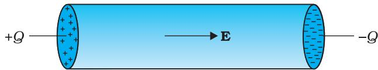  
FIGURE 3.1 Charges $+ Q$ and $- Q$ put at the ends of a metallic cylinder. The electrons will drift because of the electric field created to neutralise the charges. The current thus will stop after a while unless the charges $+ Q$ and $- Q$ are continuously replenished.

We can also imagine a mechanism where the ends of the cylinder are supplied with fresh charges to make up for any charges neutralised by electrons moving inside the conductor.In that case, there will be a steady electric field in the body of the conductor. This will result in a continuous current rather than a current for a short period of time. Mechanisms, which maintain a steady electric field are cells or batteries that we shall study later in this chapter. In the next sections,we shall study the steady current that results from a steady electric field in conductors.

# 3.4 OHM's LAW

A basic law regarding flow of currents was discovered by G.S. Ohm in 1828,long before the physical mechanism responsible for flow of currents was discovered. Imagine a conductor through which a current Iis flowing and let $V$ be the potential difference between the ends of the conductor. Then Ohm's law states that

$$
V \propto I
$$

where the constant of proportionality $R$ is called the resistance of the conductor. The SI units of resistance is ohm, and is denoted by the symbol $\Omega$ . The resistance $R$ not only depends on the material of the conductor but also on the dimensions of the conductor. The dependence of $R$ on the dimensions of the conductor can easily be determined as follows.

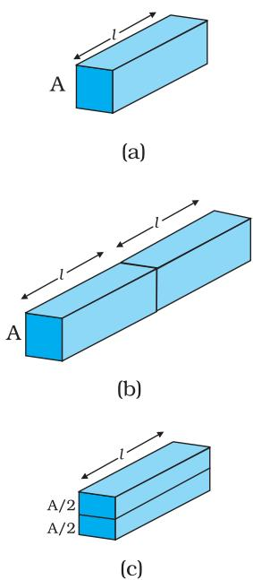

Consider a conductor satisfying Eq. (3.3) to be in the form of a slab of length land cross sectional area A [Fig. 3.2(a)]. Imagine placing two such identical slabs side by side [Fig. 3.2(b)], so that the length of the combination is 2l. The current flowing through the combination is the same as that flowing through either of the slabs. If $V$ is the potential difference across the ends of the first slab, then $V$ is also the potential difference across the ends of the second slab since the second slab is

# FIGURE 3.2

Illustrating the relation $\mathrm { \Delta R } = \rho l / A$ for a rectangular slab of length l and area of cross-section $A _ { i }$

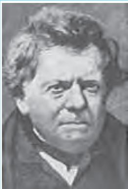

identical to the first and the same current Iflows through both.The potential difference across the ends of the combination is clearly sum of the potential difference across the two individual slabs and hence equals $2 V .$ The current through the combination is Iand the resistance of the combination $R _ { \mathrm { c } }$ is [from Eq. (3.3)],

$$
R _ { c } = \frac { 2 V } { I } = 2 R
$$

since $V / I = R$ , the resistance of either of the slabs. Thus, doubling the length of a conductor doubles the resistance. In general, then resistance is proportional to length,

$$
R \propto l
$$

Georg Simon Ohm (1787- 1854) German physicist, professor at Munich. Ohm was led to his law by an analogy between‘the conduction of heat: the electric field is analogous to the temperature gradient, and the electric current is analogous to the heat flow.

Next, imagine dividing the slab into two by cutting it lengthwise so that the slab can be considered as a combination of two identical slabs of length l,but each having a cross sectional area of $A / 2$ [Fig. 3.2(c)].

For a given voltage $V$ across the slab, if Iis the current through the entire slab, then clearly the current flowing through each of the two half-slabs is $I / 2$ . Since the potential difference across the ends of the half-slabs is $V ,$ i.e., the same as across the full slab, the resistance of each of the half-slabs $R _ { 1 }$ is

$$
R _ { 1 } = \frac { V } { \left( I / 2 \right) } = 2 \frac { V } { I } { = 2 R } .
$$

Thus, halving the area of the cross-section of a conductor doubles the resistance. In general, then the resistance $R$ is inversely proportional to the cross-sectional area,

$$
R \propto { \frac { 1 } { A } }
$$

Combining Eqs. (3.5) and (3.7), we have

$$
R \propto \frac { l } { A }
$$

and hence for a given conductor

$$
\stackrel { \triangledown } { \boldsymbol { R } } = \rho \frac { \boldsymbol { l } } { A }
$$

where the constant of proportionality $\rho$ depends on the material of the conductor but not on its dimensions. $\rho$ is called resistivity.

Using the last equation, Ohm's law reads

$$
V = I \times R = \frac { I \rho l } { A }
$$

Current per unit area (taken normal to the current), $I / A$ ,is called current density and is denoted by $j$ The SI units of the current density are $\mathrm { A / m ^ { 2 } }$ . Further, if $E$ is the magnitude of uniform electric field in the conductor whose length is $l _ { \pm }$ ，then the potential difference $V$ across its ends is $E l .$ . Using these, the last equation reads

$$
\mathrm { ~ E ~ } l = j \rho l
$$

$$
E = j \rho
$$

The above relation for magnitudes $E$ and $j$ can indeed be cast in a vector form. The current density, (which we have defined as the current through unit area normal to the current) is also directed along $\mathbf { \delta E }$ ,and is also a vector j $\mathbf { \beta } ( \equiv j \mathbf { \delta E } / \mathrm { E } )$ . Thus, the last equation can be written as,

$$
\begin{array} { c } { \mathbf { E } = \mathbf { j } \rho } \\ { \mathrm { o r , } } & { \mathbf { j } = \sigma \mathbf { E } } \end{array}
$$

where $\sigma \equiv 1 / \rho$ is called the conductivity. Ohm's law is often stated in an equivalent form, Eq. (3.13) in addition to Eq.(3.3).In the next section, we will try to understand the origin of the Ohm's law as arising from the characteristics of the drift of electrons.

# 3.5 DRIFT OF ELECTRONS AND THE ORIGIN OF RESISTIVITY

As remarked before,an electron will suffer collisions with the heavy fixed ions, but after collision, it will emerge with the same speed but in random directions. If we consider all the electrons, their average velocity wil be zero since their directions are random. Thus, if there are $N$ electrons and the velocity of the $i ^ { \mathrm { { t h } } }$ electron $( i = 1 , 2 , 3 , \dots N )$ at a given time is $\mathbf { v } _ { i }$ ,then

$$
\frac { 1 } { N } \sum _ { i = 1 } ^ { N } { \bf { v } } _ { i } = 0
$$

Consider now the situation when an electric field is present. Electrons will be accelerated due to this field by

$$
\mathbf { a } = { \frac { - e \mathbf { E } } { m } }
$$

where $- e$ is the charge and $\mathbf { m }$ is the mass of an electron. Consider again the $\bar { \pmb { i } } ^ { \mathrm { t h } }$ electron at a given time t. This electron would have had its last collision some time before $t ,$ and let $t _ { i }$ be the time elapsed after its last collision. If $\mathbf { v } _ { i }$ was its velocity immediately after the last collision, then its velocity $\mathbf { v } _ { i }$ at time $t$ is

$$
\mathbf { \nabla } \mathbf { { V } } _ { i } = \mathbf { { v } } _ { i } + \mathbf { \nabla } \frac { - e \mathbf { { E } } } { m } \mathbf { \nabla } t _ { i }
$$

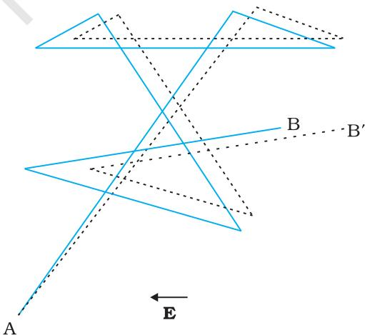  
FIGURE 3.3 A schematic picture of an electron moving from a point A to another point B through repeated collisions,and straight line travel between collisions (full lines). If an electric field is applied as shown， the electron ends up at point $\mathrm { B ^ { \prime } }$ (dotted lines). A slight drift in a direction opposite the electric field is visible.

since starting with its last collision it was accelerated (Fig. 3.3) with an acceleration given by Eq. (3.15) for a time interval $t _ { i }$ .The average velocity of the electrons at time $t$ is the average of all the $\mathbf { v } _ { i } \mathbf { s }$ . The average of ${ \bf { v } } _ { i } ^ { \prime } { \bf { S } }$ is zero [Eq. (3.14)] since immediately after any collision, the direction of the velocity of an electron is completely random. The collisions of the electrons do not occur at regular intervals but at random times. Let us denote by $\tau$ ,the average time between successive collisions.Then at a given time, some of the electrons would have spent time more than $\tau$ and some less than t. In other words, the time $\pmb { t } _ { i }$ in Eq. (3.16) will be less than $\tau$ for some and more than $\tau$ for others as we go through the values of $\mathbf { i } = 1$ , 2 ..... N. The average value of $t _ { i }$ then is $\tau$ (known as relaxation time). Thus,averaging Eq. (3.16) over the $N \cdot$ electrons at any given time $\pmb { t }$ gives us for the average velocity ${ \pmb v } _ { { \pmb d } }$

$$
\begin{array} { l } { { \displaystyle { { \bf { v } } _ { d } } \equiv \left( { \bf { V } } _ { i } \right) _ { a v e r a g e } = \left( { \bf { v } } _ { i } \right) _ { a v e r a g e } - \frac { e { \bf { E } } } { m } \left( { t _ { i } } \right) _ { a v e r a g e } } } \\ { { \displaystyle \mathrm { ~  ~ \Omega ~ } } } \\ { { \displaystyle = 0 - \frac { e { \bf { E } } } { m } \tau = - \frac { e { \bf { E } } } { m } \tau } } \end{array}
$$

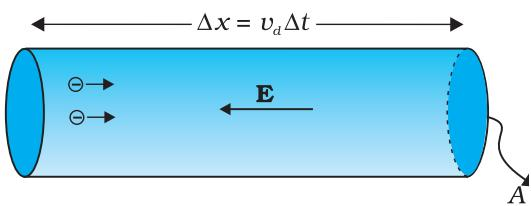  
FIGURE 3.4 Current in a metallic conductor. The magnitude of current density in a metal is the magnitude of charge contained in a cylinder of unit area and length Ud

This last result is surprising. It tells us that the electrons move with an average velocity which is independent of time,although electrons are accelerated. This is the phenomenon of drift and the velocity ${ \pmb v } _ { { \pmb d } }$ in Eq. (3.17) is called the drift velocity.

Because of the drift, there will be net transport of charges across any area perpendicular to E. Consider a planar area A, located inside the conductor such that the normal to the area is parallel to $\mathbf { E }$ (Fig. 3.4). Then because of the drift, in an infinitesimal amount of time $\Delta \mathbf { t } .$ , all electrons to the left of the area at distances upto $| \pmb { v _ { d } } | \Delta \pmb { t }$ would have crossed the area. If $\pmb { n }$ is the number of free electrons per unit volume in the metal, then there are n △t $| \pmb { \ v } _ { d } | A$ such electrons.Since each electron carries a charge -e, the total charge transported across this area $\pmb { A }$ to the right in time $\Delta t$ is $- n e A | \mathbf { v } _ { d } | \Delta t .$ $\mathbf { E }$ is directed towards the left and hence the total charge transported along $\mathbf { E }$ across the area is negative of this. The amount of charge crossing the area $A$ in time $\Delta t$ is by definition [Eq. (3.2)] $I \Delta t$ ,where $I$ is the magnitude of the current. Hence,

$$
I \Delta t = + n e A \left| \mathbf { v } _ { d } \right| \Delta t
$$

Substituting the value of $| \pmb { \ v } _ { d } |$ from Eq. (3.17)

$$
I \Delta t = \frac { e ^ { 2 } A } { m } \tau n \Delta t \vert \mathrm { E } \vert
$$

By definition Iis related to the magnitude $| \bf j |$ of the current density by

$$
I = | { \bf j } | A
$$

Hence, from Eqs.(3.19) and (3.20),

$$
\scriptstyle \left| \mathbf { j } \right| = { \frac { n e ^ { 2 } } { m } } \tau \left| \mathbf { E } \right|
$$

The vector $\mathbf { j }$ is parallel to $\mathbf { \delta E }$ and hence we can write Eq. (3.2l) in the vector form

$$
\mathbf { j } { = } \frac { n e ^ { 2 } } { m } \tau \mathbf { E }
$$

Comparison with Eq. (3.13) shows that Eq. (3.22) is exactly the Ohm's law, if we identify the conductivity $\sigma$ as

$$
\sigma = \frac { n e ^ { 2 } } { m } \tau
$$

We thus see that a very simple picture of electrical conduction reproduces Ohm's law.We have,of course,made assumptions that $\tau$ and $n$ are constants,independent of $E .$ ，We shall,in the next section, discuss the limitations of Ohm's law.

Example 3.1 (a) Estimate the average drift speed of_conduction electrons in a copper wire of cross-sectional area $\mathrm { i } . 0 \times 1 0 ^ { - 7 } \mathrm { m } ^ { 2 }$ carrying a current of 1.5 A. Assume that each copper atom contributes roughly one conduction electron. The density of copper is $9 . 0 \times 1 0 ^ { 3 } \mathrm { k g } / \mathrm { \bar { m } } ^ { \bar { 3 } }$ and its atomic mass is $6 3 . 5 \mathrm { ~ u ~ }$ . (b) Compare the drift speed obtained above with, (i) thermal speeds of copper atoms at ordinary temperatures, (ii) speed of propagation of electric field along the conductor which causes the drift motion.

# Solution

(a) The direction of drift velocity of conduction electrons is opposite to the electric field direction, i.e., electrons drift in the direction of increasing potential. The drift speed $v _ { d }$ is given by Eq. (3.18) $v _ { d } = ( I / n e A )$ Now, $e = 1 . 6 \times 1 0 ^ { - 1 9 } \mathrm { ~ C ~ }$ $A = 1 . 0 \times 1 0 ^ { - 7 } \mathrm { m ^ { 2 } }$ $I = 1 . 5$ A. The density of conduction electrons, $n$ is equal to the number of atoms per cubic metre (assuming one conduction electron per Cu atom as is reasonable from its valence electron count of one). A cubic metre of copper has a mass of $9 . 0 \times 1 0 ^ { 3 }$ kg. Since $6 . 0 \times 1 0 ^ { 2 3 }$ copper atoms have a mass of $6 3 . 5 \ \mathrm { g }$ $n = \frac { 6 . 0 \times 1 0 ^ { 2 3 } } { 6 3 . 5 } \times 9 . 0 \times 1 0 ^ { 6 }$ rep $= 8 . 5 \times 1 0 ^ { 2 8 } \mathrm { m } ^ { - 3 }$ which gives, $\nu _ { d } = \frac { 1 . 5 } { 8 . 5 \times 1 0 ^ { 2 8 } \times 1 . 6 \times 1 0 ^ { - 1 9 } \times 1 . 0 \times 1 0 ^ { - 7 } }$ $= 1 . 1 \times 1 0 ^ { - 3 } \mathrm { ~ m ~ s ^ { - 1 } ~ } = 1 . 1 \mathrm { ~ m m ~ s ^ { - 1 } ~ }$

(b) (i) At a temperature $T _ { i }$ ，the thermal speed\* of a copper atom of mass $M$ is obtained from $[ < ( 1 / 2 ) \ M v ^ { 2 } > = ( 3 / 2 ) \ k _ { \mathrm { B } } T \ ]$ and is thus typically of the order of $\sqrt { k _ { B } T / M }$ ，where $k _ { _ B }$ is the Boltzmann constant. For copper at $3 0 0 \mathrm { ~ K ~ }$ ，this is about $2 \times 1 0 ^ { 2 } \ \mathrm { m / s }$ . This figure indicates the random vibrational speeds of copper atoms in a conductor. Note that the drift speed of electrons is much smaller, about $1 0 ^ { - 5 }$ times the typical thermal speed at ordinary temperatures.

(ii) An electric field travelling along the conductor has a speed of an electromagnetic wave, namely equal to $3 . 0 ~ \times ~ 1 0 ^ { 8 } \mathrm { ~ m ~ } \mathrm { ~ s ~ } ^ { - 1 }$ (You will learn about this in Chapter 8). The drift speed is, in comparison, extremely small; smaller by a factor of 10-11.

# Example 3.2

(a) In Example 3.1, the electron drift speed is estimated to be only a few $\mathrm { m m ~ } \mathrm { s ^ { - 1 } }$ for currents in the range of a few amperes? How then is current established almost the instant a circuit is closed?   
(b) The electron drift arises due to the force experienced by electrons in the electric field inside the conductor. But force should cause acceleration. Why then do the electrons acquire a steady average drift speed?   
(c) If the electron drift speed is so small, and the electron's charge is small, how can we still obtain large amounts of current in a conductor?   
(d) When electrons drift in a metal from lower to higher potential, does it mean that all the ‘free' electrons of the metal are moving in the same direction?   
(e) Are the paths of electrons straight lines between successive collisions (with the positive ions of the metal) in the (i) absence of electric field, (ii) presence of electric field?

# Solution

(a) Electric field is established throughout the circuit, almost instantly (with the speed of light) causing at every point a local electron drift. Establishment of a current does not have to wait for electrons from one end of the conductor travelling to the other end. However, it does take a little while for the current to reach its steady value.   
(b) Each free' electron does accelerate, increasing its drift speed until it collides with a positive ion of the metal. It loses its drift speed after collision but starts to accelerate and increases its drift speed again only to suffer a collision again and so on. On the average, therefore, electrons acquire only a drift speed.   
(c) Simple, because the electron number density is enormous, ${ \sim } 1 0 ^ { 2 9 } \mathrm { m } ^ { - 3 }$   
(d) By no means. The drift velocity is superposed over the large random velocities of electrons.   
(e) In the absence of electric field, the paths are straight lines; in the presence of electric field, the paths are, in general, curved.

# 3.5.1 Mobility

As we have seen,conductivity arises from mobile charge carriers. In metals, these mobile charge carriers are electrons; in an ionised gas, they are electrons and positive charged ions; in an electrolyte, these can be both positive and negative ions.

An important quantity is the mobility $\mu$ defined as the magnitude of the drift velocity per unit electric field:

$$
\mu { = } \frac { \vert \mathbf { v } _ { d } \vert } { E }
$$

The SI unit of mobility is $\mathrm { m ^ { 2 } / V s }$ and is $1 0 ^ { 4 }$ of the mobility in practical units $( \mathrm { c m } ^ { 2 } / \mathrm { V s } )$ . Mobility is positive. From Eq. (3.17),we have

$$
v _ { d } = { \frac { e \tau E } { m } }
$$

Hence,

$$
\mu { = } \frac { v _ { d } } { E } { = } \frac { e \tau } { m }
$$

where $\tau$ is the average collision time for electrons.

# 3.6 LIMITATIONS OF OHM'S LAW

Although Ohm's law has been found valid over a large class of materials,there do exist materials and devices used in electric circuits where the proportionality of $V$ and Idoes not hold. The deviations broadly are one or more of the following types:

(a) V ceases to be proportional to $I \left( \mathrm { F i g . } 3 . 5 \right)$ ： law.T (b) The relation between Vand Idepends on the sign of $V .$ In $V$ other words,if Iis the current for a certain V, then reversing the direction of $V$ keeping its magnitude fixed, does not produce a current of the same magnitude as Iin the opposite directi (Fig. 3.6). This happens,for example, in a diode which we will stu in Chapter 14. 一

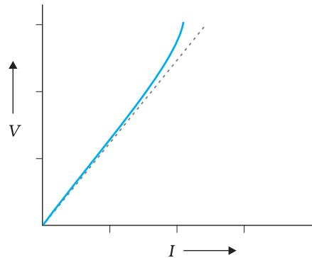  
FIGURE 3.5 The dashed line represents the linear Ohm's law. The solid line is the voltage versus current I for a good conductor.

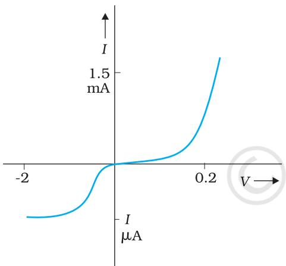  
FIGURE 3.6 Characteristic curve of a diode. Note the different scales for negative and positive values of the voltage and current.

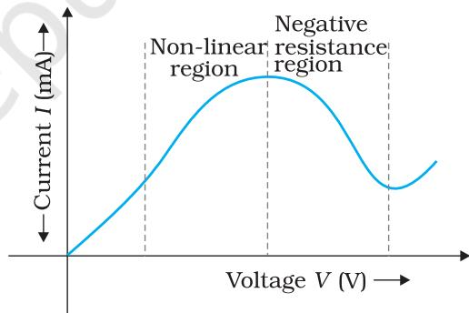  
FIGURE 3.7 Variation of current versus voltage for GaAs.

(c) The relation between $V$ and $I$ is not unique,i.e., there is more than one value of Vfor the same current I(Fig. 3.7). A material exhibiting such behaviour is GaAs.

Materials and devices not obeying Ohm's law in the form of Eq. (3.3) are actually widely used in electronic circuits. In this and a few subsequent chapters,however, we will study the electrical currents in materials that obey Ohm's law.

# 3.7 RESISTIVITY OF VARIOUS MATERIALS

The materials are classified as conductors, semiconductors and insulators depending on their resistivities,in an increasing order of their values.

Metals have low resistivities in the range of $1 0 ^ { - 8 } \Omega \mathrm { m }$ to $1 0 ^ { - 6 } \Omega \mathrm { m }$ .At the other end are insulators like ceramic,rubber and plastics having resistivities $1 0 ^ { 1 8 }$ times greater than metals or more. In between the two are the semiconductors.These，however,have resistivities characteristically decreasing with a rise in temperature. The resistivities of semiconductors can be decreased by adding small amount of suitable impurities.This last feature is exploited in use of semiconductors for electronic devices.

# 3.8 TEMPERATURE DEPENDENCE OF RESISTIVITY

The resistivity of a material is found to be dependent on the temperature. Different materials do not exhibit the same dependence on temperatures. Over a limited range of temperatures, that is not too large, the resistivity of a metallic conductor is approximately given by,

$$
\rho _ { _ { \mathrm { T } } } = \rho _ { _ { 0 } } \left[ 1 + \alpha \left( T { - } T _ { _ { 0 } } \right) \right]
$$

where $\rho _ { \mathrm { T } }$ is the resistivity at a temperature $T$ and $\rho _ { 0 }$ is the same at a reference temperature $T _ { 0 } , \alpha$ is called the temperature co-efficient of resistivity,and from Eq. (3.26), the dimension of $\alpha$ is (Temperature)-1. For metals, $\alpha$ is positive.

The relation of Eq. (3.26) implies that a graph of $\rho _ { \mathrm { T } }$ plotted against $T$ would be a straight line. At temperatures much lower than $0 \%$ ,the graph, however, deviates considerably from a straight line (Fig. 3.8).

Equation (3.26) thus, can be used approximately over a limited range of $T$ around any reference temperature $T _ { 0 }$ ，where the graph can be approximated as a straight line.

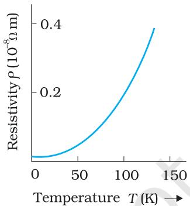

# FIGURE 3.8

Resistivity $\rho _ { T }$ of copper as a function of temperature $T .$

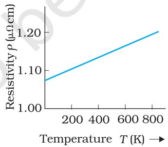  
FIGURE 3.9 Resistivity $\rho _ { T }$ of nichrome as a function of absolute temperature T.

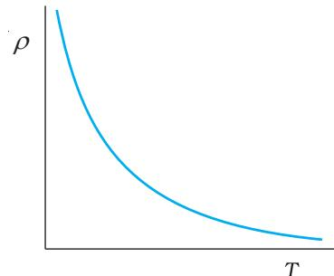  
FIGURE 3.10   
Temperature dependence of resistivity for a typical semiconductor.

Some materials like Nichrome (which is an alloy of nickel, iron and chromium) exhibit a very weak dependence of resistivity with temperature (Fig. 3.9).Manganin and constantan have similar properties. These materials are thus widely used in wire bound standard resistors since their resistance values would change very little with temperatures.

Unlike metals,the resistivities of semiconductors decrease with increasing temperatures. A typical dependence is shown in Fig. 3.10.

We can qualitatively understand the temperature dependence of resistivity, in the light of our derivation of Eq. (3.23). From this equation, resistivity of a material is given by

$$
\rho = \displaystyle \frac { 1 } { \sigma } = \displaystyle \frac { m } { n e ^ { 2 } \tau }
$$

$\rho$ thus depends inversely both on the number $n$ of free electrons per unit volume and on the average time $\tau$ between collisions.As we increase temperature,average speed of the electrons,which actas the carriers of current, increases resulting in more frequent collisions. The average time of collisions $\tau .$ ,thus decreases with temperature.

In a metal, $n$ is not dependent on temperature to any appreciable extent and thus the decrease in the value of $\tau$ with rise in temperature causes $\rho$ to increase as we have observed.

For insulators and semiconductors,however, $n$ increases with temperature. This increase more than compensates any decrease in t in Eq.(3.23) so that for such materials, $\rho$ decreases with temperature.

Example 3.3 An electric toaster uses nichrome for its heating element. When a negligibly small current passes through it, its resistance at room temperature $\left( 2 7 . 0 ~ ^ { \circ } \mathrm { C } \right)$ is found to be $7 5 . 3 \Omega$ .When the toaster is connected to a $2 3 0 \ \mathrm { V }$ supply, the current settles, after a few seconds, to a steady value of 2.68 A. What is the steady temperature of the nichrome element? The temperature coefficient of resistance of nichrome averaged over the temperature range involved, is $1 . 7 0 \times 1 0 ^ { - 4 } ~ { ^ \circ } \mathrm { C } ^ { - 1 }$ ：

Solution When the current through the element is very small, heating effects can be ignored and the temperature $T _ { 1 }$ of the element is the same as room temperature. When the toaster is connected to the supply, its initial current will be slightly higher than its steady value of 2.68 A. But due to heating effect of the current, the temperature will rise. This will cause an increase in resistance and a slight decrease in current. In a few seconds,a steady state will be reached when temperature will rise no further, and both the resistance of the element and the current drawn will achieve steady values. The resistance $R _ { 2 }$ at the steady temperature $T _ { 2 }$ is

$$
R _ { 2 } = { \frac { 2 3 0 \mathrm { ~ V ~ } } { 2 . 6 8 \mathrm { ~ A ~ } } } = 8 5 . 8 \Omega
$$

Using the relation

$$
R _ { 2 } = R _ { 1 } \left[ 1 + \alpha \left( T _ { 2 } - T _ { 1 } \right) \right]
$$

with $\alpha = 1 . 7 0 \times 1 0 ^ { - 4 } ~ { ^ \circ } \mathrm { C } ^ { - 1 }$ , we get

$$
T _ { 2 } - T _ { 1 } { = } { \frac { ( 8 5 . 8 - 7 5 . 3 ) } { ( 7 5 . 3 ) { \times } 1 . 7 0 { \times } 1 0 ^ { - 4 } } } = 8 2 0 \ { \circ } \mathrm { C }
$$

that is, $T _ { 2 } = ( 8 2 0 + 2 7 . 0 ) \ { } ^ { \circ } \mathrm { C } = 8 4 7 \ { } ^ { \circ } \mathrm { C }$ Thus, the steady temperature of the heating element (when heating effect due to the current equals heat loss to the surroundings) is $8 4 7 ~ ^ { \circ } \mathrm { C }$ ：

Example 3.4 The resistance of the platinum wire of a platinum resistance thermometer at the ice point is $5 ~ \Omega$ and at steam point is $5 . 2 3 \Omega$ . When the thermometer is inserted in a hot bath, the resistance of the platinum wire is 5.795 $\Omega$ . Calculate the temperature of the bath.

Solution $R _ { 0 } = 5 \Omega$ ， $R _ { 1 0 0 } = 5 . 2 3 \Omega$ and $R _ { t } = 5 . 7 9 5 \Omega$

Now,

$$
{ \begin{array} { r l } & { t = { \cfrac { R _ { t } - R _ { 0 } } { R _ { 1 0 0 } - R _ { 0 } } } \times 1 0 0 , \qquad R _ { t } = R _ { 0 } \left( 1 + \alpha t \right) } \\ & { } \\ & { = { \cfrac { 5 . 7 9 5 - 5 } { 5 . 2 3 - 5 } } \times 1 0 0 } \\ & { } \\ & { = { \cfrac { 0 . 7 9 5 } { 0 . 2 3 } } \times 1 0 0 \ = \ 3 4 5 . 6 5 ~ ^ { \circ } \mathbb { C } } \end{array} }
$$

# 3.9 ELECTRICAL ENERGY, POWER

Consider a conductor with end points A and B,in which a current $I$ is flowing from A to B. The electric potential at A and B are denoted by $V ( \mathrm { A } )$ and $V ( \mathrm { B } )$ respectively. Since current is flowing from A to B, $V ( \mathrm { A } ) > V ( \mathrm { B } )$ and the potential difference across AB is $V = V ( \mathrm { A } ) - V ( \mathrm { B } ) > 0$

In a time interval $\Delta t .$ , an amount of charge $\Delta Q = I \Delta t$ travels from A to B. The potential energy of the charge at A, by definition, was $\ Q \ V ( \mathrm { A } )$ and similarly at B, it is Q V(B). Thus, change in its potential energy $\Delta U _ { \mathrm { p o t } }$ is

$$
\dot { \mathbf { \sigma } } = \Delta Q [ ( V ( \mathbf { B } ) - V ( \mathbf { A } ) ] = - \Delta Q \mathbf { \sigma } V
$$

If charges moved without collisions through the conductor, their kinetic energy would also change so that the total energy is unchanged. Conservation of total energy would then imply that,

$$
\Delta K = \ - \Delta U _ { \mathrm { p o t } }
$$

that is,

$$
\Delta K = I V \Delta t > 0
$$

Thus, in case charges were moving freely through the conductor under the action of electric field, their kinetic energy would increase as they move.We have,however, seen earlier that on the average, charge carriers do not move with acceleration but with a steady drift velocity. This is because of the collisions with ions and atoms during transit. During collisions, the energy gained by the charges thus is shared with the atoms. The atoms vibrate more vigorously,i.e., the conductor heats up. Thus, in an actual conductor,an amount of energy dissipated as heat in the conductor during the time interval $\Delta t$ is,

$$
\Delta W = I \ : V \Delta t
$$

The energy dissipated per unit time is the power dissipated $P = \Delta W / \Delta t$ and we have,

Using Ohm's law $V = I R$ we get

$$
P = I ^ { 2 } R = V ^ { 2 } / R
$$

as the power loss ("ohmic loss") in a conductor of resistance $R$ carrying a current $I .$ It is this power which heats up, for example, the coil of an electric bulb to incandescence,radiating out heat and light.

Where does the power come from? As we have reasoned before, we need an external source to keep a steady current through the conductor. It is clearly this source which must supply this power. In the simple circuit shown with a cell (Fig.3.11), it is the chemical energy of the cell which supplies this power for as long as it can.

The expressions for power, Eqs. (3.32) and (3.33), show the dependence of the power dissipated in a resistor $R$ on the current through it and the voltage across it.

Equation (3.33) has an important application to power transmission. Electrical power is transmitted from power stations to homes and factories,which may be hundreds of miles away,via transmission cables. One obviously wants to minimise the power loss in the transmission cables connecting the power stations to homes and factories.We shall see now how this can be achieved. Consider a device $R _ { : }$ ，to which a power $P$ is to be delivered via transmission cables having a resistance $R _ { c }$ to be dissipated by it finally. If $V$ is the voltage across $R$ and $I$ the current through it, then

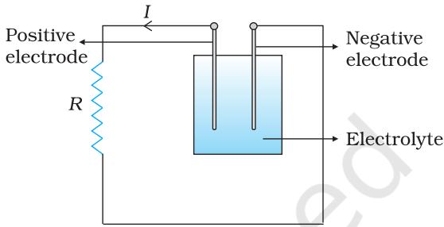  
FIGURE 3.11 Heat is produced in the resistor $R$ which is connected across the terminals of a cell. The energy dissipated in the resistor $R$ comes from the chemical energy of the electrolyte.

$$
P = V I
$$

The connecting wires from the power station to the device has a finite resistance $R _ { c }$ . The power dissipated in the connecting wires,which is wasted is $P _ { c }$ with

$$
\begin{array} { r } { P _ { c } = I ^ { 2 } R _ { c } } \\ { \displaystyle = \frac { P ^ { 2 } R _ { c } } { V ^ { 2 } } } \end{array}
$$

from Eq. (3.32). Thus, to drive a device of power $P _ { \ast }$ , the power wasted in the connecting wires is inversely proportional to $V ^ { 2 }$ .The transmission cables from power stations are hundreds of miles long and their resistance $R _ { c }$ is considerable. To reduce $P _ { c }$ , these wires carry current at enormous values of Vand this is the reason for the high voltage danger signs on transmission lines 一 a common sight as we move away from populated areas. Using electricity at such voltages is not safe and hence at the other end,a device called a transformer lowers the voltage to a value suitable for use.

# 3.10 CELLS, EMF, INTERNAL RESISTANCE

We have already mentioned that a simple device to maintain a steady current in an electric circuit is the electrolytic cell. Basically a cell has two electrodes, called the positive (P) and the negative (N),as shown in

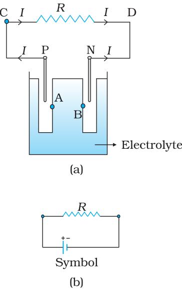  
Fig. 3.12. They are immersed in an electrolytic solution. Dipped in the solution, the electrodes exchange charges with the electrolyte. The positive electrode has a potential difference $V _ { \mathrm { + } } \left( V _ { \mathrm { + } } > 0 \right)$ between itself and the electrolyte solution immediately adjacent to it marked A in the figure. Similarly, the negative electrode develops a negative potential $- \left( V _ { - } \right) \left( V _ { - } \geq 0 \right)$ relative to the electrolyte adjacent to it, marked as $B$ in the figure.When there is no current, the electrolyte has the same potential throughout, so that the potential difference between $\mathrm { P }$ and $_ \mathrm { N }$ is $V _ { + } - ( - V _ { - } ) = V _ { + } + V _ { - }$ .This difference is called the electromotive force (emf) of the cell and is denoted by $\varepsilon$ Thus

$$
\varepsilon = V _ { + } + V _ { - } > 0
$$

FIGURE 3.12 (a) Sketch of an electrolyte cell with positive terminal P and negative terminal N. The   
gap between the electrodes   
is exaggerated for clarity. A and B are points in the   
electrolyte typically close to   
P and N. (b) the symbol for   
a cell, $^ +$ referring to P and - referring to the N electrode. Electrical   
connections to the cell are made at P and N.

Note that $\varepsilon$ is,actually, a potential difference and not a force. The name emf, however, is used because of historical reasons,and was given at a time when the phenomenon was not understood properly.

To understand the significance of $\varepsilon$ ， consider a resistor $R$ connected across the cell (Fig. 3.12).A current $I$ flows across $R$ from C to D.As explained before, a steady current is maintained because current flows from N to $\mathrm { P }$ through the electrolyte. Clearly, across the electrolyte the same current flows through the electrolyte but from N to P, whereas through $R ,$ it flows from P to N.

The electrolyte through which a current flows has a finite resistance $r _ { \mathrm { { , } } }$ ，called the internal resistance. Consider first the situation when $R$ is infinite so that $I = V / R = 0$ ，where $V$ is the potential difference between P and N. Now,

$V =$ Potential difference between P and A $^ +$ Potential difference between A and B $^ +$ Potential difference between B and N $= \varepsilon$

Thus, emf $\varepsilon$ is the potential difference between the positive and negative electrodes in an open circuit, i.e.,when no current is

flowing through the cell.

If however $R$ is finite, $I$ is not zero. In that case the potential difference between P and $_ \mathrm { N }$ is

$$
\begin{array} { l } { { V = V _ { + } + V _ { - } - I r } } \\ { { \ } } \\ { { \ = \varepsilon - I r } } \end{array}
$$

Note the negative sign in the expression $( I r )$ for the potential difference between A and B.This is because the current Iflows from B to A in the electrolyte.

In practical calculations,internal resistances of cells in the circuit may be neglected when the current $I$ is such that $\varepsilon > > I r .$ The actual values of the internal resistances of cells vary from cell to cell. The internal resistance of dry cells,however,is much higher than the common electrolytic cells.

We also observe that since Vis the potential difference across $R _ { : }$ we have from Ohm's law

$$
V = I R
$$

Combining Eqs. (3.38) and (3.39), we get

The maximum current that can be drawn from a cell is for $R = 0$ and it is $I _ { \mathrm { m a x } } = \varepsilon / r .$ However, in most cells the maximum allowed current is much lower than this to prevent permanent damage to the cell.

# 3.11CELLS IN SERIES AND IN PARALLEL

Like resistors, cells can be combined together in an electric circuit.And like resistors, one can, for calculating currents and voltages in a circuit, replace a combination of cells by an equivalent cell.

$$
\begin{array} { r l } { \varepsilon _ { 1 } } & { { } \quad \quad \varepsilon _ { 2 } } \\ { \underset { \mathrm { ~ \tiny ~ A ~ } } { \sim } } & { { } \quad | \underset { \begin{array} { l l } { 1 } & { \quad \quad \frac { \theta } { 8 } } \end{array} } { \overset { \mathbb { Z } } } | \underset { \begin{array} { l } { r _ { 2 } } \end{array} } { \longmapsto } } & { { } \quad \frac { \theta } { \mathrm { C } } } & { { } \quad \frac { \varepsilon _ { e q } } { \mathrm { ~ \tiny ~ A ~ } \ U } \underset { \begin{array} { l } { r _ { e q } } \end{array} } { \overset { \mathbb { Z } } }  \quad \frac { I } { \mathrm { ~ \tiny ~ C ~ } } } \end{array}
$$

FIGURE 3.13 Two cells of emf's $\varepsilon _ { 1 }$ and $\varepsilon _ { 2 }$ in the series. $r _ { 1 }$ $r _ { 2 }$ are their internal resistances. For connections across A and $\mathbf { C }$ ， the combination can be considered as one cell of emf $\varepsilon _ { e q }$ and an internal resistance reg

Consider first two cells in series (Fig. 3.13), where one terminal of the two cells is joined together leaving the other terminal in either cell free. $\varepsilon _ { 1 }$ $\varepsilon _ { 2 }$ are the emfs of the two cells and $r _ { 1 }$ $r _ { 2 }$ their internal resistances, respectively.

Let $V ( \mathbb { A } )$ ， $V ( \mathrm { B } )$ ， $V ( \mathbf { C } )$ be the potentials at points A, B and C shown in Fig. 3.13.Then $V ( \mathbb { A } ) - V ( \mathbb { B } )$ is the potential difference between the positive and negative terminals of the first cell. We have already calculated it in Eq. (3.38) and hence,

$$
V _ { \mathrm { A B } } \equiv V ( \mathrm { A } ) - V ( \mathrm { B } ) = \varepsilon _ { \mathrm { 1 } } - I r _ { \mathrm { 1 } }
$$

Similarly,

$$
V _ { \mathrm { B C } } \equiv V \left( \mathrm { B } \right) - V \left( \mathrm { C } \right) = \varepsilon _ { 2 } - I r _ { 2 }
$$

Hence, the potential difference between the terminals A and $\mathrm { C }$ of the combination is Y

$$
\begin{array} { r l } {  { V _ { \mathrm { A C } } \equiv V ( \mathbf { A } ) - V ( \mathbf { C } ) = \ V \big ( \mathbf { A } \big ) - V \big ( \mathbf { B } \big ) \ + \ V \big ( \mathbf { B } \big ) - V \big ( \mathbf { C } \big ) } } \\ & { = \big ( \varepsilon _ { 1 } + \varepsilon _ { 2 } \big ) - I \big ( r _ { 1 } + r _ { 2 } \big ) } \end{array}
$$

If we wish to replace the combination by a single cell between A and C of emf $\varepsilon _ { e q }$ and internal resistance ${ r } _ { e q }$ , we would have

$$
V _ { A C } = \varepsilon _ { e q } - I r _ { e q }
$$

Comparing the last two equations, we get

$$
\boldsymbol { \mathfrak { E } } _ { \mathrm { e q } } = \mathfrak { E } _ { 1 } + \mathfrak { E } _ { 2 }
$$

and ${ r _ { e q } } = { r _ { 1 } } + { r _ { 2 } }$

In Fig.3.13, we had connected the negative electrode of the first to the positive electrode of the second. If instead we connect the two negatives,

Eq. (3.42) would change to $V _ { _ { B C } } { = } { - } \varepsilon _ { 2 } { - } I r _ { 2 }$ and we will get

$$
\varepsilon _ { e q } = \varepsilon _ { 1 } - \varepsilon _ { 2 } \qquad ( \varepsilon _ { 1 } > \varepsilon _ { 2 } )
$$

The rule for series combination clearly can be extended to any number of cells:

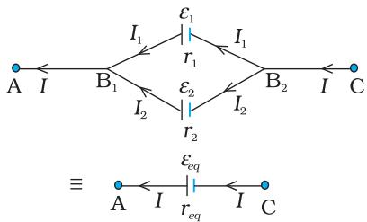

FIGURE 3.14 Two cells in parallel. For connections across A and C, the combination can be   
replaced by one cell of emf   
$\varepsilon _ { e q }$ and internal resistances   
$r _ { e q }$ whose values are given in Eqs. (3.54) and (3.55).   
(i) The equivalent emf of a series combination of n cells is just the sum of their individual emf's,and   
(ii) The equivalent internal resistance of a series combination of n cells is just the sum of their internal resistances.

This is so, when the current leaves each cell from the positive electrode. If in the combination, the current leaves any cell from the negative electrode, the emf of the cell enters the expression for $\varepsilon _ { e q }$ with a negative sign, as in Eq. (3.47).

Next, consider a parallel combination of the cells (Fig. 3.14). $I _ { 1 }$ and $I _ { 2 }$ are the currents leaving the positive electrodes of the cells.At the point $\mathrm { B } _ { 1 }$ $I _ { 1 }$ and $I _ { 2 }$ flow in whereas the current Iflows out. Since as much charge flows in as out, we have

$$
I = I _ { 1 } + I _ { 2 }
$$

Let $V ( B _ { 1 } )$ and $V ( B _ { 2 } )$ be the potentials at $B _ { 1 }$ and $B _ { 2 }$ ,respectively. Then, considering the first cell, the potential difference across its terminals is $V ( B _ { 1 } ) - V ( B _ { 2 } )$ Hence, from Eq. (3.38)

$$
V \equiv V \left( B _ { 1 } \right) - V \left( B _ { 2 } \right) = \varepsilon _ { 1 } - I _ { 1 } r _ { 1 }
$$

Points $B _ { 1 }$ and $B _ { 2 }$ are connected exactly similarly to the second cell. Hence considering the second cell, we also have

$$
V \equiv V \left( B _ { 1 } \right) - V \left( B _ { 2 } \right) = \varepsilon _ { 2 } - I _ { 2 } r _ { 2 }
$$

Combining the last three equations

$$
{ \begin{array} { r l } { I } & { = \ I _ { 1 } \ + \ I _ { 2 } } \\ & { = \displaystyle \frac { \varepsilon _ { 1 } - V } { r _ { 1 } } } \end{array} } = \frac { \varepsilon _ { 2 } - V } { r _ { 2 } } = \left( \frac { \varepsilon _ { 1 } } { r _ { 1 } } + \frac { \varepsilon _ { 2 } } { r _ { 2 } } \right) - V \left( \frac { 1 } { r _ { 1 } } + \frac { 1 } { r _ { 2 } } \right)
$$

Hence, $V$ is given by,

$$
V = \frac { \varepsilon _ { 1 } r _ { 2 } + \varepsilon _ { 2 } r _ { 1 } } { r _ { 1 } + r _ { 2 } } - I \frac { r _ { 1 } r _ { 2 } } { r _ { 1 } + r _ { 2 } }
$$

If we want to replace the combination by a single cell, between $B _ { 1 }$ and $B _ { 2 }$ ,of emf $\varepsilon _ { e q }$ and internal resistance $r _ { e q }$ , we would have

$$
V = \varepsilon _ { e q } - I r _ { e q }
$$

The last two equations should be the same and hence

$$
\begin{array} { l } { \displaystyle \varepsilon _ { e q } = \frac { \varepsilon _ { \scriptscriptstyle 1 } r _ { 2 } + \varepsilon _ { \scriptscriptstyle 2 } r _ { 1 } } { r _ { 1 } + r _ { 2 } } } \\ { \displaystyle r _ { e q } = \frac { r _ { 1 } r _ { 2 } } { r _ { 1 } + r _ { 2 } } } \end{array}
$$

We can put these equations in a simpler way,

$$
\frac { 1 } { r _ { e q } } { = } \frac { 1 } { r _ { 1 } } { + } \frac { 1 } { r _ { 2 } }
$$

$$
\frac { \varepsilon _ { e q } } { r _ { e q } } = \frac { \varepsilon _ { 1 } } { r _ { 1 } } + \frac { \varepsilon _ { 2 } } { r _ { 2 } }
$$

In Fig. (3.14),we had joined the positive terminals together and similarly the two negative ones, so that the currents $I _ { 1 } , I _ { 2 }$ flow out of positive terminals. If the negative terminal of the second is connected to positive terminal of the first, Eqs. (3.56) and (3.57) would still be valid with $\varepsilon _ { 2 } \to - \varepsilon _ { 2 }$

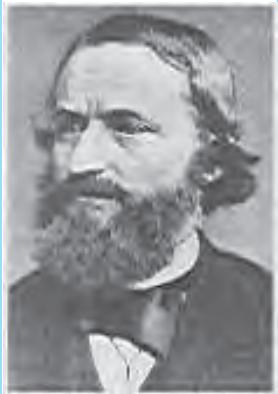

Equations (3.56) and (3.57) can be extended easily. If there are n cells of emf $\varepsilon _ { 1 }$ ， $\varepsilon _ { \mathrm { n } }$ and of internal resistances $r _ { \mathrm { 1 } } , \ldots r _ { \mathrm { n } }$ respectively, connected in parallel, the combination is equivalent to a single cell of emf $\varepsilon _ { e q }$ and internal resistance $r _ { e q } , \quad$ such that

$$
\frac { 1 } { r _ { e q } } = \frac { 1 } { r _ { 1 } } + \ldots + \frac { 1 } { r _ { n } }
$$

$$
\frac { \varepsilon _ { e q } } { r _ { e q } } = \frac { \varepsilon _ { 1 } } { r _ { 1 } } + \ldots + \frac { \varepsilon _ { n } } { r _ { n } }
$$

Gustav Robert Kirchhoff (1824 - 1887) German physicist， professor at Heidelberg and at Berlin. Mainly known for his development of spectroscopy,he also made many important contributions to mathematical physics, among them， his first and second rules for circuits.

# 3.12 KIRCHHOFF's RULES

Electric circuits generally consist of a number of resistors and cells interconnected sometimes in a complicated way.

The formulae we have derived earlier for series and parallel combinations of resistors are not always sufficient to determine all the currents and potential differences in the circuit. Two rules,called Kirchhoffs rules, are very useful for analysis of electric circuits.

Given a circuit, we start by labelling currents in each resistor by a symbol, say I, and a directed arrow to indicate that a current $I$ flows along the resistor in the direction indicated. If ultimately Iis determined to be positive, the actual current in the resistor is in the direction of the arrow. If Iturns out to be negative, the current actually flows in a direction opposite to the arrow. Similarly, for each source (i.e., cell or some other source of electrical power) the positive and negative electrodes are labelled, as well as, a directed arrow with a symbol for the current flowing through the cell. This will tell us the potential difference, $V = V \left( \mathrm { P } \right) - V \left( \mathrm { N } \right) = \varepsilon - I r$ [Eq. (3.38) between the positive terminal P and the negative terminal N; $I$ here is the current flowing from N to P through the cell]. If, while labelling the current $I$ through the cell one goes from P to N, then of course

$$
V = \varepsilon + I r
$$

Having clarified labelling, we now state the rules and the proof:

(a)Junction rule: At any junction, the sum of the currents entering the junction is equal to the sum of currents leaving the junction (Fig. 3.15).

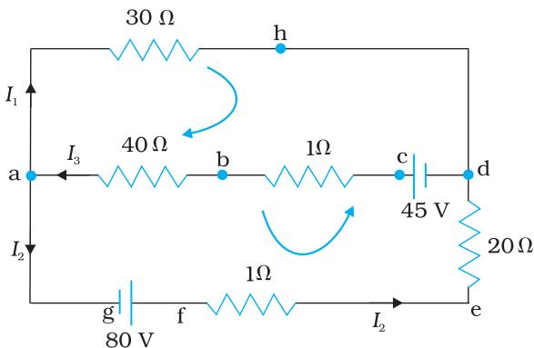

FIGURE 3.15 At junction a the current leaving is $I _ { 1 } + I _ { 2 }$ and current entering is $I _ { 3 } ^ { \phantom { + } }$ The junction rule says $I _ { 3 } = I _ { 1 } + I _ { 2 } .$ At point h current entering is $I _ { 1 ^ { \prime } }$ ，There is only one current leaving h and by junction rule that will also be $I _ { 1 }$ ， For the loops ‘ahdcba' and ‘ahdefga'， the loop rules give $- 3 0 I _ { 1 } \ -$ 4 $\mathrm { ~ l ~ } I _ { 3 } + 4 5 = 0$ and $- 3 0 I _ { \mathrm { { 1 } } } + 2 1 I _ { \mathrm { { 2 } } } - 8 0 = \mathrm { { \bar { 0 } } }$

This applies equally well if instead of a junction of several lines,we consider a point ina line.

The proof of this rule follows from the fact that when currents are steady, there is no accumulation of charges at any junction or at any point in a line. Thus, the total current flowing in, (which is the rate at which charge flows into the junction), must equal the total current flowing out.

(b) Loop rule: The algebraic sum of changes in potential around any closed loop involving resistors and cells in the loop is zero (Fig. 3.15).

This rule is also obvious, since electric potential is dependent on the location of the point. Thus starting with any point if we come back to the same point, the total change must be zero. In a closed loop,we do come back to the starting point and hence the rule.

Example 3.5 A battery of $1 0 \mathrm { ~ V ~ }$ and negligible internal resistance is connected across the diagonally opposite corners of a cubical network consisting of 12 resistors each of resistance $1 \ \Omega$ (Fig. 3.16). Determine the equivalent resistance of the network and the current along each edge of the cube.

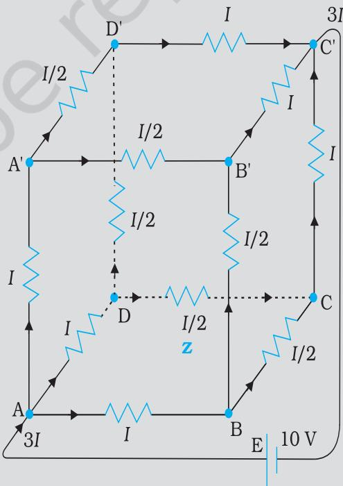

Solution The network is not reducible to a simple series and parallel combinations of resistors. There is, however, a clear symmetry in the problem which we can exploit to obtain the equivalent resistance of the network.

The paths AA', AD and AB are obviously symmetrically placed in the network. Thus, the current in each must be the same, say, I. Further, at the corners A', B and D, the incoming current I must split equally into the two outgoing branches. In this manner, the current in all the l2 edges of the cube are easily written down in terms of I, using Kirchhoffs first rule and the symmetry in the problem.

Next take a closed loop,say, ABCC'EA, and apply Kirchhoffs second rule:

$$
- I R - ( 1 / 2 ) I R - I R + \varepsilon = 0
$$

where $R$ is the resistance of each edge and $\varepsilon$ the emf of battery. Thus,

$$
\varepsilon { = } \frac { 5 } { 2 } I R
$$

The equivalent resistance $R _ { e q }$ of the network is

$$
R _ { e q } = \frac { \varepsilon } { 3 I } = \frac { 5 } { 6 } R
$$

For $R = 1 ~ \Omega$ ， $R _ { e q } = \left( 5 / 6 \right) \Omega$ and for $\varepsilon = 1 0 \mathrm { ~ V ~ }$ , the total current $\ l ( = 3 I )$ in the network is

The current flowing in each edge can now be read off from the Fig. 3.16.

It should be noted that because of the symmetry of the network, the great power of Kirchhoffs rules has not been very apparent in Example 3.5. In a general network, there will be no such simplification due to symmetry, and only by application of Kirchhoffs rules to junctions and closed loops (as many as necessary to solve the unknowns in the network) can we handle the problem. This will be illustrated in Example 3.6.

Example 3.6 Determine the current in each branch of the network shown in Fig. 3.17.

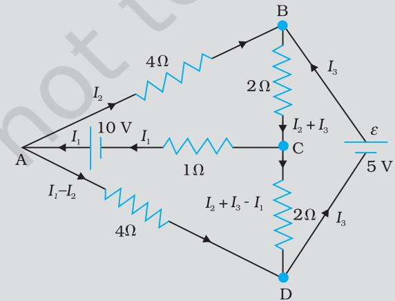  
FIGURE 3.17

Solution Each branch of the network is assigned an unknown current to be determined by the application of Kirchhoff's rules. To reduce the number of unknowns at the outset, the first rule of Kirchhoff is used at every junction to assign the unknown current in each branch. We then have three unknowns $I _ { 1 } , \ I _ { 2 }$ and $I _ { 3 }$ which can be found by applying the second rule of Kirchhoff to three different closed loops. Kirchhoffs second rule for the closed loop ADCA gives,

$$
1 0 - 4 ( I _ { \mathrm { 1 } } - I _ { \mathrm { 2 } } ) + 2 ( I _ { \mathrm { 2 } } + I _ { \mathrm { 3 } } - I _ { \mathrm { 1 } } ) - I _ { \mathrm { 1 } } = 0
$$

that is, $7 I _ { 1 } - 6 I _ { 2 } - 2 I _ { 3 } = 1 0$

For the closed loop ABCA, we get

$$
1 0 - 4 I _ { 2 } - 2 \ : ( I _ { 2 } + I _ { 3 } ) - I _ { 1 } = 0
$$

that is, $I _ { 1 } + 6 I _ { 2 } + 2 I _ { 3 } = 1 0$

For the closed loop BCDEB, we get

$$
5 - 2 \ ( I _ { 2 } + I _ { 3 } ) - 2 \ ( I _ { 2 } + I _ { 3 } - I _ { 1 } ) = 0
$$

that is, $2 I _ { 1 } - 4 I _ { 2 } - 4 I _ { 3 } = - 5$

Equations (3.61 a,b,c) are three simultaneous equations in three unknowns. These can be solved by the usual method to give

$$
I _ { 1 } = 2 . 5 \mathsf { A } , I _ { 2 } = \frac { 5 } { 8 } \mathsf { A } , I _ { 3 } = 1 \frac { 7 } { 8 } \mathsf { A }
$$

The currents in the various branches of the network are

$$
{ \begin{array} { l } { { \mathrm { A B } } : { \frac { 5 } { 8 } } ~ { \mathrm { A } } , ~ { \mathrm { C A } } : ~ 2 { \frac { 1 } { 2 } } ~ { \mathrm { A } } , ~ { \mathrm { D E B } } : 1 { \frac { 7 } { 8 } } ~ { \mathrm { A } } } \\ { { \mathrm { A D } } : 1 { \frac { 7 } { 8 } } ~ { \mathrm { A } } , ~ { \mathrm { C D } } : 0 ~ { \mathrm { A } } , ~ { \mathrm { B C } } : 2 { \frac { 1 } { 2 } } ~ { \mathrm { A } } } \end{array} }
$$

It is easily verified that Kirchhoff's second rule applied to the remaining closed loops does not provide any additional independent equation, that is, the above values of currents satisfy the second rule for every closed loop of the network. For example, the total voltage drop over the closed loop BADEB

$$
{ \sf 5 } { \sf V } + \left( \frac { 5 } { 8 } { \sf \times } 4 \right) { \sf V } - \left( \frac { 1 5 } { 8 } { \sf \times } 4 \right) { \sf V }
$$

equal to zero, as required by Kirchhoffs second rule.

# 3.13 WHEATSTONE BRIDGE

As an application of Kirchhoffs rules consider the circuit shown in Fig. 3.18,which is called the Wheatstone bridge. The bridge has four resistors $R _ { 1 }$ ， $R _ { 2 }$ ， $R _ { 3 }$ and $R _ { 4 }$ .Across one pair of diagonally opposite points (A and C in the figure) a source is connected. This (i.e.,AC) is called the battery arm.Between the other two vertices,B and D,a galvanometer G (which is a device to detect currents) is connected. This line, shown as BD in the figure, is called the galvanometer arm.

For simplicity, we assume that the cell has no internal resistance. In general there will be currents flowing across all the resistors as well as a current $I _ { \mathrm { g } }$ through G. Of special interest, is the case of a balanced bridge where the resistors are such that $I _ { \mathrm { g } } = 0$ . We can easily get the balance condition,such that there is no current through G.In this case,the Kirchhoffs junction rule applied to junctions D and B (see the figure)

immediately gives us the relations $I _ { 1 } = I _ { 3 }$ and $I _ { 2 } = I _ { 4 }$ . Next, we apply Kirchhoff's loop rule to closed loops ADBA and CBDC. The first loop gives

$$
- I _ { 1 } R _ { 1 } + 0 + I _ { 2 } R _ { 2 } = 0 \qquad ( I _ { \mathrm { g } } = 0 )
$$

and the second loop gives, upon using $I _ { 3 } = I _ { 1 }$ $I _ { 4 } = I _ { 2 }$

$$
I _ { 2 } R _ { 4 } + 0 - I _ { 1 } R _ { 3 } = 0
$$

From Eq. (3.62), we obtain,

$$
\scriptstyle { \frac { I _ { 1 } } { I _ { 2 } } } = { \frac { R _ { 2 } } { R _ { 1 } } }
$$

whereas from Eq. (3.63), we obtain,

$$
\frac { I _ { 1 } } { I _ { 2 } } { = } \frac { R _ { 4 } } { R _ { 3 } }
$$

Hence,we obtain the condition

$$
\frac { \mathrm { { R } _ { 2 } } } { \mathrm { { R } _ { 1 } } } = \frac { \mathrm { { R } _ { 4 } } } { \mathrm { { R } _ { 3 } } }
$$

This last equation relating the four resistors is called the balance condition for the galvanometer to give zero or null deflection.

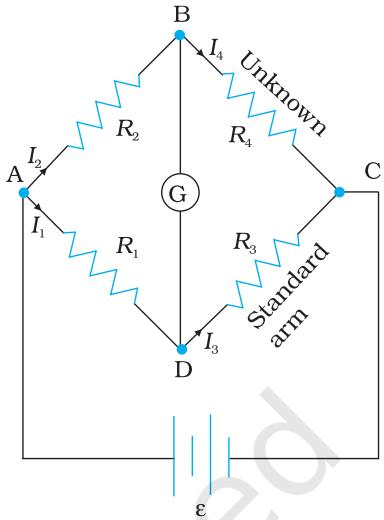  
FIGURE 3.18

The Wheatstone bridge and its balance condition provide a practical method for determination of an unknown resistance. Let us suppose we have an unknown resistance, which we insert in the fourth arm; $R _ { 4 }$ is thus not known. Keeping known resistances $R _ { 1 }$ and $R _ { 2 }$ in the first and second arm of the bridge,we go on varying $R _ { 3 }$ till the galvanometer shows a null deflection. The bridge then is balanced,and from the balance condition the value of the unknown resistance $R _ { 4 }$ is given by,

$$
R _ { 4 } = R _ { 3 } \frac { R _ { 2 } } { R _ { 1 } }
$$

A practical device using this principle is called the meter bridge.

Example 3.7 The four arms of a Wheatstone bridge (Fig. 3.19) have the following resistances:

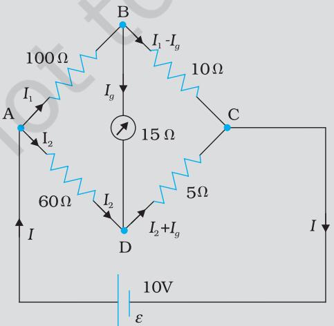  
FIGURE 3.19

A galvanometer of 15Ω resistance is connected across BD. Calculate the current through the galvanometer when a potential difference of $1 0 \mathrm { ~ V ~ }$ is maintained across AC.

Solution Considering the mesh BADB, we have

$$
1 0 0 I _ { \scriptscriptstyle 1 } + 1 5 I _ { \scriptscriptstyle g } - 6 0 I _ { \scriptscriptstyle 2 } = 0
$$

$$
2 0 I _ { \mathrm { { } _ { 1 } } } + 3 I _ { \mathrm { { } _ { g } } } - 1 2 I _ { \mathrm { { 2 } } } { = } 0
$$

Considering the mesh BCDB, we have

$$
\begin{array} { l } { { 1 0 ~ ( I _ { 1 } - I _ { g } ) - 1 5 I _ { g } - 5 ~ ( I _ { 2 } + I _ { g } ) = 0 } } \\ { { { } } } \\ { { 1 0 I _ { 1 } - 3 0 I _ { g } - 5 I _ { 2 } = 0 } } \\ { { { } } } \\ { { 2 I _ { 1 } - 6 I _ { g } - I _ { 2 } = 0 } } \end{array}
$$

[3.65(b)]

Considering the mesh ADCEA,

$$
\begin{array} { l } { 6 0 I _ { 2 } + 5 \left( I _ { 2 } + I _ { g } \right) = 1 0 } \\ { 6 5 I _ { 2 } + 5 I _ { g } = 1 0 } \\ { 1 3 I _ { 2 } + I _ { g } = 2 } \end{array}
$$

[3.65(c)]

Multiplying Eq. (3.65b) by 10

$$
2 0 I _ { \mathrm { 1 } } - 6 0 I _ { g } - 1 0 I _ { \mathrm { 2 } } = 0
$$

From Eqs. (3.65d) and (3.65a) we have

$$
\begin{array} { l } { { 6 3 I _ { g } - 2 I _ { 2 } = 0 } } \\ { { \ I _ { 2 } = 3 1 . 5 I _ { g } } } \end{array}
$$

[3.65(e)]

Substituting the value of $I _ { 2 }$ into Eq. [3.65(c)l, we get

# SUMMARY

1. Current through a given area of a conductor is the net charge passing per unit time through the area.   
2. To maintain a steady current, we must have a closed circuit in which an external agency moves electric charge from lower to higher potential energy. The work done per unit charge by the source in taking the charge from lower to higher potential energy (i.e., from one terminal of the source to the other) is called the electromotive force, or emf, of the source. Note that the emf is not a force; it is the voltage difference between the two terminals of a source in open circuit.   
3. Ohm's law: The electric current $I$ flowing through a substance is proportional to the voltage $V$ across its ends, i.e., $V \propto I$ or $V = R I$ where $R$ is called the resistance of the substance. The unit of resistance is ohm: $1 \Omega = 1 \mathrm { ~ V ~ A ~ } ^ { - 1 }$

4. The resistance $R$ of a conductor depends on its length l and cross-sectional area $A$ through the relation,

$$
R { = } \frac { \rho l } { A }
$$

where $\rho$ , called resistivity is a property of the material and depends on temperature and pressure.

5. Electrical resistivity of substances varies over a very wide range. Metals have low resistivity, in the range of $1 0 ^ { - 8 } \Omega \mathrm { m }$ to $\mathrm { i } 0 ^ { - 6 } \Omega \mathrm { m }$ . Insulators like glass and rubber have $1 \bar { 0 } ^ { 2 2 }$ to $1 0 ^ { 2 4 }$ times greater resistivity. Semiconductors like Si and Ge lie roughly in the middle range of resistivity on a logarithmic scale.

6. In most substances, the carriers of current are electrons; in some cases, for example, ionic crystals and electrolytic liquids, positive and negative ions carry the electric current.

7. Current density j gives the amount of charge flowing per second per unit area normal to the flow,

$$
{ \bf j } = n q { \bf v } _ { \mathrm { d } }
$$

where $n$ is the number density (number per unit volume) of charge carriers each of charge $q$ ,and $\pmb { v } _ { \mathrm { d } }$ is the drift velocity of the charge carriers. For electrons $q = - e$ If $\mathbf { j }$ is normal to a cross-sectional area Aand is constant over the area, the magnitude of the current Ithrough the area is $n e v _ { \mathrm { d } } A$

8. Using $E = V / l$ $I = n e v _ { d } A$ , and Ohm's law, one obtains

$$
\frac { e E } { m } = \rho \frac { n e ^ { 2 } } { m } v _ { d }
$$

The proportionality between the force $e E$ on the electrons in a metal due to the external field $E$ and the drift velocity $v _ { d }$ (not acceleration) can be understood, if we assume that the electrons suffer collisions with ions in the metal, which deflect them randomly. If such collisions occur on an average at a time interval $\tau { } _ { \cdot }$

$$
v _ { d } = a \tau = e E \tau / m
$$

where $a$ is the acceleration of the electron. This gives

$$
\rho { = } \frac { m } { n e ^ { 2 } \tau }
$$

9. In the temperature range in which resistivity increases linearly with temperature, the temperature coefficient of resistivity $\alpha$ is defined as the fractional increase in resistivity per unit increase in temperature.

10. Ohm's law is obeyed by many substances, but it is not a fundamental law of nature. It fails if

(a) $V$ depends on I non-linearly.   
(b) the relation between $V$ and I depends on the sign of Vfor the same absolute value of $V .$   
(c) The relation between $V$ and $I$ is non-unique.   
An example of (a) is when $\rho$ increases with $I$ (even if temperature is kept fixed). A rectifier combines features (a) and (b). GaAs shows the feature (c).

11. When a source of emf $\varepsilon$ is connected to an external resistance $R _ { : }$ the voltage $V _ { e x t }$ across $R$ is given by

$$
V _ { e x t } = I R = { \frac { \varepsilon } { R + r } } R
$$

where $r$ is the internal resistance of the source.

12. Kirchhoff s Rules -

(a) Junction Rule: At any junction of circuit elements, the sum of currents entering the junction must equal the sum of currents leaving it.   
(b) Loop Rule: The algebraic sum of changes in potential around any closed loop must be zero.

13. The Wheatstone bridge is an arrangement of four resistances - $\mathrm { R } _ { \mathrm { 1 } }$ $\mathrm { R _ { 2 } }$ $\mathrm { R _ { 3 } }$ $\mathrm { R } _ { 4 }$ as shown in the text. The null-point condition is given by

$$
\frac { R _ { 1 } } { R _ { 2 } } = \frac { R _ { 3 } } { R _ { 4 } }
$$

using which the value of one resistance can be determined, knowing the other three resistances.

<table><tr><td>Physical Quantity</td><td> Symbol</td><td>Dimensions</td><td>Unit</td><td> Remark</td></tr><tr><td>Electric current</td><td></td><td>[A]</td><td></td><td> SI base unit</td></tr><tr><td>Charge</td><td>Q, q</td><td>[T A]</td><td></td><td></td></tr><tr><td>Voltage, Electric potential 1 difference</td><td>V</td><td>[M L²T³A1]</td><td></td><td>Work/charge</td></tr><tr><td>Electromotive force</td><td>£</td><td>[M L² T−³A1]</td><td></td><td>Work/charge</td></tr><tr><td>Resistance</td><td>R</td><td>[M L²T−³A2]</td><td>Ω</td><td>R= V/I</td></tr><tr><td>Resistivity</td><td>p</td><td>[M L²T³A²]</td><td>Ω m</td><td>R = pl/A</td></tr><tr><td>Electrical conductivity</td><td>9</td><td>[M−1 L³T³A]</td><td>S</td><td>σ= 1/p</td></tr><tr><td>Electric field</td><td>E</td><td>[M L T-³ A−1]</td><td>V m-1</td><td>Electric force charge</td></tr><tr><td> Drift speed</td><td>七α</td><td>[L T−1]</td><td> m s-1</td><td>eEt Va</td></tr><tr><td>Relaxation time</td><td>T</td><td>[T]</td><td>S</td><td>m</td></tr><tr><td>Current density</td><td></td><td>[L²A]</td><td>A m²</td><td>current/ /area</td></tr><tr><td>Mobility</td><td>μ</td><td>[M L³T4A−1]</td><td>m²v-1s-1</td><td>Ud/E</td></tr></table>

# POINTS TO PONDER

1. Current is a scalar although we represent current with an arrow. Currents do not obey the law of vector addition. That current is a scalar also follows from it's definition. The current I through an area of cross-section is given by the scalar product of two vectors:

$$
I = { \bf j } \cdot \Delta { \bf s }
$$

where j and △S are vectors.

2.Refer to $V – I$ curves of a resistor and a diode as drawn in the text. A resistor obeys Ohm's law while a diode does not. The assertion that $V = I R$ is a statement of Ohm's law is not true. This equation defines resistance and it may be applied to all conducting devices whether they obey Ohm's law or not. The Ohm's law asserts that the plot of $I$ versus $V$ is linear i.e., $R$ is independent of $V .$

Equation $\mathbf { E } = \rho \mathbf { j }$ leads to another statement of Ohm's law,i.e., a conducting material obeys Ohm's law when the resistivity of the material does not depend on the magnitude and direction of applied electric field.

3. Homogeneous conductors like silver or semiconductors like pure germanium or germanium containing impurities obey Ohm's law within some range of electric field values. If the field becomes too strong, there are departures from Ohm's law in all cases.

4. Motion of conduction electrons in electric field $\mathbf { E }$ is the sum of (i) motion due to random collisions and (ii) that due to E. The motion due to random collisions averages to zero and does not contribute to $V _ { d }$ (Chapter 10, Textbook of Class XI). $\nu _ { d }$ , thus is only due to applied electric field on the electron.

5. The relation $\mathbf { j } = \rho \mathbf { \Delta } \mathbf { v }$ should be applied to each type of charge carriers separately. In a conducting wire, the total current and charge density arises from both positive and negative charges:

$$
\begin{array} { l } { \mathbf { j } = \rho _ { _ + } \mathbf { v } _ { _ + } + \rho _ { _ - } \mathbf { v } _ { _ - } } \\ { \mathbf { \rho } \qquad } \\ { \mathbf { \rho } \qquad } \end{array}
$$

Now in a neutral wire carrying electric current,

$$
\pmb { \rho } _ { + } = - \mathbf { \nabla } \rho _ { - }
$$

Further, $ { V _ { \mathrm { + } } } \sim 0$ which gives

$$
\begin{array} { l } { \pmb { \rho } = 0 } \\ { \mathbf { j } = \rho _ { - } \mathbf { v } } \end{array}
$$

Thus, the relation $\mathbf { j } = \rho \mathbf { v }$ does not apply to the total current charge density.

6. Kirchhoffs junction rule is based on conservation of charge and the outgoing currents add up and are equal to incoming current at a junction. Bending or reorienting the wire does not change the validity of Kirchhoffs junction rule.

# EXERCISES

3.1 The storage battery of a car has an emf of $1 2 \mathrm { ~ V ~ }$ ， If the internal resistance of the battery is $0 . 4 \Omega$ ，what is the maximum current that can be drawn from the battery?

3.2 A battery of emf $1 0 \mathrm { ~ V ~ }$ and internal resistance $3 \ \Omega$ is connected to a resistor. If the current in the circuit is $_ { 0 . 5 \mathrm { ~ A ~ } }$ ，what is the resistance of the resistor? What is the terminal voltage of the battery when the circuit is closed?

3.3 At room temperature $( 2 7 . 0 \ ^ { \circ } \mathrm { C } )$ the resistance of a heating element is $1 0 0 ~ \Omega$ . What is the temperature of the element if the resistance is found to be $1 1 7 \ \Omega$ ，given that the temperature coefficient of the material of the resistor is $1 . 7 0 \times 1 0 ^ { - 4 } ~ \mathrm { { ^ { \circ } C ^ { - 1 } } }$

3.4 A negligibly small current is passed through a wire of length $1 5 \mathrm { ~ m ~ }$ and uniform cross-section $\mathbf { \dot { 6 } . 0 \times 1 0 ^ { - 7 } \Omega m ^ { 2 } }$ ， and its resistance is measured to be $5 . 0 \ \Omega$ . What is the resistivity of the material at the temperature of the experiment?

3.5 A silver wire has a resistance of $2 . 1 \ \Omega$ at $2 7 . 5 \ ^ { \circ } \mathrm { C }$ ，and a resistance of $2 . 7 \Omega$ at $1 0 0 ~ ^ { \circ } \mathrm { C }$ . Determine the temperature coefficient of resistivity of silver.

3.6 A heating element using nichrome connected to a $2 3 0 \mathrm { ~ V ~ }$ supply draws an initial current of 3.2 A which settles after a few seconds to a steady value of $2 . 8 \mathrm { { A } }$ . What is the steady temperature of the heating element if the room temperature is $2 7 . 0 \ ^ { \circ } \mathrm { C ? }$ Temperature coefficient of resistance of nichrome averaged over the temperature range involved is $1 . 7 0 \times 1 0 ^ { - 4 } ~ { ^ \circ } \mathrm { C } ^ { - 1 }$ ： ■

3.7 Determine the current in each branch of the network shown in

Fig. 3.20:

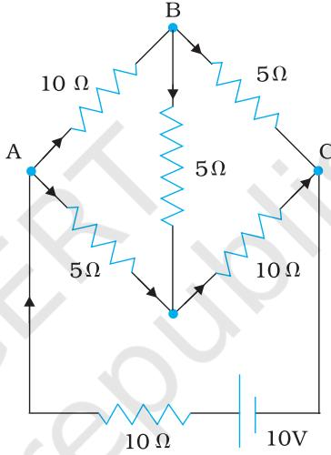  
FIGURE 3.20

3.8 A storage battery of emf $8 . 0 \mathrm { ~ V ~ }$ and internal resistance $0 . 5 ~ \Omega$ is being charged by a $1 2 0 { \mathrm { V } }$ dc supply using a series resistor of $1 5 . 5 \Omega$ .What is the terminal voltage of the battery during charging? What is the purpose of having a series resistor in the charging circuit?

3.9 The number density of free electrons in a copper conductor estimated in Example 3.1 is $8 . 5 \times 1 0 ^ { 2 8 } \mathrm { m } ^ { - 3 }$ . How long does an electron take to drift from one end of a wire $3 . 0 \mathrm { ~ m ~ }$ long to its other end? The area of cross-section of the wire is $2 . 0 \times 1 0 ^ { - 6 } ~ \mathrm { { m } ^ { 2 } }$ and it is carrying a current of 3.0 A.