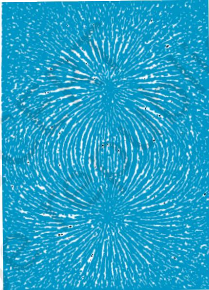
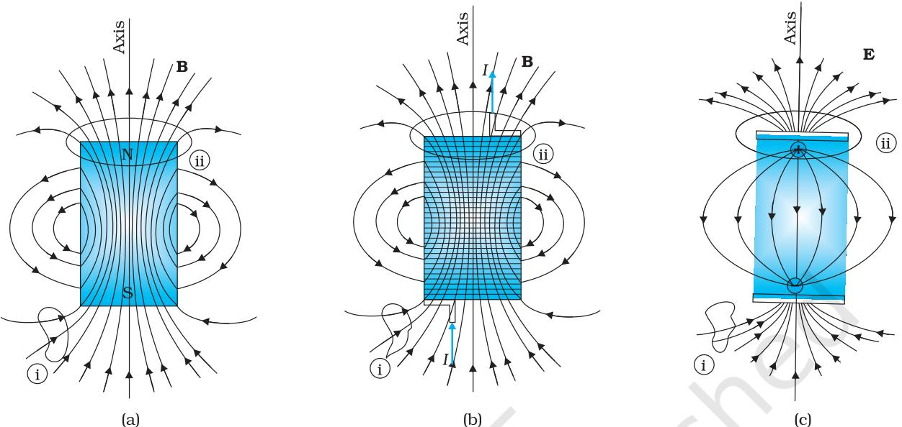
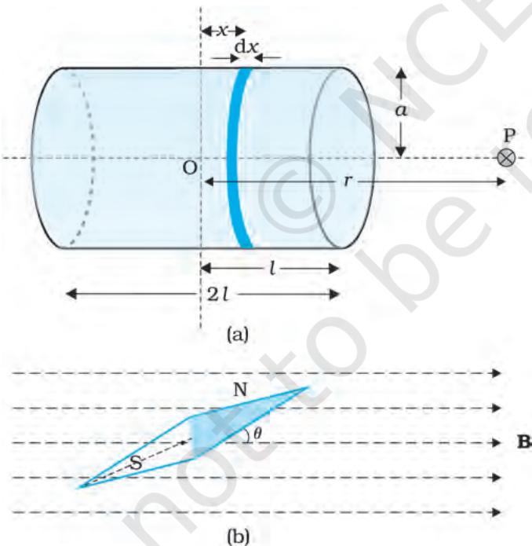
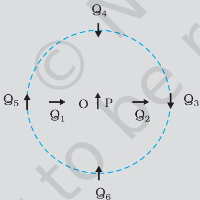
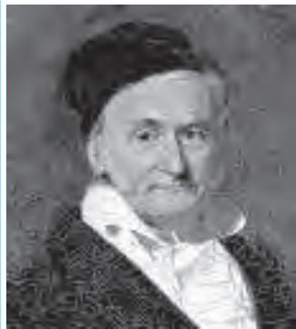
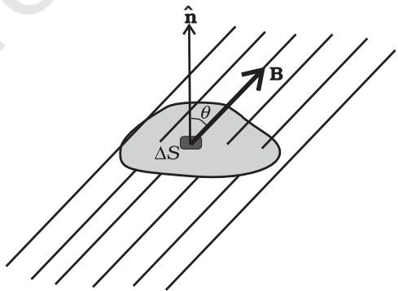
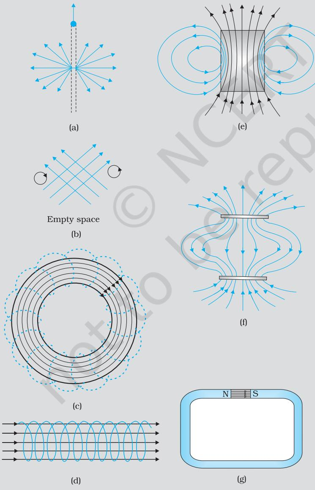
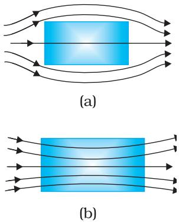
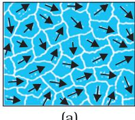
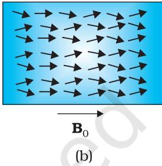

Chapter Five

# MAGNETISM AND MATTER

# 5.1 INTRODUCTION

Magnetic phenomena are universal in nature. Vast, distant galaxies, the tiny invisible atoms, humans and beasts all are permeated through and through with a host of magnetic fields from a variety of sources. The earth's magnetism predates human evolution. The word magnet is derived from the name of an island in Greece called magnesia where magnetic ore deposits were found, as early as 600 BC.

In the previous chapter we have learned that moving charges or electric currents produce magnetic fields. This discovery, which was made in the early part of the nineteenth century is credited to Oersted, Ampere, Biot and Savart, among others.

In the present chapter, we take a look at magnetism as a subject in its own right.

Some of the commonly known ideas regarding magnetism are:

(i) The earth behaves as a magnet with the magnetic field pointing approximately from the geographic south to the north.

(ii) When a bar magnet is freely suspended, it points in the north-south direction. The tip which points to the geographic north is called the north pole and the tip which points to the geographic south is called the south pole of the magnet.

(ii) There is a repulsive force when north poles （or south poles ） of two magnets are brought close together. Conversely, there is an attractive force between the north pole of one magnet and the south pole of the other.   
(iv) We cannot isolate the north, or south pole of a magnet. If a bar magnet is broken into two halves，we get two similar bar magnets with somewhat weaker properties. Unlike electric charges, isolated magnetic north and south poles known as magnetic monopoles do not exist.   
(v) It is possible to make magnets out of iron and its alloys.

We begin with a description of a bar magnet and its behaviour in an external magnetic field. We describe Gauss's law of magnetism. We next describe how materials can be classified on the basis of their magnetic properties. We describe para-, dia-,and ferromagnetism.

# 5.2 THE BAR MAGNET

We begin our study by examining iron filings sprinkled on a sheet of glass placed over a short bar magnet. The arrangement of iron filings is shown in Fig. 5.1.

The pattern of iron filings suggests that the magnet has two poles similar to the positive and negative charge of an electric dipole.As mentioned in the introductory section，one pole is designated the North pole and the other, the South pole. When suspended freely, these poles point approximately towards the geographic north and south poles, respectively.A similar pattern of iron filings is observed around a current carrying solenoid.

# 5.2.1 The magnetic field lines

The pattern of iron filings permits us to plot the magnetic field lines\*. This is shown both for the bar-magnet and the currentcarrying solenoid in Fig. 5.2. For comparison refer to the Chapter 1, Figure 1.14(d). Electric field lines of an electric dipole are also displayed in Fig. 5.2(c). The magnetic field lines are a visual and intuitive realisation of the magnetic field. Their properties are:

  
FIGURE 5.1 The arrangement of iron filings surrounding a bar magnet. The pattern mimics magnetic field lines. The pattern suggests that the bar magnet is a magnetic dipole.

(i) The magnetic field lines of a magnet (or a solenoid) form continuous closed loops. This is unlike the electric dipole where these field lines begin from a positive charge and end on the negative charge or escape to infinity.

  
FIGURE 5.2 The field lines of (a) a bar magnet, (b) a current-carrying finite solenoid and (c) electric dipole. At large distances, the field lines are very similar. The curves labelled $\textcircled{1}$ and $\textcircled{1}$ are closed Gaussian surfaces.

  
FIGURE 5.3 Calculation of (a) The axial field of a finite solenoid in order to demonstrate its similarity to that of a bar magnet. (b) A magnetic needle in a uniform magnetic field B. The arrangement may be used to determine either B or the magnetic moment m of the needle.

(ii) The tangent to the field line at a given point represents the direction of the net magnetic field B at that point.   
(iii) The larger the number of field lines crossing per unit area, the stronger is the magnitude of the magnetic field B. In Fig. 5.2(a),B is larger around region ii than in region $\textcircled{1}$ ：   
(iv) The magnetic field lines do not intersect,for if they did, the direction of the magnetic field would not be unique at the point of intersection.

One can plot the magnetic field lines in a variety of ways. One way is to place a small magnetic compass needle at various positions and note its orientation.This gives us an idea of the magnetic field direction at various points in space.

# 5.2.2 Bar magnet as an equivalent solenoid

In the previous chapter,we have explained how a current loop acts as a magnetic dipole (Section 4.9). We mentioned Ampere's hypothesis that all magnetic phenomena can be explained in terms of circulating currents.

The resemblance of magnetic field lines for a bar magnet and a solenoid suggest that a bar magnet may be thought of as a large number of circulating currents in analogy with a solenoid. Cutting a bar magnet in half is like cutting a solenoid. We get two smaller solenoids with weaker magnetic properties. The field lines remain continuous,emerging from one face of the solenoid and entering into the other face. One can test this analogy by moving a small compass needle in the neighbourhood of a bar magnet and a current-carrying finite solenoid and noting that the deflections of the needle are similar in both cases.

To make this analogy more firm we may calculate the axial field of a finite solenoid depicted in Fig. 5.3 (a). We can demonstrate that at large distances this axial field resembles that of a bar magnet.

The magnitude of the field at point P due to the solenoid is

$$
B = { \frac { \mu _ { \mathrm { 0 } } } { 4 \pi } } { \frac { 2 m } { r ^ { 3 } } }
$$

This is also the far axial magnetic field of a bar magnet which one may obtain experimentally. Thus,a bar magnet and a solenoid produce similar magnetic fields. The magnetic moment of a bar magnet is thus equal to the magnetic moment of an equivalent solenoid that produces the same magnetic field. 一

# 5.2.3 The dipole in a uniform magnetic field

Let's place a small compass needle of known magnetic moment m allowing it to oscillate in the magnetic field. This arrangement is shown in Fig. 5.3(b).

The torque on the needle is [see Eq. (4.23)l,

$$
{ \pmb { \tau } } = { \bf m } \times { \bf B }
$$

In magnitude $\tau = m B \sin \theta$

Here $\pmb { \tau }$ is restoring torque and $\theta$ is the angle between m and B.

An expression for magnetic potential energy can be obtained on lines similar to electrostatic potential energy.

The magnetic potential energy $U _ { m }$ is given by

$$
\begin{array} { l } { { \displaystyle U _ { m } = \int \tau ( \theta ) d \theta } } \\ { ~ } \\ { { \displaystyle ~ = \int m B \sin \theta d \theta } } \\ { { \displaystyle ~ = - { \bf m . B } } } \end{array} = - m B \cos \theta
$$

We have emphasised in Chapter 2 that the zero of potential energy can be fixed at one's convenience. Taking the constant of integration to be zero means fixing the zero of potential energy at $\theta = 9 0 ^ { \circ }$ , i.e.,when the needle is perpendicular to the field. Equation (5.3) shows that potential energy is minimum $\left( = - m \mathrm { B } \right)$ at $\theta = 0 ^ { \circ }$ (most stable position) and maximum $\left( = + m \mathrm { B } \right)$ at $\theta = 1 8 0 ^ { \circ }$ (most unstable position).

# Example 5.1

(a) What happens if a bar magnet is cut into two pieces: (i) transverse to its length, (i) along its length?   
(b) A magnetised needle in a uniform magnetic field experiences a torque but no net force. An iron nail near a bar magnet, however, experiences a force of attraction in addition to a torque. Why?

(c) Must every magnetic configuration have a north pole and a south pole? What about the field due to a toroid?

(d) Two identical looking iron bars A and B are given, one of which is definitely known to be magnetised. (We do not know which one.) How would one ascertain whether or not both are magnetised? If only one is magnetised, how does one ascertain which one? [Use nothing else but the bars A and B.]

# Solution

(a) In either case, one gets two magnets,each with a north and south pole.   
(b) No force if the field is uniform. The iron nail experiences a nonuniform field due to the bar magnet. There is induced magnetic moment in the nail, therefore, it experiences both force and torque. The net force is attractive because the induced south pole (say) in the nail is closer to the north pole of magnet than induced north pole.   
(c) Not necessarily. True only if the source of the field has a net non-zero magnetic moment. This is not so for a toroid or even for a straight infinite conductor.   
(d) Try to bring different ends of the bars closer. A repulsive force in some situation establishes that both are magnetised. If it is always attractive, then one of them is not magnetised. In a bar magnet the intensity of the magnetic field is the strongest at the two ends (poles) and weakest at the central region. This fact may be used to determine whether A or B is the magnet. In this case, to see which one of the two bars is a magnet, pick up one, (say,A) and lower one of its ends; first on one of the ends of the other (say, B), and then on the middle of B. If you notice that in the middle of B,A experiences no force, then B is magnetised. If you do not notice any change from the end to the middle of B, then A is magnetised.

# 5.2.4 The electrostatic analog

Comparison of Eqs. (5.1), (5.2) and (5.3) with the corresponding equations for electric dipole (Chapter 1)， suggests that magnetic field at large distances due to a bar magnet of magnetic moment m can be obtained from the equation for electric field due to an electric dipole of dipole moment p, by making the following replacements:

$$
{ \bf E }  { \bf B } , \ { \bf p }  { \bf m } , \frac { 1 } { 4 \pi \varepsilon _ { 0 } }  \frac { \mu _ { 0 } } { 4 \pi }
$$

In particular, we can write down the equatorial field $( \mathbf { B } _ { \mathrm { E } } )$ of a bar magnet at a distance $^ { r , }$ for $r { > } { > } l$ ,where $l$ is the size of the magnet:

$$
\mathbf { B } _ { E } = - \frac { \mu _ { 0 } \mathbf { m } } { 4 \pi r ^ { 3 } }
$$

Likewise, the axial field $\mathbf { ( B _ { A } ) }$ of a bar magnet for $r > > l$ is:

$$
\mathbf { B } _ { A } = { \frac { \mu _ { 0 } } { 4 \pi } } { \frac { 2 \mathbf { m } } { r ^ { 3 } } }
$$

Equation (5.5) is just Eq. (5.1) in the vector form. Table 5.1 summarises the analogy between electric and magnetic dipoles.

TABLE 5.1 THE DIPOLE ANALOGY   

<table><tr><td rowspan=3 colspan=1>Dipole moment Equatorial Field for a short dipoleAxial Field for a short dipoleExternal Field: torque External Field: Energy</td><td rowspan=1 colspan=1>Electrostatics</td><td rowspan=1 colspan=1>Magnetism</td></tr><tr><td rowspan=1 colspan=1>1/εp-p/4πε0r8</td><td rowspan=2 colspan=1>μm- μ m/ 4π r³μ0 2m//4π r³Cm × B-m·B</td></tr><tr><td rowspan=1 colspan=1>2p/4πεr8p ×E-p·E</td></tr></table>

Example 5.2 Figure 5.4 shows a small magnetised needle P placed at a point O. The arrow shows the direction of its magnetic moment. The other arrows show different positions (and orientations of the magnetic moment) of another identical magnetised needle Q.

(a) In which configuration the system is not in equilibrium?   
(b) In which configuration is the system in (i) stable,and (ii) unstable equilibrium?   
(c) Which configuration corresponds to the lowest potential energy among all the configurations shown?

  
FIGURE 5.4

# Solution

Potential energy of the configuration arises due to the potential energy of one dipole (say, Q) in the magnetic field due to other (P). Use the result that the field due to $\mathrm { P }$ is given by the expression [Eqs. (5.4) and (5.5)l:

$$
\begin{array} { l l } { { { \displaystyle { \bf B } } _ { \mathrm { P } } = - \frac { \mu _ { 0 } } { 4 \pi } \frac { { \bf m } _ { \mathrm { P } } } { r ^ { 3 } } } } & { { ~ \mathrm { ( o n ~ t h e ~ n o r m a l ~ b i s e c t o r ) } } } \\ { { \ } } & { { \ } } \\ { { { \bf B } _ { \mathrm { P } } = \frac { \mu _ { 0 } 2 } { 4 \pi } \frac { { \bf m } _ { \mathrm { P } } } { r ^ { 3 } } } } & { { ~ \mathrm { ( o n ~ t h e ~ a x i s ) } } } \end{array}
$$

where $\mathbf { m } _ { \mathrm { P } }$ is the magnetic moment of the dipole P.

Equilibrium is stable when $\mathbf { m } _ { \mathrm { Q } }$ is parallel to $\mathbf { B } _ { \mathrm { P } }$ , and unstable when it is anti-paralle to $\mathbf { B } _ { \mathrm { P } }$ ，

For instance for the configuration $\mathrm { Q _ { 3 } }$ for which $\mathrm { \Delta Q }$ is along the perpendicular bisector of the dipole P, the magnetic moment of $\mathrm { \Delta Q }$ is parallel to the magnetic field at the position 3. Hence $\mathrm { Q _ { 3 } }$ is stable. Thus,

（a) $\mathrm { P Q } _ { 1 }$ and $\mathrm { P Q } _ { 2 }$   
(b) (i) $\mathrm { P Q } _ { 3 }$ ， $\mathrm { P Q } _ { 6 }$ (stable); (i) $\mathrm { P Q } _ { 5 }$ ， $\mathrm { P Q } _ { 4 }$ (unstable)$\mathrm { P Q } _ { 6 }$

Karl Friedrich Gauss (1777 - 1855) He was a child prodigy and was gifted in mathematics, physics, engineering， astronomy and even land surveying. The properties of numbers fascinated him, and in his work he anticipated major mathematical development of later times. Along with Wilhelm Welser, he built the first electric telegraph in 1833. His mathematical theory of curved surface laid the foundation for the later work of Riemann.

# 5.3MAGNETISM AND GAUSS's LAW

In Chapter 1, we studied Gauss's law for electrostatics. In Fig 5.2(c), we see that for a closed surface represented by $\textcircled{1}$ , the number of lines leaving the surface is equal to the number of lines entering it. This is consistent with the fact that no net charge is enclosed by the surface. However, in the same figure, for the closed surface $( \widehat { \mathbf { i } \mathbf { i } } ) ,$ thereis a net outward flux, since it does include a net (positive) charge.

The situation is radically different for magnetic fields which are continuous and form closed loops. Examine the Gaussian surfaces represented by $\textcircled{1}$ or $\textcircled{1}$ in Fig 5.2(a) or Fig. 5.2(b). Both cases visually demonstrate that the number of magnetic field lines leaving the surface is balanced by the number of lines entering it. The net magnetic flux is zero for both the surfaces. This is true for any closed surface.

  
FIGURE 5.5

Consider a small vector area element $\Delta \mathbf { S }$ of a closed surface S as in Fig. 5.5. The magnetic flux through $\mathbf { \ddot { A } S }$ is defined as $\Delta \phi _ { _ { B } } \mathrm { = } \mathbf { B } { \cdot } \Delta \mathbf { S }$ ,where $\mathbf { B }$ is the field at △S.We divide $S$ into many small area elements and calculate the individual flux through each. Then, the net flux $\phi _ { B }$ is,

$$
\phi _ { B } = \sum _ { a u } \Delta \phi _ { B } = \sum _ { , a u } { \bf B } . \Delta { \bf S } = 0
$$

where ‘all' stands for'all area elements $\Delta \mathbf { S } ^ { \prime }$ . Compare this with the Gauss's law of electrostatics. The flux through a closed surface in that case is given by

$$
\sum \mathbf { E } . \Delta \mathbf { S } = \frac { q } { \mathfrak { E } _ { 0 } }
$$

where $q$ is the electric charge enclosed by the surface.

The difference between the Gauss's law of magnetism and that for electrostatics is a reflection of the fact that isolated magnetic poles (also called monopoles) are not known to exist. There are no sources or sinks of B;the simplest magnetic element is a dipole or a current loop. All magnetic phenomena can be explained in terms of an arrangement of dipoles and/or current loops.

Thus, Gauss's law for magnetism is:

The net magnetic flux through any closed surface is zero.

Example 5.3 Many of the diagrams given in Fig. 5.6 show magnetic field lines (thick lines in the figure) wrongly. Point out what is wrong with them. Some of them may describe electrostatic field lines correctly. Point out which ones.

# Solution

(a) Wrong. Magnetic field lines can never emanate from a point,as shown in figure. Over any closed surface, the net flux of B must always be zero, i.e.,pictorially as many field lines should seem to enter the surface as the number of lines leaving it. The field lines shown, in fact, represent electric field of a long positively charged wire. The correct magnetic field lines are circling the straight conductor，as described in Chapter 4.

(b) Wrong. Magnetic field lines (like electric field lines) can never cross each other, because otherwise the direction of field at the point of intersection is ambiguous. There is further error in the figure. Magnetostatic field lines can never form closed loops around empty space. A closed loop of static magnetic field line must enclose a region across which a current is passing. By contrast, electrostatic field lines can never form closed loops, neither in empty space, nor when the loop encloses charges.

(c) Right. Magnetic lines are completely confined within a toroid. Nothing wrong here in field lines forming closed loops, since each loop encloses a region across which a current passes. Note, for clarity of figure,only a few field lines within the toroid have been shown. Actually, the entire region enclosed by the windings contains magnetic field.

(d) Wrong. Field lines due to a solenoid at its ends and outside cannot be so completely straight and confined; such a thing violates Ampere's law. The lines should curve out at both ends, and meet eventually to form closed loops.

(e) Right. These are field lines outside and inside a bar magnet. Note carefully the direction of field lines inside. Not all field lines emanate out of a north pole (or converge into a south pole). Around both the N-pole, and the S-pole, the net flux of the field is zero.

(f) Wrong. These field lines cannot possibly represent a magnetic field. Look at the upper region. All the field lines seem to emanate out of the shaded plate. The net flux through a surface surrounding the shaded plate is not zero. This is impossible for a magnetic field. The given field lines,in fact,show the electrostatic field lines around a positively charged upper plate and a negatively charged lower plate. The difference between Fig. [5.6(e) and (f)] should be carefully grasped.

(g) Wrong. Magnetic field lines between two pole pieces cannot be precisely straight at the ends. Some fringing of lines is inevitable. Otherwise, Ampere's law is violated. This is also true for electric field lines.

# Example 5.4

(a) Magnetic field lines show the direction (at every point) along which a small magnetised needle aligns (at the point). Do the magnetic field lines also represent the lines of force on a moving charged particle at every point?   
(b) If magnetic monopoles existed, how would the Gauss's law of magnetism be modified?   
(c) Does a bar magnet exert a torque on itself due to its own field? Does one element of a current-carrying wire exert a force on another element of the same wire?

(d) Magnetic field arises due to charges in motion. Can a system have magnetic moments even though its net charge is zero?

# Solution

(a) No. The magnetic force is always normal to $\mathbf { B }$ (remember magnetic force $\mathbf { \mu } = q \mathbf { v }$ B). It is misleading to call magnetic field lines as lines of force.   
(b) Gauss's law of magnetism states that the flux of $\mathbf { B }$ through any closed surface is always zero $\int _ { S } { \bf B } . \Delta { \bf s } = 0$ ： If monopoles existed, the right hand side would be equal to the monopole (magnetic charge) $q _ { m }$ enclosed by S. [Analogous to Gauss's law of electrostatics, $\int _ { S } { \bf B } . \Delta { \bf s } = \mu _ { 0 } q _ { m }$ where $q _ { m }$ is the (monopole) magnetic charge enclosed by $S$ ]   
(c) No. There is no force or torque on an element due to the field produced by that element itself. But there is a force (or torque) on an element of the same wire. (For the special case of a straight wire, this force is zero.)   
(d) Yes. The average of the charge in the system may be zero. Yet, the mean of the magnetic moments due to various current loops may not be zero. We will come across such examples in connection with paramagnetic material where atoms have net dipole moment through their net charge is zero.

# 5.4MAGNETISATION AND MAGNETIC INTENSITY

The earth abounds with a bewildering variety of elements and compounds. In addition, we have been synthesising new alloys, compounds and even elements. One would like to classify the magnetic properties of these substances. In the present section, we define and explain certain terms which will help us to carry out this exercise.

We have seen that a circulating electron in an atom has a magnetic moment. In a bulk material, these moments add up vectorially and they can give a net magnetic moment which is non-zero. We define magnetisation M of a sample to be equal to its net magnetic moment per unit volume:

$$
\mathbf { M } = \frac { \mathbf { m } _ { n e t } } { V }
$$

M is a vector with dimensions $\mathrm { { { L } ^ { - 1 } \mathrm { { A } } } }$ and is measured in a units of $\mathrm { A m ^ { - 1 } }$

Consider a long solenoid of $_ n$ turns per unit length and carrying a current $I .$ The magnetic field in the interior of the solenoid was shown to be given by

$$
{ \bf B } _ { 0 } = \mu _ { 0 } n I
$$

If the interior of the solenoid is filled with a material with non-zero magnetisation, the field inside the solenoid will be greater than $\mathbf { B } _ { 0 }$ .The net $\mathbf { B }$ field in the interior of the solenoid may be expressed as

$$
\mathbf { B } = \mathbf { B } _ { 0 } + \mathbf { B } _ { \mathrm { m } }
$$

where $\mathbf { B } _ { \mathrm { m } }$ is the field contributed by the material core. It turns out that this additional field $\mathbf { B } _ { \mathrm { m } }$ is proportional to the magnetisation M of the material and is expressed as

$$
{ \bf B } _ { \mathrm { m } } = \mu _ { 0 } { \bf M }
$$

where $\mu _ { 0 }$ is the same constant (permittivity of vacuum) that appears in Biot-Savart's law.

It is convenient to introduce another vector field H, called the magnetic intensity, which is defined by

$$
\mathbf { H } = \frac { \mathbf { B } } { \mu _ { 0 } } - \mathbf { M }
$$

where $\mathbf { H }$ has the same dimensions as Mand is measured in units of A $\mathrm { m ^ { - 1 } }$ Thus, the total magnetic field $\mathbf { B }$ is written as

$$
\mathbf { B } = \mu _ { 0 } \left( \mathbf { H } + \mathbf { M } \right)
$$

We repeat our defining procedure. We have partitioned the contribution to the total magnetic field inside the sample into two parts: one, due to external factors such as the current in the solenoid. This is represented by H. The other is due to the specific nature of the magnetic material, namely M. The latter quantity can be influenced by external factors. This influence is mathematically expressed as

$$
\mathbf { M } = \chi \mathbf { H }
$$

where $\chi$ , a dimensionless quantity, is appropriately called the magnetic susceptibility. It is a measure of how a magnetic material responds to an external field. $\chi$ is small and positive for materials,which are called paramagnetic. It is small and negative for materials, which are termed diamagnetic. In the latter case $\mathbf { M }$ and H are opposite in direction. From Eqs. (5.12) and (5.13) we obtain,

$$
\mathbf { B } = \mu _ { 0 } ( 1 + \chi ) \mathbf { H }
$$

$$
\begin{array} { r l } & { \mathbf { B } = \mu _ { \mathrm { 0 } } ( 1 + } \\ & { } \\ & { = \mu _ { \mathrm { 0 } } \mu _ { \mathrm { r } } \mathbf { H } } \\ & { = \mathbf { \Omega } \mu \mathbf { H } } \end{array}
$$

where $\mu _ { \mathrm { r } } = 1 + \chi$ , is a dimensionless quantity called the relative magnetic permeability of the substance.It is the analog of the dielectric constant in electrostatics. The magnetic permeability of the substance is $\mu$ and it has the same dimensions and units as $\mu _ { 0 }$

$$
\mu = \mu _ { 0 } \mu _ { r } = \mu _ { 0 } \left( 1 + \chi \right) .
$$

The three quantities $\chi , ~ \mu _ { \mathrm { r } }$ and $\mu$ are interrelated and only one of them is independent. Given one, the other two may be easily determined.

Example 5.5 A solenoid has a core of a material with relative permeability 40o. The windings of the solenoid are insulated from the core and carry a current of 2A. If the number of turns is 1000 per metre, calculate (a) $H ,$ (b) $M ,$ （C) $B$ and (d) the magnetising current $I _ { m } .$

# Solution

(a) The field $H$ is dependent of the material of the core, and is $H { = } n I { = } 1 0 0 0 \times 2 . 0 = 2 \times 1 0 ^ { 3 } \mathrm { A / m }$

(b) The magnetic field $B$ is given by

$$
\begin{array} { r l } & { B = \mu _ { r } \mu _ { 0 } \mathrm { H } } \\ & { \quad = 4 0 0 \times 4 \pi \times 1 0 ^ { - 7 } \ ( \mathrm { N } / \mathrm { A } ^ { 2 } ) \times 2 \times 1 0 ^ { 3 } \ ( \mathrm { A } / \mathrm { m } ) } \\ & { \quad = 1 . 0 \mathrm { T } } \end{array}
$$

(c) Magnetisation is given by

$$
\begin{array} { r l } & { M { = } \left( B - { \mu _ { \scriptscriptstyle 0 } } H \right) / \left. \mu _ { \scriptscriptstyle 0 } \right. } \\ & { \quad = \left( { \mu _ { \scriptscriptstyle r } } \mu _ { \scriptscriptstyle 0 } H - \mu _ { \scriptscriptstyle 0 } H \right) / \mu _ { \scriptscriptstyle 0 } = ( \mu _ { \scriptscriptstyle r } - 1 ) H = 3 9 9 \times H } \\ & { \quad \cong 8 \times 1 0 ^ { 5 } \mathrm { A } / \mathrm { m } } \end{array}
$$

(d) The magnetising current $I _ { M }$ is the additional current that needs to be passed through the windings of the solenoid in the absence of the core which would give a $B$ value as in the presence of the core. Thus $B = \mu _ { r } n \left( I + I _ { M } \right)$ . Using $I = 2 \mathrm { A }$ $B = 1 \mathrm { T }$ , we get $I _ { M } = 7 9 4 \mathrm { \ A }$

# 5.5MAGNETIC PROPERTIES OF MATERIALS

The discussion in the previous section helps us to classify materials as diamagnetic, paramagnetic or ferromagnetic. In terms of the susceptibility x,a material is diamagnetic if $\chi$ is negative, para- if $\chi$ is positive and small, and ferro- if $\chi$ is large and positive.

A glance at Table 5.2 gives one a better feeling for these materials. Here $\varepsilon$ is a small positive number introduced to quantify paramagnetic materials. Next, we describe these materials in some detail.

TABLE 5.2   

<table><tr><td>Diamagnetic</td><td>Paramagnetic</td><td>Ferromagnetic</td></tr><tr><td>-1≤x&lt;0</td><td>0&lt;x&lt;ε</td><td>x&gt;&gt;1</td></tr><tr><td>0≤μ&lt;1</td><td>1&lt; μ&lt;1+ε</td><td>μr&gt;&gt; 1</td></tr><tr><td>μ&lt;μo</td><td>μ&gt; μo</td><td>μ &gt;&gt; μo</td></tr></table>

# 5.5.1 Diamagnetism

Diamagnetic substances are those which have tendency to move from stronger to the weaker part of the external magnetic field. In other words, unlike the way a magnet attracts metals like iron,it would repel a diamagnetic substance.

Figure 5.7(a) shows a bar of diamagnetic material placed in an external magnetic field. The field lines are repelled or expelled and the field inside the material is reduced. In most cases, this reduction is slight,being one part in $1 0 ^ { 5 }$ . When placed in a non-uniform magnetic field, the bar will tend to move from high to low field.

# FIGURE 5.7

Behaviour of   
magnetic field lines   
near a   
(a) diamagnetic,   
(b) paramagnetic   
substance.

The simplest explanation for diamagnetism is as follows. Electrons in an atom orbiting around nucleus possess orbital angular momentum. These orbiting electrons are equivalent to current-carrying loop and thus possess orbital magnetic moment.Diamagnetic substances are the ones in which resultant magnetic moment in an atom is zero. When magnetic field is applied, those electrons having orbital magnetic moment in the same direction slow down and those in the opposite direction speed up. This happens due to induced current in accordance with Lenz's law which you will study in Chapter 6. Thus, the substance develops a net magnetic moment in direction opposite to that of the applied field and hence repulsion.

Some diamagnetic materials are bismuth,copper,lead，silicon, nitrogen (at STP), water and sodium chloride. Diamagnetism is present in all the substances. However, the effect is so weak in most cases that it gets shifted by other effects like paramagnetism, ferromagnetism, etc.

The most exotic diamagnetic materials are superconductors. These are metals, cooled to very low temperatures which exhibits both perfect conductivity and perfect diamagnetism. Here the field lines are completely expelled! $\chi = - 1$ and $\mu _ { r } = 0$ . A superconductor repels a magnet and (by Newton's third law) is repelled by the magnet. The phenomenon of perfect diamagnetism in superconductors is called the Meissner effect, after the name of its discoverer. Superconducting magnets can be gainfully exploited in variety of situations, for example, for running magnetically levitated superfast trains.

# 5.5.2 Paramagnetism

Paramagnetic substances are those which get weakly magnetised when placed in an external magnetic field. They have tendency to move from a region of weak magnetic field to strong magnetic field, i.e., they get weakly attracted to a magnet.

The individual atoms (or ions or molecules) of a paramagnetic material possess a permanent magnetic dipole moment of their own. On account of the ceaseless random thermal motion of the atoms, no net magnetisation is seen. In the presence of an external field $\mathbf { B } _ { 0 }$ ,which is strong enough, and at low temperatures, the individual atomic dipole moment can be made to align and point in the same direction as $\mathbf { B } _ { 0 }$ Figure 5.7(b) shows a bar of paramagnetic material placed in an external field. The field lines gets concentrated inside the material, and the field inside is enhanced. In most cases, this enhancement is slight, being one part in $1 0 ^ { 5 }$ .When placed in a non-uniform magnetic field, the bar will tend to move from weak field to strong.

Some paramagnetic materials are aluminium, sodium,calcium, oxygen (at STP) and copper chloride. For a paramagnetic material both $\chi$ and $\mu _ { r }$ depend not only on the material, but also (in a simple fashion) on the sample temperature.As the field is increased or the temperature is lowered, the magnetisation increases until it reaches the saturation value at which point all the dipoles are perfectly aligned with the field.

# Magnetism and Matter

# 5.5.3Ferromagnetism

Ferromagnetic substances are those which gets strongly magnetised when placed in an external magnetic field. They have strong tendency to move from a region of weak magnetic field to strong magnetic field, i.e., they get strongly attracted to a magnet.

The individual atoms (or ions or molecules) in a ferromagnetic material possess a dipole moment as in a paramagnetic material. However, they interact with one another in such a way that they spontaneously align themselves in a common direction over a macroscopic volume called domain. The explanation of this cooperative effect requires quantum mechanics and is beyond the scope of this textbook. Each domain has a net magnetisation. Typical domain size is lmm and the domain contains about $1 0 ^ { 1 1 }$ atoms. In the first instant, the magnetisation varies randomly from domain to domain and there is no bulk magnetisation. This is shown in Fig. 5.8(a). When we apply an external magnetic field $\mathbf { B } _ { 0 }$ ,the domains orient themselves in the direction of $\mathbf { B } _ { 0 }$ and simultaneously the domain oriented in the direction of $\mathbf { B } _ { 0 }$ grow in size. This existence of domains and their motion in $\mathbf { B } _ { 0 }$ are not speculations. One may observe this under a microscope after sprinkling a liquid suspension of powdered ferromagnetic substance of samples. This motion of suspension can be observed. Fig. 5.8(b) shows the situation when the domains have aligned and amalgamated to form a single 'giant' domain.

Thus,in a ferromagnetic material the field lines are highly concentrated. In non-uniform magnetic field, the sample tends to move towards the region of high field. We may wonder as to what happens when the external field is removed. In some ferromagnetic materials the magnetisation persists. Such materials are called hard magnetic materials or hard ferromagnets. Alnico, an alloy of iron, aluminium, nickel, cobalt and copper, is one such material. The naturally occurring lodestone is another. Such materials form permanent magnets to be used among other things as a compass needle. On the other hand, there is a class of ferromagnetic materials in which the magnetisation disappears on removal of the external field. Soft iron is one such material. Appropriately enough, such materials are called soft ferromagnetic materials. There are a number of elements,which are ferromagnetic: iron, cobalt, nickel, gadolinium, etc. The relative magnetic permeability is ${ > } 1 0 0 0 !$

The ferromagnetic property depends on temperature. At high enough temperature, a ferromagnet becomes a paramagnet. The domain structure disintegrates with temperature. This disappearance of magnetisation with temperature is gradual.

  
(a)

FIGURE 5.8   
(a) Randomly   
oriented domains,   
(b) Aligned domains.

# SUMMARY

1. The science of magnetism is old. It has been known since ancient times that magnetic materials tend to point in the north-south direction; like magnetic poles repel and unlike ones attract; and cutting a bar magnet in two leads to two smaller magnets. Magnetic poles cannot be isolated.

2. When a bar magnet of dipole moment m is placed in a uniform magnetic field B,

the force on it is zero,   
the torque on it is $\mathbf { m } \times \mathbf { B }$ ，   
its potential energy is $- \mathbf { m } \cdot \mathbf { B }$ , where we choose the zero of energy at the orientation when m is perpendicular to B.

3. Consider a bar magnet of size land magnetic moment m, at a distance $\boldsymbol { r }$ from its mid-point, where $r > > l ,$ the magnetic field B due to this bar is,

$$
\begin{array} { l l } { { { \bf B } = \displaystyle \frac { \mu _ { 0 } { \bf m } } { 2 \pi r ^ { 3 } } } } & { { ~ \mathrm { ( a l o n g ~ a x i s ) } } } \\ { { \mathrm { . } } } \\ { { \displaystyle = - \frac { \mu _ { 0 } { \bf m } } { 4 \pi r ^ { 3 } } } } & { { ~ \mathrm { ( a l o n g ~ e q u a t o r ) } } } \end{array}
$$

4. Gauss's law for magnetism states that the net magnetic flux through any closed surface is zero

$$
\phi _ { B } = \sum _ { \begin{array} { c } { { a l l } } { { a r e a } } \\ { { e l e m e n t s \Delta \mathbf { S } } } \end{array} } \mathbf { B } { \cdot } \Delta \mathbf { S } = 0
$$

5. Consider a material placed in an external magnetic field $\mathbf { B } _ { 0 }$ .The magnetic intensity is defined as,

$$
\mathbf { H } = \frac { \mathbf { B } _ { 0 } } { \mu _ { 0 } }
$$

The magnetisation M of the material is its dipole moment per unit volume. The magnetic field B in the material is,

6. For a linear material $\mathbf { M } = { \boldsymbol { \chi } } \mathbf { H }$ . So that $\mathbf { B } = { \boldsymbol { \mu } } \mathbf { H }$ and $\chi$ is called the magnetic susceptibility of the material. The three quantities, $\chi$ ，the relative magnetic permeability $\mu _ { \mathrm { r } }$ , and the magnetic permeability $\mu$ are related as follows:

$$
\begin{array} { r } { \mu = \mu _ { 0 } \mu _ { r } } \\ { \mu _ { r } = 1 + \chi } \end{array}
$$

7, Magnetic materials are broadly classified as: diamagnetic, paramagnetic, and ferromagnetic. For diamagnetic materials $\chi$ is negative and small and for paramagnetic materials it is positive and small. Ferromagnetic materials have large $\chi$

8. Substances, which at room temperature, retain their ferromagnetic property for a long period of time are called permanent magnets.

Magnetism and Matter   

<table><tr><td rowspan=1 colspan=6> Physical quantity        Symbol   Nature      Dimensions     Units       Remarks</td></tr><tr><td rowspan=1 colspan=1>Permeability offree space</td><td rowspan=1 colspan=1>μ</td><td rowspan=1 colspan=1>Scalar</td><td rowspan=1 colspan=1>[MLT-² A-2]</td><td rowspan=1 colspan=1>T m A-1</td><td rowspan=1 colspan=1>μ/4π = 10-7</td></tr><tr><td rowspan=1 colspan=1> Magnetic field,Magnetic  induction, Magnetic flux density</td><td rowspan=1 colspan=1>B</td><td rowspan=1 colspan=1>Vector</td><td rowspan=1 colspan=1>[MT² A−1]</td><td rowspan=1 colspan=1>T (tesla)</td><td rowspan=1 colspan=1>104 G (gauss) = 1 T</td></tr><tr><td rowspan=1 colspan=1>Magnetic  moment</td><td rowspan=1 colspan=1>m</td><td rowspan=1 colspan=1>Vector</td><td rowspan=1 colspan=1>[L² A]</td><td rowspan=1 colspan=1>A m²</td><td rowspan=1 colspan=1></td></tr><tr><td rowspan=1 colspan=1> Magnetic flux</td><td rowspan=1 colspan=1>B</td><td rowspan=1 colspan=1>Scalar</td><td rowspan=1 colspan=1>[ML2T² A-1]</td><td rowspan=1 colspan=1>W (weber)</td><td rowspan=1 colspan=1> W= Tm²</td></tr><tr><td rowspan=1 colspan=1> Magnetisation</td><td rowspan=1 colspan=1>M</td><td rowspan=1 colspan=1>Vector</td><td rowspan=1 colspan=1>[L−1 A]</td><td rowspan=1 colspan=1>A m-1</td><td rowspan=1 colspan=1> Magnetic momentVolume</td></tr><tr><td rowspan=1 colspan=1>Magnetic intensityMagnetic field strength</td><td rowspan=1 colspan=1>H</td><td rowspan=1 colspan=1>Vector</td><td rowspan=1 colspan=1>[L−1 A]</td><td rowspan=1 colspan=1>A m-1</td><td rowspan=1 colspan=1>B= μ (H + M)</td></tr><tr><td rowspan=1 colspan=1>Magnetic susceptibility</td><td rowspan=1 colspan=1>X</td><td rowspan=1 colspan=1>Scalar</td><td rowspan=1 colspan=1></td><td rowspan=1 colspan=1></td><td rowspan=1 colspan=1>M= xH</td></tr><tr><td rowspan=1 colspan=1> Relative magnetic permeability</td><td rowspan=1 colspan=1>μr</td><td rowspan=1 colspan=1>Scalar</td><td rowspan=1 colspan=1></td><td rowspan=1 colspan=1></td><td rowspan=1 colspan=1>B= μμ,H</td></tr><tr><td rowspan=1 colspan=1> Magnetic permeability</td><td rowspan=1 colspan=1>μ</td><td rowspan=1 colspan=1>Scalar</td><td rowspan=1 colspan=1>[MLT-² A-2]</td><td rowspan=1 colspan=1>T m A-1N A-2</td><td rowspan=1 colspan=1>μ= μoμrB=μH</td></tr></table>

# POINTS TO PONDER

1. A satisfactory understanding of magnetic phenomenon in terms of moving charges/currents was arrived at after 18oo AD. But technological exploitation of the directional properties of magnets predates this scientific understanding by two thousand years. Thus, scientific understanding is not a necessary condition for engineering applications. Ideally， science and engineering go hand-in-hand, one leading and assisting the other in tandem.

2. Magnetic monopoles do not exist. If you slice a magnet in half, you get two smaller magnets. On the other hand, isolated positive and negative charges exist. There exists a smallest unit of charge, for example, the electronic charge with value $| \boldsymbol { e } | = 1 . 6 \times 1 0 ^ { - 1 9 } ( $ C. All other charges are integral multiples of this smallest unit charge. In other words, charge is quantised. We do not know why magnetic monopoles do not exist or why electric charge is quantised.

3. A consequence of the fact that magnetic monopoles do not exist is that the magnetic field lines are continuous and form closed loops. In contrast, the electrostatic lines of force begin on a positive charge and terminate on the negative charge (or fade out at infinity).

4. A miniscule difference in the value of $\chi$ , the magnetic susceptibility, yields radically different behaviour: diamagnetic versus paramagnetic. For diamagnetic materials $\chi = - 1 0 ^ { - 5 }$ whereas $\chi = + 1 0 ^ { - 5 }$ for paramagnetic materials.

5. There exists a perfect diamagnet, namely,a superconductor. This is a metal at very low temperatures. In this case $\chi = - 1$ $\mu _ { r } = 0$ ， $\mu = 0$ .The external magnetic field is totally expelled. Interestingly, this material is also a perfect conductor. However, there exists no classical theory which ties these two properties together. A quantum-mechanical theory by Bardeen, Cooper,and Schrieffer (BCS theory) explains these effects. The BCS theory was proposed inl957 and was eventually recognised by a Nobel Prize in physics in 1970.   
6. Diamagnetism is universal. It is present in all materials. But it is weak and hard to detect if the substance is para- or ferromagnetic.   
7. We have classified materials as diamagnetic, paramagnetic,and ferromagnetic. However, there exist additional types of magnetic material such as ferrimagnetic, anti-ferromagnetic, spin glass, etc. with properties which are exotic and mysterious.

# EXERCISES

5.1 A short bar magnet placed with its axis at $3 0 ^ { \circ }$ with a uniform external magnetic field of $0 . 2 5 \mathrm { ~ T ~ }$ experiences a torque of magnitude equal to $4 . 5 \times 1 0 ^ { - 2 } \mathrm { J }$ . What is the magnitude of magnetic moment of the magnet?

5.2 A short bar magnet of magnetic moment $\mathrm { m } = 0 . 3 2 \ \mathrm { J T ^ { - 1 } }$ is placed in a uniform magnetic field of $0 . 1 5 \mathrm { ~ T ~ }$ 、If the bar is free to rotate in the plane of the field, which orientation would correspond to its (a) stable, and (b) unstable equilibrium? What is the potential energy of the magnet in each case?

5.3 A closely wound solenoid of 8oo turns and area of cross section $2 . 5 \times 1 0 ^ { - 4 } \mathrm { ~ m } ^ { 2 }$ carries a current of 3.0 A. Explain the sense in which the solenoid acts like a bar magnet. What is its associated magnetic moment?

5.4 If the solenoid in Exercise 5.5 is free to turn about the vertical direction and a uniform horizontal magnetic field of $0 . 2 5 \mathrm { T }$ is applied, what is the magnitude of torque on the solenoid when its axis makes an angle of $3 0 ^ { \circ }$ with the direction of applied field?

5.5 A bar magnet of magnetic moment $1 . { \overset { - } { 5 } } \ J \ \operatorname { T } ^ { - 1 }$ lies aligned with the direction of a uniform magnetic field of $0 . 2 2 ~ \mathrm { T }$

(a) What is the amount of work required by an external torque to turn the magnet so as to align its magnetic moment: (i) normal to the field direction, (ii) opposite to the field direction?

b) What is the torque on the magnet in cases (i) and (ii)?

5.6 A closely wound solenoid of 2ooo turns and area of cross-section $1 . 6 \times 1 0 ^ { - 4 } \mathrm { m } ^ { 2 }$ ， carrying a current of $4 . 0 \ \mathrm { A } .$ ， is suspended through its centre allowing it to turn in a horizontal plane.

(a) What is the magnetic moment associated with the solenoid?   
(b) What is the force and torque on the solenoid if a uniform horizontal magnetic field of $\bar { 7 . 5 } \times 1 0 ^ { - 2 } \mathrm { ~ T ~ }$ is set up at an angle of $3 0 ^ { \circ }$ with the axis of the solenoid?

5.7 A short bar magnet has a magnetic moment of $0 . 4 8 \ J \ \mathrm { T } ^ { - 1 }$ . Give the direction and magnitude of the magnetic field produced by the magnet at a distance of $1 0 ~ \mathrm { c m }$ from the centre of the magnet on (a) the axis, (b) the equatorial lines (normal bisector) of the magnet.