Chapter Six

# ELECTROMAGNETIC INDUCTION

# 6.1 INTRODUCTION

Electricity and magnetism were considered separate and unrelated phenomena for a long time. In the early decades of the nineteenth century, experiments on electric current by Oersted, Ampere and a few others established the fact that electricity and magnetism are inter-related. They found that moving electric charges produce magnetic fields. For example, an electric current deflects a magnetic compass needle placed in its vicinity. This naturally raises the questions like: Is the converse effect possible? Can moving magnets produce electric currents? Does the nature permit such a relation between electricity and magnetism? The answer is resounding yes! The experiments of Michael Faraday in England and Joseph Henry in USA, conducted around 1830, demonstrated conclusively that electric currents were induced in closed coils when subjected to changing magnetic fields. In this chapter, we will study the phenomena associated with changing magnetic fields and understand the underlying principles. The phenomenon in which electric current is generated by varying magnetic fields is appropriately called electromagnetic induction.

When Faraday first made public his discovery that relative motion between a bar magnet and a wire loop produced a small current in the latter, he was asked, "What is the use of it?" His reply was: "What is the use of a new born baby?" The phenomenon of electromagnetic induction

# Electromagnetic Induction

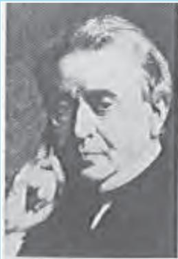

is not merely of theoretical or academic interest but also of practical utility. Imagine a world where there is no electricity – no electric lights, no trains, no telephones and no personal computers. The pioneering experiments of Faraday and Henry have led directly to the development of modern day generators and transformers. Today's civilisation owes its progress to a great extent to the discovery of electromagnetic induction.

# 6.2 THE ExPERIMENTS OF FARADAY AND HENRY

The discovery and understanding of electromagnetic induction are based on a long series of experiments carried out by Faraday and Henry. We shall now describe some of these experiments.

# Experiment 6.1

Josheph Henry [1797 1878] American experimental physicist, professor at Princeton University and first director of the Smithsonian Institution. He made important improvements in electromagnets by winding coils of insulated wire around iron pole pieces and invented an electromagnetic motor and a new, efficient telegraph. He discoverd self-induction and investigated how currents in one circuit induce currents in another.

Figure 6.1 shows a coil $\mathbf { C _ { 1 } } ^ { * }$ connected to a galvanometer G. when the North-pole of a bar magnet is pushed towards the coil, the pointer in the galvanometer deflects, indicating the presence of electric current in the coil. The deflection lasts as long as the bar magnet is in motion. The galvanometer does not show any deflection when the magnet is held stationary. When the magnet is pulled away from the coil, the galvanometer shows deflection in the opposite direction, which indicates reversal of the current's direction. Moreover, when the South-pole of the bar magnet is moved towards or away from the coil, the deflections in the galvanometer are opposite to that observed with the North-pole for similar movements. Further, the deflection (and hence current) is found to be larger when the magnet is pushed towards or pulled away from the coil faster. Instead, when the bar magnet is held fixed and the coil $\mathrm { C } _ { 1 }$ is moved towards or away from the magnet, the same effects are observed. It shows that it is the relative motion between the magnet and the coil that is responsible for generation (induction) of electric current in the coil.

# Experiment 6.2

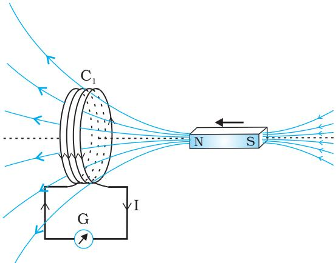  
FIGuRE 6.1 When the bar magnet is pushed towards the coil, the pointer in the galvanometer G deflects.

In Fig. 6.2 the bar magnet is replaced by a second coil $\mathrm { C } _ { 2 }$ connected to a battery. The steady current in the coil $\mathrm { C } _ { 2 }$ produces a steady magnetic field. As coil $\mathrm { C } _ { 2 }$ is moved towards the coil $\mathrm { C } _ { 1 }$ , the galvanometer shows a deflection. This indicates that electric current is induced in coil $\mathrm { C } _ { 1 }$ .When $\mathrm { C } _ { 2 }$ is moved away, the galvanometer shows a deflection again, but this time in the opposite direction. The deflection lasts as long as coil $\mathrm { C } _ { 2 }$ is in motion. when the coil $\mathrm { C } _ { 2 }$ is held fixed and $\mathrm { C } _ { 1 }$ is moved, the same effects are observed. Again, it is the relative motion between the coils that induces the electric current.

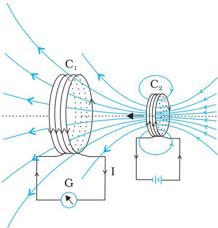  
FIGuRE 6.2 Current is induced in coil $\mathrm { C } _ { 1 }$ due to motion of the current carrying coil C2·

# Experiment 6.3

The above two experiments involved relative motion between a magnet and a coil and between two coils, respectively. Through another experiment, Faraday showed that this relative motion is not an absolute requirement. Figure 6.3 shows two coils $\mathrm { C } _ { 1 }$ and $\mathrm { C } _ { 2 }$ held stationary. Coil $\mathbf { C } _ { 1 }$ is connected to galvanometer G while the second coil $\mathrm { C } _ { 2 }$ is connected to a battery through a tapping key K.

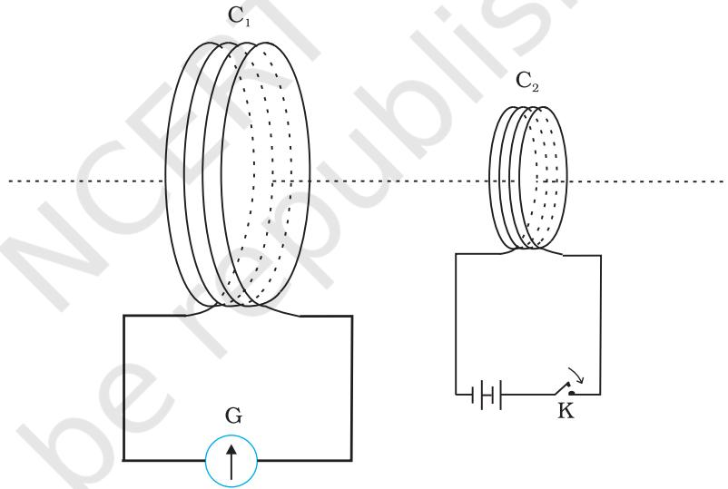  
FIGuRE 6.3 Experimental set-up for Experiment 6.3.

It is observed that the galvanometer shows a momentary deflection when the tapping key K is pressed. The pointer in the galvanometer returns to zero immediately. If the key is held pressed continuously, there is no deflection in the galvanometer. when the key is released, a momentory deflection is observed again, but in the opposite direction. It is also observed that the deflection increases dramatically when an iron rod is inserted into the coils along their axis.

# 6.3 MAGNETIC FLUX

Faraday's great insight lay in discovering a simple mathematical relation to explain the series of experiments he carried out on electromagnetic induction. However, before we state and appreciate his laws, we must get familiar with the notion of magnetic fl ux, $\boldsymbol { \phi } _ { \mathrm { ~ B ~ } }$ . Magnetic fl ux is defined in the same way as electric fl ux is defined in Chapter 1. Magnetic fl ux through a plane of area $A$ placed in a uniform magnetic field B (Fig. 6.4) can be written as

$$
\phi _ { _ \mathrm { B } } { } = \mathbf { B } \cdot \mathbf { A } = B A \cos { \theta }
$$

where $\theta$ is angle between $\mathbf { B }$ and A. The notion of the area as a vector has been discussed earlier in Chapter 1. Equation (6.1) can be extended to curved surfaces and nonuniform fields.

If the magnetic field has different magnitudes and directions at various parts of a surface as shown in Fig. 6.5, then the magnetic flux through the surface is given by

$$
\mathcal { P } _ { _ B } = \mathbf { B } _ { 1 } { \bullet } \mathrm { d } \mathbf { A } _ { 1 } + \mathbf { B } _ { 2 } { \bullet } \mathrm { d } \mathbf { A } _ { 2 } + \ldots = \sum _ { \mathrm { a l l } } \mathbf { B } _ { i } { \bullet } \mathrm { d } \mathbf { A } _ { i }
$$

where 'all' stands for summation over all the area elements $\mathrm { d } \mathbf { A } _ { i }$ comprising the surface and $\mathbf { B } _ { i }$ is the magnetic field at the area element $\mathrm { d } { \bf A } _ { \mathrm { i } }$ . The SI unit of magnetic flux is weber (Wb) or tesla meter squared $( \mathrm { T } \mathrm { m } ^ { 2 } )$ . Magnetic flux is a scalar quantity.

# 6.4 FArADAY's LAW oF INDucTiON

From the experimental observations, Faraday arrived at a conclusion that an emf is induced in a coil when magnetic flux through the coil changes with time. Experimental observations discussed in Section 6.2 can be explained using this concept.

The motion of a magnet towards or away from coil $\mathrm { C } _ { 1 }$ in Experiment 6. 1 and moving a current-carrying coil $\mathrm { C } _ { 2 }$ towards or away from coil $\mathrm { C } _ { 1 }$ in Experiment 6.2, change the magnetic flux associated with coil $\mathrm { C } _ { 1 }$ . The change in magnetic flux induces emf in coil $\mathrm { C } _ { 1 }$ . It was this induced emf which caused electric current to flow in coil $\mathrm { C } _ { 1 }$ and through the galvanometer. A plausible explanation for the observations of Experiment 6.3 is as follows: When the tapping key K is pressed, the current in coil $\mathrm { C } _ { 2 }$ (and the resulting magnetic field) rises from zero to a maximum value in a short time. Consequently, the magnetic flux through the neighbouring coil $\mathrm { C } _ { 1 }$ also increases. It is the change in magnetic flux through coil $\mathrm { C } _ { 1 }$ that produces an induced emf in coil $\mathrm { C } _ { 1 }$ when the key is held pressed, current in coil $\mathrm { C } _ { 2 }$ is constant. Therefore, there is no change in the magnetic flux through coil $\mathrm { C } _ { 1 }$ and the current in coil $\mathrm { C } _ { 1 }$ drops to zero. when the key is released, the current in $\mathrm { C } _ { 2 }$ and the resulting magnetic field decreases from the maximum value to zero in a short time. This results in a decrease in magnetic flux through coil $\mathrm { C } _ { 1 }$ and hence again induces an electric current in coil $\mathrm { C _ { 1 } } ^ { * }$ . The common point in all these observations is that the time rate of change of magnetic flux through a circuit induces emf in it. Faraday stated experimental observations in the form of a law called Faraday's law of electromagnetic induction. The law is stated below.

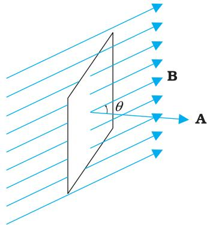  
FIGurE 6.4 A plane of surface area A placed in a uniform magnetic field B.

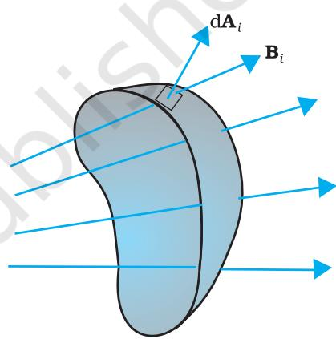  
FIGuRE 6.5 Magnetic field B at the $i ^ { \mathrm { { t h } } }$ area element. $\mathrm { d } \mathbf { A } _ { i }$ represents area vector of the (cid:) $i ^ { \mathrm { t h } }$ area element.

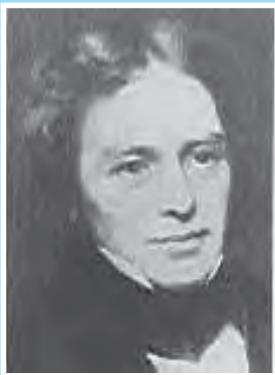

The magnitude of the induced emf in a circuit is equal to the time rate of change of magnetic flux through the circuit.

Michael Faraday [1791- 1867l Faradaymade numerous contributions to science, viz., the discovery of electromagnetic induction, the laws of electrolysis, benzene,and the fact that the plane of polarisation is rotated in an electric field. He is also credited with the invention of the electric motor, the electric generator and the transformer. He is widely regarded as the greatest experimental scientist of the nineteenth century.

Mathematically, the induced emf is given by

$$
\boxed { \varepsilon = - \frac { \mathrm { d } \phi _ { _ B } } { \mathrm { d } t } }
$$

The negative sign indicates the direction of $\varepsilon$ and hence the direction of current in a closed loop. This will be discussed in detail in the next section.

In the case of a closely wound coil of $N$ turns, change of flux associated with each turn, is the same. Therefore, the expression for the total induced emf is given by

$$
\boxed { \varepsilon = - N \frac { \mathrm { d } \phi _ { _ B } } { \mathrm { d } t } }
$$

The induced emf can be increased by increasing the number of turns $N$ of a closed coil.

From Eqs. (6.1) and (6.2), we see that the flux can be varied by changing any one or more of the terms B, A and 0. In Experiments 6.1 and 6.2 in Section 6.2, the flux is changed by varying B. The flux can also be altered by changing the shape of a coil (that is, by shrinking it or stretching it) in a magnetic field, or rotating a coil in a magnetic field such that the angle $\theta$ between B and A changes. In these cases too, an emf is induced in the respective coils.

Example 6.1 Consider Experiment 6.2. (a) What would you do to obtain a large deflection of the galvanometer? (b) How would you demonstrate the presence of an induced current in the absence of a galvanometer?

# Solution

(a) To obtain a large deflection, one or more of the following steps can be taken: (i) Use a rod made of soft iron inside the coil $C _ { 2 }$ , (ii) Connect the coil to a powerful battery, and (i) Move the arrangement rapidly towards the test coil $C _ { 1 }$ .   
(b) Replace the galvanometer by a small bulb, the kind one finds in a small torch light. The relative motion between the two coils will cause the bulb to glow and thus demonstrate the presence of an induced current. In experimental physics one must learn to innovate. Michael Faraday who is ranked as one of the best experimentalists ever, was legendary for his innouative skills.

Example 6.2 A square loop of side $1 0 ~ \mathrm { { c m } }$ and resistance $0 . 5 \Omega$ is placed vertically in the east-west plane. A uniform magnetic field of $0 . 1 0 \mathrm { ~ T ~ }$ is set up across the plane in the north-east direction. The magnetic field is decreased to zero in O.70 s at a steady rate. Determine the magnitudes of induced emf and current during this time-interval.

# Electromagnetic Induction

solution The angle $\theta$ made by the area vector of the coil with the magnetic field is $4 5 ^ { \circ }$ . From Eq. (6.1), the initial magnetic flux is

$\Phi = B A$ cos θ

$$
\frac { 0 . 1 \times 1 0 ^ { - 2 } } { \sqrt { 2 } } \mathrm { W b }
$$

Final fl ux, $\varPhi _ { \mathrm { m i n } } = 0$

The change in flux is brought about in O.70 s. From Eq. (6.3), the magnitude of the induced emf is given by

$$
\varepsilon = { \frac { \left| \Delta \phi _ { _ B } \right| } { \Delta t } } = { \frac { \left| \left( \phi - 0 \right) \right| } { \Delta t } } \ = { \frac { 1 0 ^ { - 3 } } { \sqrt { 2 } \times 0 . 7 } } = 1 . 0 \mathrm { m V }
$$

And the magnitude of the current is

$$
I = { \frac { \varepsilon } { R } } = { \frac { 1 0 ^ { - 3 } \mathrm { V } } { 0 . 5 \Omega } } = 2 \mathrm { m A }
$$

Note that the earth's magnetic field also produces a flux through the loop. But it is a steady field (which does not change within the time span of the experiment) and hence does not induce any emf.

# Example 6.3

A circular coil of radius $1 0 ~ \mathrm { c m }$ , 500 turns and resistance $2 \ \Omega$ is placed with its plane perpendicular to the horizontal component of the earth's magnetic field. It is rotated about its vertical diameter through $1 8 0 ^ { \circ }$ in $0 . 2 5 \mathrm { ~ s ~ }$ . Estimate the magnitudes of the emf and current induced in the coil. Horizontal component of the earth's magnetic field at the place is $3 . 0 \times 1 0 ^ { - 5 }$ T.

# Solution

Initial flux through the coil,

$$
\begin{array} { r l } { \Phi _ { \mathrm { B ( i n i t i a l ) } } } & { = B A \cos { \Theta } } \\ & { = 3 . 0 \times 1 0 ^ { - 5 } \times ( \pi \times 1 0 ^ { - 2 } ) \times \cos { 0 ^ { \circ } } } \\ & { = 3 \pi \times 1 0 ^ { - 7 } \mathrm { W b } } \end{array}
$$

Final flux after the rotation,

$$
\begin{array} { r l } { \varPhi _ { \mathrm { B \ ( f i n a l ) } } } & { = 3 . 0 \times 1 0 ^ { - 5 } \times ( \pi \times 1 0 ^ { - 2 } ) \times \mathrm { c o s ~ } 1 8 0 ^ { \circ } } \\ & { = - 3 \pi \times 1 0 ^ { - 7 } \mathrm { W b } } \end{array}
$$

Therefore, estimated value of the induced emf is,

$$
\begin{array} { l } { \varepsilon = N \frac { - \cdot } { \Delta t } } \\ { I = 5 0 0 \times ( 6 \pi \times 1 0 ^ { - 7 } ) / 0 . 2 5 } \\ { = 3 . 8 \times 1 0 ^ { - 3 } \ \mathrm { V } } \\ { I = \varepsilon / R = 1 . 9 \times 1 0 ^ { - 3 } \mathrm { A } } \end{array}
$$

Note that the magnitudes of ε and $I$ are the estimated values. Their instantaneous values are different and depend upon the speed of rotation at the particular instant.

# 6.5 LEnz's LAW AND CoNSERvATIoN OF ENErGY

In 1834, German physicist Heinrich Friedrich Lenz (1804-1865) deduced a rule, known as Lenz's law which gives the polarity of the induced emf in a clear and concise fashion. The statement of the law is:

The polarity of induced emf is such that it tends to produce a current which opposes the change in magnetic flux that produced it.

The negative sign shown in Eq. (6.3) represents this effect. We can understand Lenz's law by examining Experiment 6.1 in Section 6.2.1. In Fig. 6.1, we see that the North-pole of a bar magnet is being pushed towards the closed coil. As the North-pole of the bar magnet moves towards the coil, the magnetic flux through the coil increases. Hence current is induced in the coil in such a direction that it opposes the increase in flux. This is possible only if the current in the coil is in a counter-clockwise direction with respect to an observer situated on the side of the magnet. Note that magnetic moment associated with this current has North polarity towards the North-pole of the approaching magnet. Similarly, if the Northpole of the magnet is being withdrawn from the coil, the magnetic flux through the coil will decrease. To counter this decrease in magnetic flux, the induced current in the coil flows in clockwise direction and its Southpole faces the receding North-pole of the bar magnet. This would result in an attractive force which opposes the motion of the magnet and the corresponding decrease in flux.

What will happen if an open circuit is used in place of the closed loop the above example? In this case too, an emf is induced across the open ends of the circuit. The direction of the induced emf can be found using Lenz's law. Consider Figs. 6.6 (a) and (b). They provide an easier way to understand the direction of induced currents. Note that the direction shown by $\mathfrak { H }$ and $\nless$ indicate the directions of the induced currents.

A little reflection on this matter should convince us on the correctness of Lenz's law. Suppose that the induced current was in the direction opposite to the one depicted in Fig. 6.6(a). In that case, the South-pole due to the induced current will face the approaching North-pole of the magnet. The bar magnet will then be attracted towards the coil at an ever increasing acceleration. A gentle push on the magnet will initiate the process and its velocity and kinetic energy will continuously increase without expending any energy. If this can happen, one could construct a perpetual-motion machine by a suitable arrangement. This violates the law of conservation of energy and hence can not happen.

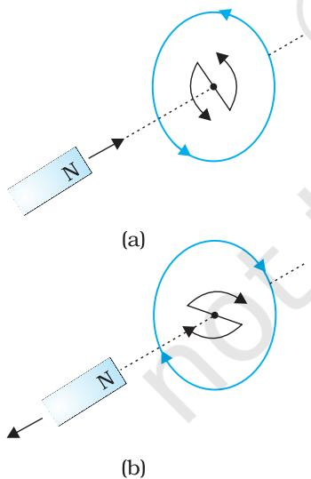  
FIGURE 6.6 Illustration of Lenz's law.

Now consider the correct case shown in Fig. 6.6(a). In this situation, the bar magnet experiences a repulsive force due to the induced current. Therefore, a person has to do work in moving the magnet.

Where does the energy spent by the person go? This energy is dissipated by Joule heating produced by the induced current.

# Electromagnetic Induction

# Example 6.4

Figure 6.7 shows planar loops of different shapes moving out of or into a region of a magnetic field which is directed normal to the plane of the loop away from the reader. Determine the direction of induced current in each loop using Lenz's law.

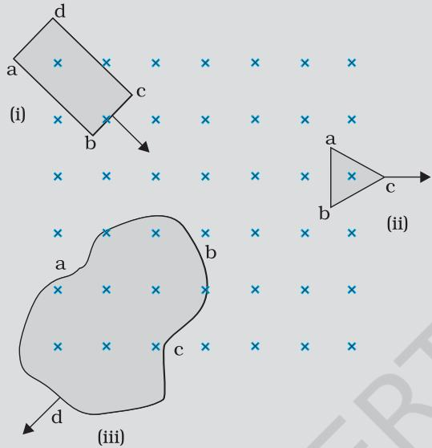  
FIGURE 6.7

# Solution

(i) The magnetic flux through the rectangular loop abcd increases, due to the motion of the loop into the region of magnetic field, The induced current must flow along the path bcdab so that it opposes the increasing flux.   
(ii) Due to the outward motion, magnetic flux through the triangular loop abc decreases due to which the induced current flows along bacb, so as to oppose the change in flux.   
(ii) As the magnetic flux decreases due to motion of the irregular shaped loop abcd out of the region of magnetic field, the induced current flows along cdabc, so as to oppose change in flux. Note that there are no induced current as long as the loops are completely inside or outside the region of the magnetic field.

# Example 6.5

(a) A closed loop is held stationary in the magnetic field between the north and south poles of two permanent magnets held fixed. Can we hope to generate current in the loop by using very strong magnets?

(b) A closed loop moves normal to the constant electric field between the plates of a large capacitor. Is a current induced in the loop (i) when it is wholly inside the region between the capacitor plates (ii) when it is partially outside the plates of the capacitor? The electric field is normal to the plane of the loop.

(c) A rectangular loop and a circular loop are moving out of a uniform magnetic field region (Fig. 6.8) to a field-free region with a constant velocity $\pmb { \ v }$ . In which loop do you expect the induced emf to be constant during the passage out of the field region? The field is normal to the loops.

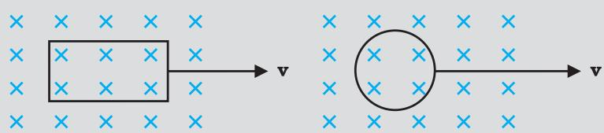  
FIGURE 6.8

(d) Predict the polarity of the capacitor in the situation described by Fig. 6.9.

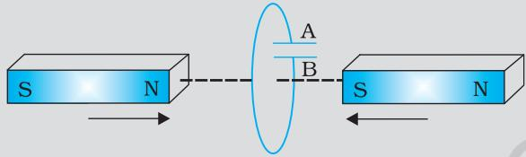  
FIGURE 6.9

# Solution

(a) No. However strong the magnet may be, current can be induced only by changing the magnetic flux through the loop.   
(b) No current is induced in either case. Current can not be induced by changing the electric flux.   
(c) The induced emf is expected to be constant only in the case of the rectangular loop. In the case of circular loop, the rate of change of area of the loop during its passage out of the field region is not constant, hence induced emf will vary accordingly.   
(d) The polarity of plate A' will be positive with respect to plate 'B' in the capacitor.

# 6.6 MoTIONAL ELECTROMOTIVE FORCE

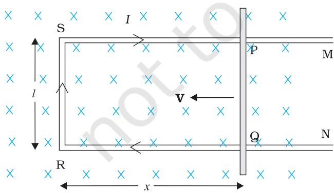  
FIGuRE 6.10 The arm PQ is moved to the left side, thus decreasing the area of the rectangular loop. This movement induces a current I as shown.

Let us consider a straight conductor moving in a uniform and timeindependent magnetic field. Figure 6. 10 shows a rectangular conductor PQRS in which the conductor PQ is free to move. The rod PQ is moved towards the left with a constant velocity $\pmb { \ v }$ as shown in the figure. Assume that there is no loss of energy due to friction. PQRS forms a closed circuit enclosing an area that changes as PQ moves. It is placed in a uniform magnetic field B which is perpendicular to the plane of this system. If the length $\operatorname { R Q } = x$ and ${ \mathrm { R S } } = l ,$ the magnetic flux $\boldsymbol { \phi } _ { \mathrm { B } }$ enclosed by the loop PQRS will be

$$
\phi _ { \mathrm { { B } } } = B { l x }
$$

Since $x$ is changing with time, the rate of change of fl ux $\boldsymbol { \phi } _ { \mathrm { B } }$ will induce an emf given by:

$$
\begin{array} { c } { \displaystyle [ \varepsilon = \frac { - \mathrm { d } \phi _ { _ B } } { \mathrm { d } t } = - \frac { \mathrm { d } } { \mathrm { d } t } ( B l x )  } \\ { \displaystyle  \ } \\ { = - B l \frac { \mathrm { d } x } { \mathrm { d } t } = B l v } \end{array}
$$

where we have used $\mathrm { d } \boldsymbol { x } / \mathrm { d } t = - \boldsymbol { v }$ which is the speed of the conductor PQ. The induced emf Blu is called motional emf. Thus, we are able to produce induced emf by moving a conductor instead of varying the magnetic field, that is, by changing the magnetic flux enclosed by the circuit.

It is also possible to explain the motional emf expression in Eq. (6.5) by invoking the Lorentz force acting on the free charge carriers of conductor PQ. Consider any arbitrary charge $q$ in the conductor PQ. When the rod moves with speed $v$ , the charge will also be moving with speed u in the magnetic field B. The Lorentz force on this charge is quB in magnitude, and its direction is towards $\mathrm { \sf { Q } }$ . All charges experience the same force, in magnitude and direction, irrespective of their position in the rod PQ.

The work done in moving the charge from P to $\mathrm { \sf { Q } }$ is,

$$
\mathbf { W } = q v \mathbf { B } l
$$

Since emf is the work done per unit charge,

$$
\varepsilon = { \frac { W } { q } }
$$

$$
= B l v
$$

This equation gives emf induced across the rod PQ and is identical to Eq. (6.5). We stress that our presentation is not wholly rigorous. But it does help us to understand the basis of Faraday's law when the conductor is moving in a uniform and time-independent magnetic field.

On the other hand, it is not obvious how an emf is induced when a conductor is stationary and the magnetic field is changing – a fact which Faraday verified by numerous experiments. In the case of a stationary conductor, the force on its charges is given by

$$
\mathbf { F } = q \left( \mathbf { E } + \mathbf { v } \times \mathbf { B } \right) = q \mathbf { E }
$$

since $\mathbf { v } = 0$ . Thus, any force on the charge must arise from the electric field term $\mathbf { E }$ alone. Therefore, to explain the existence of induced emf or induced current, we must assume that a time-varying magnetic field generates an electric field. However, we hasten to add that electric fields produced by static electric charges have properties different from those produced by time-varying magnetic fields. In Chapter 4, we learnt that charges in motion (current) can exert force/torque on a stationary magnet. Conversely, a bar magnet in motion (or more generally, a changing magnetic field) can exert a force on the stationary charge. This is the fundamental significance of the Faraday's discovery. Electricity and magnetism are related.

Example 6.6 A metallic rod of $1 \textrm { m }$ length is rotated with a frequency of 50 rev/s, with one end hinged at the centre and the other end at the circumference of a circular metallic ring of radius $1 \textrm { m }$ ,about an axis passing through the centre and perpendicular to the plane of the ring (Fig. 6.1 1). A constant and uniform magnetic field of $1 ~ \mathrm { T }$ parallel to the axis is present everywhere. What is the emf between the centre and the metallic ring?

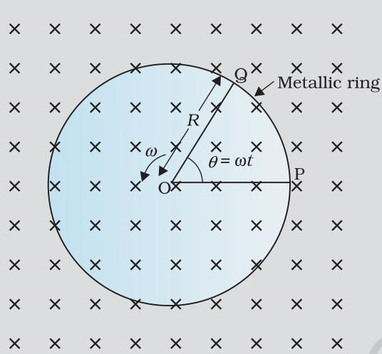  
FIGURE 6.11

# Solution

Method I

As the rod is rotated, free electrons in the rod move towards the outer end due to Lorentz force and get distributed over the ring. Thus, the resulting separation of charges produces an emf across the ends of the rod. At a certain value of emf, there is no more flow of electrons and a steady state is reached. Using Eq. (6.5), the magnitude of the emf generated across a length ${ \mathrm { d } } r$ of the rod as it moves at right angles to the magnetic field is given by

$\mathbf { d } \varepsilon = B v \mathbf { d } r$ . Hence,

$$
\varepsilon = \intop _ { 0 } ^ { R } \mathrm { d } \varepsilon = \intop _ { 0 } ^ { R } B v \mathrm { d } r = \intop _ { 0 } ^ { R } B \omega r \mathrm { d } r = \frac { B \omega R ^ { 2 } } { 2 }
$$

Note that we have used $v = \omega ~ r .$ This gives

$$
\varepsilon = \frac { 1 } { 2 } \times 1 . 0 \times 2 \pi \times 5 0 \times ( 1 ^ { 2 } )
$$

# Method II

To calculate the emf, we can imagine a closed loop OPQ in which point $\mathrm { o }$ and $\mathrm { P }$ are connected with a resistor $R$ and Og is the rotating rod. The potential difference across the resistor is then equal to the induced emf and equals $B \times$ (rate of change of area of loop). If $\theta$ is the angle between the rod and the radius of the circle at $\mathrm { P }$ at time $t$ ,the area of the sector OPQ is given by

$$
\pi R ^ { 2 } \times \frac { \theta } { 2 \pi } = \frac { 1 } { 2 } R ^ { 2 } \theta
$$

where $R$ is the radius of the circle. Hence, the induced emf is

$$
\varepsilon = B \times { \frac { \mathrm { d } } { \mathrm { d } t } } \left[ { \frac { 1 } { 2 } } R ^ { 2 } \theta \right] = { \frac { 1 } { 2 } } B R ^ { 2 } { \frac { \mathrm { d } \theta } { \mathrm { d } t } } = { \frac { B \omega R ^ { 2 } } { 2 } }
$$

[Note: ${ \frac { \mathrm { d } \theta } { \mathrm { d } t } } = \omega = 2 \pi \nu ]$

This expression is identical to the expression obtained by Method I and we get the same value of $\varepsilon$

# Electromagnetic Induction

# Example 6.7

A wheel with 10 metallic spokes each $0 . 5 \mathrm { ~ m ~ }$ long is rotated with a speed of $1 2 0 \mathrm { \ r e v / m i n }$ in a plane normal to the horizontal component of earth's magnetic field $H _ { E }$ at a place. If $H _ { E } = 0 . 4 \mathrm { ~ G ~ }$ at the place, what is the induced emf between the axle and the rim of the wheel? Note that $1 \mathrm { ~ G ~ } = 1 0 ^ { - 4 } \mathrm { T }$ ,

# Solution

$$
\begin{array} { l } { { \mathrm { f } = ( 1 / 2 ) ~ \omega { \cal B } { \cal R } ^ { 2 } } } \\ { { { } = ( 1 / 2 ) \times 4 \pi \times 0 . 4 \times 1 0 ^ { - 4 } \times ( 0 . 5 ) ^ { 2 } } } \\ { { { } = 6 . 2 8 \times 1 0 ^ { - 5 } \mathrm { V } } } \end{array}
$$

The number of spokes is immaterial because the emf's across the spokes are in parallel.

# 6.7 INDUCTANCE

An electric current can be induced in a coil by flux change produced by another coil in its vicinity or flux change produced by the same coil. These two situations are described separately in the next two sub-sections. However, in both the cases, the flux through a coil is proportional to the current. That is, $\phi _ { \mathrm { B } } \propto I .$ (cid:)

Further, if the geometry of the coil does not yary with time then,

$$
\frac { \mathrm { d } \phi _ { _ B } } { \mathrm { d } t } \propto \frac { \mathrm { d } I } { \mathrm { d } t }
$$

For a closely wound coil of $N$ turns, the same magnetic flux is linked with all the turns. When the flux $\phi _ { \mathrm { B } }$ through the coil changes, each turn contributes to the induced emf. Therefore, a term called flux linkage is used which is equal to $N \phi _ { \mathrm { B } }$ for a closely wound coil and in such a case

$$
N \phi _ { \mathrm { { B } } } \propto I
$$

The constant of proportionality, in this relation, is called inductance. We shall see that inductance depends only on the geometry of the coil and intrinsic material properties. This aspect is akin to capacitance which for a parallel plate capacitor depends on the plate area and plate separation (geometry) and the dielectric constant $K$ of the intervening medium (intrinsic material property).

Inductance is a scalar quantity. It has the dimensions of $[ \mathrm { M L ^ { 2 } T ^ { - 2 } A ^ { - 2 } } ]$ given by the dimensions of flux divided by the dimensions of current. The SI unit of inductance is henry and is denoted by H. It is named in honour of Joseph Henry who discovered electromagnetic induction in USA, independently of Faraday in England.

# 6.7.1 Mutual inductance

Consider Fig. 6. 12 which shows two long co-axial solenoids each of length 1. We denote the radius of the inner solenoid $S _ { 1 }$ by $r _ { 1 }$ and the number of turns per unit length by $n _ { 1 }$ . The corresponding quantities for the outer solenoid $S _ { 2 }$ are $r _ { 2 }$ and $n _ { 2 }$ , respectively. Let $N _ { 1 }$ and $N _ { 2 }$ be the total number of turns of coils $S _ { 1 }$ and $S _ { 2 }$ , respectively.

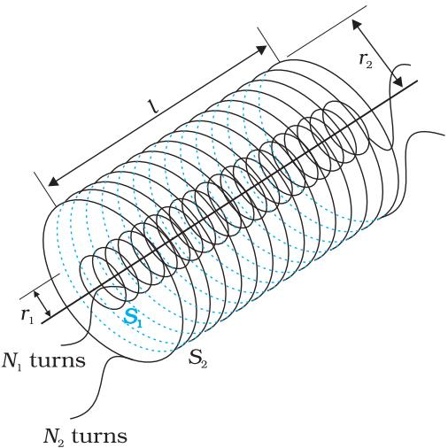  
FIGURE 6.12 Two long co-axial solenoids of same length 1.

When a current $I _ { 2 }$ is set up through $S _ { 2 }$ , it in turn sets up a magnetic flux through $S _ { 1 }$ Let us denote i b $\varPhi _ { 1 }$ The corresponding flux linkage with solenoid $S _ { 1 }$ is

$$
N _ { 1 } \Phi _ { 1 } = M _ { 1 2 } I _ { 2 }
$$

$M _ { \scriptscriptstyle { 1 2 } }$ is called the mutual inductance of solenoid $S _ { 1 }$ with respect to solenoid $S _ { 2 }$ . It is also referred to as the coefficient of mutual induction.

For these simple co-axial solenoids it is possible to calculate $M _ { \scriptscriptstyle { 1 2 } }$ . The magnetic field due to the current $I _ { 2 } \mathbf { i n }$ $S _ { 2 }$ is $\mu _ { 0 } n _ { 2 } I _ { 2 }$ . The resulting flux linkage with coil $S _ { 1 }$ is,

$$
\begin{array} { c } { N _ { 1 } \Phi _ { 1 } = \left( n _ { 1 } l \right) \left( \pi r _ { 1 } ^ { 2 } \right) \left( \mu _ { 0 } n _ { 2 } I _ { 2 } \right) } \\ { \phantom { \frac { 1 } { 1 } } = \mu _ { 0 } n _ { 1 } n _ { 2 } \pi r _ { 1 } ^ { 2 } l \phantom { } l _ { 2 } } \end{array}
$$

where $n _ { \mathrm { 1 } } l$ is the total number of turns in solenoid $S _ { 1 }$ Thus, from Eq. (6.7) and Eq. (6.8),

$$
M _ { \mathrm { 1 2 } } = \mu _ { 0 } n _ { 1 } n _ { 2 } \pi r _ { 1 } ^ { 2 } l
$$

Note that we neglected the edge effects and considered the magnetic field $\mu _ { 0 } n _ { 2 } I _ { 2 }$ to be uniform throughout the

length and width of the solenoid $S _ { 2 }$ . This is a good approximation keeping in mind that the solenoid is long, implying $l > > r _ { 2 }$

We now consider the reverse case. A current $I _ { 1 }$ is passed through the solenoid $S _ { 1 }$ and the flux linkage with coil $S _ { 2 }$ is,

$$
N _ { 2 } \Phi _ { 2 } = M _ { 2 1 } I _ { 1 }
$$

(cid:) $M _ { 2 1 }$ is called the mutual inductance of solenoid $S _ { 2 }$ with respect to solenoid $S _ { 1 }$

The flux due to the current $I _ { 1 }$ in $S _ { 1 }$ can be assumed to be confined solely inside $S _ { 1 }$ since the solenoids are very long. Thus, flux linkage with solenoid $S _ { 2 }$ is

$$
N _ { 2 } \Phi _ { 2 } = \left( n _ { 2 } l \right) \left( \pi r _ { 1 } ^ { 2 } \right) \left( \mu _ { 0 } n _ { 1 } I _ { 1 } \right)
$$

where $n _ { 2 } l$ is the total number of turns of $\mathsf { S } _ { 2 }$ . From Eq. (6.10),

$$
M _ { 2 1 } = \mu _ { 0 } n _ { 1 } n _ { 2 } \pi r _ { 1 } ^ { 2 } l
$$

Using Eq. (6.9) and Eq. (6. 10), we get

$$
M _ { 1 2 } = M _ { 2 1 } = M \mathrm { ( s a y ) }
$$

We have demonstrated this equality for long co-axial solenoids. However, the relation is far more general. Note that if the inner solenoid was much shorter than (and placed well inside) the outer solenoid, then we could still have calculated the flux linkage $N _ { 1 } \phi _ { 1 }$ because the inner solenoid is eff ectively immersed in a uniform magnetic field due to the outer solenoid. In this case, the calculation of $M _ { \mathrm { { 1 2 } } }$ would be easy. However, it would be extremely difficult to calculate the flux linkage with the outer solenoid as the magnetic field due to the inner solenoid would vary across the length as well as cross section of the outer solenoid. Therefore, the calculation of $M _ { 2 1 }$ would also be extremely difficult in this case. The equality $M _ { \mathrm { 1 2 } } { = } M _ { \mathrm { 2 1 } }$ is very useful in such situations.

We explained the above example with air as the medium within the solenoids. Instead, if a medium of relative permeability $\mu _ { \mathrm { r } }$ had been present, the mutual inductance would be

$$
{ \cal M } = \mu _ { _ { T } } \mu _ { _ { 0 } } n _ { _ { 1 } } n _ { _ { 2 } } \pi r _ { _ { 1 } } ^ { 2 } I
$$

It is also important to know that the mutual inductance of a pair of coils, solenoids, etc., depends on their separation as well as their relative orientation.

Example 6.8 Two concentric circular coils, one of small radius $r _ { 1 }$ and the other of large radius $r _ { 2 }$ , such that $r _ { 1 } < < r _ { 2 }$ , are placed co-axially with centres coinciding. Obtain the mutual inductance of the arrangement.

Solution Let a current $I _ { 2 }$ flow through the outer circular coil. The field at the centre of the coil is $B _ { 2 } ~ = ~ \mu _ { 0 } I _ { 2 } ~ / ~ 2 r _ { 2 }$ . Since the other co-axially placed coil has a very small radius, $B _ { 2 }$ may be considered constant over its cross-sectional area. Hence,

$$
\begin{array} { r } { \Phi _ { 1 } = \pi r _ { 1 } ^ { 2 } B _ { 2 } } \\ { = \displaystyle \frac { \mu _ { 0 } \pi r _ { 1 } ^ { 2 } } { 2 r _ { 2 } } I _ { 2 } } \\ { = M _ { 1 2 } I _ { 2 } } \end{array}
$$

Thus,

$$
M _ { 1 2 } = \frac { \mu _ { 0 } \pi r _ { 1 } ^ { 2 } } { 2 r _ { 2 } }
$$

From Eq. (6.12)

$$
M _ { 1 2 } = M _ { 2 1 } = \frac { \mu _ { 0 } \pi r _ { 1 } ^ { 2 } } { 2 r _ { 2 } }
$$

Note that we calculated $M _ { 1 2 }$ from an approximate value of $\varPhi _ { 1 }$ , assuming the magnetic field $B _ { 2 }$ to be uniform over the area $\pi \ r _ { 1 } ^ { 2 }$ . However, we can accept this value because $r _ { 1 } < < r _ { 2 }$

Now, let us recollect Experiment 6.3 in Section 6.2. In that experiment, emf is induced in coil $C _ { 1 }$ wherever there was any change in current through coil $C _ { 2 }$ . Let $\varPhi _ { 1 }$ be the flux through coil $C _ { 1 }$ (say of $N _ { 1 }$ turns) when current in coil $C _ { 2 }$ is $I _ { 2 }$ X

Then, from Eq. (6.7), we have

$$
N _ { 1 } \phi _ { 1 } = M _ { 2 }
$$

For currents varrying with time,

$$
\frac { \mathrm { ~ d ~ } \left( N _ { 1 } \phi _ { 1 } \right) } { \mathrm { ~ d } t } = \frac { \mathrm { ~ d ~ } \left( M I _ { 2 } \right) } { \mathrm { ~ d } t }
$$

Since induced emf in coil $C _ { 1 }$ is given by

$$
\left| \varepsilon _ { \mathrm { 1 } } = - \frac { \mathrm { d } \left( N _ { \mathrm { 1 } } \phi _ { \mathrm { 1 } } \right) } { \mathrm { d } t } \right|
$$

We get,

$$
\boxed { \pmb { \varepsilon } _ { 1 } = - M \frac { \mathrm { d } I _ { 2 } } { \mathrm { d } t } }
$$

It shows that varying current in a coil can induce emf in a neighbouring coil. The magnitude of the induced emf depends upon the rate of change of current and mutual inductance of the two coils.

# 6.7.2 Self-inductance

In the previous sub-section, we considered the flux in one solenoid due to the current in the other. It is also possible that emf is induced in a single isolated coil due to change of flux through the coil by means of varying the current through the same coil. This phenomenon is called self-induction. In this case, flux linkage through a coil of $N$ turns is proportional to the current through the coil and is expressed as

$$
\begin{array} { c } { { N \varPhi _ { \scriptscriptstyle B } \propto I } } \\ { { N \varPhi _ { \scriptscriptstyle B } = L I } } \end{array}
$$

where constant of proportionality $L$ is called self-inductance of the coil. It is also called the coefficient of self-induction of the coil. when the current is varied, the flux linked with the coil also changes and an emf is induced in the coil. Using Eq. (6. 13), the induced emf is given by

$$
\begin{array} { c } { \varepsilon = - \displaystyle \frac { \mathrm { d } \big ( N \phi _ { \mathrm { B } } ^ { } \big ) } { \mathrm { d } t } } \\ { \varepsilon = - L \displaystyle \frac { \mathrm { d } I } { \mathrm { d } t } } \end{array}
$$

Thus, the self-induced emf always opposes any change (increase or decrease) of current in the coil.

It is possible to calculate the self-inductance for circuits with simple geometries. Let us calculate the self -inductance of a long solenoid of crosssectional area $A$ and length I, having $_ n$ turns per unit length. The magnetic field due to a current Iflowing in the solenoid is $B { = } \mu _ { 0 } n I$ (neglecting edge effects, as before). The total flux linked with the solenoid is

$$
\begin{array} { l } { { \displaystyle N \phi _ { _ B } = ( n l ) ( \mu _ { 0 } n I ) ( A ) } } \\ { { \displaystyle ~ = \mu _ { 0 } n ^ { 2 } A l I } } \end{array}
$$

where $_ { n l }$ is the total number of turns. Thus, the self-inductance is,

$$
\begin{array} { c } { { \displaystyle { \boxed { L = \frac { N \phi _ { _ B } } { I } } } } } \\ { { \mathrm { } } } \\ { { \displaystyle { } = \mu _ { \mathrm { 0 } } n ^ { 2 } A l } } \end{array}
$$

If we fil the inside of the solenoid with a material of relative permeability $\mu _ { r }$ (for example soft iron, which has a high value of relative permeability), then,

$$
L = \mu _ { r } \mu _ { 0 } n ^ { 2 } A l
$$

The self-inductance of the coil depends on its geometry and on the permeability of the medium.

The self-induced emf is also called the back emf as it opposes any change in the current in a circuit. Physically, the self-inductance plays the role of inertia. It is the electromagnetic analogue of mass in mechanics. So, work needs to be done against the back emf (ε) in establishing the current. This work done is stored as magnetic potential energy. For the current $I$ at an instant in a circuit, the rate of work done is

$$
\frac { \mathrm { d } W } { \mathrm { d } t } = | \boldsymbol { \varepsilon } | I
$$

If we ignore the resistive losses and consider only inductive effect, then using Eq. (6.14),

$$
{ \dot { \frac { \mathrm { d } W } { \mathrm { d } t } } } = L \ I { \frac { \mathrm { d } I } { \mathrm { d } t } }
$$

Total amount of work done in establishing the current Iis

$$
W = \int \mathrm { d } W = \int _ { 0 } ^ { I } L I \mathrm { d } I
$$

Thus, the energy required to build up the current Iis,

$$
W = \frac { 1 } { 2 } L I ^ { 2 }
$$

This expression reminds us of $m \nu ^ { 2 } / 2$ for the (mechanical) kinetic energy of a particle of mass $_ { m }$ , and shows that $L$ is analogous to $_ m$ (i.e., $L$ is electrical inertia and opposes growth and decay of current in the circuit).

Consider the general case of currents flowing simultaneously in two nearby coils. The flux linked with one coil wil be the sum of two fluxes which exist independently. Equation (6.7) would be modified into

$$
N _ { 1 } \phi _ { 1 } = M _ { 1 1 } I _ { 1 } + M _ { 1 2 } I _ { 2 }
$$

where $M _ { \mathrm { { 1 1 } } }$ represents inductance due to the same coil.

Therefore, using Faraday's law,

$$
\varepsilon _ { 1 } = - M _ { \mathrm { { 1 1 } } } { \frac { \mathrm { { d } } I _ { \mathrm { { 1 } } } } { \mathrm { { d } } t } } - M _ { \mathrm { { 1 2 } } } { \frac { \mathrm { { d } } I _ { \mathrm { { 2 } } } } { \mathrm { { d } } t } }
$$

$M _ { \mathrm { 1 1 } }$ is the self-inductance and is written as $L _ { 1 }$ . Therefore,

$$
 \varepsilon _ { 1 } = - L _ { 1 } \frac { \mathrm { d } I _ { 1 } } { \mathrm { d } t } - M _ { 1 2 } \frac { \mathrm { d } I _ { 2 } } { \mathrm { d } t }
$$

Example 6.9 (a) Obtain the expression for the magnetic energy stored in a solenoid in terms of magnetic field $B .$ area $A$ and length I of the solenoid. (b) How does this magnetic energy compare with the electrostatic energy stored in a capacitor?

# Solution

(a) From Eq. (6.17), the magnetic energy is

$$
\begin{array} { c c l } { { } } & { { U _ { \scriptscriptstyle B } = \displaystyle \frac { 1 } { 2 } L ^ { 2 } } } \\ { { } } & { { } } \\ { { \displaystyle \vphantom { \frac { 1 } { 2 } } = \displaystyle \frac { 1 } { 2 } L \left( \frac { B } { \mu _ { \scriptscriptstyle O } n } \right) ^ { 2 } } } & { { } } & { { ~ \displaystyle \left( \mathrm { s i n c e } B ~ = ~ \mu _ { o } n I , \mathrm { f o r } \mathrm { a } \mathrm { s o l e n o i d } \right) } } \end{array}
$$

$$
\begin{array} { l l } { { } } & { { = \displaystyle \frac { 1 } { 2 } ( \mu _ { 0 } n ^ { 2 } A l ) \Biggl ( \frac { B } { \mu _ { 0 } n } \Biggr ) ^ { 2 } \qquad [ \mathrm { f r o m ~ E q . ~ ( 6 . 1 5 ) } ] } } \\ { { } } & { { } } \\ { { } } & { { = \displaystyle \frac { 1 } { 2 \mu _ { 0 } } B ^ { 2 } A l } } \end{array}
$$

(b) The magnetic energy per unit volume is,

$$
\begin{array} { r } { u _ { _ B } = \displaystyle \frac { U _ { _ B } } { V } } \\ { = \displaystyle \frac { U _ { _ B } } { A l } } \\ { = \displaystyle \frac { B ^ { 2 } } { 2 \mu _ { 0 } } } \end{array}
$$

(where $V$ is volume that contains flux)

We have already obtained the relation for the electrostatic energy stored per unit volume in a parallel plate capacitor (refer to Chapter 2, Eq. 2.73),

$$
\boldsymbol { u } _ { E } = \frac { 1 } { 2 } \varepsilon _ { 0 } E ^ { 2 }
$$

In both the cases energy is proportional to the square of the field strength. Equations (6.18) and (2.73) have been derived for special cases: a solenoid and a parallel plate capacitor, respectively. But they are general and valid for any region of space in which a magnetic field or/and an electric field exist.

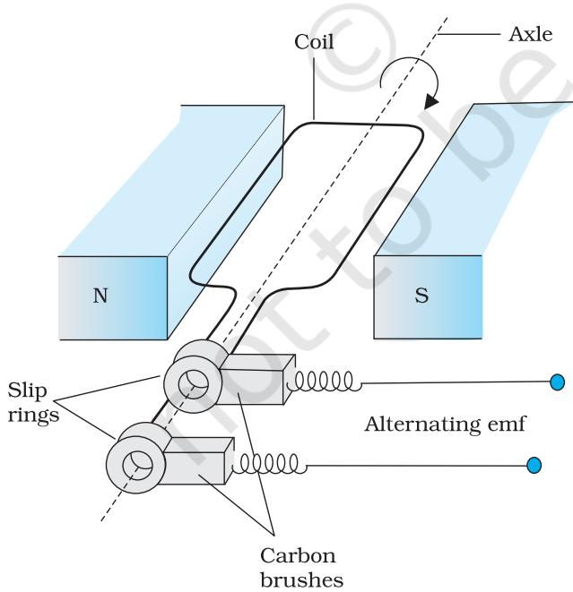  
FIGuRE 6.13 AC Generator

# 6.8 AC GENErATOR

The phenomenon of electromagnetic induction has been technologically exploited in many ways. An exceptionally important application is the generation of alternating currents (ac). The modern ac generator with a typical output capacity of 100 MW is a highly evolved machine. In this section, we shall describe the basic principles behind this machine. The Yugoslav inventor Nicola Tesla is credited with the development of the machine. As was pointed out in Section 6.3, one method to induce an emf or current in a loop is through a change in the loop's orientation or a change in its effective area. As the coil rotates in a magnetic field B, the effective area of the loop (the face perpendicular to the field) is $A$ cos $\theta _ { \ast }$ where $\theta$ is the angle between A and B. This method of producing a flux change is the principle of operation of a simple ac generator. An ac generator converts mechanical energy into electrical energy.

The basic elements of an ac generator are shown in Fig. 6. 13. It consists of a coil mounted on a rotor shaft. The axis of rotation of the coil is perpendicular to the direction of the magnetic field. The coil (called armature) is mechanically rotated in the uniform magnetic field by some external means. The rotation of the coil causes the magnetic flux through it to change, so an emf is induced in the coil. The ends of the coil are connected to an external circuit by means of slip rings and brushes.

When the coil is rotated with a constant angular speed $\omega$ , the angle $\theta$ between the magnetic field vector B and the area vector A of the coil at any instant tis $\theta = \omega t$ (assuming $\theta = 0 ^ { \circ }$ at $t = 0$ ). As a result, the effective area of the coil exposed to the magnetic field lines changes with time, and from Eq. (6. 1), the flux at any time $t$ is

$$
\phi _ { _ \mathrm { B } } = B A \cos \theta = B A \cos \omega t
$$

From Faraday's law, the induced emf for the rotating coil of $N$ turns is then, ■ ▲

$$
\varepsilon = - N { \frac { \mathrm { d } \phi _ { _ B } } { \mathrm { d t } } } { = } - N B A { \frac { \mathrm { d } } { \mathrm { d } t } } ( \cos \omega t )
$$

Thus, the instantaneous value of the emf is

$$
\scriptstyle { \varepsilon = N B A \omega s i n \omega t }
$$

where NBAo is the maximum value of the emf, which occurs when sin $\omega t = \pm 1$ . If we denote NBAw as $\varepsilon _ { 0 }$ then

$$
\varepsilon = \varepsilon _ { _ 0 } \sin \omega t
$$

Since the value of the sine fuction varies between $+ 1$ and $^ { - 1 }$ , the sign, or polarity of the emf changes with time. Note from Fig. 6.14 that the emf has its extremum value when $\theta = 9 0 ^ { \circ }$ or $\theta = 2 7 0 ^ { \circ }$ , as the change of fl ux is greatest at these points.

The direction of the current changes periodically and therefore the current is called alternating current (ac). Since $\omega = 2 \pi \nu ,$ , Eq (6.20) can be written as

$$
\varepsilon = \varepsilon _ { 0 } \sin 2 \pi \nu t
$$

where $\nu$ is the frequency of revolution of the generator's coil.

Note that Eq. (6.20) and (6.21) give the instantaneous value of the emf and $\varepsilon$ varies between +80 and $- \varepsilon _ { 0 }$ periodically. We shall learn how to determine the time-averaged value for the alternating voltage and current in the next chapter.

In commercial generators, the mechanical energy required for rotation of the armature is provided by water falling from a height, for example, from dams. These are called hydro-electric generators. Alternatively, water is heated to produce steam using coal or other sources. The steam at high pressure produces the rotation of the armature. These are called thermal generators. Instead of coal, if a nuclear fuel is used, we get nuclear power generators. Modern day generators produce electric power as high as 500 MW, i.e., one can light

# Stage1

# Stage2

# Stage3

The plane of the armature is perpendicular to the magnetic

#

armature   
after a   
rotation of   
(cid:) $1 8 0 ^ { \circ }$ (cid:)

when the armature rotates through $9 0 °$ (cid:) the plane of the armature is parallel to magnetic field

# Stage4

Armature after rotating through

field

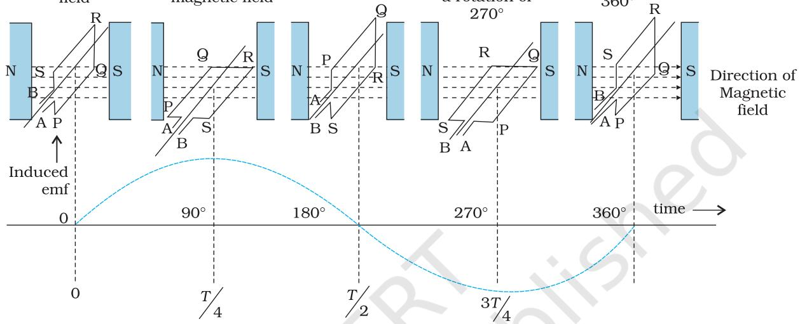  
FIGuRE 6.14 An alternating emf is generated by a loop of wire rotating in a magnetic field.

up 5 million 1oo W bulbs! In most generators, the coils are held stationary and it is the electromagnets which are rotated. The frequency of rotation is $5 0 ~ \mathrm { H z }$ in India. In certain countries such as USA, it is $6 0 ~ \mathrm { H z }$

Example 6.1o Kamla peddles a stationary bicycle. The pedals of the bicycle are attached to a 100 turn coil of area $0 . 1 0 ~ \mathrm { m } ^ { 2 }$ . The coil rotates at half a revolution per second and it is placed in a uniform magnetic field of O.01 T perpendicular to the axis of rotation of the coil. what is the maximum voltage generated in the coil?

Solution Here $\nu { = } 0 . 5 \mathrm { H z }$ ; $N { = } 1 0 0$ , $A = 0 . 1 \mathrm { m } ^ { 2 }$ and $B { = } 0 . 0 1 1$ . Employing Eq. (6.19)

$$
\varepsilon _ { \scriptscriptstyle 0 } = N B A \ ( 2 \ \pi \ \nu )
$$

The maximum voltage is $0 . 3 1 4 \mathrm { ~ V ~ }$

We urge you to explore such alternative possibilities for power generation.

# SUMMARY

1. The magnetic fl ux through a surface of area A placed in a uniform magnetic field $\mathbf { B }$ is defined as,

$$
\phi _ { _ \mathrm { B } } = { \bf B } . { \bf A } = B A \cos \theta
$$

where $\theta$ is the angle between B and A.

2. Faraday's laws of induction imply that the emf induced in a coil of $N$ turns is directly related to the rate of change of flux through it,

$$
\varepsilon = - N { \frac { \mathrm { d } \phi _ { \mathrm { B } } } { \mathrm { d } t } }
$$

Here $\boldsymbol { \varPhi } _ { \mathrm { B } }$ is the flux linked with one turn of the coil. If the circuit is closed, a current $I = \varepsilon / R$ is set up in it, where $R$ is the resistance of the circuit.

3. Lenz's law states that the polarity of the induced emf is such that it tends to produce a current which opposes the change in magnetic flux that produces it. The negative sign in the expression for Faraday's law indicates this fact.

4. When a metal rod of length l is placed normal to a uniform magnetic field $B$ and moved with a velocity v perpendicular to the field, the induced emf (called motional emf) across its ends is $\varepsilon = B l v$

5. Inductance is the ratio of the flux-linkage to current. It is equal to NΦ/.

6. A changing current in a coil (coil 2) can induce an emf in a nearby coil (coil 1). This relation is given by,

$$
\bigg \vert \varepsilon _ { 1 } = - M _ { 1 2 } \frac { \mathrm { d } I _ { 2 } } { \mathrm { d } t }
$$

The quantity $M _ { \mathrm { 1 2 } }$ is called mutual inductance of coil 1 with respect to coil 2. One can similarly define $M _ { 2 1 }$ . There exists a general equality,

$$
M _ { \mathrm { 1 2 } } = M _ { \mathrm { 2 1 } }
$$

7. when a current in a coil changes, it induces a back emf in the same coil. The self-induced emf is given by,

$$
{ \boldsymbol { \varepsilon } } = - L { \frac { \mathrm { d } { \boldsymbol { I } } } { \mathrm { d } t } }
$$

$L$ is the self-inductance of the coil. It is a measure of the inertia of the coil against the change of current through it.

8. The self-inductance of a long solenoid, the core of which consists of a magnetic material of relative permeability $\mu _ { \mathrm { r } }$ , is given by

$$
L = \mu _ { r } \mu _ { o } n ^ { 2 } A l
$$

where $A$ is the area of cross-section of the solenoid, l its length and $n$ the number of turns per unit length.

9. In an ac generator, mechanical energy is converted to electrical energy by virtue of electromagnetic induction. If coil of $N$ turn and area $A$ is rotated at $\nu$ revolutions per second in a uniform magnetic field $B$ , then the motional emf produced is

$$
\varepsilon = N B A \left( 2 \pi \nu \right) \sin \left( 2 \pi \nu t \right)
$$

where we have assumed that at time $t = 0 ~ \mathrm { s }$ , the coil is perpendicular to the field.

<table><tr><td>Guantity</td><td>Symbol</td><td>Units</td><td>Dimensions</td><td>Equations</td></tr><tr><td>Magnetic Flux</td><td>Qa</td><td>Wb (weber)</td><td>[ML²T-²A-¹]</td><td>φB = B·A</td></tr><tr><td>EMF</td><td>E</td><td>V (volt)</td><td>[ML²T-³A-1]</td><td>ε = −d(Nβ)/ dt</td></tr><tr><td>Mutual Inductance</td><td>M</td><td>H (henry)</td><td>[ML²T-²A^²}]</td><td>ε1 = −M12 (d12 /dt)</td></tr><tr><td>Self Inductance</td><td>L</td><td>H (henry)</td><td>[ML²T-²A²]</td><td>ε = −L (dI / dt)</td></tr></table>

# POINTS TO PONDER

1. Electricity and magnetism are intimately related. In the early part of the nineteenth century, the experiments of Oersted, Ampere and others established that moving charges (currents) produce a magnetic field. Somewhat later, around 1830, the experiments of Faraday and Henry demonstrated that a moving magnet can induce electric current.   
2. In a closed circuit, electric currents are induced so as to oppose the changing magnetic flux. It is as per the law of conservation of energy. However, in case of an open circuit, an emf is induced across its ends. How is it related to the flux change?   
3. The motional emf discussed in Section 6.5 can be argued independently from Faraday's law using the Lorentz force on moving charges. However, even if the charges are stationary [and the q $\bf ( v \times \bf \delta B )$ term of the Lorentz force is not operativel, an emf is nevertheless induced in the presence of a time-varying magnetic field. Thus, moving charges in static field and static charges in a time-varying field seem to be symmetric situation for Faraday's law. This gives a tantalising hint on the relevance of the principle of relativity for Faraday's law.

# EXERCISES

6.1 Predict the direction of induced current in the situations described by the following Figs. 6.15(a) to (f).

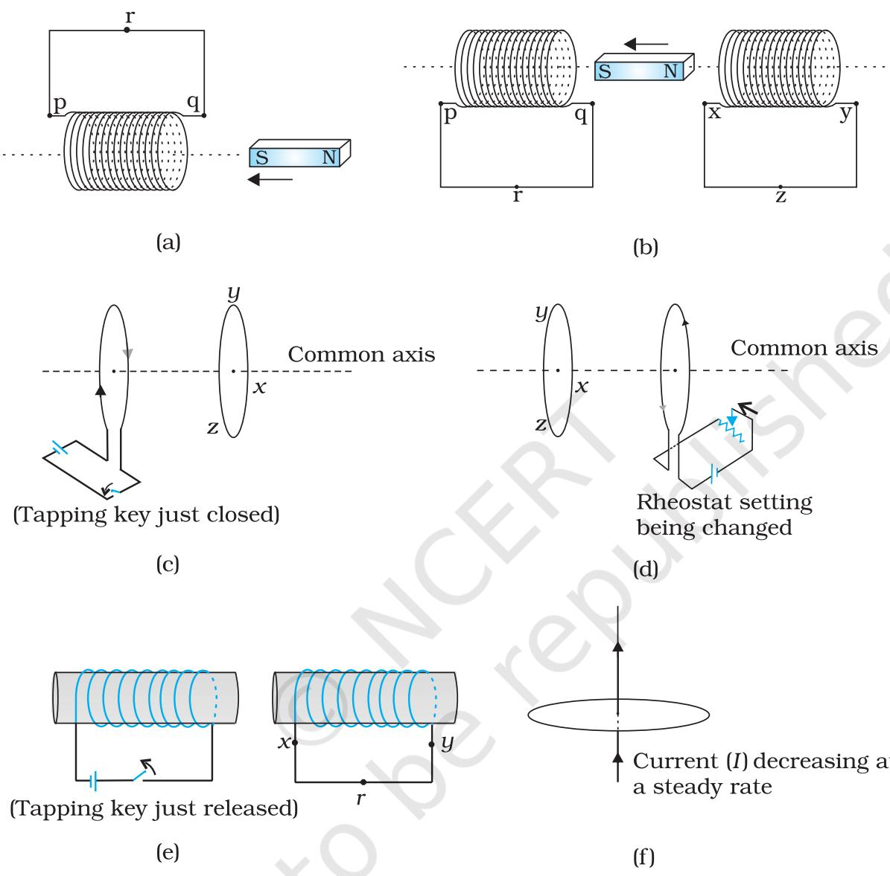  
FIGURE 6.15

6.2 Use Lenz's law to determine the direction of induced current in the situations described by Fig. 6.16:

(a) A wire of irregular shape turning into a circular shape;

(b) A circular loop being deformed into a narrow straight wire.

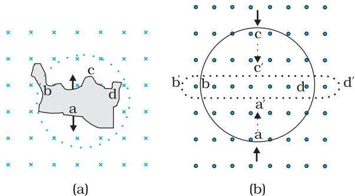  
FIGURE 6.16

6.3 A long solenoid with 15 turns per cm has a small loop of area $2 . 0 \ \mathrm { c m ^ { 2 } }$ placed inside the solenoid normal to its axis. If the current carried by the solenoid changes steadily from 2.0 A to 4.0 A in $0 . 1 \mathrm { { s } }$ what is the induced emf in the loop while the current is changing?

6.4 A rectangular wire loop of sides $8 \mathrm { \ c m }$ and $2 \mathrm { \ c m }$ with a small cut is moving out of a region of uniform magnetic field of magnitude $0 . 3 \textrm { T }$ directed normal to the loop. What is the emf developed across the cut if the velocity of the loop is $1 \mathrm { ~ c m ~ } \mathbf { s } ^ { - 1 }$ in a direction normal to the (a) longer side, (b) shorter side of the loop? For how long does the induced voltage last in each case?

6.5 A $1 . 0 \textrm { m }$ long metallic rod is rotated with an angular frequency of 400 rad $\mathbf { S } ^ { - 1 }$ about an axis normal to the rod passing through its one end. The other end of the rod is in contact with a circular metallic ring. A constant and uniform magnetic field of $0 . 5 ~ \mathrm { T }$ parallel to the axis exists everywhere. Calculate the emf developed between the centre and the ring.

6.6 A horizontal straight wire $1 0 \textrm { m }$ long extending from east to west is falling with a speed of $5 . 0 \mathrm { ~ m ~ } \mathbf { s } ^ { - 1 }$ , at right angles to the horizontal component of the earth's magnetic field, $0 . 3 0 \times 1 0 ^ { - 4 }$ Wb $\mathrm { m } ^ { - 2 }$ (a) what is the instantaneous value of the emf induced in the wire? (b) what is the direction of the emf? (c) which end of the wire is at the higher electrical potential?

6.7 Current in a circuit falls from $5 . 0 \mathrm { A }$ to 0.0 A in 0.1 s. If an average emf of $2 0 0 \mathrm { V }$ induced, give an estimate of the self-inductance of the circuit.

6.8 A pair of adjacent coils has a mutual inductance of $1 . 5 \ \mathrm { H }$ .If the current in one coil changes from 0 to 20 A in $_ { 0 . 5 \mathrm { ~ s ~ } }$ ,what is the change of flux linkage with the other coil?